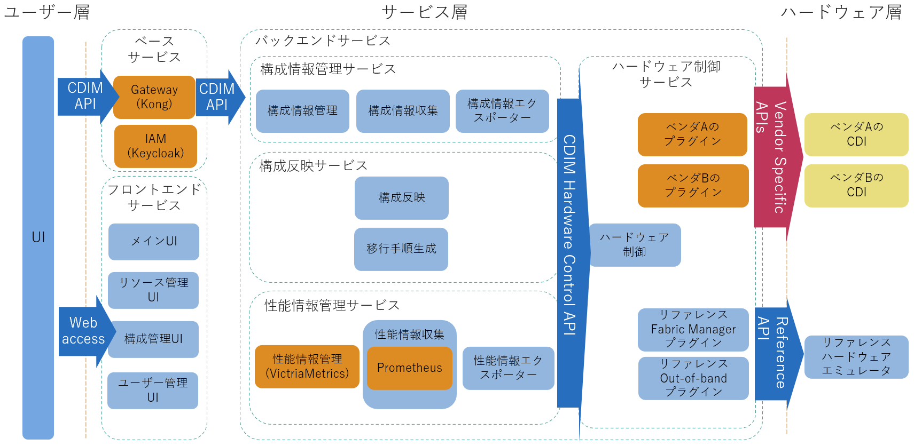

# コンセプト

## ゴール

近年、PCI Express/CXLスイッチを介して、サーバー (CPUノード) とMemory (CXL Memory) や、GPU、FPGA、NVMe SSDなどのデバイス接続を動的に組み替えられるハードウェア (Composable Disaggregated Infrastructure, CDI) が各ハードウェアベンダからリリースされ始めています。このCDIを使用し、ワークロードの稼働状況に応じて適切にノードを構成・再構成・解体することでハードウェアを効率的に利用できることが期待されます。

しかし、CDIの構成リソース (CPU、Memory、GPU、FPGA、NVMe SSDなど) が数百、数千あるような大規模環境を想定した場合、複雑化する計算資源の瞬時な構成制御と、その自動運用が課題になります。

この課題を解決するため、Composable Disaggregated Infrastructure Manager (以降、CDIM) によって、上位層のクライアントや下位層のハードウェア、ファブリックの実装に依存のない、ワークロードに最適なシステム構成の自動設計と構成変更を可能とする共通プラットフォームの提供を最終目標としています。

## スコープ

CDIMの最終目標達成には大きくは以下の機能が必要と想定しており、これらの機能を本プロジェクトで実装し、最終目標を達成します。

  1. 異種のハードウェアを統合的/共通的に管理できるインタフェース
  2. ワークロードに最適なノード構成を自動設計・反映するためのフレームワーク
  3. OpenStackやKubernetesのような既存ソフトウェアを含めた統合的なシステム制御

現時点の提供範囲は「異種のハードウェアを統合的/共通的に管理できるインタフェース」の機能のみです。その他の機能のロードマップについては、[ロードマップ](../../roadmap/ja/README.md)をご覧ください。

## アーキテクチャ

現時点のアーキテクチャは下図のとおりです。
このアーキテクチャをベースとして、[スコープ](#スコープ)で述べた未実装の機能を実現するコンポーネントやインタフェース仕様を追加していきます。

青で記載している機能はCDIMの提供範囲で、オレンジで記載している機能は他のOSSを使用しています。また、図中では表現していませんが、サービス間の連携にはDaprを使用しています。

各機能の説明は以下のとおりです。

> [!NOTE]
> 以降では、CDIを構成する個々のデバイスは「リソース」と呼び、これらのリソースを組み合わせて作成される計算実行基盤を「計算ノード」と呼びます。

### ベースサービス

| 機能名 | リポジトリ | 説明 |
|--|--|--|
| Gateway(Kong) | [base-compose][] | バックエンドサービスが提供するAPIのAPIゲートウェイです。実装としてはKongを使用しています。 |
| IAM(Keycloak) | [base-compose][] | 認証・認可の機能を提供します。実装としてはKeycroakを使用しています。 |

### フロントエンドサービス

| 機能名 | リポジトリ | 説明 |
|--|--|--|
| メインUI | [mf-core][] | メインとなるWeb UI画面を提供します。 | 
| リソース管理UI | [mf-resource][] | リソースの一覧と詳細情報を確認するためのWeb UI画面を提供します。 |
| 構成管理UI | [mf-layout][] | 計算ノードの構成を確認および変更するためのWeb UI画面を提供します。 |
| ユーザー管理UI | [mf-user][] | ユーザーを管理 (ユーザーの追加や削除など) するためのWeb UI画面を提供します。 |
| UI共通モジュール | [mf-shared-modules][] | Web UIの共通モジュールです。 |

### バックエンドサービス

#### 構成情報管理サービス

| 機能名 | リポジトリ | 説明 |
|--|--|--|
| 構成情報管理 | [configuration-manager][] | リソースと計算ノードの構成情報およびステータスをデータベースで管理します。 |
| 構成情報収集 | [configuration-collector][] | リソースと計算ノードの構成情報およびステータスを収集します。 |
| 構成情報エクスポーター | [configuration-exporter][] | リソースと計算ノードの構成情報およびステータスのエクスポーターです。 |

#### 構成案反映サービス

| 機能名 | リポジトリ | 説明 |
|--|--|--|
| 構成案反映 | [layout-apply][] | 新しい計算ノードの構成を適用するためのリクエストを受け取り、hw-controlを通じてリソースを制御します。 |
| 移行手順生成 | [migration-procedure-generator][] | 現在の計算ノード構成から新しい構成へ移行するためのリソース制御手順を生成します。 |

#### 性能情報管理サービス

| 機能名 | リポジトリ | 説明 |
|--|--|--|
| 性能情報管理(VictriaMetrics) | [performance-manager-compose][] | VictoriaMetricsを使用してリソースと計算ノードのパフォーマンス情報を管理します。 |
| 性能情報収集 | [performance-collector][] | リソースと計算ノードのパフォーマンス情報を収集し、構成情報管理と連携動作します。基本機能にはPrometheusを使用しています。 |
| 性能情報エクスポーター | [performance-exporter][] | リソースと計算ノードのパフォーマンス情報のためのPrometheusエクスポーターです。 |

#### ハードウェア制御サービス

| 機能名 | リポジトリ | 説明 |
|--|--|--|
| ハードウェア制御 | [hw-control][] | リソース情報の取得、リソースの電源のオン/オフ、および接続/切断などの操作を制御します。 |

##### リファレンスハードウェアプラグイン

| 機能名 | リポジトリ | 説明 |
|--|--|--|
| リファレンスFabric Managerプラグイン | [fm-plugin-reference][] | Fabric Managerプラグインのリファレンス実装です。 |
| リファレンスOut-of-Bandプラグイン | [oob-plugin-reference][] | Out-of-Bandプラグインのリファレンス実装です。 |

### リファレンスハードウェアエミュレータ

| 機能名 | リポジトリ | 説明 |
|--|--|--|
| リファレンスハードウェアエミュレータ | [hw-emulator-reference][] | Redfishインタフェースをエミュレートするハードウェアエミュレーターです。 |

<!-- Link informations  -->

[OverviewOurGoal]: imgs/overview_our_goal.png
[Roadmap]: ../roadmap/README.md
[Our scope]: #our-scope
[ModuleDiagram]: imgs/architecture.png

[base-compose]: https://github.com/project-cdim/base-compose

[mf-core]: https://github.com/project-cdim/mf-core
[mf-resource]: https://github.com/project-cdim/mf-resource
[mf-layout]: https://github.com/project-cdim/mf-layout
[mf-user]: https://github.com/project-cdim/mf-user
[mf-shared-modules]: https://github.com/project-cdim/mf-shared-modules

[configuration-manager]: https://github.com/project-cdim/configuration-manager
[configuration-collector]: https://github.com/project-cdim/configuration-collector
[configuration-exporter]: https://github.com/project-cdim/configuration-exporter

[layout-apply]: https://github.com/project-cdim/layout-apply
[migration-procedure-generator]: https://github.com/project-cdim/migration-procedure-generator

[performance-manager-compose]: https://github.com/project-cdim/performance-manager-compose
[performance-collector]: https://github.com/project-cdim/performance-collector
[performance-exporter]: https://github.com/project-cdim/performance-exporter

[hw-control]: https://github.com/project-cdim/hw-control
[fm-plugin-reference]: https://github.com/project-cdim/fm-plugin-reference
[oob-plugin-reference]: https://github.com/project-cdim/oob-plugin-reference

[hw-emulator-reference]: https://github.com/project-cdim/hw-emulator-reference
