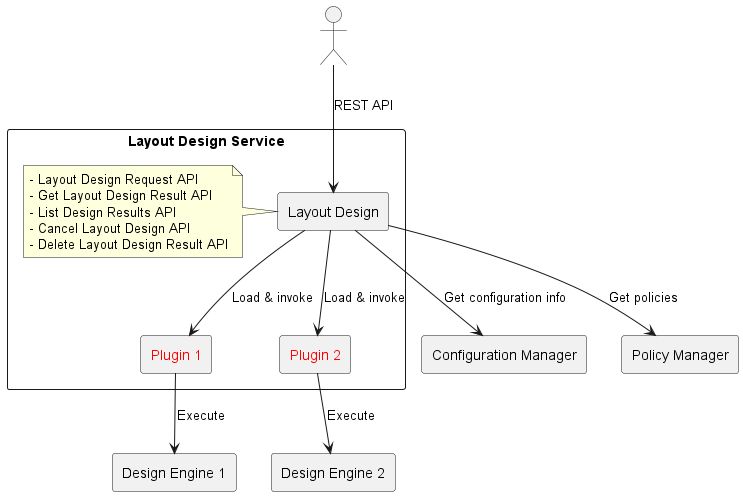

# 1. Introduction

This guide explains how to develop Design Engine plugins for the Layout Design.

The Layout Design accepts API requests such as layout design requests and layout design result retrieval, and delegates processing to the corresponding plugins.
A Design Engine determines node compositions (layouts) by selecting resources based on provided service definitions and resource requirements, and manages the resulting layout plans.
A Design Engine plugin (hereafter "plugin") sits between the Layout Design and a Design Engine and has the roles below:
- Convert between the unified interface provided by the Layout Design and the engine-specific interfaces of each Design Engine.
- This lets the Layout Design use multiple Design Engines in the same way without needing to know their implementation details.
- Adding a new Design Engine only requires implementing its corresponding plugin, enabling flexible integration with various kinds of Design Engines.

An overview of the Layout Design is shown below.

The Layout Design is a REST API service.
At startup, it loads any plugins placed in the plugin directory and can then call the corresponding Design Engines through those plugins.

The components in the diagram are summarized below.

| Component | Description |
| --- | --- |
| Layout Design | Coordinates with multiple Design Engines via plugins and aggregates requests such as executing a layout design and fetching design results for the specified Design Engine. |
| Configuration Manager | Holds information such as resource performance data and current node configurations used when running a layout design. |
| Policy Manager | Maintains and manages policies for resource selection used during layout design. |
| Plugin | Coordinates with its corresponding Design Engine and handles engine-specific processing. |
| Design Engine | Creates a layout plan for running the target services based on the provided information about services and resources. |

## Terminology

This section summarizes the terms used in this guide.

| Term | Overview |
| --- | --- |
| Node | A group of resources that forms a system |
| Resource | Compute resources that constitute a node (CPU, memory, storage, etc.) |
| Service | An application or software function that runs on a node |
| Resource Requirement | The required resource types and performance needed by a service |
| Resource Group | A logical grouping of resources |
| Design ID (designID) | An ID that identifies a layout design request, assigned by the plugin or the Design Engine |
| Request ID (requestID) | An ID used by the caller of the Layout Design to identify a layout design request |
| Layout Plan (design) | A node composition (layout plan) designed from inputs such as service definitions and resource requirements |
| Migration Condition | Constraints on node load tolerated when migrating from the current node configuration to the designed layout plan |
| Migration Procedure | The steps to migrate from the current node configuration to the designed layout plan |
| Design Status | The status of a layout plan (IN_PROGRESS, COMPLETED, FAILED, CANCELING, CANCELED) |
| Entire Design | A design mode in which all services/nodes provided as input are in scope |
| Partial Design | A design mode in which only specified services/nodes are in scope |
| Sample Plugin / Sample Design Engine | Sample code provided as a reference implementation for plugin development |
| Stub | A test program that acts as a substitute for related components during development |
