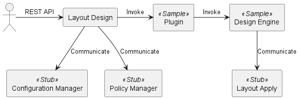

# 3. Setup

This chapter explains how to integrate a plugin into the Layout Design and run the REST APIs using the Sample Plugin as an example.
You can verify plugin behavior using [2.1. REST APIs of the Layout Design](02_LayoutDesignFunctions.md#21-rest-apis-of-the-layout-design). Implementation details are in [5. Implementing the Plugin](05_Implementing_plugin.md).

Following the steps in this chapter will build a development environment with the following structure:



The components built by these steps are:
- Layout Design
- Sample Plugin / Sample Design Engine
- Stub
  - Substitute for Configuration Manager
  - Substitute for Policy Manager
  - Substitute for Layout Apply

After setup you can:
- Execute the Layout Design REST APIs using the Sample Plugin
- Verify the end-to-end flow from layout design request to fetching the layout design result
- Inspect the input/output data necessary for plugin development via the Sample Plugin

The Sample Plugin/Sample Design Engine helps with environment setup and with understanding the flow and input/output from a layout design request through layout design result retrieval.
The Stub exposes API endpoints for the related components required to run the Layout Design REST APIs:
- Configuration Manager
- Policy Manager
- Layout Apply (when using the Sample Plugin/Sample Design Engine)

If the Stub is not available, the Layout Design will error or the Sample Plugin/Sample Design Engine will fail to produce a layout design result.
Specifically this includes:
- The stub process is not running
- The stub port does not match the port specified in the Layout Design and Sample Plugin/Sample Design Engine configuration files

Notes and limitations for the Sample Plugin:
- When using the Sample Plugin, Layout Apply is required in addition to Configuration Manager and Policy Manager.
- If the stub is not running, or the configured port does not match, you will get an error or the layout design process will fail.
- The Sample Plugin/Sample Design Engine does not support canceling or deleting a layout design result.

Development is performed on Linux with the following installed:
- [Python](https://www.python.org/) (3.14+)
- [PDM](https://pdm-project.org/latest/)
- [git](https://git-scm.com/)
- [docker](https://www.docker.com/)

## 3.1. Setting up the Stub

When the Layout Design accepts a layout design request, it communicates with the Configuration Manager and the Policy Manager.
When using the Sample Plugin/Sample Design Engine, it also communicates with Layout Apply.
In development, use the Stub as the destination for these components.

The Stub is in the same Git repository as this guide.
Clone this guide's repository (`design-engine-plugin-dev-guide`) into any directory.

<!-- TODO: Update once URLs are confirmed -->
```shell
cd <any directory path>
git clone <git url> --recursive
```

Below, the cloned directory is referred to as `design-engine-plugin-dev-guide`.

The Stub is at `design-engine-plugin-dev-guide/rest-api-stub`.
Run the following in `design-engine-plugin-dev-guide/rest-api-stub` to create a Python virtual environment (venv) and install packages:

```shell
cd ./design-engine-plugin-dev-guide/rest-api-stub/
pdm install
```

### Port Number (Stub)

Port 8002 is used by default.
To change it, edit the file below.

- Config file: `design-engine-plugin-dev-guide/rest-api-stub/src/settings.py`

```python
PORT = 8002  # Change this value to modify the port
```

- When using the Stub, also set the following host-side ports in the Layout Design to 8002 (see [3.2. Setting up Layout Design](03_Setup.md#32-setting-up-layout-design)):
  - Policy Manager: `policy_manager.uri`
  - Configuration Manager: `configuration_manager.uri`
- When using the Sample Plugin/Sample Design Engine, also set the following host-side port to 8002 (see [3.3. Placing the Plugin](03_Setup.md#33-placing-the-plugin)):
  - Layout Apply: `layout_apply.uri`

### Starting the Stub

Run the following Python file to start the Stub.

- Entry file: `design-engine-plugin-dev-guide/rest-api-stub/src/main.py`

Example:
```shell
pdm run python src/main.py
```

## 3.2. Setting up Layout Design

Clone the Layout Design repository (`layout-design-compose`) into any directory.

<!-- TODO: Update once URLs are confirmed -->
```shell
cd <any directory path>
git clone <git url> --recursive
```

Below, the cloned directory is referred to as `layout-design-compose`.

### Ports for Layout Design

The Layout Design runs in Docker and uses the following ports by default:
- Host port: 8011
- Container port: 8000

To change Docker port mappings, edit:
- compose.yml: `layout-design-compose/compose.yml`

```yml
ports:
  - 8011:8000  # Change the first number for host port; the last for container port
  - 3502:3500
```

- Defaults are host 8011 and container 8000.
- The public port 8011 usually does not need changes unless there's a conflict.

To change the internal port used by the Layout Design, edit:
- Layout Design config: `layout-design-compose/layout-design/config/layoutdesign_config.yaml`

```yaml
layout_design:
  host: 0.0.0.0
  port: 8000  # Change this to modify the internal listen port
```

- The default for `layout_design.port` is `8000` (container listen port).
- Ensure it matches the mapping in `compose.yml` (e.g., `8011:8000`).

### Logger Settings for Layout Design

The Layout Design uses the [Python standard logger](https://docs.python.org/3/library/logging.html).
To change logging settings, edit:
- Log config: `layout-design-compose/layout-design/config/layoutdesign_log_config.yaml`

### Destination for Related Components

When handling a layout design request, the Layout Design communicates with the Configuration Manager and the Policy Manager.
To change their destinations, edit:
- Layout Design config: `layout-design-compose/layout-design/config/layoutdesign_config.yaml`

```yaml
policy_manager:
  uri: http://localhost:3500/v1.0/invoke/policy-manager/method/cdim/api/v1  # Change if the Policy Manager URI differs
  timeout: 60
configuration_manager:
  uri: http://localhost:3500/v1.0/invoke/configuration-manager/method/cdim/api/v1  # Change if the Configuration Manager URI differs
  timeout: 60
```

- The values above are defaults.
- If you use the stub, modify the following:
  - Because the stub runs outside the container, change localhost to the host machine’s IP address.
  - Change the port number so that it matches the stub-side PORT setting (default: 8002).
  - The default path parameter value is intended for communication via dapr. If you are using the stub, specify the path parameter by referring to the example below.

Example after the change:
``` yaml
policy_manager:
  uri: http://192.168.128.1:8002/cdim/api/v1
  timeout: 60
configuration_manager:
  uri: http://192.168.128.1:8002/cdim/api/v1
  timeout: 60
```

## 3.3. Placing the Plugin

Deploy the plugin to the layout design function.
The plugin deployment location and the required file structure are described in [4.1. File Structure](04_Configuration.md#41-file-structure).
The sample plugin is included in the layout design function by default.
After starting the layout design function (see [3.4. Starting the Layout Design Function](03_Setup.md#34-executing-the-layout-design)), the plugin directory (`layout-design-compose/layout-design/plugins/`) of the layout design function will look like the following:

```text
layout-design-compose/layout-design/plugins/
└── sample_design_engine ................... Directory for the Sample Plugin
    ├── config_loader.py ................... Loads the Sample Plugin config
    ├── config_sample_design_engine.yaml ... Sample Plugin config file
    ├── config_schema.py ................... Schema for the Sample Plugin config
    ├── layout_apply_consumer.py ........... Calls the Layout Apply API
    ├── plugin_sample_design_engine.py ..... Sample Plugin file
    └── sample_design_engine.py ............ Sample Design Engine file
```

Beyond the functions explained in [5. Implementing the Plugin](05_Implementing_plugin.md), there are no extra constraints.  
As an example implementation, the sample plugin is provided under `design-engine-plugin-dev-guide/samples/sample-design-engine-plugin`.

When using the Sample Plugin, it calls the Layout Apply REST API.
The Sample Plugin config file (`layout-design-compose/layout-design/config/config_sample_design_engine.yaml`) contains logging settings and the Layout Apply API URI.
To change the destination for Layout Apply, edit these items:

```yaml
layout_apply:
  uri: http://localhost:3500/v1.0/invoke/layout-apply/method/cdim/api/v1  # Change if the Layout Apply URI differs
  timeout: 60
```

- The values above are defaults.
- If you use the stub, modify the following:
  - Because the stub runs outside the container, change localhost to the host machine’s IP address.
  - Change the port number so that it matches the stub-side PORT setting (default: 8002).
  - The default path parameter value is intended for communication via dapr. If you are using the stub, specify the path parameter by referring to the example below.

Example after the change:
```yaml
layout_apply:
  uri: http://192.168.128.1:8002/cdim/api/v1
  timeout: 60
```

Also note that the Sample Plugin and Sample Design Engine do not support canceling a layout design or deleting a layout design result.

## 3.4. Executing the Layout Design

The Layout Design runs on Docker; use `docker compose` commands to start/stop it.
If a Docker network named `cdim-net` does not exist, create it beforehand:

```shell
docker network create cdim-net
```

After placing the plugin you plan to use, start the Layout Design service:
- Start (include `--build` for the first run)

    ```shell
    cd <any directory path>/layout-design-compose
    docker compose up [-d] [--build]
    ```
- Stop

    ```shell
    docker compose down
    ```

After starting, run `docker ps` and confirm that a container named `layout-design` is up.

Example output:
```shell
docker ps
CONTAINER ID   IMAGE                             COMMAND                  CREATED          STATUS         PORTS                                            NAMES
bd3a77325874   daprio/daprd:edge                 "./daprd -app-id lay…"   11 seconds ago   Up 2 seconds                                                    layout-design-dapr
4d24ff726960   layout-design-dev-layout-design   "sh -c 'exec layoutd…"   12 seconds ago   Up 2 seconds   0.0.0.0:3502->3500/tcp, 0.0.0.0:8011->8000/tcp   layout-design
```

## 3.5. Running the Plugin

Use a REST API client to run the [Layout Design Request](02_LayoutDesignFunctions.md#21-rest-apis-of-the-layout-design).
The Configuration Manager and Policy Manager are required as related components.
When using the Sample Plugin, the Layout Apply service is also required.
Before starting the Layout Design, complete the stub configuration and start the stub.
For details on the request body for the API, see [Appendix 1. Arguments to request_design](a01_Args_to_request_design_Function.md).
Example using curl with the Sample Plugin:

```shell
curl -X POST -H "Content-Type: application/json" "localhost:8011/cdim/api/v1/layout-designs?designEngine=sample_design_engine" -d @<input-file>
```

You can find a sample input file under this guide's repository:
- `samples/data/post_request_data.json`

Example response:

```json
{"designID": "ca71c4bb-7ba8-41ea-9707-35f46b675857"}
```

The `designID` identifies the layout design request and is assigned by the plugin or the Design Engine.
Use the returned `designID` to call [Get Layout Design Result](02_LayoutDesignFunctions.md#21-rest-apis-of-the-layout-design).
For details on the response body, see [Appendix 2. Return Value of get_design](a02_Return_Value_from_get_design.md).
Example using curl with the Sample Plugin:

```shell
curl -X GET "localhost:8011/cdim/api/v1/layout-designs/<designID>?designEngine=sample_design_engine"
```

- Replace `<designID>` with the design ID returned by the layout design request.

Example response:

```json
{
    "status": "COMPLETED",
    "requestID": "17d9a80f-1a32-4f5a-9c50-b1c64c259f15",
    "startedAt": "2025-05-10T00:00:00Z",
    "endedAt": "2025-05-10T00:00:00Z",
    "design": {...},
    "conditions": {},
    "procedures": [...]
}
```
