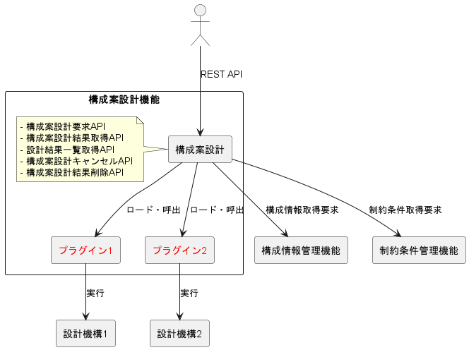

# 1. はじめに

本書は構成案設計機能における設計機構プラグインの開発方法を説明するものです。

構成案設計機能は外部から構成案設計要求や構成案設計結果取得要求などのAPI要求を受け付け、対応するプラグインに処理を委譲するソフトウェアです。  
設計機構は入力されたサービスの定義情報やリソース要求を基にリソースの選定を行いノードの構成を決定し構成案を設計/管理するソフトウェアです。  
設計機構プラグイン(以降プラグインと記載)は、構成案設計機能と設計機構の間に位置するコンポーネントであり、以下の役割を担います。  
- 構成案設計機能が提供する統一的なインターフェースと、各設計機構の固有のインターフェースを相互に変換します。  
- これにより、構成案設計機能は設計機構の実装詳細を意識することなく、複数の設計機構を同じ方法で利用できます。  
- 新しい設計機構を追加する際も、対応するプラグインを実装するだけで統合が可能になり、構成案設計機能から柔軟にさまざまな種類の設計機構と連携が可能になります。

構成案設計機能の概要を以下に示します。

構成案設計機能はREST APIサービスです。  
構成案設計機能の起動時に配置されているプラグインを取り込むことで対応する設計機構の呼出が可能になります。

図中のコンポーネントについて下表にまとめます。

| コンポーネント | 説明 |
| --- | --- |
| 構成案設計 | プラグインを介して複数の設計機構と連携し、指定された設計機構への構成案の設計の実行要求、設計結果の取得要求などを取りまとめるコンポーネント。 |
| 構成情報管理機能 | 構成案の設計実行時にプラグイン/設計機構へ渡すリソースの性能情報、ノードの構成情報などの情報を持つコンポーネント。 |
| 制約条件管理機能 | 構成案の設計実行時にリソース選定の制約条件を保持、管理するコンポーネント。 |
| プラグイン | 対応する設計機構と連携し、各設計機構に依存する処理を受け持つコンポーネント。 |
| 設計機構 | 入力されたサービス、リソースなどの各種情報からサービスが稼働する構成案を作成するコンポーネント。 |

## 用語一覧

本書で使用している用語とその概要を以下にまとめます。

| 用語 | 概要 |
| --- | --- |
| ノード | システムを構成するリソース群 |
| リソース | ノードを構成する計算機資源（CPU、メモリ、ストレージなど） |
| サービス | ノード上で稼働するアプリケーションやソフトウェア機能 |
| リソース要求 | サービスが必要とするリソースの種別と性能要件 |
| リソースグループ | リソースの論理的な集合 |
| 設計ID (designID) | プラグインまたは設計機構により割り当てられる構成案設計要求を識別するID |
| 要求ID (requestID) | 構成案設計機能の呼び出し元で管理する構成案設計要求を識別するためのID |
| 構成案 | サービスの定義情報、リソース要求情報などの入力情報をもとに設計されたノードの構成案 |
| 移行条件 | 入力された現ノード構成から作成された構成案へ移行する際に許容されるノード負荷の条件 |
| 移行手順 | 入力された現ノード構成から作成された構成案へ移行するための手順 |
| 設計状態 | 構成案の設計状態を示すステータス（IN_PROGRESS、COMPLETED、FAILED、CANCELING、CANCELED）|
| 全体設計 | 入力されたすべてのサービス/ノードが設計対象となる設計方式 |
| 部分設計 | 指定されたサービス/ノードのみが設計対象となる設計方式 |
| サンプルプラグイン/サンプル設計機構 | プラグイン開発の参考実装として提供されるサンプルコード |
| スタブ | 開発時に関連コンポーネントの代替として機能するテスト用プログラム |
