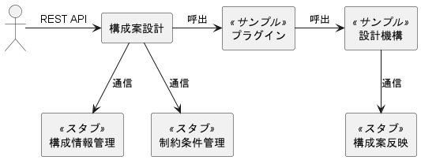

# 3. 開発環境構築

本章では、サンプルプラグインを例に、構成案設計機能にプラグインを組込み、REST APIを実行する手順を説明します。  
プラグインの動作確認は、[2.1. 構成案設計機能のREST API](02_LayoutDesignFunctions.md#21-構成案設計機能のrest-api)により行います。詳細は[5. プラグインの実装](05_Implementing_plugin.md)に記載します。

本章の手順により、以下の図に示す構成でプラグインの開発環境を構築します。



本章の手順を実行することで、構築される開発環境のコンポーネントの一覧は以下の通りです。
- 構成案設計
- サンプルプラグイン/サンプル設計機構
- スタブ
  - 構成情報管理機能の代替
  - 制約条件管理機能の代替
  - 構成案反映機能の代替

構築後は以下が実現できます。
- サンプルプラグインを使用した構成案設計機能のREST API実行
- 構成案設計要求から構成案設計結果取得までの一連の動作確認
- サンプルプラグインを使用したプラグイン開発に必要な入出力情報の確認

サンプルプラグイン/サンプル設計機構はプラグインの環境構築、および構成案設計要求から構成案設計結果取得までの一連の実行の流れと入出力情報の確認に使用できます。  
スタブは構成案設計機能のREST APIを実行するにあたって必要となる以下の関連コンポーネントのAPIエンドポイントを持ちます。
- 構成情報管理機能
- 制約条件管理機能
- 構成案反映機能(サンプルプラグイン/サンプル設計機構を使用する場合)

スタブの機能が利用可能な状態になっていない場合、構成案設計でエラーになる、またはサンプルプラグイン/サンプル設計機構を使用した構成案設計要求で構成案の設計に失敗します。  
具体的には、以下のような状態を指します。
- スタブのプロセスが起動していない
- スタブのポート番号が構成案設計およびサンプルプラグイン/サンプル設計機構の設定ファイルに記載されたポート番号と一致していない

サンプルプラグインに関する制限事項/注意事項を以下にまとめます。
- サンプルプラグイン利用時は構成情報管理機能・制約条件管理機能に加えて構成案反映機能も必要です。
- スタブが未起動、または設定ファイル記載のポート番号と不一致の場合はエラー、もしくは設計処理が失敗します。
- サンプルプラグイン/サンプル設計機構は構成案設計キャンセルおよび構成案設計結果削除機能に非対応です。

開発は以下がインストールされたLinux上で行います。
- [Python](https://www.python.org/)(3.14以上)
- [PDM](https://pdm-project.org/latest/)
- [git](https://git-scm.com/)
- [docker](https://www.docker.com/)

## 3.1. スタブのセットアップ

構成案設計機能は構成案設計要求を受け付けた際、構成情報管理機能と制約条件管理機能と通信します。  
またサンプルプラグイン/サンプル設計機構を使用する際に、構成案反映機能と通信します。  
開発ではこれらの接続先としてスタブを使用します。

スタブは、本ガイドと同じGitリポジトリに登録されています。  
本ガイドのGitリポジトリ(`design-engine-plugin-dev-guide`)を任意のディレクトリへクローンします。

<!-- TODO: 確定後に修正 -->
``` shell
cd <任意のディレクトリパス>
git clone <git url> --recursive
```

以下、作成されたディレクトリを`design-engine-plugin-dev-guide`と表記します。

`design-engine-plugin-dev-guide/rest-api-stub`にスタブが登録されています。  
`design-engine-plugin-dev-guide/rest-api-stub`で以下を実行し、Python仮想環境(venv)の作成とパッケージのダウンロードを行います。

``` shell
cd ./design-engine-plugin-dev-guide/rest-api-stub/
pdm install
```

### ポート番号(スタブ)

デフォルトで8002番ポートを使用します。
  変更する場合は以下のファイルを編集します。

- 設定ファイル: `design-engine-plugin-dev-guide/rest-api-stub/src/settings.py`

``` python
PORT = 8002  # ポート番号を変更する場合はこの値を修正
```

- スタブを使用する場合、構成案設計の以下の設定のホスト側ポートも`8002`に合わせてください。([3.2. 構成案設計のセットアップ](03_Setup.md#32-構成案設計のセットアップ)を参照)
  - 制約条件管理 `policy_manager.uri`
  - 構成情報管理 `configuration_manager.uri`
- サンプルプラグイン/サンプル設計機構を使用する場合、以下の設定のホスト側ポートも`8002`に合わせてください。([3.3. プラグインの配置](03_Setup.md#33-プラグインの配置)を参照)
  - 構成案反映 `layout_apply.uri`

### スタブの起動

以下のPythonファイルを実行して、スタブを起動します。

- 起動ファイル: `design-engine-plugin-dev-guide/rest-api-stub/src/main.py`

起動コマンド例:
``` shell
pdm run python src/main.py
```

## 3.2. 構成案設計のセットアップ

構成案設計機能のGitリポジトリ(`layout-design-compose`)を任意のディレクトリへクローンします。

<!-- TODO: 確定後に修正 -->
``` shell
cd <任意のディレクトリパス>
git clone <git url> --recursive
```

以下、作成されたディレクトリを`layout-design-compose`と表記します。

### 構成案設計のポート番号

構成案設計機能はdocker上で動作します。デフォルトで以下のポート番号を使用します。
- ホストのポート番号: 8011
- コンテナのポート番号: 8000

dockerのポート番号を変更する場合は以下のファイルを編集します。
- compose.yml: `layout-design-compose/compose.yml`

``` yml
ports:
  - 8011:8000  # ホスト側のポート番号を変更する場合は先頭の数値、コンテナのポート番号を変更する場合は末尾の数値を修正
  - 3502:3500
```

- デフォルトのホスト側ポートは`8011`、コンテナ側は`8000`です。
- 構成案設計の公開ポート`8011`は他のサービスと競合しない限り変更不要です。

構成案設計のポート番号を変更する場合は以下のファイルを編集します。
- 構成案設計設定ファイル: `layout-design-compose/layout-design/config/layoutdesign_config.yaml`

``` yaml
layout_design:
  host: 0.0.0.0
  port: 8000  # ポート番号を変更する場合はこの値を修正
```

- `layout_design.port`のデフォルト値は`8000`です（コンテナ内の待受ポート）。
- `compose.yml`のマッピング`8011:8000`と整合している必要があります。

### 構成案設計のロガー設定

構成案設計機能では[Pythonの標準ロガー](https://docs.python.org/3/library/logging.html)を使用します。  
ログに関する設定を変更する場合は以下のファイルを編集します。
- 構成案設計ログ設定ファイル: `layout-design-compose/layout-design/config/layoutdesign_log_config.yaml`

### 関連コンポーネントの宛先

構成案設計が構成案設計要求を受け付けた際、構成案設計から構成情報管理機能、制約条件管理機能と通信します。  
構成情報管理機能、制約条件管理機能の宛先を変更する場合は以下のファイルを編集します。
- 構成案設計設定ファイル: `layout-design-compose/layout-design/config/layoutdesign_config.yaml`

``` yaml
policy_manager:
  uri: http://localhost:3500/v1.0/invoke/policy-manager/method/cdim/api/v1  # 制約条件管理機能のURIを変更する場合はこの値を修正
  timeout: 60
configuration_manager:
  uri: http://localhost:3500/v1.0/invoke/configuration-manager/method/cdim/api/v1  # 構成情報管理機能のURIを変更する場合はこの値を修正
  timeout: 60
```

- 上記の設定値はデフォルト値です。
- スタブを使用する場合は、以下を修正してください
  - スタブはコンテナ外で動作するため、`localhost`をホストのIPアドレスに変更してください。
  - ポート番号をスタブ側の`PORT`設定 (デフォルト: `8002`) と一致するよう変更してください。
  - デフォルト値のパスパラメータは`dapr`を経由して通信する場合の値です。スタブを使用する場合は以下の記入例を参考にパスパラメータを指定してください。

変更後の記入例:
``` yaml
policy_manager:
  uri: http://192.168.128.1:8002/cdim/api/v1
  timeout: 60
configuration_manager:
  uri: http://192.168.128.1:8002/cdim/api/v1
  timeout: 60
```

## 3.3. プラグインの配置

プラグインを構成案設計機能に配置します。
プラグインの配置場所と必要なファイル構成については[4.1. ファイル構成](04_Configuration.md#41-ファイル構成)に記載されています。  
サンプルプラグインは構成案設計機能にデフォルトで取り込まれます。  
[3.4. 構成案設計の起動](03_Setup.md#34-構成案設計の起動)後、構成案設計機能のプラグインディレクトリ (`layout-design-compose/layout-design/plugins/`) は以下のようになります。

``` text
layout-design-compose/layout-design/plugins/
└── sample_design_engine ................... サンプルプラグイン配置ディレクトリ
    ├── config_loader.py ................... サンプルプラグイン設定ファイル読み込みファイル
    ├── config_sample_design_engine.yaml ... サンプルプラグイン設定ファイル
    ├── config_schema.py ................... サンプルプラグイン設定ファイルスキーマファイル
    ├── layout_apply_consumer.py ........... 構成案反映API実行ファイル
    ├── plugin_sample_design_engine.py ..... サンプルプラグインファイル
    └── sample_design_engine.py ............ サンプル設計機構ファイル
```

プラグインは[5. プラグインの実装](05_Implementing_plugin.md)で説明する機能以外に制約などはありません。  
プラグインの実装例として、サンプルプラグインを`design-engine-plugin-dev-guide/samples/sample-design-engine-plugin`に配置しています。

サンプルプラグインを使用する場合、サンプルプラグインから構成案反映のREST APIを呼び出します。  
サンプルプラグインの設定ファイル(`layout-design-compose/layout-design/config/config_sample_design_engine.yaml`)にログに関する設定項目、および構成案反映APIのURIが記載されています。  
構成案反映の宛先を変更する場合は以下の項目を編集します。

``` yaml
layout_apply:
  uri: http://localhost:3500/v1.0/invoke/layout-apply/method/cdim/api/v1  # 構成案反映機能のURIを変更する場合はこの値を修正
  timeout: 60
```

- 上記の設定値はデフォルト値です。
- スタブを使用する場合は、以下を修正してください
  - スタブはコンテナ外で動作するため、`localhost`をホストのIPアドレスに変更してください。
  - ポート番号をスタブ側の`PORT`設定 (デフォルト: `8002`) と一致するよう変更してください。
  - デフォルト値のパスパラメータは`dapr`を経由して通信する場合の値です。スタブを使用する場合は以下の記入例を参考にパスパラメータを指定してください。

変更後の記入例:
``` yaml
layout_apply:
  uri: http://192.168.128.1:8002/cdim/api/v1
  timeout: 60
```

また、サンプルプラグインおよびサンプル設計機構では、構成案設計キャンセルと構成案設計結果削除には対応していません。

## 3.4. 構成案設計の起動

構成案設計はdocker上で動作しており、起動/停止には`docker compose`コマンドを使用します。  
```cdim-net```という名前のdockerネットワークが作成されていない場合は事前に以下のコマンドを実行して作成してください。

```shell
docker network create cdim-net
```

使用するプラグインの配置後に以下のコマンドを実行して構成案設計機能を実行してください。
- 起動(初回起動時には```--build```オプションを指定してください)

    ``` shell
    cd <任意のディレクトリパス>/layout-design-compose
    docker compose up [-d] [--build]
    ```
- 停止

    ``` shell
    docker compose down
    ```

構成案設計の起動後、`docker ps`コマンドを実行して`layout-design`というコンテナが起動状態になっている場合、起動に成功しています。

出力例:
``` shell
docker ps
CONTAINER ID   IMAGE                             COMMAND                  CREATED          STATUS         PORTS                                            NAMES
bd3a77325874   daprio/daprd:edge                 "./daprd -app-id lay…"   11 seconds ago   Up 2 seconds                                                    layout-design-dapr
4d24ff726960   layout-design-dev-layout-design   "sh -c 'exec layoutd…"   12 seconds ago   Up 2 seconds   0.0.0.0:3502->3500/tcp, 0.0.0.0:8011->8000/tcp   layout-design
```

## 3.5. プラグインの実行

REST API実行ツールを使用して、[構成案設計要求](02_LayoutDesignFunctions.md#21-構成案設計機能のrest-api)を実行します。  
構成案設計要求を実行する際、構成情報管理機能、制約条件管理機能が関連コンポーネントとして必要になります。  
サンプルプラグインを使用する場合は、追加で構成案反映機能が必要になります。  
構成案設計機能の起動前にスタブへの接続設定とスタブの起動を完了させてください。  
構成案設計要求APIのリクエストボディとして渡す情報については[付録1. request_design関数へ渡される引数](a01_Args_to_request_design_Function.md)を参照してください。  
サンプルプラグインを使用する場合のcurlコマンドでの実行例は以下の通りです。

``` shell
curl -X POST -H "Content-Type: application/json" "localhost:8011/cdim/api/v1/layout-designs?designEngine=sample_design_engine" -d @<入力情報ファイル>
```

上記コマンド例の`<入力情報ファイル>`で指定可能なサンプルデータファイルが本ガイドのGitリポジトリの以下のパスにあります。
- `samples/data/post_request_data.json`

実行結果は以下のようになります。

``` json
{"designID": "ca71c4bb-7ba8-41ea-9707-35f46b675857"}
```

`designID`はプラグインまたは設計機構により割り当てられる構成案設計要求を識別するIDです。  
返却された`designID`を指定して[構成案設計結果取得](02_LayoutDesignFunctions.md#21-構成案設計機能のrest-api)を実行します。  
構成案設計結果取得APIのレスポンスボディとして返却される情報については[付録2. get_design関数から返却される戻り値](a02_Return_Value_from_get_design.md)を参照してください。  
サンプルプラグインを使用する場合のcurlコマンドでの実行例は以下の通りです。

``` shell
curl -X GET "localhost:8011/cdim/api/v1/layout-designs/<designID>?designEngine=sample_design_engine"
```

- `<designID>`には構成案設計要求で返却された設計IDを指定してください。

実行結果は以下のようになります。

``` json
{
    "status": "COMPLETED",
    "requestID": "17d9a80f-1a32-4f5a-9c50-b1c64c259f15",
    "startedAt": "2025-05-10T00:00:00Z",
    "endedAt": "2025-05-10T00:00:00Z",
    "design": {...},
    "conditions": {},
    "procedures": [...]
}
```