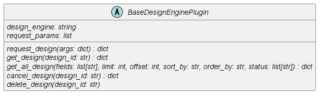

# 4. プラグインの構成

本章ではプラグインを構成するファイルとクラスについて説明します。

## 4.1. ファイル構成

プラグインはPythonモジュールで構成されます。  
構成案設計機能の`layout-design-compose/layout-design/plugins/`ディレクトリに設計機構プラグインごとに1つのディレクトリを配置します。

``` text
plugins/
├── プラグイン1/
│   ├── プラグインファイル.py
│   └── その他ディレクトリ/モジュール.py
├── プラグイン2/
│   ├── プラグインファイル.py
│   └── その他ディレクトリ/モジュール.py
└── sample_design_engine/
```

プラグインファイルは```plugin_```から始まる```plugin_XXX.py```の形式のファイル名で作成します。  
プラグインファイルに[4.2. クラス構成](04_Configuration.md#42-クラス構成)で説明するクラスを定義します。  
プラグインファイル以外に必要があればその他ディレクトリ/モジュールや設定ファイル等を作成します。  
構成案設計の起動時に`layout-design-compose/layout-design/plugins/`ディレクトリ配下にあるプラグインファイルを検索し、`importlib`モジュールを使用してプラグインとしてロードされます。
ロードする際に[4.2. クラス構成](04_Configuration.md#42-クラス構成)および[5. プラグインの実装](05_Implementing_plugin.md)で説明するプロパティ/関数が実装されていない場合、構成案設計の起動に失敗します。

## 4.2. クラス構成

プラグインは以下に示す基底クラスを継承して実装します。



`BaseDesignEnginePlugin`はプラグインの基底クラスです。本クラスは`layout-design-compose/layout-design/layout-design/src/common/base.py`に定義されています。  
プラグインはこのクラスを継承し、[2.2. プラグインの概要](02_LayoutDesignFunctions.md#22-プラグインの概要)に示したメソッドを実装します。  
実装の詳細は[5. プラグインの実装](05_Implementing_plugin.md)で説明します。

本クラスは以下の```import```文から利用できます。
``` python
from common.base import BaseDesignEnginePlugin
```
