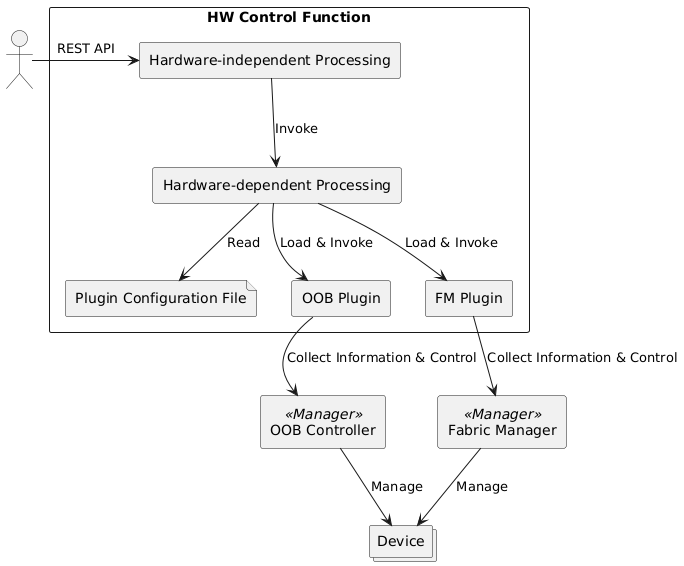

# 1. Introduction

This manual explains how to develop plugins for hardware (HW) control function.

The HW control function is software that collects information of the hardware and controls it.  
In order to support various hardware in the future, hardware-dependent functions will be implemented as plugins.

An overview of the HW control functions is shown below.

The HW control function is a REST API service.  
When processing a request, it loads the plugin as needed and performs its function.

The main terms in the diagram are summarized in the table below.

|Terminology               |Description
|--------------------------|--------------------------------------------------------------------------------------------
|Manager                   |A component the plugin communicates with. The plugin communicates with the manager via vendor-dependent protocols to collect information of the hardware and control it.
|OOB Controller            |A component (type of manager) that manages equipment by a dedicated means of communication (Out Of Band).
|Fabric Manager            |The component that controls the CXL/PCIe switch (a type of manager).
|OOB Plugin                |A plugin that works with OOB controllers.
|FM Plugin                 |A plugin that works with Fabric Manager.
|Plugin Configuration File |A file that contains the settings required to load and invoke the plugin.
|Device                    |Processors (CPU, GPU...), memory, storage, network interfaces, etc. managed by the manager.
