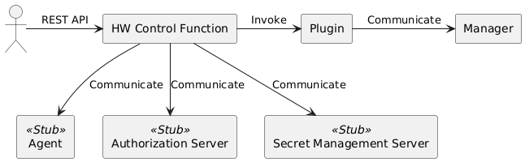

# 3. Setup

This chapter describes the procedure to embed a plugin in the HW control function and executing the REST API.  
The operation of the plugin can be verified using [the REST API of the HW control function](02_HWControlFunction.md#21-rest-api-of-hw-control-function).
Details are provided in chapters [5](05_Implementing_OOB_plugins.md) and [6](06_Implementing_FM_plugins.md).

Development is done on Linux with [Python](https://www.python.org/) (3.12 or higher) and [PDM](https://pdm-project.org/latest/) installed.

## 3.1. Setting Up the Stub

When collecting information of the device and controlling it,
the HW control function communicates with the agent on the OS that controls the device.  
It also communicates with the authorization server and the secrets management server.  
Development uses stubs as these communication destinations.



The stub is registered in the same Git repository as this guide.  
Clone the Git repository (`plugin-dev-guide`) of this guide.

``` shell
git clone https://github.com/project-cdim/plugin-dev-guide.git
```

Hereinafter, the created directory is referred to as `plugin-dev-guide/`.

The stub is placed in `plugin-dev-guide/rest-api-stub/`.  
In `plugin-dev-guide/rest-api-stub/`, run the following to create a Python virtual environment (venv) and download the package.

``` shell
pdm sync
```

### Port Number (Stub)

Port 8001 is used by default. If you want to change it, edit the following file.

- Startup script: `plugin-dev-guide/rest-api-stub/pyproject.toml`

  ``` toml
  start = "fastapi run --host 0.0.0.0 --port 8001"
                                             ^^^^ Change here
  ```

## 3.2. Setting Up HW Control Function

Clone the Git repository (`hw-control`) of the HW control function.

``` shell
git clone https://github.com/project-cdim/hw-control.git
```

Hereinafter, the created directory is referred to as `hw-control/`.

Run the following in `hw-control/` to create a Python virtual environment (venv) and download the package.

``` shell
pdm sync
```

Edit or create the following files:  
(If you have changed [the port number of the stub](#port-number-stub), set `8001` to the new port number.)

- `hw-control/pyproject.toml` (edit)

  ``` toml
  ...
  [tool.pdm.scripts]
  start.cmd = "uvicorn app.hw_control_main:app --host 0.0.0.0 --port 8000 --reload"
  start.env = { PYTHONPATH = "${PDM_PROJECT_ROOT}/src" }
  start.env_file = ".env"     # Add this line
  ```

- `hw-control/.env` (create)

  ``` shell
  HW_CONTROL_LOG_DIR=./logs
  HW_CONTROL_LOG_STDOUT=true
  HW_CONTROL_CONFIG_FILE_DIR=./config/
  HW_CONTROL_DATA_FILE_DIR=./data
  HW_CONTROL_AUTHORIZATION_SERVER_TOKEN_ENDPOINT=http://localhost:8001/hw-control/token
  HW_CONTROL_SECRET_API_HOST=localhost
  HW_CONTROL_SECRET_API_PORT=8001
  HW_CONTROL_SECRET_API_PATH=/hw-control/secrets/
  ```

  The following settings are made in this file.

  - Set the log output directory to `hw-control/logs`
  - Enable logging to the console
  - Set the configuration file directory to `hw-control/config`
  - Set the data output directory to `hw-control/data`
  - Set the authorization server and secret management server to stubs

- `hw-control/config/device_attribute_setting.yaml` (edit)

  ``` yaml
  ---
  DEFAULT:
      agent:
          url: http://127.0.0.1:8001
  ```

- `hw-control/src/app/core/control/agent_control.py` (edit)

  ``` python
  # AGENT_REST_API_PORT = 8000   # Comment out this line and
  AGENT_REST_API_PORT = 8001     # add this line
  ```

Run the following in `hw-control/` to create an output directory for logs and data:

``` shell
mkdir logs data
```

### Port Number (HW Control Function)

Port 8000 is used by default. If you want to change it, edit the following file.

- Startup script: `hw-control/pyproject.toml`

  ``` toml
  start.cmd = "uvicorn app.hw_control_main:app --host 0.0.0.0 --port 8000 --reload"
                                                                     ^^^^ Change here
  ```

## 3.3. Executing HW Control Function

Launch the stub.  
In `plugin-dev-guide/rest-api-stub/`, run:

``` shell
pdm start
```

Start the HW control function.  
Open a new terminal and run the following in `hw-control/`:

``` shell
pdm start
```

The REST API of the HW control function is executed by a REST client such as Swagger UI or curl.  
The Swagger UI is accessed by opening a <http://localhost:8000/docs> in a browser.  
When you run the REST API in the Swagger UI, you will see the command line when using curl.

At this stage, you have not yet deployed the plugin, so the REST API will fail.  
Plugins should be placed in `hw-control/src/plugins` according to [4.1. File Structure](04_Configuration.md#41-file-structure).  
[3.4. Deploying and Running the Sample Plugin](#34-deploying-and-running-the-sample-plugin) shows the procedure using the sample.  
If the plugin is placed or changed, the HW control function should be restarted.

### Stop

To stop the stub or HW control function, press `Ctrl-C` on the console.

### Log Level

By default, logs of INFO level or higher are output.  
If you want to change the log level to debug, set the environment variable `HW_CONTROL_LOGGING_LEVEL` to `DEBUG`.

``` shell
HW_CONTROL_LOGGING_LEVEL=DEBUG pdm start
```

## 3.4. Deploying and Running the Sample Plugin

### Deploying the Sample Plugin

Place the sample OOB plugin in the HW control function.  
OOB plugin samples are placed in `plugin-dev-guide/samples/oob-sample-plugin/`.  
Copy all files/directories under this directory to `hw-control/src/plugins/oob/`.  

The plugin directory of the HW control function is as follows.

``` text
hw-control/src/plugins/
└── oob/ ..................... OOB Plugin directory
    ├── OOB1_manager.yaml .... OOB Plugin configuration file
    └── oob_sample/
        └── plugin.py ........ OOB Plugin
```

- OOB plugin related files should be placed in `plugins/oob/`.
- The OOB plugin configuration file name is "manager ID + `_manager.yaml`".  
  In the sample, `OOB1` is the manager ID.  
  The plugin configuration file is described in [4. Plugin Configuration](04_Configuration.md).
- The OOB plugin is a Python module.  
  In the sample, `oob_sample.plugin` is the relative path of the module.  
  Plugins will be described in the next chapter.

In the same way, place the FM plugin sample in the HW control function.  
FM plugin samples are placed in `plugin-dev-guide/samples/fm-sample-plugin/`.  
Copy all files/directories under this directory to `hw-control/src/plugins/fm/`.

The result should look like this (details are omitted because it is the same as the OOB plugin):

``` text
hw-control/src/plugins/
└── fm/ ...................... FM Plugin directory
    ├── FM1_manager.yaml ..... FM Plugin configuration file
    └── fm_sample/
        └── plugin.py ........ FM Plugin
```

### Running the Sample Plugin

Access the HW control function Swagger UI and execute [`Get device ID list information`](02_HWControlFunction.md#21-rest-api-of-hw-control-function).  
The result of the execution is as follows.

``` json
{
  "deviceList": [
    {
      "deviceID": "b5e08b81-cfa4-4939-aa42-f28d18907d1a",
      "type": "CPU"
    },
    {
      "deviceID": "8dd4db5a-d73d-4a72-a50e-d7765d57581e",
      "type": "CPU"
    },
    ...
  ],
  "infoTimestamp": "2024-12-19T06:27:18Z"
}
```

The `deviceID` is assigned by the HW control function.  
Copy one of the `deviceID`'s and execute [`Get spec information`](02_HWControlFunction.md#21-rest-api-of-hw-control-function).  
The result of the execution is as follows.

``` json
{
  "deviceID": "b5e08b81-cfa4-4939-aa42-f28d18907d1a",
  "type": "CPU",
  "baseSpeedMHz": 1200,
  "operatingSpeedMHz": 3200,
  "TDPWatts": 100,
  "totalCores": 4,
  "totalEnabledCores": 4,
  "totalThreads": 8,
  ...
  "infoTimestamp": "2024-12-19T06:30:11Z"
}
```

### Where to connect the sample plugin

The sample plugin connects to the stub.  
If [the port number of the stub](#port-number-stub) has been changed, edit the following file and restart the HW control function.

- OOB Plugin Sample: `hw-control/src/plugins/oob/OOB1_manager.yaml`

  ``` yaml
  ...
  specific_data:
    base_url: http://localhost:8001/oob-sample
                               ^^^^ Change here
  ```

- FM Plugin Sample: `hw-control/src/plugins/fm/FM1_manager.yaml`

  ``` yaml
  ...
  specific_data:
    base_url: http://localhost:8001/fm-sample
                               ^^^^ Change here
  ```
