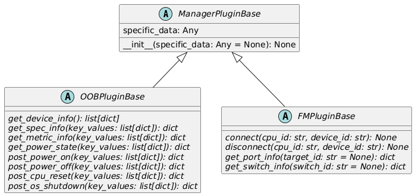

# 4. Plugin Configuration

This chapter describes the files and classes that make up the plugin.

## 4.1. File Structure

The plugin consists of a configuration file and a Python module.  
Place them in the `plugins/` directory for each manager type of hardware control functions.  

``` text
plugins/
└── manager_type/
    ├── configuration_file.yaml
    └── directory/module.py
```

Manager types are either `oob` or `fm`. The OOB plugin should be placed in `oob/`, and the FM plugin should be placed in `fm/`.

A configuration file is created for each manager, in YAML format, with the file name as "manager ID + `_manager.yaml`".  
The manager ID is a name that uniquely identifies the manager and can use alphanumeric characters, underscores (`_`), and hyphens (`-`).  
The configuration file includes the Python module path, class name, and configuration information (details are described [below](#plugin-configuration-file-format)).  
The Python modules should be placed in subdirectories, and their paths should be unique for each manager type.

The sample file structure is as follows.

``` text
plugins/
├── oob/
│   ├── OOB1_manager.yaml
│   └── oob_sample/
│       └── plugin.py
└── fm/
    ├── FM1_manager.yaml
    └── fm_sample/
        └── plugin.py
```

- The configuration file for the OOB plugin is `OOB1_manager.yaml` (manager ID is `OOB1`), and the Python module is `oob_sample.plugin`.
- The configuration file for the FM plugin is `FM1_manager.yaml` (manager ID is `FM1`), and the Python module is `fm_sample.plugin`.

### Plugin Configuration File Format

The configuration file format is YAML. The following properties are defined:

- `module`  
  The module path of the plugin.
- `class`  
  The class name of the plugin (refer to the [next section](#42-class-structure) for details about classes).
- `specific_data`  
  Plugin-specific configuration information, such as connection information to a manager.  
  The base class of the plugin, discussed in the [next section](#plugin-base-class-managerpluginbase), holds the configuration information.

Here is an example.

``` yaml
---
module: oob_sample.plugin
class: OOBSamplePlugin
specific_data:
  base_url: http://localhost:8080
  timeout_sec: 60
  manager_path: /redfish/v1/Managers/1
```

- The module path is `oob_sample.plugin`, and the class name is `OOBSamplePlugin`.
- The following settings are configured for the plugin-specific information:
  - Manager connection information (`base_url`)
  - Timeout (`timeout_sec`)
  - Path to manager information (`manager_path`)  
    *Note: `base_url` + `manager_path` forms the URL for the manager information.*

## 4.2. Class Structure

Plugins are implemented by inheriting from the base classes shown below.



### Plugin Base Class (ManagerPluginBase)

It is a common base class for plugins.  
The attribute `specific_data` holds the `specific_data` from the [plugin configuration file](#plugin-configuration-file-format).  
Plugins acquire configuration information (such as connection information to the manager) from this attribute.

Derived classes cannot change the form of the constructor.  
If implementing specific initialization processes for derived classes, it should be done as follows.

``` python
def __init__(self, specific_data: Any = None) -> None:
    super().__init__(specific_data)
    # Implement initial processing here.
```

### OOB Plugin Base Class (OOBPluginBase)

The OOB plugin inherits from this class and implements the methods outlined in [2.2 Overview of Plugins](02_HWControlFunction.md#oob-plugin-methods).  
The implementation details are described in [5. Implementation of OOB Plugins](05_Implementing_OOB_plugins.md).

### FM Plugin Base Class (FMPluginBase)

FM plugins inherit from this class and implement the methods shown in [2.2 Overview of Plugins](02_HWControlFunction.md#fm-plugin-methods).  
Details of the implementation are described in [6. Implementation of FM Plugins](06_Implementing_FM_plugins.md).
