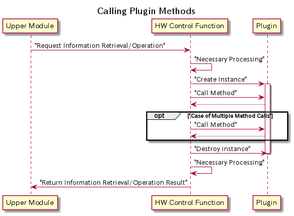

# 9. Special Notes

## 9.1. Notice

### Regarding Exclusivity

The HW control function operates in a multithreaded environment.  
Plugins allow for the creating instances, invocation of methods, and destroying instances from multiple threads.  
This means that instances may be created in parallel for the same control target (FM/OOB).  
Therefore, when performing exclusion or order control for targets like FM/OOB, use class variables instead of instance variables.  
Additionally, the `cpu_id` (USP side) and `device_id` (DSP side) specified in the FM plugin's `connect`/`disconnect` methods are exclusive within the hardware control function, ensuring that another thread is not executing the `connect`/`disconnect` methods simultaneously.  

The following is an execution image of the plugin when information retrieval and manipulation requests occur from the upper module:  



### Device Linking

Information about devices controlled by the HW control function is obtained from both the OOB plugin and the FM plugin.  
It is possible that the information of the same device is returned from both the OOB plugin and the FM plugin.
The necessary specifications to link the information from both are described below.  
It is required that the `get_device_info` method of the OOB plugin and the `get_port_info` method of the FM plugin return the same information for any of the following:

- CPU Information:
  - CPU information consists of CPUSerialNumber, CPUManufacturer, and CPUModel.
- PCIe Device Information:
  - PCIe device information consists of PCIeDeviceSerialNumber, PCIeDeviceId, and PCIeVendorId.
- deviceKeys:
  - deviceKeys is used when CPU information or PCIe device information cannot be obtained from both the FM plugin and the OOB plugin, and there is other information identifiable by devices retrievable from both plugins.
  - deviceKeys should be in the form of dictionary data, and key names corresponding to the information to be retrieved should be predetermined.
  - The number of keys, as well as the keys and their values, must match exactly, including spaces, uppercase, and lowercase.
- portKeys:
  - portKeys are used when CPU information, PCIe device information, and deviceKeys cannot be obtained from both the FM plugin and the OOB plugin, utilizing information that can identify switch ports obtainable from both plugins.
  - portKeys should be in the form of dictionary data, and key names corresponding to the information to be retrieved should be predetermined.
  - The number of keys, as well as the keys and their values, must match exactly, including spaces, uppercase, and lowercase.

Returning both CPU information and PCIe device information does not result in correct recognition.  
The linking information for the devices above must be unique within the system.
If the same value is returned for multiple devices, the device information may not be linked as expected.  
For details on the `get_device_info` method, please refer to 
[5.1. `get_device_info()`](05_Implementing_OOB_plugins.md#51-get_device_info),
and for details on the `get_port_info` method, 
[6.3. `get_port_info(target_id=None)`](06_Implementing_FM_plugins.md#63-get_port_infotarget_idnone).  

### Implementation of Unsupported Methods

If it is not possible to implement a plugin method due to reasons such as the device not being supported, please raise a [`RequestNotSupportedHwControlError`](07_Handling_Exceptions.md#72-defined-exceptions).  
An example is shown below.

``` python
def post_os_shutdown(self, key_values: list[dict[str, str]]) -> dict[str, list[dict]]:
    raise RequestNotSupportedHwControlError
```

## 9.2. Restriction

### Additional Packages

Third-party additional packages that are not installed in the operating environment of the HW control function cannot be additionally installed.  
The following packages are currently available.

- [Pydantic (Pydantic Settings)](https://docs.pydantic.dev/latest/)
- [PyYAML](https://pyyaml.org/wiki/PyYAMLDocumentation)
- [Requests](https://docs.python-requests.org/en/latest/index.html)
- [urllib3](https://urllib3.readthedocs.io/en/stable/)

### Vendor-Dependent Extended Exception Class Code

The three-character vendor-dependent extended exception class code required when adding exceptions assumes a string that does not conflict with publicly available plugins.  
Currently, no plugins have been released, so any code can be used.  
If plugins are released by vendors in the future, methods to avoid conflicts (such as publishing a list of class codes used by existing plugins) will be provided.  
