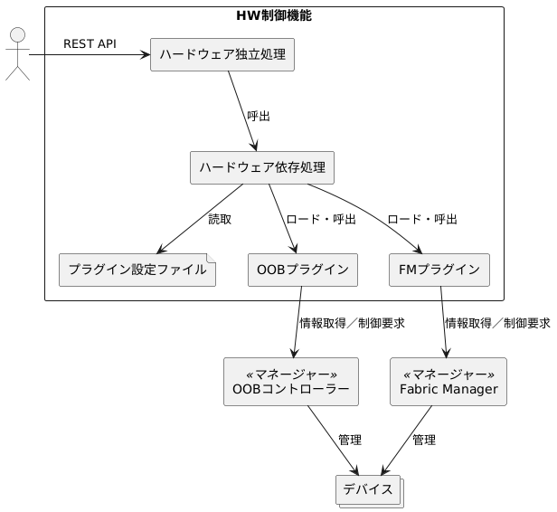

# 1. はじめに

本書はHW制御機能におけるプラグインの開発方法を説明するものです。

HW制御機能はハードウェアの情報収集と制御を行うソフトウェアです。  
将来にわたって様々なハードウェアに対応するため、ハードウェアに依存する機能をプラグインとして実装します。

HW制御機能の概要を以下に示します。

HW制御機能はREST APIサービスです。  
要求を処理する際、必要に応じてプラグインをロードし、その機能を実行します。

図中の主な用語を下表にまとめます。

|用語                   |説明
|-----------------------|-----------------------------------------------------------------------------------------------
|マネージャー           |プラグインの制御対象。プラグインはベンダ依存のプロトコルでマネージャーと通信し、ハードウェアの情報収集と制御を行います。
|OOBコントローラー      |専用の通信手段(Out Of Band)で機器を管理するコンポーネント(マネージャーの1種)。
|Fabric Manager         |CXL/PCIeスイッチを制御するコンポーネント(マネージャーの1種)。
|OOBプラグイン          |OOBコントローラーと連携するプラグイン。
|FMプラグイン           |Fabric Managerと連携するプラグイン。
|プラグイン設定ファイル |プラグインをロードして呼び出すために必要な設定が記載されたファイル。
|デバイス               |マネージャーが管理するプロセッサ(CPU, GPU...)、メモリ、ストレージ、ネットワークインターフェースなど。
