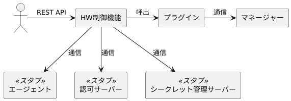

# 3. 開発環境の構築

本章では、HW制御機能にプラグインを組み込み、REST APIを実行する手順を説明します。  
プラグインの動作確認は、[HW制御機能のREST API](02_HWControlFunction.md#21-hw制御機能のrest-api)により行います。詳細は[5章](05_Implementing_OOB_plugins.md)と[6章](06_Implementing_FM_plugins.md)に記載します。

開発は[Python](https://www.python.org/)(3.12以上)と[PDM](https://pdm-project.org/latest/)がインストールされたLinuxで行います。  

## 3.1. スタブのセットアップ

HW制御機能はデバイスの情報収集と制御を行う際、デバイスを制御しているOS上のエージェントと通信します。  
また、認可サーバーとシークレット管理サーバーとも通信します。  
開発ではこれらの通信先としてスタブを使用します。



スタブは、本ガイドと同じGitリポジトリに登録されています。  
本ガイドのGitリポジトリ(`plugin-dev-guide`)をクローンします。

``` shell
git clone https://github.com/project-cdim/plugin-dev-guide.git
```

以下、作成されたディレクトリを`plugin-dev-guide/`と表記します。

`plugin-dev-guide/rest-api-stub/`にスタブが登録されています。  
`plugin-dev-guide/rest-api-stub/`で以下を実行し、Python仮想環境(venv)の作成とパッケージのダウンロードを行います。

``` shell
pdm sync
```

### ポート番号(スタブ)

デフォルトで8001番ポートを使用します。変更する場合は以下のファイルを編集します。

- 起動スクリプト: `plugin-dev-guide/rest-api-stub/pyproject.toml`

  ``` toml
  start = "fastapi run --host 0.0.0.0 --port 8001"
                                             ^^^^ ここを変更
  ```

## 3.2. HW制御機能のセットアップ

HW制御機能のGitリポジトリ(`hw-control`)をクローンします。

``` shell
git clone https://github.com/project-cdim/hw-control.git
```

以下、作成されたディレクトリを`hw-control/`と表記します。

`hw-control/`で以下を実行し、Python仮想環境(venv)の作成とパッケージのダウンロードを行います。

``` shell
pdm sync
```

以下のファイルを編集または作成します。  
※ [スタブのポート番号](#ポート番号スタブ)を変更している場合、`8001`を変更後のポート番号にしてください。

- `hw-control/pyproject.toml` (編集)

  ``` toml
  ...
  [tool.pdm.scripts]
  start.cmd = "uvicorn app.hw_control_main:app --host 0.0.0.0 --port 8000 --reload --log-config config/logging_config.yaml"
  start.env = { PYTHONPATH = "${PDM_PROJECT_ROOT}/src" }
  start.env_file = ".env"     # この行を追加します
  ```

- `hw-control/.env` (作成)

  ``` shell
  HW_CONTROL_CONFIG_FILE_DIR=./config/
  HW_CONTROL_DATA_FILE_DIR=./data
  HW_CONTROL_AUTHORIZATION_SERVER_TOKEN_ENDPOINT=http://localhost:8001/hw-control/token
  HW_CONTROL_SECRET_API_HOST=localhost
  HW_CONTROL_SECRET_API_PORT=8001
  HW_CONTROL_SECRET_API_PATH=/hw-control/secrets/
  ```

  このファイルで以下の設定を行っています。

  - 設定ファイルのディレクトリを`hw-control/config`に設定
  - データ出力ディレクトリを`hw-control/data`に設定
  - 認可サーバーとシークレット管理サーバーをスタブに設定

- `hw-control/config/logging_config.yaml` (編集)

  ``` yaml
  handlers:
    app_log_handler:
      ...
      filename: ./logs/app_hw_control.log
      ...
      level: INFO
  ...
  loggers:
    ...
    plugins:
      ...
      level: INFO
  ```

  このファイルで以下の設定を行っています。

  - ログ出力ファイルを`hw-control/logs/app_hw_control.log`に設定
  - ログレベルをINFOに設定 (デバッグログを出力する場合は`DEBUG`に設定します)

- `hw-control/config/device_attribute_setting.yaml` (編集)

  ``` yaml
  ---
  DEFAULT:
      agent:
          url: http://127.0.0.1:8001
  ```

- `hw-control/src/app/core/control/agent_control.py` (編集)

  ``` python
  # AGENT_REST_API_PORT = 8000   # この行をコメントアウトし、
  AGENT_REST_API_PORT = 8001     # この行を追加します
  ```

`hw-control/`で以下を実行し、ログとデータの出力ディレクトリを作成します。

``` shell
mkdir logs data
```

### ポート番号(HW制御機能)

デフォルトで8000番ポートを使用します。変更する場合は以下のファイルを編集します。

- 起動スクリプト: `hw-control/pyproject.toml`

  ``` toml
  start.cmd = "uvicorn app.hw_control_main:app --host 0.0.0.0 --port 8000 --reload"
                                                                     ^^^^ ここを変更
  ```

## 3.3. HW制御機能の実行

スタブを起動します。  
`plugin-dev-guide/rest-api-stub/`で以下を実行します。

``` shell
pdm start
```

HW制御機能を起動します。  
新たにターミナルを開き、`hw-control/`で以下を実行します。

``` shell
pdm start
```

HW制御機能のREST APIは、Swagger UIまたはcurl等のRESTクライアントにより実行します。  
Swagger UIへはブラウザで<http://localhost:8000/docs>をオープンしてアクセスします。  
Swagger UIでREST APIを実行すると、curlを使用する際のコマンドラインが表示されます。

この段階では、まだプラグインを配置していないため、REST APIはエラーになります。  
プラグインは[4.1. ファイル構成](04_Configuration.md#41-ファイル構成)にしたがって`hw-control/src/plugins`に配置します。  
[3.4. サンプルプラグインの配置と実行](#34-サンプルプラグインの配置と実行)でサンプルを用いた手順を示します。  
なお、プラグインを配置または変更した場合はHW制御機能を再起動します。

### 停止

スタブまたはHW制御機能を停止するときはコンソールで`Ctrl-C`を押下します。

## 3.4. サンプルプラグインの配置と実行

### サンプルプラグインの配置

OOBプラグインのサンプルをHW制御機能に配置します。  
OOBプラグインのサンプルは`plugin-dev-guide/samples/oob-sample-plugin/`に登録されています。  
このディレクトリ配下のすべてのファイル／ディレクトリを`hw-control/src/plugins/oob/`にコピーします。  

HW制御機能のプラグインディレクトリは以下のようになります。

``` text
hw-control/src/plugins/
└── oob/ ..................... OOBプラグイン配置ディレクトリ
    ├── OOB1_manager.yaml .... OOBプラグイン設定ファイル
    └── oob_sample/
        └── plugin.py ........ OOBプラグイン
```

- OOBプラグイン関連ファイルは`plugins/oob/`に配置します。
- OOBプラグイン設定ファイル名は「マネージャーID + `_manager.yaml`」です。  
  サンプルでは`OOB1`がマネージャーIDになります。  
  プラグイン設定ファイルについては[4. プラグインの構成](04_Configuration.md)で説明します。
- OOBプラグインはPythonのモジュールです。  
  サンプルでは`oob_sample.plugin`がモジュールの相対パスになります。  
  プラグインについては次章以降で説明します。

同様にしてFMプラグインのサンプルをHW制御機能に配置します。  
FMプラグインのサンプルは`plugin-dev-guide/samples/fm-sample-plugin/`に登録されています。  
このディレクトリ配下のすべてのファイル／ディレクトリを`hw-control/src/plugins/fm/`にコピーします。

結果は以下のようになります。OOBプラグインと同様のため詳細は省略します。

``` text
hw-control/src/plugins/
└── fm/ ...................... FMプラグイン配置ディレクトリ
    ├── FM1_manager.yaml ..... FMプラグイン設定ファイル
    └── fm_sample/
        └── plugin.py ........ FMプラグイン
```

### サンプルプラグインの実行

HW制御機能Swagger UIにアクセスし、[`デバイスID一覧情報取得`](02_HWControlFunction.md#21-hw制御機能のrest-api)を実行します。  
実行結果は以下のようになります。

``` json
{
  "deviceList": [
    {
      "deviceID": "b5e08b81-cfa4-4939-aa42-f28d18907d1a",
      "type": "CPU"
    },
    {
      "deviceID": "8dd4db5a-d73d-4a72-a50e-d7765d57581e",
      "type": "CPU"
    },
    ...
  ],
  "infoTimestamp": "2024-12-19T06:27:18Z"
}
```

`deviceID`はHW制御機能により割り当てられます。  
`deviceID`のひとつをコピーして[`スペック情報取得`](02_HWControlFunction.md#21-hw制御機能のrest-api)を実行します。  
実行結果は以下のようになります。

``` json
{
  "deviceID": "b5e08b81-cfa4-4939-aa42-f28d18907d1a",
  "type": "CPU",
  "baseSpeedMHz": 1200,
  "operatingSpeedMHz": 3200,
  "TDPWatts": 100,
  "totalCores": 4,
  "totalEnabledCores": 4,
  "totalThreads": 8,
  ...
  "infoTimestamp": "2024-12-19T06:30:11Z"
}
```

### サンプルプラグインの接続先

サンプルプラグインはスタブに接続します。  
[スタブのポート番号](#ポート番号スタブ)を変更している場合、下記のファイルを編集し、HW制御機能を再起動します。

- OOBプラグインサンプル: `hw-control/src/plugins/oob/OOB1_manager.yaml`

  ``` yaml
  ...
  specific_data:
    base_url: http://localhost:8001/oob-sample
                               ^^^^ ここを変更
  ```

- FMプラグインサンプル: `hw-control/src/plugins/fm/FM1_manager.yaml`

  ``` yaml
  ...
  specific_data:
    base_url: http://localhost:8001/fm-sample
                               ^^^^ ここを変更
  ```
