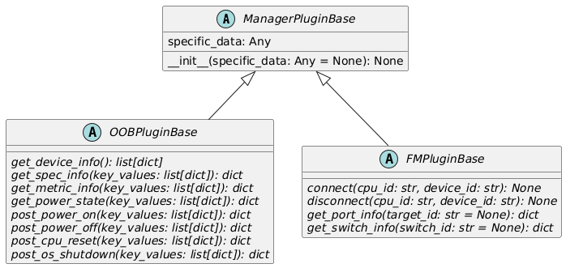

# 4. プラグインの構成

本章ではプラグインを構成するファイルとクラスについて説明します。

## 4.1. ファイル構成

プラグインは設定ファイルとPythonモジュールで構成されます。  
HW制御機能の`plugins/`ディレクトリにマネージャー種別ごとに配置します。  

``` text
plugins/
└── マネージャー種別/
    ├── 設定ファイル.yaml
    └── ディレクトリ/モジュール.py
```

マネージャー種別は`oob`または`fm`です。OOBプラグインは`oob/`に、FMプラグインは`fm/`に配置します。

設定ファイルはマネージャーごとに作成し、形式はYAML、ファイル名は「マネージャーID + `_manager.yaml`」です。  
マネージャーIDはマネージャーを一意に識別する名前です。半角英数字、`_(下線)`、`-(ハイフン)`を使用することができます。  
設定ファイルにはPythonモジュールのパス、クラス名、設定情報を記載します(詳細は[後述](#プラグイン設定ファイルの形式))。  
Pythonモジュールはサブディレクトリに配置し、そのパスはマネージャー種別ごとに一意となる必要があります。  

サンプルのファイル構成は以下のとおりです。

``` text
plugins/
├── oob/
│   ├── OOB1_manager.yaml
│   └── oob_sample/
│       └── plugin.py
└── fm/
    ├── FM1_manager.yaml
    └── fm_sample/
        └── plugin.py
```

- OOBプラグインの設定ファイルは`OOB1_manager.yaml`(マネージャーIDは`OOB1`)、Pythonモジュールは`oob_sample.plugin`です。
- FMプラグインの設定ファイルは`FM1_manager.yaml`(マネージャーIDは`FM1`)、Pythonモジュールは`fm_sample.plugin`です。

### プラグイン設定ファイルの形式

設定ファイルの形式はYAMLです。下記のプロパティを定義します。

- `module`  
  プラグインのモジュールパス。
- `class`  
  プラグインのクラス名(クラスについては[次節](#42-クラス構成)参照)。
- `specific_data`  
  プラグイン固有の設定情報。マネージャーへの接続情報などを記載します。  
  設定情報は[次節](#プラグイン基底クラス-managerpluginbase)で述べるプラグインの基底クラスが保持します。

以下に例を示します。

``` yaml
---
module: oob_sample.plugin
class: OOBSamplePlugin
specific_data:
  base_url: http://localhost:8080
  timeout_sec: 60
  manager_path: /redfish/v1/Managers/1
```

- モジュールパスは`oob_sample.plugin`、クラス名は`OOBSamplePlugin`です。
- プラグイン固有の設定情報に以下を設定しています。
  - マネージャーの接続情報(`base_url`)
  - タイムアウト(`timeout_sec`)
  - マネージャー情報のパス(`manager_path`)  
    ※ `base_url` + `manager_path`がマネージャー情報のURL

## 4.2. クラス構成

プラグインは以下に示す基底クラスを継承して実装します。



### プラグイン基底クラス (ManagerPluginBase)

プラグイン共通の基底クラスです。  
属性`specific_data`に[プラグイン設定ファイル](#プラグイン設定ファイルの形式)の`specific_data`を保持します。  
プラグインはこの属性から設定情報を取得します(マネージャーへの接続情報など)。

派生クラスでコンストラクタの形式を変更することはできません。  
派生クラス固有の初期処理を実装する場合は以下のようにします。

``` python
def __init__(self, specific_data: Any = None) -> None:
    super().__init__(specific_data)
    # ここに初期処理を実装します。
```

### OOBプラグイン基底クラス (OOBPluginBase)

OOBプラグインはこのクラスを継承し、[2.2 プラグインの概要](02_HWControlFunction.md#oobプラグインのメソッド)に示したメソッドを実装します。  
実装の詳細は[5. OOBプラグインの実装](05_Implementing_OOB_plugins.md)で説明します。

### FMプラグイン基底クラス (FMPluginBase)

FMプラグインはこのクラスを継承し、[2.2 プラグインの概要](02_HWControlFunction.md#fmプラグインのメソッド)に示したメソッドを実装します。  
実装の詳細は[6. FMプラグインの実装](06_Implementing_FM_plugins.md)で説明します。
