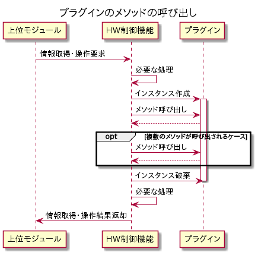

# 9. 特記事項

## 9.1. 注意事項

### 排他について

HW制御機能は、マルチスレッドで動作します。  
プラグインは、複数のスレッドから、インスタンスの生成、メソッドの呼び出し、インスタンスの破棄が実行されます。  
つまり、同一の制御対象(FM/OOB)に対して、インスタンスは複数並列に作成される可能性があります。  
そのため、FM/OOBなどの対象に対して排他や順序制御を行う場合、インスタンス変数ではなく、クラス変数を使用してください。  
なお、FMプラグインの`connect`/`disconnect`メソッドで指定される`cpu_id`(USP側)および`device_id`(DSP側)は、
HW制御機能内で排他され、別のスレッドで `connect`/`disconnect`メソッドが実行中ではないことが保証されます。  

以下に上位モジュールから情報取得・操作要求が発生したときのプラグインの実行イメージを記載します。  



### デバイスの紐づけ

HW制御機能で構成制御するデバイスの情報はOOBプラグインとFMプラグインの両方から取得されます。  
OOBプラグインとFMプラグインの双方から同じデバイスの情報が返却される場合があります。
双方の情報を紐づけるために必要な仕様について記載します。  
OOBプラグインの`get_device_info`メソッド、および、FMプラグインの`get_port_info`メソッドで、
以下のいずれかについて同じ情報を返す必要があります。  

- CPU情報:
  - CPU情報は、CPUSerialNumber、CPUManufacturer、CPUModelの3つの情報です。
- PCIeデバイス情報:
  - PCIeデバイス情報は、PCIeDeviceSerialNumber、PCIeDeviceId、PCIeVendorIdの3つの情報です。
- devieKeys:
  - deviceKeysはCPU情報、または、PCIeデバイス情報がFMプラグイン、OOBプラグインの両方から取得可能ではない場合で、
ほかに FMプラグイン、OOBプラグインの両方から取得可能なデバイスの識別が可能な情報があった場合に使用します。  
  - deviceKeysは辞書型データで、取得する情報に対応するキー名を決めておく必要があります。  
  - キーの数、また、キーとその値は空白・大文字・小文字などを含め完全一致している必要があります。  
- portKeys:
  - portKeys はCPU情報、または、PCIeデバイス情報、および、deviceKeysがFMプラグイン、OOBプラグインの両方から取得可能ではない場合に、
FMプラグイン、OOBプラグインの両方から取得可能なスイッチポートの識別が可能な情報を使用します。  
  - portKeysは辞書型データで、取得する情報に対応するキー名を決めておく必要があります。  
  - キーの数、また、キーとその値は空白・大文字・小文字などを含め完全一致している必要があります。  

CPU情報とPCIeデバイス情報は両方を返却されると正しく認識されません。  
上記のデバイスの紐づけ情報については、システム内で一意の値にする必要があります。
複数のデバイスに対して同一の値が返却された場合は、デバイス情報が期待どおり紐づけられない場合があります。  
`get_device_info`メソッドの詳細は、
[5.1. `get_device_info()`](05_OOBプラグインの実装.md#51-get_device_info)を、
`get_port_info`メソッドの詳細は、
[6.3. `get_port_info(target_id=None)`](06_FMプラグインの実装.md#63-get_port_infotarget_idnone)
を参照ください。  

### サポート対象外メソッドの実装

デバイスが対応していない等の理由により、プラグインのメソッドを実装できない場合は
[`RequestNotSupportedHwControlError`](07_例外処理.md#72-定義済み例外)を送出してください。  
以下に例を示します。

``` python
def post_os_shutdown(self, key_values: list[dict[str, str]]) -> dict[str, list[dict]]:
    raise RequestNotSupportedHwControlError
```

## 9.2. 制限事項

### 追加パッケージ

HW制御機能の動作環境にインストールされていない、サードパーティー製の追加パッケージは追加インストールできません。  
現在下記のパッケージを利用することができます。

- [Pydantic (Pydantic Settings)](https://docs.pydantic.dev/latest/)
- [PyYAML](https://pyyaml.org/wiki/PyYAMLDocumentation)
- [Requests](https://docs.python-requests.org/en/latest/index.html)
- [urllib3](https://urllib3.readthedocs.io/en/stable/)

### ベンダ依存拡張例外クラスコード

例外の追加時に必要な3文字のベンダ依存拡張例外クラスコードは、公開されているプラグインで衝突しない文字列を想定しています。  
現時点では公開されているプラグインはないため、任意のコードを使用可能とします。  
今後、ベンダによるプラグインが公開された場合、衝突を避けるための方法(公開済みのプラグインが使用しているクラスコードの一覧を公開するなど)を提示します。  
