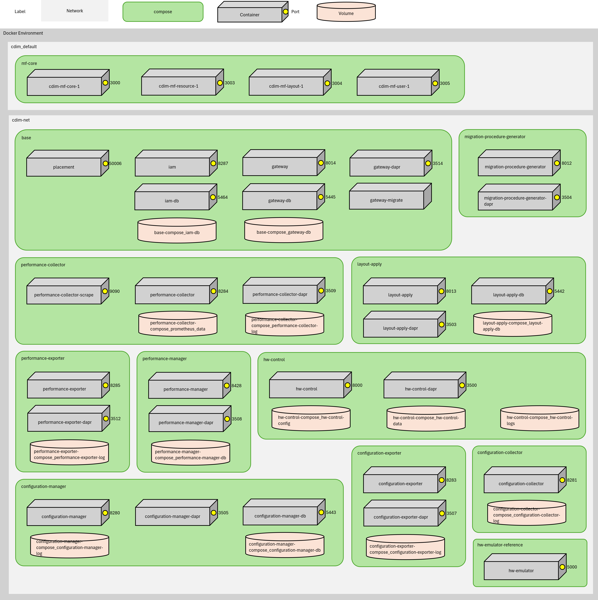

# Getting Started

This guide outlines the necessary steps to install, initialize, verify operations, and start using Composable Disaggregated Infrastructure Manager (CDIM). For a more comprehensive understanding of CDIM, we recommend beginning with the [Concepts](../../concepts/en/README.md) section.

> [!WARNING]
> The setup steps described in this guide involve the use of fixed-value credentials, making it unsuitable for real-world production environments. Future updates will include guidelines on how to modify these credentials.

## Installation Steps

1. [Set Up Environment](prepare/prepare.md)  
Prepare the environment required for building CDIM.
2. [Install the Emulator](emulator/emulator.md)  
Start by building an environment that simulates integration with CDIM using an emulator. This step is crucial for testing and development purposes.
3. [Install CDIM](install/install.md)  
Proceed with the installation of CDIM using the provided installer. This step will prepare the necessary software on your system.
4. [Perform Initial Setup of CDIM](setup/setup.md)  
Configure CDIM based on the specific requirements and the environment in which it will operate. This step is vital to tailor CDIM to your infrastructure needs.
5. [Use CDIM](use/use.md)  
Begin using CDIM and verify its functionality through various features. This step is essential for ensuring that CDIM operates as expected in your setup.

## System Requirements

The recommended requirements for this guide are listed in the table below. 

### Hardware

| Requirement | Recommended Value   |
| ----------- | ------------------- |
| CPU         | x64 4 cores or more |
| Memory      | 8GB or more         |
| Disk        | 64GB or more        |

### Software

| Requirement               | Software                |
| ------------------------- | ----------------------- |
| OS                        | Alma Linux 9            |
| Container Management Tool | Docker / Docker Compose |
| Version Management System | git                     |

## Ports and Protocols

The ports and protocols used by CDIM are listed below.

| Protocol | Direction | Port Range | Purpose |
| --- | --- | --- | --- |
| TCP | Inbound | 3000,3003-3005 | Frontend |
| TCP | Inbound | 3500,3503-3505,3507-3509,3512-3515,3517,50006 | DAPR Communication |
| TCP | Inbound | 5000 | Reference Hardware Emulator |
| TCP | Inbound | 8000 | Hardware Control |
| TCP | Inbound | 8012 | Migration Procedure Generator |
| TCP | Inbound | 8013 | Layout Apply |
| TCP | Inbound | 8014 | Gateway(Kong) |
| TCP | Inbound | 8280 | Configuration Manager |
| TCP | Inbound | 8283 | Configuration Exporter  |
| TCP | Inbound | 8284 | Performance Collector |
| TCP | Inbound | 8285 | Performance Exporter |
| TCP | Inbound | 8286 | Alert Manager (Alerta) |
| TCP | Inbound | 8287 | IAM(Keycloak) |
| TCP | Inbound | 8288 | Job Manager (Rundeck) |
| TCP | Inbound | 8289 | Message Broker (NATS) |
| TCP | Inbound | 8428 | Performance Manager (VictoriaMetrics) |
| TCP | Inbound | 9090 | Performance Collector (Prometheus) |
| TCP | Inbound | 9094 | Alert Manager (AlertManager) |

## Environment Overview

Please refer to the diagram below for the overall configuration of the environment being built.

## Learning More

### [CDIM Tutorial](../../tutorial/en/README.md)

Enhance your understanding and skills related to CDIM by following detailed examples and scenarios provided in the tutorial. This resource is excellent for both new and existing users to become proficient with CDIM.

By following these steps, you will be well-prepared to deploy, manage, and optimize your infrastructure using CDIM effectively.
