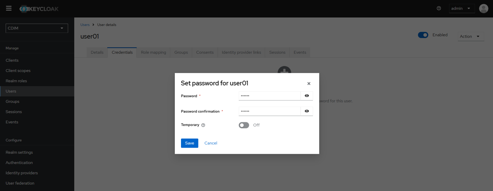

# Initial Setup for CDIM

> [!NOTE]
> Use the same value for `cdim-server` as used in the configuration file for [Installing CDIM](../install/install.md).

## 1. Gateway (Kong) Setup

### 1.1. Confirm Public Key

Log in to Keycloak.

```sh
http://cdim-server:8287/
Username: admin
Password: admin
```

Switch to the "CDIM" realm.

Click "Realm settings" and then click the "Keys" tab. Check and copy the "Public key" for "RS256".  


### 1.2. Setup Gateway with Public Key

Using the copied Public Key from "1.1", create a `public_key.pem` file in the `set-up-tools/gateway/tools/` directory using the format shown below:

```txt:public_key.pem
-----BEGIN PUBLIC KEY-----
(Paste the copied Public key here)
-----END PUBLIC KEY-----
```

Run the `post_install` script to initialize the gateway.

```sh
./post_install
```

Afterward, reset the gateway containers.

```sh
cd base-compose
docker compose down gateway-dapr
docker compose down gateway
docker compose up -d --build
```

## 2. Frontend Configuration

### 2.1. Create Client in Keycloak

Log in to Keycloak.

```sh
http://cdim-server:8287/
Username: admin
Password: admin
```

Click "Clients" and then click "Create client", then click on "Create client".  


In "General settings", configure as follows and click "Next".

| Item | Value |
|---|---|
| Client type | OpenID Connect |
| Client ID | cdim-client |
| Name | (leave blank) |
| Description | (leave blank) |
| Always display in UI | Off |


In "Capability config", only enable "Standard flow" under "Authentication flow" and click "Next".


Specify the following in "Login settings":

| Item | Value |
|------|------|
| Root URL | <http://cdim-server:3000/> |
| Home URL | <http://cdim-server:3000/> |
| Valid redirect URIs | <http://cdim-server:3000/*> |
| Valid post logout redirect URIs | <http://cdim-server:3000/*> |
| Web origins | * |


Click "Save" to finalize the settings.

### 2.2. User Setup

Create a user account for CDIM, ideally with administrative privileges.

#### 2.2.1. Add User

Click "Users" and then click "Add User".


Enter the "Username" and click "Create".


#### 2.2.2. Set User Password

Click the "Credentials" tab, and in the displayed screen, click the "Set password".


Enter the password. Set "Temporary" to "Off". Click the "Save".  


Click the "Save password".  


#### 2.2.3. Assign Roles

Click the "Role mapping" tab and then click the "Assign role".


Switch the filter condition to "Filter by realm roles".


Check the role to be assigned in the list. Here, check "cdim-administrator", which represents administrator privileges. Click the "Assign".  


## 3. Verification

Log in to CDIM using the credentials of the user you just created.

```sh
http://cdim-server:3000/
```

If the dashboard correctly displays information like resource data retrieved from the emulator, then the setup is successful.  


[Next step: Using CDIM](../use/use.md)
