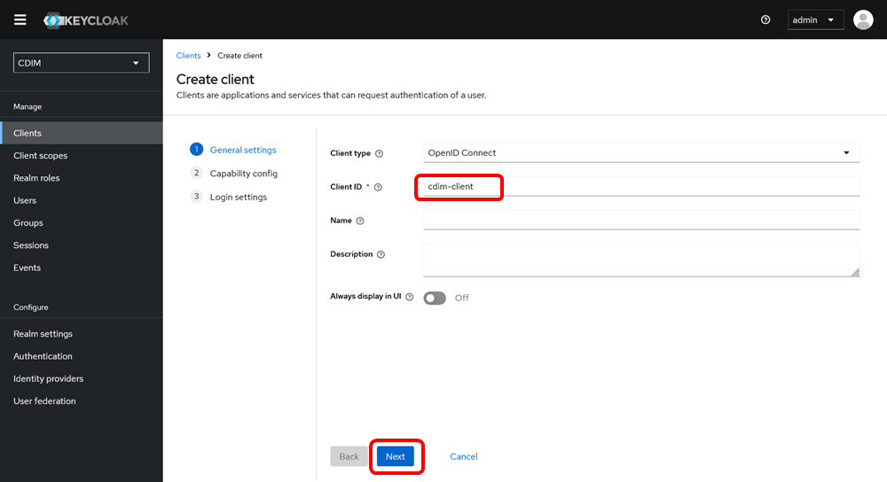
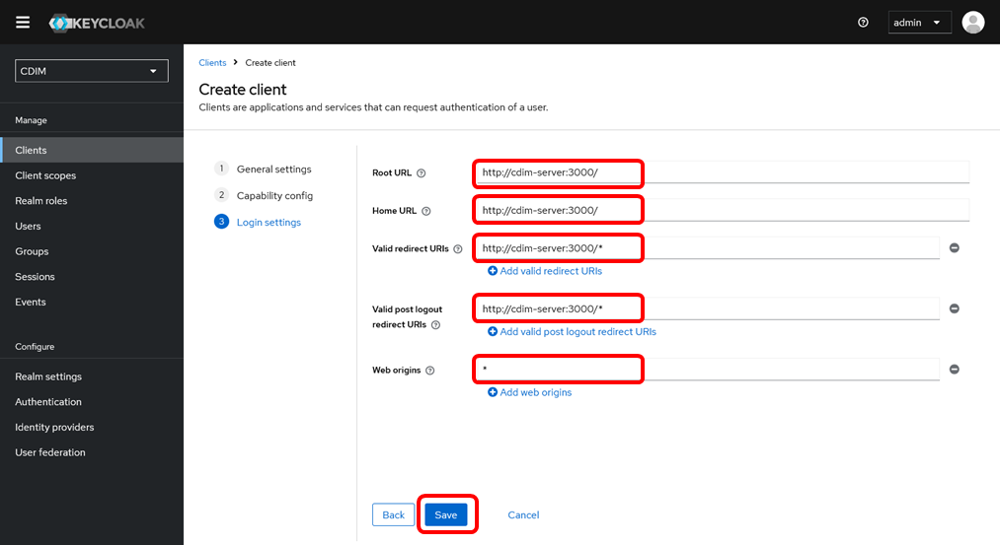
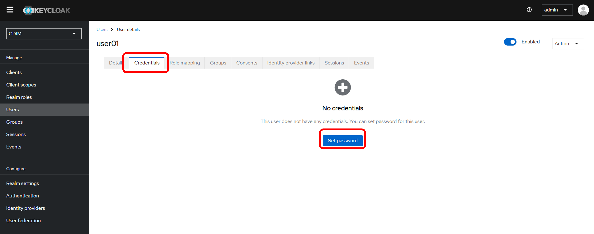
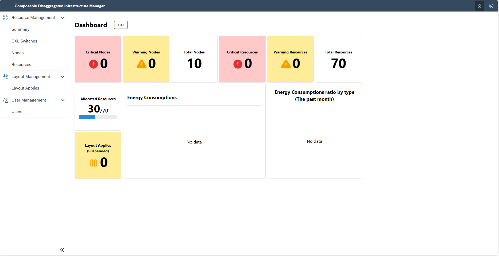

# Initial Setup for CDIM

> [!NOTE]
> Use the same value for `cdim-server` as used in the configuration file for [Installing CDIM](../install/install.md).

## 1. Gateway (Kong)

### 1.1. Confirm Public Key

Log in to Keycloak.

```sh
http://cdim-server:8287/
admin/admin
```

Switch the realm to "CDIM".

Click "Realm settings" and then click the "Keys" tab. Check and copy the "Public key" for "RS256".


### 1.2. Initial Setup for Gateway

Using the Public key confirmed and copied in "1.1.", create a `public_key.pem` file under the `set-up-tools/gateway/tools/` directory. The format is as follows:

```txt:public_key.pem
-----BEGIN PUBLIC KEY-----
(Paste the copied Public key here)
-----END PUBLIC KEY-----
```

Execute the `setup` script to perform the initial setup.

```sh
./setup
```

Restart the base containers.

```sh
cd base-compose
docker compose down
docker compose up -d --build
```

## 2. Frontend

### 2.1. Create Client

Log in to Keycloak.

```sh
http://cdim-server:8287/
admin/admin
```

Switch the realm to "CDIM".

Click "Clients" and then click "Create client".


In "General settings", configure as follows and click "Next".

| Item | Value |
|---|---|
| Client type | OpenID Connect |
| Client ID | cdim-client |
| Name | (leave blank) |
| Description | (leave blank) |
| Always display in UI | Off |



In "Capability config", select only "Standard flow" under "Authentication flow" and click "Next".


Specify the following in "Login settings".

| Item | Value |
|------|------|
|Root URL| <http://cdim-server:3000/>  |
|Home URL| <http://cdim-server:3000/>  |
|Valid redirect URIs| <http://cdim-server:3000/*> |
|Valid post logout redirect URIs| <http://cdim-server:3000/*> |
|Web origins| * |



Click "Save" to save the settings.

### 2.2. Create User

Create a user for CDIM. Here, we will explain how to create an administrator user.

#### 2.2.1. Add User

Click "Users" and then click "Add User".


Enter the "Username" and click the "Create" button.


#### 2.2.2. Set Password for User

Click the "Credentials" tab, and in the displayed screen, click the "Set password" button.


Enter the password. Set "Temporary" to "Off". Click the "Save" button.


Click the "Save password" button.


#### 2.2.3. Assign Role to User

Click the "Role mapping" tab and then click the "Assign role" button.


Switch the filter condition to "Filter by realm roles".


Check the role to be assigned in the list. Here, check "cdim-administrator", which represents administrator privileges. Click the "Assign" button.


## 3. Verification

Log in to CDIM using the created user.

```sh
http://cdim-server:3000/
```

If the dashboard screen displays resource information retrieved from the emulator as shown below, it is functioning properly.



[Next step: Using CDIM](../use/use.md)
