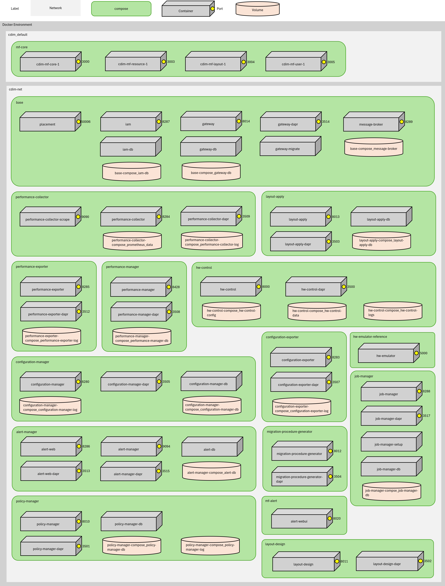

# Getting Started

このガイドではComposable Disaggregated Infrastructure Manager (以降、CDIM) をインストール、初期化、動作確認を行い、使用を開始するための一連の手順を説明します。
CDIMの概要を知りたい場合は[コンセプト](../../concepts/ja/README.md)から始めることをお勧めします。

> [!WARNING]
> 本ガイドで提供される構築手順には固定値で設定された認証情報が含まれています。このため、実際の運用環境で利用することは推奨されません。認証情報を変更する手順は今後公開する予定です。

## 導入ステップ

1. [エミュレーターをインストールする](emulator/emulator.md)  
CDIMと連携する環境をエミュレーターを使用して構築します。
2. [CDIMをインストールする](install/install.md)  
インストーラーを使用してCDIMをインストールします。
3. [CDIMの初期設定を行う](setup/setup.md)  
CDIMを動作させる環境に合わせて初期設定します。
4. [CDIMを使用する](use/use.md)   
CDIMの機能を使用して動作を確認します。

## 動作要件

本ガイドの推奨要件は以下の表に記載のとおりです。
なお、OSについてはAlma Linux 9を想定しています。

| 要件     | 推奨値        |
| -------- | ------------- |
| CPU      | x64 4コア以上 |
| メモリ   | 8GB以上       |
| ディスク | 64GB以上      |

## 環境概要

構築される環境の全体構成については、下図をご参照ください。

## 学習をさらに進めたい方へ

### [CDIMチュートリアル](../../tutorial/ja/README.md)

チュートリアルに記載された詳細な例とシナリオを通じて、CDIMに関する理解とスキルを向上させましょう。このリソースは、新規ユーザーおよび既存ユーザーの両方がCDIMを習得するのに最適です。

これらの手順に従うことで、CDIMを効果的に使用してインフラストラクチャを展開、管理、最適化する準備が整います。