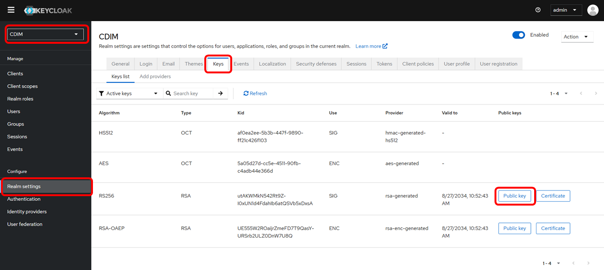
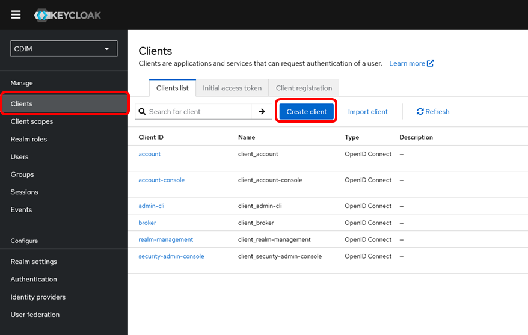
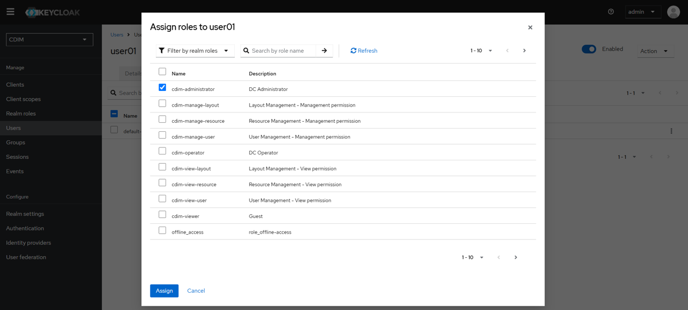
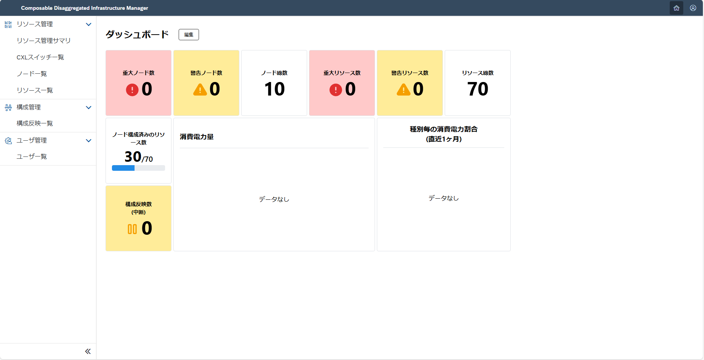

# CDIM の初期設定を行う

> [!NOTE]
> `cdim-server` は[CDIM をインストールする](../install/install.md)の設定ファイルで使用したものと同じ値を使用します。

## 1. gateway (Kong)

### 1.1. Public key の確認

Keycloak にログインします。

```sh
http://cdim-server:8287/
admin/admin
```

Realm を「CDIM」に切り替えます。

「Realm settings」をクリックし、「Keys」タブをクリックします。
「RS256」の「Public key」を確認してコピーしておきます。


### 1.2. gateway の初期設定

「1.1.」で確認してコピーした Public key を使用して、`set-up-tools/gateway/tools/` ディレクトリ配下に `public_key.pem` ファイルを作成します。
形式は以下のとおりです。

```txt:public_key.pem
-----BEGIN PUBLIC KEY-----
(ここにコピーした Public key を貼り付けます)
-----END PUBLIC KEY-----
```

`post_install` スクリプトを実行して初期設定を行います。

```sh
./post_install
```

基盤のgatewayコンテナを再起動します。

```sh
cd base-compose
docker compose down gateway-dapr
docker compose down gateway
docker compose up -d --build
```

## 2. フロントエンド

### 2.1. client 作成

Keycloak にログインします。

```sh
http://cdim-server:8287/
admin/admin
```

Realmを「CDIM」に切り替えます。

「Clients」をクリックし、「Create client」をクリックします。


「General settings」で以下のように設定を行い「Next」をクリックします。

| 項目 | 値 |
|---|---|
| Client type | OpenID Connect|
| Client ID | cdim-client |
| Name | (空欄のまま) |
| Description | (空欄のまま) |
| Always display in UI | Off |


「Capability config」で「Authentication flow」の「Standard flow」だけ選択した状態にして「Next」をクリックします。


「Login settings」で以下のように指定します。

| 項目 | 値 |
|------|------|
|Root URL| <http://cdim-server:3000/>  |
|Home URL| <http://cdim-server:3000/>  |
|Valid redirect URIs| <http://cdim-server:3000/*> |
|Valid post logout redirect URIs| <http://cdim-server:3000/*> |
|Web origins| * |


「Save」をクリックして設定を保存します。

### 2.2. User 作成

CDIM のユーザーを作成します。
ここでは管理者ユーザーの作成を例に説明します。

#### 2.2.1. User の追加

「Users」をクリックし、「Add User」をクリックします。


「Username」を入力し、「Create」ボタンをクリックします。


#### 2.2.2. User にパスワードを設定する

「Credentials」タブをクリックし、表示された画面で「Set password」ボタンをクリックします。


Password を入力します。Temporary は「Off」にします。「Save」ボタンをクリックします。


「Save password」ボタンをクリックします。


#### 2.2.3. User にロールを付与する

「Role mapping」タブをクリックし、「Assign role」ボタンをクリックします。


フィルターの条件を「Filter by realm roles」に切り替えます。


一覧の中で付与するロールにチェックを付けます。
ここでは管理者権限を表す「cdim-administrator」にチェックを付けます。
「Assign」ボタンをクリックします。


## 3. 動作確認

作成したユーザーで CDIM にログインします。

```sh
http://cdim-server:3000/
```

以下のようにダッシュボード画面にエミュレーターから取得したリソース情報が表示されていれば正常に動作しています。



[Next step: CDIM を使用する](../use/use.md)
