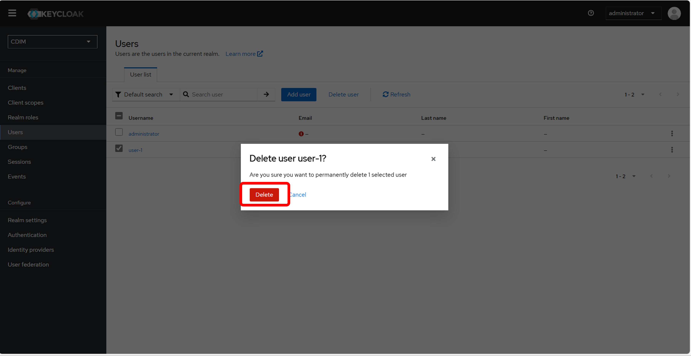
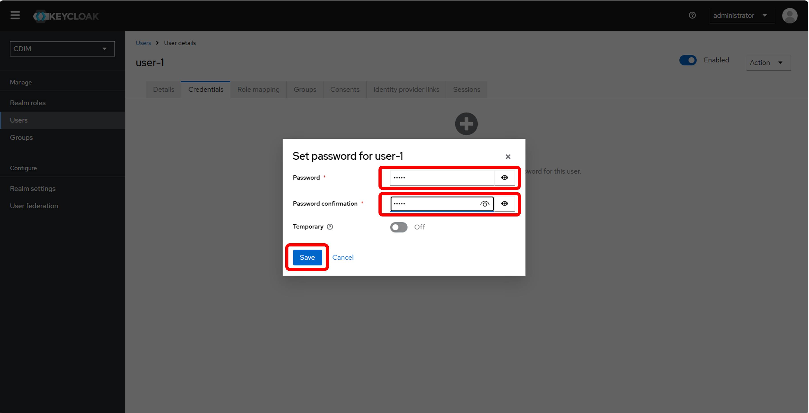

### 3. Various Configuration Methods <!-- omit in toc -->
This section explains various configuration methods for Composable Disaggregated Infrastructure Manager (CDIM).

- [3.1. Check and Change Log Output Methods](#31-check-and-change-log-output-methods)
  - [3.1.1. Check Logs](#311-check-logs)
  - [3.1.2. Change Log Output Methods](#312-change-log-output-methods)
- [3.2. Change Information Collection Settings](#32-change-information-collection-settings)
- [3.3. Change User Authentication Methods and Permissions](#33-change-user-authentication-methods-and-permissions)
  - [3.3.1. Add Users](#331-add-users)
  - [3.3.2. Change User Permissions in CDIM](#332-change-user-permissions-in-cdim)
  - [3.3.3. Register and Change User Authentication Methods](#333-register-and-change-user-authentication-methods)
    - [3.3.3.1. Password Authentication Settings](#3331-password-authentication-settings)

#### 3.1. Check and Change Log Output Methods 
##### 3.1.1. Check Logs
By default, logs are output to the following location. However, they are retained within the container, so ensure to manage their storage appropriately.
```sh
$ docker exec -it <container-name> /bin/sh
$ ls /var/log/cdim
```
Logs are organized by component into the following files:

| Log Type | Log File Name |
|:--|:--|
| Audit Log | trail.log |
| Application Log (Hardware Control) | app_hw_control.log |
| Application Log (Layout Application) | app_layout_apply.log |
| Application Log (Migration Procedure Generation) | app_migration_procedures.log |
| Application Log (Configuration Information Management) | app_config_info.log |

##### 3.1.2. Change Log Output Methods
To modify the log output settings, update the settings file corresponding to each component. The settings files are located as follows:

| Component Name | Settings File Name | File Path |
|:--|:--|:--|
| Audit Log (Performance Information Collection) | main.go | performance-collector-compose/performance-collector/performance-collector |
| Audit Log (Performance Information Exporter) | main.go | performance-exporter-compose/performance-exporter/performance-exporter |
| Audit Log (Configuration Information Exporter) | main.go | configuration-exporter-compose/configuration-exporter/configuration-exporter |
| Audit Log (Configuration Information Management) | main.go | configuration-manager-compose/configuration-manager/configuration-manager |
| Hardware Control | settings.py | hw-control-compose/hw-control/src/app/common |
| Layout Application | layoutapply_config.yaml | layout-apply-compose/layout-apply/src/layoutapply/config |
| Migration Procedure Generation | migrationprocedures_config.yaml | migration-procedure-generator-compose/migration-procedure-generator/src/migrationproceduregenerator/config |
| Performance Information Collection | logger.go | performance-collector-compose/performance-collector/performance-collector/internal/service |
| Performance Information Exporter | logger.go | performance-exporter-compose/performance-exporter/performance-exporter/internal/service |
| Configuration Information Exporter | controller_common.go | configuration-exporter-compose/configuration-exporter/configuration-exporter/controller |
| Configuration Information Management | gi_cm_applog.go | configuration-manager-compose/configuration-manager/configuration-manager/common |

The settings for log output files are as follows. For settings files in Go format, write the following items in the code.
| Setting Item | Description |
|:--|:--|
| tag | Tag representing the component |
| log_dir | Log output directory |
| log_file | Log file name |
| logging_level | Logging level. Logs above the set level are output |
| rotation_size | File size (bytes) for log rotation |
| backup_files | Number of backup files to retain through rotation |
| stdout | If true, logs are also output to standard output |

After modifying the settings, restart the component using [this procedure](../appendix/troubleshooting/README.md#4-restart-a-specific-component).

> [!NOTE]
> If the component fails to run after changing the log output directory, you may need to create the directory beforehand. Adjust the Dockerfile accordingly to create the log output directory.

#### 3.2. Change Information Collection Settings 
Modify the settings file of each collection component to adjust the collection interval and other parameters.

Job Manager - Configuration Collector Settings: job-manager-compose/job-manager-setup/HW_configuration_information_data_linkage_job.yaml

```yaml
  schedule:    # Configuration information retrieval interval
    dayofmonth:
      day: '*'
    month: '*'
    time:
      hour: '*'
      minute: '0/10'
      seconds: '0'
    year: '*'
  timeout: '600'  # Configuration information timeout value (s)
```
After changing the collection interval, apply the settings with the following command.

```sh
$ curl -X POST 'http://localhost:8288/api/14/project/CDIM/jobs/import?fileformat=yaml&dupeOption=update' -H "X-Rundeck-Auth-Token:$(cut -d' ' -f2 ../share/token/tokens.properties | cut -d',' -f1)" -H "Content-Type: application/yaml" --data-binary '@HW_configuration_information_data_linkage_job.yaml'
```

Performance Information Collection: performance-collector-compose/share/prometheus.yml

```yaml
global:
    evaluation_interval: 180s  # Performance information retrieval interval (s)
    scrape_interval: 180s      # Performance information timeout value (s)
```

For performance information collection, you need to restart the information collection.
```sh
$ docker exec -it performance-collector /bin/sh
$ curl -i -s -X PUT http://localhost:8080/cdim/api/v1/configs
```

#### 3.3. Change User Authentication Methods and Permissions
> [!NOTE]
> Keycloak is used for authentication.  
> For details, refer to the [official documentation (English version)](https://www.keycloak.org/documentation).

##### 3.3.1. Add Users

1. Access the Keycloak master URL for CDIM user management and log in
   - **When using the user management screen:**  
     Log in with an account that has `cdim-manage-user` permissions (such as Administrator) and navigate to User Management/User List.  
     Click "Admin Console" in the upper right and log in.
     

   - **When using the Keycloak management URL:**  
     Follow the instructions in [getting started](../../../getting-started/en/setup/setup.md#2-frontend) to log in directly to the Keycloak management screen.  
     After logging in, switch to the CDIM management screen by changing the dropdown list in the upper left from Keycloak to CDIM.

> [!NOTE]
> If you access via the user management screen and encounter a "We are sorry" error, it is not an issue.  
> Click "Back to Application" to proceed to the CDIM management URL.

> [!NOTE]
> Also, users without the cdim-administrator role can transition to the user management screen, but cannot make changes such as adding users.

1. To add users:
   - Click "Users" in the menu on the left and then click the "Add User" button.
   
   - Choose "English/Japanese" for the locale and enter the user name.
   
   - After filling in other necessary fields, click the "Create" button.

2. To delete a user:
   - Select the desired user and click "Delete User".
   
   

##### 3.3.2. Change User Permissions in CDIM
- **To add permissions:**
  1. Navigate to the detailed user screen:
     - Access the URL for user management and switch to the CDIM management screen.
     - Click "Users" on the left and open the details screen of the user whose permissions you want to modify.  
     

  2. Modify permissions via "Role mapping":
     - Click "Role mapping" from the tabs at the top and click "Assign role".
       
     - Change the filter in the upper left to "Filter by realm roles".  
       
     - Check the permissions to add and click "Assign".
     
     - Require the user to log in again to apply the settings.

   <details>
   <summary> Details of CDIM Permissions </summary>
   Available when filtering by "filter by realm roles".

   | Role | Name | Description |
   |:--|:--|:--|
   | Guest | cdim-viewer | Can view all menus in CDIM. Includes cdim-view-layout, cdim-view-resource, and cdim-view-user roles |
   | DC Operator | cdim-operator | Can operate all menus in CDIM. Includes cdim-viewer permissions with cdim-manage-layout and cdim-manage-resource roles |
   | DC Administrator | cdim-administrator | Full operational permissions in CDIM. Includes cdim-operator permissions with cdim-manage-user roles |
   
   </details>

- **To remove permissions:**
   - In the "Role mapping" screen, check the permissions to remove and click "Unassign".
   

##### 3.3.3. Register and Change User Authentication Methods
###### 3.3.3.1. Password Authentication Settings

1. Assign a password to the user:
   - Login with an account having `cdim-administrator` permissions.
   - Navigate to User Management/User List, and click "Admin Console" in the upper right.
   - From "Users" in the left menu, open the detail screen of the user intended for password authentication.
   - Click the "Credentials" tab and then "Set Password". Enter the password and click the "Save" button.
   
     

   > [!TIP]
   > Set "Temporary" to ON when issuing an account to a new user.  
   > The user will be prompted to set a new password upon first login.

   The user can now access the CDIM URL and log in using password authentication.

2. Password Policy Setup:
   - Login to the user management URL as a REALM management account.
   - Click "Authentication" and select the "Policy" tab.
   
   
   - Click "Add policy" in the password policy section and select the desired password policy.  
   

<!--
###### 3.3.3.2. OTP (One Time Password) Authentication Method

Log in to the Keycloak master URL and change the dropdown list in the upper left from Keycloak to CDIM.
Select the "Authentication" menu and choose the Flow you want to change the authentication method for.
Select "Add step" and choose "OTP Form" for the OTP authentication Flow, and insert it at your preferred timing in the Flow.
After deciding the Flow, return to the "Authentication" menu, select Policies/OTP Policy from the tabs above.
After setting the details of the OTP authentication, press "Save" to complete the settings.

Access CDIM and log in with OTP authentication.

###### 3.3.3.3. Single Sign-On Authentication Method
-->

[Next 4. Appendix](../appendix/README.md)
