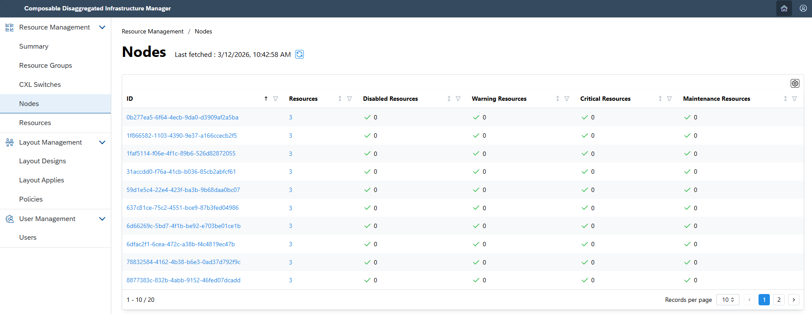
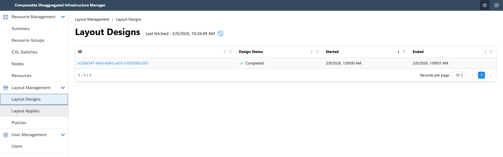
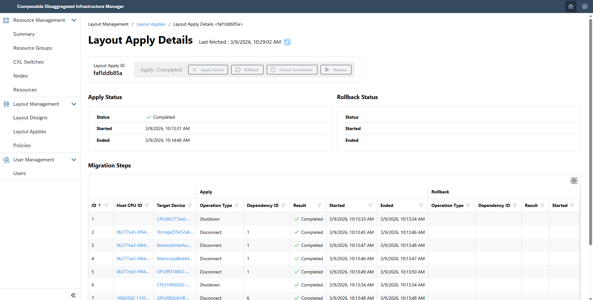
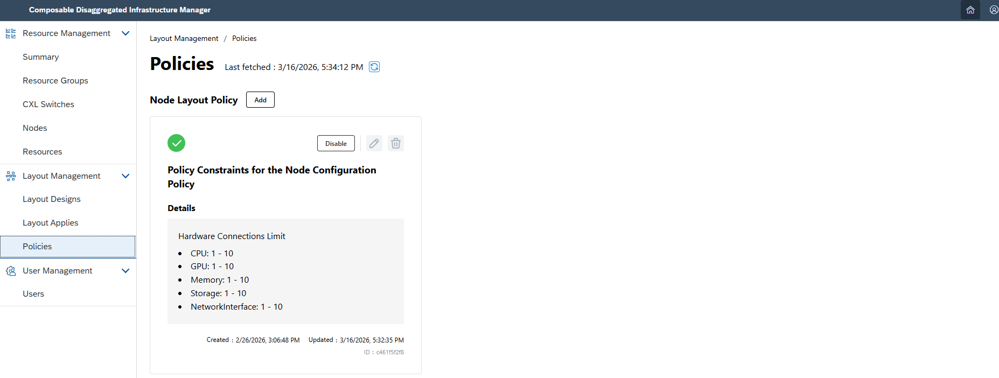
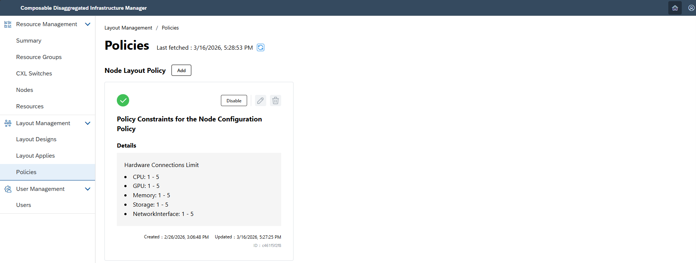
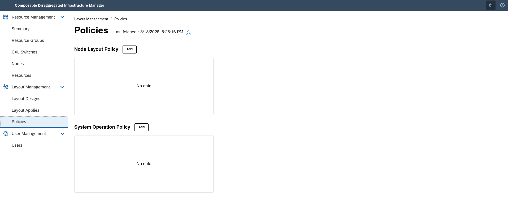

## 2.2. Configuration Changes Using Design Engine <!-- omit in toc -->
This section explains configuration changes performed by design engine when you use the Composable Disaggregated Infrastructure Manager (CDIM).

By using the functions of design engine and Layout Design, you can automatically create node layout plans required for services to run and the procedures required for node migration.  
A service refers to an application or software running on Composable Disaggregated Infrastructure (CDI).  
By submitting migration procedures created by design engine and Layout Design to the Layout Apply API, you can create or modify nodes.

<br>

- [2.2.1. About Layout Design and Design Engine](#221-about-layout-design-and-design-engine)
- [2.2.2. Create, Modify/Add, and Delete Nodes](#222-create-modifyadd-and-delete-nodes)
  - [2.2.2.1. Prepare the Input Data](#2221-prepare-the-input-data)
  - [2.2.2.2. Run the Process](#2222-run-the-process)
- [2.2.3. About Policy Manager](#223-about-policy-manager)
- [2.2.4. Add, Update, Enable, Disable, and Delete Policy Constraints](#224-add-update-enable-disable-and-delete-policy-constraints)
  - [2.2.4.1. Add New Policy Constraints](#2241-add-new-policy-constraints)
    - [Describe the Policy Constraints to Be Added](#describe-the-policy-constraints-to-be-added)
    - [Run the Procedure](#run-the-procedure)
  - [2.2.4.2. Enable and Disable Policy Constraints](#2242-enable-and-disable-policy-constraints)
    - [Describe the Policy Constraints to Enable or Disable](#describe-the-policy-constraints-to-enable-or-disable)
    - [Run the Procedure](#run-the-procedure-1)
  - [2.2.4.3. Update Policy Constraints](#2243-update-policy-constraints)
    - [Describe the Policy Constraints to Update](#describe-the-policy-constraints-to-update)
    - [Run the Procedure](#run-the-procedure-2)
  - [2.2.4.4. Delete Policy Constraints](#2244-delete-policy-constraints)
    - [Run the Procedure](#run-the-procedure-3)
- [2.2.5. Description of the Configuration Change Function (Sample File)](#225-description-of-the-configuration-change-function-sample-file)

[Layout Design API]: https://project-cdim.github.io/docs/api-reference/en/layout-design-api/index.html
[Layout Apply API]: https://project-cdim.github.io/docs/api-reference/en/layout-apply-api/index.html
[Policy Manager API]: https://project-cdim.github.io/docs/api-reference/en/policy-manager-api/index.html

### 2.2.1. About Layout Design and Design Engine

The design engine is a generic term for functions that calculate and manage the following information based on the specification information required for a service to run.
- A node layout plan calculated from the service definition information and the resource performance required by the service
- Conditions regarding the node load allowed when migrating from the current node layout at runtime to the generated node layout plan
- Procedures for migrating from the current node layout to the generated node layout plan

Layout Design provides a unified interface to multiple design engines that may use different resource selection criteria and other design policies.

Design engine plugin is a component positioned between Layout Design and design engine.
By implementing a corresponding plugin for each design engine, Layout Design can flexibly integrate with multiple design engines.

At present, no design engine provides all functions, so sample programs for a simplified design engine and design engine plugin are provided.
- [Sample Plugin / Sample Design Engine]()

When developing design engine plugin, refer to the following document.
- [Design Engine Plugin Development Guide]()

### 2.2.2. Create, Modify/Add, and Delete Nodes

Design a layout plan based on the desired specifications, and then create, modify/add, or delete nodes according to the designed layout plan.

In this procedure, prepare the desired specifications as input data, and use the [Layout Design API][] and [Layout Apply API][] to create, modify/add, or delete nodes.

Although the input data differs depending on whether you create, modify/add, or delete nodes, the operation procedure itself is the same.

#### 2.2.2.1. Prepare the Input Data

Prepare input data that describes the desired specifications.

The input data is passed to the "Layout Design Request" of the [Layout Design API][].

```sh
$ mkdir test
$ vi test/template_layoutdesign.json
```

Below are examples of input data for creating, modifying/adding, and deleting nodes.  
When running with the example input data, replace the value of services.instances.nodeID with the actual node ID value.  


For details of the input data, see [2.2.5. Description of the Configuration Change Function (Sample File)](#225-description-of-the-configuration-change-function-sample-file).

<details>
<summary> For creating a new node: template_layoutdesign.json </summary>

The following example shows input data for adding one new service instance with service ID `a58ee3a7-62a0-46f3-ba80-f7080eaa0d1c`.

```json
{
    "requestID": "463e79c1-d138-4748-9018-5c1435a50d87",
    "noCondition": false,
    "partialDesign": false,
    "resourceGroupIDs": [
        "625d8951-50fb-41b3-a824-6c98438c4c52"
    ],
    "serviceSetRequestResources": [
        {
            "id": "6ea26bd4-ece0-4a9a-b042-3fa04361526e",
            "serviceSetID": "bbb02921-ee54-4b26-97d2-0fec1d987b12",
            "serviceSetName": "Web app chat services",
            "serviceRequestResources": [
                {
                    "id": "cbc896de-1df2-4aed-b71d-4aff38206ca3",
                    "serviceID": "a58ee3a7-62a0-46f3-ba80-f7080eaa0d1c",
                    "serviceName": "LLM agent",
                    "shareService": false,
                    "resource": {
                        "operatingSystem": "Redhat Enterprise 9.0",
                        "instances": [
                            {
                                "requestInstanceID": "1d40d2a9-979f-4956-aee7-30587de64fe9",
                                "serviceInstanceID": "5b4ea1a2-4130-4de8-9045-bc92709df778",
                                "redundant": false,
                                "changed": true,
                                "cpu": {
                                    "architecture": "x86",
                                    "coreNumber": 4,
                                    "operatingSpeedMHz": 3000
                                },
                                "memory": {
                                    "size": 8000,
                                    "operatingSpeedMHz": 3200
                                },
                                "storage": {
                                    "size": 250,
                                    "capableSpeedGbs": 12
                                },
                                "gpu": [
                                    {
                                        "architecture": "x86",
                                        "coreNumber": 2,
                                        "operatingSpeedMHz": 2400,
                                        "memorySize": 16000,
                                        "deviceCount": 1
                                    }
                                ],
                                "networkInterface": {
                                    "bitRate": 9600
                                }
                            }
                        ]
                    }
                }
            ]
        }
    ],
    "services": [
        {
            "id": "a58ee3a7-62a0-46f3-ba80-f7080eaa0d1c",
            "name": "LLM agent",
            "description": "LLM inference service for natural language tasks.",
            "owner": "NEC Corp.",
            "instances": []
        }
    ]
}
```
</details>

<details>
<summary> For modify/add operations: template_layoutdesign.json </summary>

The following example shows input data for dismantling and rebuilding node `b477ea1c-db3d-48b3-9725-b0ce6e25ef01`, on which a service instance with service ID `a58ee3a7-62a0-46f3-ba80-f7080eaa0d1c` is running.

```json
{
    "requestID": "463e79c1-d138-4748-9018-5c1435a50d87",
    "noCondition": false,
    "partialDesign": false,
    "resourceGroupIDs": [
        "625d8951-50fb-41b3-a824-6c98438c4c52"
    ],
    "serviceSetRequestResources": [
        {
            "id": "6ea26bd4-ece0-4a9a-b042-3fa04361526e",
            "serviceSetID": "bbb02921-ee54-4b26-97d2-0fec1d987b12",
            "serviceSetName": "Web app chat services",
            "serviceRequestResources": [
                {
                    "id": "cbc896de-1df2-4aed-b71d-4aff38206ca3",
                    "serviceID": "a58ee3a7-62a0-46f3-ba80-f7080eaa0d1c",
                    "serviceName": "LLM agent",
                    "shareService": false,
                    "resource": {
                        "operatingSystem": "Redhat Enterprise 9.0",
                        "instances": [
                            {
                                "requestInstanceID": "1d40d2a9-979f-4956-aee7-30587de64fe9",
                                "serviceInstanceID": "5b4ea1a2-4130-4de8-9045-bc92709df778",
                                "redundant": false,
                                "changed": true,
                                "cpu": {
                                    "architecture": "x86",
                                    "coreNumber": 4,
                                    "operatingSpeedMHz": 3000
                                },
                                "memory": {
                                    "size": 8000,
                                    "operatingSpeedMHz": 3200
                                },
                                "storage": {
                                    "size": 250,
                                    "capableSpeedGbs": 12
                                },
                                "gpu": [
                                    {
                                        "architecture": "x86",
                                        "coreNumber": 2,
                                        "operatingSpeedMHz": 2400,
                                        "memorySize": 16000,
                                        "deviceCount": 1
                                    }
                                ],
                                "networkInterface": {
                                    "bitRate": 9600
                                }
                            }
                        ]
                    }
                }
            ]
        }
    ],
    "services": [
        {
            "id": "a58ee3a7-62a0-46f3-ba80-f7080eaa0d1c",
            "name": "LLM agent",
            "description": "LLM inference service for natural language tasks.",
            "owner": "NEC Corp.",
            "instances": [
                {
                    "serviceInstanceID": "5b4ea1a2-4130-4de8-9045-bc92709df778",
                    "requestInstanceID": "1d40d2a9-979f-4956-aee7-30587de64fe9",
                    "status": "RUNNING",
                    "nodeID": "b477ea1c-db3d-48b3-9725-b0ce6e25ef01"
                }
            ]
        }
    ]
}
```
</details>

<details>
<summary> For deletion: template_layoutdesign.json </summary>

The following example shows input data for dismantling/deleting node `b477ea1c-db3d-48b3-9725-b0ce6e25ef01`, on which a service instance with service ID `a58ee3a7-62a0-46f3-ba80-f7080eaa0d1c` is running.

```json
{
    "requestID": "463e79c1-d138-4748-9018-5c1435a50d87",
    "noCondition": false,
    "partialDesign": false,
    "resourceGroupIDs": [
        "625d8951-50fb-41b3-a824-6c98438c4c52"
    ],
    "serviceSetRequestResources": [],
    "services": [
        {
            "id": "a58ee3a7-62a0-46f3-ba80-f7080eaa0d1c",
            "name": "LLM agent",
            "description": "LLM inference service for natural language tasks.",
            "owner": "NEC Corp.",
            "instances": [
                {
                    "serviceInstanceID": "5b4ea1a2-4130-4de8-9045-bc92709df778",
                    "requestInstanceID": "1d40d2a9-979f-4956-aee7-30587de64fe9",
                    "status": "RUNNING",
                    "nodeID": "b477ea1c-db3d-48b3-9725-b0ce6e25ef01"
                }
            ]
        }
    ]
}
```
</details>

#### 2.2.2.2. Run the Process

1. Design a layout plan from the prepared input data  
    Run the "Layout Design Request" of the [Layout Design API][] to design a layout plan. If the API finishes successfully, `designID` (design ID) is returned.  
    ```sh
    $ curl -XPOST -H 'Content-Type: application/json' http://<ip address>:8011/cdim/api/v1/layout-designs?designEngine=sample_design_engine -d @test/template_layoutdesign_1.json | jq
    {
        "designID": "fa0ca80a-b257-4593-977e-be89605fec01"
    }
    ```  

    Use "Get Layout Design Result" of the [Layout Design API][] to retrieve the design status (`status`) and design result.  
    If `status` is `IN_PROGRESS`, wait a little and then run "Get Layout Design Result" again.  
    ```sh
    $ curl -XGET http://<ip address>:8011/cdim/api/v1/layout-designs/<designID>?designEngine=sample_design_engine | jq > test/template_layoutdesign_res1.json
    ```  
    ```sh
    $ grep status test/template_layoutdesign_res1.json
    ```  

    If `status` is `COMPLETED`, the design has finished successfully.  
    If `status` is `COMPLETED`, extract the migration procedures (`procedures`) from the retrieved design result.  
    ```sh
    $ jq '{procedures: .procedures}' test/template_layoutdesign_res1.json > test/template_layoutdesign_res1_procedures.json
    ```  

    You can also check the execution status of the layout design request from the Web UI.
    

2. Apply the layout plan  
    Using the extracted migration procedures (`procedures`) as input, run the "Layout Apply Request" of the [Layout Apply API][] to apply the designed layout plan. If the API finishes successfully, `applyID` (layout apply ID) is returned.
    ```sh
    $ curl -XPOST -H 'Content-Type: application/json' http://<ip address>:8013/cdim/api/v1/layout-apply -d @test/template_layoutdesign_res1_procedures.json | jq
    {
        "applyID": "bea0e9ba6b"
    }
    ```  

3. Check the result in the Web UI    
    Confirm in the Web UI that the node has been created, modified/added, or deleted.  
    > After execution, it may take several minutes before the result is reflected in the node list or resource list.

    

### 2.2.3. About Policy Manager

Policy Manager is a function for managing policy constraints related to resource selection when creating node layout plans using the design engine and Layout Design.

There are two types of policy constraints:
- Node configuration policy: Constraints related to the number of connectable resources on a node
- System operation policy: Constraints related to resource utilization when services are deployed on a node

Policy constraints are retrieved by Layout Design when a Layout Design request is executed and are then passed to the design engine.  
In this process, only policy constraints that are registered in Policy Manager and enabled are retrieved.

### 2.2.4. Add, Update, Enable, Disable, and Delete Policy Constraints

The following describes the procedures for adding, updating, enabling, disabling, and deleting policy constraints by executing `curl` commands against the [Policy Manager API][].

#### 2.2.4.1. Add New Policy Constraints

##### Describe the Policy Constraints to Be Added

Describe the policy constraints to be newly added to Policy Manager.

```sh
$ mkdir test
$ vi test/template_node_configuration_policy.json
$ vi test/template_system_operation_policy.json
```

<details>
<summary>Node configuration policy: test/template_node_configuration_policy.json</summary>

The following policy constraint means that, for the node configuration policy, the number of resources of each device type connected to a single node must be between 1 and 10.

```json
{
    "category": "nodeConfigurationPolicy",
    "title": "Policy Constraints for the Node Configuration Policy",
    "policy": {
        "hardwareConnectionsLimit": {
            "cpu": {
                "minNum": 1,
                "maxNum": 10
            },
            "memory": {
                "minNum": 1,
                "maxNum": 10
            },
            "storage": {
                "minNum": 1,
                "maxNum": 10
            },
            "gpu": {
                "minNum": 1,
                "maxNum": 10
            },
            "networkInterface": {
                "minNum": 1,
                "maxNum": 10
            }
        }
    },
    "enabled": true
}
```
</details>

<details>
<summary>System operation policy: test/template_system_operation_policy.json</summary>

The following policy constraint means that, for the system operation policy, the utilization rate of each device type for services deployed on a node must be 99% or less.

```json
{
    "category": "systemOperationPolicy",
    "title": "Policy Constraints for the System Operation Policy",
    "policy": {
        "useThreshold": {
            "cpu": {
                "value": 99,
                "unit": "percent",
                "comparison": "lt"
            },
            "memory": {
                "value": 99,
                "unit": "percent",
                "comparison": "lt"
            },
            "storage": {
                "value": 99,
                "unit": "percent",
                "comparison": "lt"
            },
            "gpu": {
                "value": 99,
                "unit": "percent",
                "comparison": "lt"
            },
            "networkInterface": {
                "value": 99,
                "unit": "percent",
                "comparison": "lt"
            }
        }
    },
    "enabled": true
}
```
</details>

##### Run the Procedure

The following shows the execution procedure for adding a new node configuration policy.

1. Register the described policy constraint
```sh
$ curl -XPOST -H 'Content-Type: application/json' http://<ip address>:8010/cdim/api/v1/policies -d @test/test_node_configuration_policy.json | jq
{
    "policyID": "c461f5f2f8"
}
```

2. Check in the Web UI that the policy constraint has been registered



#### 2.2.4.2. Enable and Disable Policy Constraints

##### Describe the Policy Constraints to Enable or Disable

Describe the policy constraints to be enabled or disabled.

```sh
$ mkdir test
$ vi test/policy_change_enabled.json
```

<details>
<summary>List of policy constraints to enable or disable: test/policy_change_enabled.json</summary>

The following data is an example in which policy constraint ID `c461f5f2f8` is enabled and policy constraint ID `04fd2aeab7` is disabled.

```json
{
    "enableIDList": [
        "c461f5f2f8"
    ],
    "disableIDList": [
        "04fd2aeab7"
    ]
}
```
</details>

##### Run the Procedure

1. Apply the enabled or disabled states of the described policy constraints

```sh
$ curl -XPUT -H 'Content-Type: application/json' http://<ip address>:8010/cdim/api/v1/policies/change-enabled -d @test/policy_change_enabled.json -w "%{http_code}\n"
201
```
If the enabled state is applied successfully, HTTP status 201 is returned without response body.

2. Check the enabled state in the Web UI


You can determine whether a policy constraint is enabled or disabled from the following icons.

| Status | Icon |
| --- | --- |
| Enabled |  |
| Disabled |  |

#### 2.2.4.3. Update Policy Constraints

##### Describe the Policy Constraints to Update

Describe the policy constraints to be updated.

```sh
$ mkdir test
$ vi test/template_update_node_configuration_policy.json
$ vi test/template_update_system_operation_policy.json
```

<details>
<summary>Node configuration policy: test/template_update_node_configuration_policy.json</summary>

The following policy constraint means that, for the node configuration policy, the number of resources of each device type connected to a single node must be between 1 and 5.

```json
{
    "category": "nodeConfigurationPolicy",
    "title": "Policy Constraints for the Node Configuration Policy",
    "policy": {
        "hardwareConnectionsLimit": {
            "cpu": {
                "minNum": 1,
                "maxNum": 5
            },
            "memory": {
                "minNum": 1,
                "maxNum": 5
            },
            "storage": {
                "minNum": 1,
                "maxNum": 5
            },
            "gpu": {
                "minNum": 1,
                "maxNum": 5
            },
            "networkInterface": {
                "minNum": 1,
                "maxNum": 5
            }
        }
    }
}
```
</details>

<details>
<summary>System operation policy: test/template_update_system_operation_policy.json</summary>

The following policy constraint means that, for the system operation policy, the utilization rate of each device type for services deployed on a node must be 80% or less.

```json
{
    "category": "systemOperationPolicy",
    "title": "Policy Constraints for the System Operation Policy",
    "policy": {
        "useThreshold": {
            "cpu": {
                "value": 80,
                "unit": "percent",
                "comparison": "lt"
            },
            "memory": {
                "value": 80,
                "unit": "percent",
                "comparison": "lt"
            },
            "storage": {
                "value": 80,
                "unit": "percent",
                "comparison": "lt"
            },
            "gpu": {
                "value": 80,
                "unit": "percent",
                "comparison": "lt"
            },
            "networkInterface": {
                "value": 80,
                "unit": "percent",
                "comparison": "lt"
            }
        }
    }
}
```
</details>

##### Run the Procedure

1. Apply the updates to the described policy constraint

```sh
$ curl -XPUT -H 'Content-Type: application/json' http://<ip address>:8010/cdim/api/v1/policies/{policyID} -w "%{http_code}\n"
204
```
Specify the policy constraint ID to update in `{policyID}`.  
If the policy constraint is updated successfully, HTTP status 204 is returned without response body.

To update an enabled policy constraint, either disable it first and then update it, or specify `true` for the `force` query parameter as shown below.

```sh
$ curl -XPUT -H 'Content-Type: application/json' http://<ip address>:8010/cdim/api/v1/policies/{policyID}?force=true -d @test/template_update_node_configuration_policy.json -w "%{http_code}\n"
204
```

2. Check in the Web UI that the policy constraint has been updated



#### 2.2.4.4. Delete Policy Constraints

##### Run the Procedure

1. Delete a specific policy constraint

```sh
$ curl -XDELETE http://<ip address>:8010/cdim/api/v1/policies/{policyID} -w "%{http_code}\n"
```
Specify the policy constraint ID to delete in `{policyID}`.  
If the policy constraint is deleted successfully, no response body is returned and HTTP status 204 is returned.

To delete an enabled policy constraint, either disable it first and then delete it, or specify `true` for the `force` query parameter as shown below.

```sh
$ curl -XDELETE http://<ip address>:8010/cdim/api/v1/policies/{policyID}?force=true -w "%{http_code}\n"
```

2. Check in the Web UI that the policy constraint has been deleted



### 2.2.5. Description of the Configuration Change Function (Sample File)

<details>
<summary>Detailed input data for Layout Design</summary>

```json
{
    <!-- Request ID for Layout Design / the design engine managed by the user -->
    "requestID": "463e79c1-d138-4748-9018-5c1435a50d87",
    <!-- Flag controlling whether the design engine calculates migration conditions (true: do not calculate migration conditions, false: calculate migration conditions) -->
    "noCondition": false,
    <!-- Flag controlling whether the requested layout plan is an entire design or a partial design (true: partial design, false: entire design) -->
    "partialDesign": false,
    <!-- List of resource group IDs available for layout design -->
    "resourceGroupIDs": [
        "625d8951-50fb-41b3-a824-6c98438c4c52"
    ],
    <!-- Device types and performance information required by the service -->
    "serviceSetRequestResources": [
        {
            <!-- ID identifying the service set request resource -->
            "id": "6ea26bd4-ece0-4a9a-b042-3fa04361526e",
            <!-- ID identifying the service set -->
            "serviceSetID": "bbb02921-ee54-4b26-97d2-0fec1d987b12",
            <!-- Service set name -->
            "serviceSetName": "Web app chat services",
            <!-- Performance information of the devices required by the service -->
            "serviceRequestResources": [
                {
                    <!-- ID identifying the service request resource -->
                    "id": "cbc896de-1df2-4aed-b71d-4aff38206ca3",
                    <!-- ID identifying the service -->
                    "serviceID": "a58ee3a7-62a0-46f3-ba80-f7080eaa0d1c",
                    <!-- Service name -->
                    "serviceName": "LLM agent",
                    <!-- Flag indicating whether the service can share a node with other services (true: shared, false: dedicated) -->
                    "shareService": false,
                    <!-- Devices required to run the service and their performance information -->
                    "resource": {
                        <!-- OS used by the service -->
                        "operatingSystem": "Redhat Enterprise 9.0",
                        <!-- Devices required for each service instance and their performance information -->
                        "instances": [
                            {
                                <!-- ID for identifying the instance after the configuration change -->
                                "requestInstanceID": "1d40d2a9-979f-4956-aee7-30587de64fe9",
                                <!-- ID for identifying the running instance -->
                                "serviceInstanceID": "5b4ea1a2-4130-4de8-9045-bc92709df778",
                                <!-- Flag indicating whether this service instance is a standby instance (true: standby instance, false: normal instance) -->
                                "redundant": false,
                                <!-- Flag indicating whether this instance should be redesigned in a partial design (true: redesign, false: do not redesign) -->
                                "changed": true,
                                <!-- Performance information of the required CPU -->
                                "cpu": {
                                    <!-- CPU architecture -->
                                    "architecture": "x86",
                                    <!-- Number of CPU cores -->
                                    "coreNumber": 4,
                                    <!-- CPU operating frequency (MHz) -->
                                    "operatingSpeedMHz": 3000
                                },
                                <!-- Performance information of the required memory -->
                                "memory": {
                                    <!-- Memory size (MB) -->
                                    "size": 8000,
                                    <!-- Memory operating frequency (MHz) -->
                                    "operatingSpeedMHz": 3200
                                },
                                <!-- Performance information of the required storage -->
                                "storage": {
                                    <!-- Storage size (GB) -->
                                    "size": 250,
                                    <!-- Communication speed with the storage controller (Gbit/s) -->
                                    "capableSpeedGbs": 12
                                },
                                <!-- Performance information of the required GPU -->
                                "gpu": [
                                    {
                                        <!-- GPU architecture -->
                                        "architecture": "x86",
                                        <!-- Number of GPU cores -->
                                        "coreNumber": 2,
                                        <!-- GPU operating frequency -->
                                        "operatingSpeedMHz": 2400,
                                        <!-- GPU memory size (MB) -->
                                        "memorySize": 16000,
                                        <!-- Number of required GPU devices -->
                                        "deviceCount": 1
                                    }
                                ],
                                <!-- Performance information of the required network interface -->
                                "networkInterface": {
                                    <!-- Network interface communication speed (Mbit/s) -->
                                    "bitRate": 9600
                                }
                            }
                        ]
                    }
                }
            ]
        }
    ],
    <!-- List of service information to be designed -->
    "services": [
        {
            <!-- ID for identifying the service -->
            "id": "a58ee3a7-62a0-46f3-ba80-f7080eaa0d1c",
            <!-- Service name -->
            "name": "LLM agent",
            <!-- Description of the service -->
            "description": "LLM inference service for natural language tasks.",
            <!-- Service owner -->
            "owner": "NEC Corp.",
            <!-- List of instances running the service -->
            "instances": [
                {
                    <!-- ID for identifying the running instance -->
                    "serviceInstanceID": "5b4ea1a2-4130-4de8-9045-bc92709df778",
                    <!-- ID for identifying the instance after the configuration change -->
                    "requestInstanceID": "1d40d2a9-979f-4956-aee7-30587de64fe9",
                    <!-- Status of the node on which the instance runs -->
                    "status": "RUNNING",
                    <!-- ID of the node on which the instance runs -->
                    "nodeID": "b477ea1c-db3d-48b3-9725-b0ce6e25ef01"
                }
            ]
        }
    ]
}
```
</details>

<details>
<summary>About the data prepared for each case of Layout Design Request</summary>

Among the data input to Layout Design, `serviceSetRequestResources` and `services` have the following meanings.
- `serviceSetRequestResources`: Resource types and performance information required by the services that will run on the nodes built after the configuration change
- `services`: A list of running services and service instances targeted for the configuration change

In other words, define the performance information of the nodes to be built after the configuration change in `serviceSetRequestResources`, and define the information on running nodes (service instances) to be dismantled in `services`.

1. When creating a new node

    - Since there are no service instances currently running on the node, specify an empty list for the service instance information in `services`.
    - Specify in `serviceSetRequestResources` the resource types and performance information required by the service instances that will run on the node after it is built.

2. When modifying/adding a node

    - To perform the configuration change, specify in `services` the information of nodes to be dismantled.
    - Specify in `serviceSetRequestResources` the resource types and performance information required by the service instances that will run on the node after it is built.

3. When deleting a node

    - To perform the configuration change, specify in `services` the information of unnecessary nodes to be dismantled.
    - If there will be no nodes that should run after the configuration change, specify an empty list in `serviceSetRequestResources`.

The example input data above illustrates an entire design in which all of the input nodes (service instances) are subject to configuration changes.
In contrast to an entire design, there is also a partial design in which only some of the nodes are subject to configuration changes.
With a partial design, you can keep the configuration of some of the input nodes unchanged while creating, modifying, adding, or deleting other nodes.

4. When keeping existing nodes running and adding new nodes

    - Specify information for all currently running service instances in `services`.
    - In `serviceSetRequestResources`, specify information for both the currently running service instances and the service instances to be newly added, and set the `changed` parameter as follows.
        - Service instances to keep running as they are: `changed: false`
        - Newly added service instances: `changed: true`
  
    <details>
    <summary> When keeping existing nodes running and adding new nodes: template_layoutdesign.json </summary>

    The following example shows input data for adding a service instance while one service instance with service ID `a58ee3a7-62a0-46f3-ba80-f7080eaa0d1c` is already running.

    ```json
    {
        "requestID": "463e79c1-d138-4748-9018-5c1435a50d87",
        "noCondition": false,
        "partialDesign": true,    # Specify true to indicate a partial design
        "resourceGroupIDs": [
            "625d8951-50fb-41b3-a824-6c98438c4c52"
        ],
        "serviceSetRequestResources": [
            {
                "id": "6ea26bd4-ece0-4a9a-b042-3fa04361526e",
                "serviceSetID": "bbb02921-ee54-4b26-97d2-0fec1d987b12",
                "serviceSetName": "Web app chat services",
                "serviceRequestResources": [
                    {
                        "id": "cbc896de-1df2-4aed-b71d-4aff38206ca3",
                        "serviceID": "a58ee3a7-62a0-46f3-ba80-f7080eaa0d1c",
                        "serviceName": "LLM agent",
                        "shareService": false,
                        "resource": {
                            "operatingSystem": "Redhat Enterprise 9.0",
                            "instances": [
                                {
                                    "requestInstanceID": "1d40d2a9-979f-4956-aee7-30587de64fe9",
                                    "serviceInstanceID": "5b4ea1a2-4130-4de8-9045-bc92709df778",
                                    "redundant": false,
                                    "changed": false,    # Specify false for currently running service instances whose node configuration will be kept
                                    "cpu": {
                                        "architecture": "x86",
                                        "coreNumber": 4,
                                        "operatingSpeedMHz": 3000
                                    },
                                    "memory": {
                                        "size": 8000,
                                        "operatingSpeedMHz": 3200
                                    },
                                    "storage": {
                                        "size": 250,
                                        "capableSpeedGbs": 12
                                    },
                                    "gpu": [
                                        {
                                            "architecture": "x86",
                                            "coreNumber": 2,
                                            "operatingSpeedMHz": 2400,
                                            "memorySize": 16000,
                                            "deviceCount": 1
                                        }
                                    ],
                                    "networkInterface": {
                                        "bitRate": 9600
                                    }
                                },
                                {
                                    "requestInstanceID": "107a546f-1b27-4504-9627-6d5ee22f4c33",
                                    "serviceInstanceID": "20433a4b-a5de-46b4-afe1-de46b7ad65b9",
                                    "redundant": false,
                                    "changed": true,    # Specify true for newly added service instances to be started
                                    "cpu": {
                                        "architecture": "x86",
                                        "coreNumber": 4,
                                        "operatingSpeedMHz": 3000
                                    },
                                    "memory": {
                                        "size": 8000,
                                        "operatingSpeedMHz": 3200
                                    },
                                    "storage": {
                                        "size": 250,
                                        "capableSpeedGbs": 12
                                    },
                                    "gpu": [
                                        {
                                            "architecture": "x86",
                                            "coreNumber": 2,
                                            "operatingSpeedMHz": 2400,
                                            "memorySize": 16000,
                                            "deviceCount": 1
                                        }
                                    ],
                                    "networkInterface": {
                                        "bitRate": 9600
                                    }
                                }
                            ]
                        }
                    }
                ]
            }
        ],
        "services": [
            {
                "id": "a58ee3a7-62a0-46f3-ba80-f7080eaa0d1c",
                "name": "LLM agent",
                "description": "LLM inference service for natural language tasks.",
                "owner": "NEC Corp.",
                "instances": [    # Specify information for all currently running service instances
                    {
                        "serviceInstanceID": "5b4ea1a2-4130-4de8-9045-bc92709df778",
                        "requestInstanceID": "1d40d2a9-979f-4956-aee7-30587de64fe9",
                        "status": "RUNNING",
                        "nodeID": "b477ea1c-db3d-48b3-9725-b0ce6e25ef01"
                    }
                ]
            }
        ]
    }
    ```
    </details>

5. When changing the configuration of only some existing nodes

    - Specify information for all currently running service instances in `services`.
    - In `serviceSetRequestResources`, specify information for the currently running service instances and the service instances whose configuration will be changed, and set the `changed` parameter as follows.
        - Service instances to keep running as they are: `changed: false`
        - Service instances whose configuration will be changed: `changed: true`
  
    <details>
    <summary> When changing the configuration of only some existing nodes: template_layoutdesign.json </summary>

    The following example shows input data for changing the configuration of only one service instance while two service instances with service ID `a58ee3a7-62a0-46f3-ba80-f7080eaa0d1c` are running.

    ```json
    {
        "requestID": "463e79c1-d138-4748-9018-5c1435a50d87",
        "noCondition": false,
        "partialDesign": true,    # Specify true to indicate a partial design
        "resourceGroupIDs": [
            "625d8951-50fb-41b3-a824-6c98438c4c52"
        ],
        "serviceSetRequestResources": [
            {
                "id": "6ea26bd4-ece0-4a9a-b042-3fa04361526e",
                "serviceSetID": "bbb02921-ee54-4b26-97d2-0fec1d987b12",
                "serviceSetName": "Web app chat services",
                "serviceRequestResources": [
                    {
                        "id": "cbc896de-1df2-4aed-b71d-4aff38206ca3",
                        "serviceID": "a58ee3a7-62a0-46f3-ba80-f7080eaa0d1c",
                        "serviceName": "LLM agent",
                        "shareService": false,
                        "resource": {
                            "operatingSystem": "Redhat Enterprise 9.0",
                            "instances": [
                                {
                                    "requestInstanceID": "1d40d2a9-979f-4956-aee7-30587de64fe9",
                                    "serviceInstanceID": "5b4ea1a2-4130-4de8-9045-bc92709df778",
                                    "redundant": false,
                                    "changed": false,    # Specify false for currently running service instances whose node configuration will be kept
                                    "cpu": {
                                        "architecture": "x86",
                                        "coreNumber": 4,
                                        "operatingSpeedMHz": 3000
                                    },
                                    "memory": {
                                        "size": 8000,
                                        "operatingSpeedMHz": 3200
                                    },
                                    "storage": {
                                        "size": 250,
                                        "capableSpeedGbs": 12
                                    },
                                    "gpu": [
                                        {
                                            "architecture": "x86",
                                            "coreNumber": 2,
                                            "operatingSpeedMHz": 2400,
                                            "memorySize": 16000,
                                            "deviceCount": 1
                                        }
                                    ],
                                    "networkInterface": {
                                        "bitRate": 9600
                                    }
                                },
                                {
                                    "requestInstanceID": "107a546f-1b27-4504-9627-6d5ee22f4c33",
                                    "serviceInstanceID": "20433a4b-a5de-46b4-afe1-de46b7ad65b9",
                                    "redundant": false,
                                    "changed": true,    # Specify true for service instances whose configuration will be changed
                                    "cpu": {
                                        "architecture": "x86",
                                        "coreNumber": 4,
                                        "operatingSpeedMHz": 3000
                                    },
                                    "memory": {
                                        "size": 8000,
                                        "operatingSpeedMHz": 3200
                                    },
                                    "storage": {
                                        "size": 250,
                                        "capableSpeedGbs": 12
                                    },
                                    "gpu": [
                                        {
                                            "architecture": "x86",
                                            "coreNumber": 2,
                                            "operatingSpeedMHz": 2400,
                                            "memorySize": 16000,
                                            "deviceCount": 1
                                        }
                                    ],
                                    "networkInterface": {
                                        "bitRate": 9600
                                    }
                                }
                            ]
                        }
                    }
                ]
            }
        ],
        "services": [
            {
                "id": "a58ee3a7-62a0-46f3-ba80-f7080eaa0d1c",
                "name": "LLM agent",
                "description": "LLM inference service for natural language tasks.",
                "owner": "NEC Corp.",
                "instances": [    # Specify information for all currently running service instances
                    {
                        "serviceInstanceID": "5b4ea1a2-4130-4de8-9045-bc92709df778",
                        "requestInstanceID": "1d40d2a9-979f-4956-aee7-30587de64fe9",
                        "status": "RUNNING",
                        "nodeID": "b477ea1c-db3d-48b3-9725-b0ce6e25ef01"
                    },
                    {
                        "serviceInstanceID": "20433a4b-a5de-46b4-afe1-de46b7ad65b9",
                        "requestInstanceID": "107a546f-1b27-4504-9627-6d5ee22f4c33",
                        "status": "RUNNING",
                        "nodeID": "c0ee1cfd-83a8-49bf-b90b-442dc8359e22"
                    }
                ]
            }
        ]
    }
    ```
    </details>
  
6. When deleting only some of multiple running nodes

    - Specify information for all currently running service instances in `services`.
    - In `serviceSetRequestResources`, specify only the service instances that will remain running, and set the `changed` parameter to `false`.
  
    <details>
    <summary> When deleting only some of multiple running nodes: template_layoutdesign.json </summary>

    The following example shows input data for deleting only one service instance while two service instances with service ID `a58ee3a7-62a0-46f3-ba80-f7080eaa0d1c` are running.

    ```json
    {
        "requestID": "463e79c1-d138-4748-9018-5c1435a50d87",
        "noCondition": false,
        "partialDesign": true,    # Specify true to indicate a partial design
        "resourceGroupIDs": [
            "625d8951-50fb-41b3-a824-6c98438c4c52"
        ],
        "serviceSetRequestResources": [
            {
                "id": "6ea26bd4-ece0-4a9a-b042-3fa04361526e",
                "serviceSetID": "bbb02921-ee54-4b26-97d2-0fec1d987b12",
                "serviceSetName": "Web app chat services",
                "serviceRequestResources": [
                    {
                        "id": "cbc896de-1df2-4aed-b71d-4aff38206ca3",
                        "serviceID": "a58ee3a7-62a0-46f3-ba80-f7080eaa0d1c",
                        "serviceName": "LLM agent",
                        "shareService": false,
                        "resource": {
                            "operatingSystem": "Redhat Enterprise 9.0",
                            "instances": [
                                {
                                    "requestInstanceID": "1d40d2a9-979f-4956-aee7-30587de64fe9",
                                    "serviceInstanceID": "5b4ea1a2-4130-4de8-9045-bc92709df778",
                                    "redundant": false,
                                    "changed": false,    # Specify false for currently running service instances whose node configuration will be kept
                                    "cpu": {
                                        "architecture": "x86",
                                        "coreNumber": 4,
                                        "operatingSpeedMHz": 3000
                                    },
                                    "memory": {
                                        "size": 8000,
                                        "operatingSpeedMHz": 3200
                                    },
                                    "storage": {
                                        "size": 250,
                                        "capableSpeedGbs": 12
                                    },
                                    "gpu": [
                                        {
                                            "architecture": "x86",
                                            "coreNumber": 2,
                                            "operatingSpeedMHz": 2400,
                                            "memorySize": 16000,
                                            "deviceCount": 1
                                        }
                                    ],
                                    "networkInterface": {
                                        "bitRate": 9600
                                    }
                                }
                            ]
                        }
                    }
                ]
            }
        ],
        "services": [
            {
                "id": "a58ee3a7-62a0-46f3-ba80-f7080eaa0d1c",
                "name": "LLM agent",
                "description": "LLM inference service for natural language tasks.",
                "owner": "NEC Corp.",
                "instances": [    # Specify information for all currently running service instances
                    {
                        "serviceInstanceID": "5b4ea1a2-4130-4de8-9045-bc92709df778",
                        "requestInstanceID": "1d40d2a9-979f-4956-aee7-30587de64fe9",
                        "status": "RUNNING",
                        "nodeID": "b477ea1c-db3d-48b3-9725-b0ce6e25ef01"
                    },
                    {
                        "serviceInstanceID": "20433a4b-a5de-46b4-afe1-de46b7ad65b9",
                        "requestInstanceID": "107a546f-1b27-4504-9627-6d5ee22f4c33",
                        "status": "RUNNING",
                        "nodeID": "c0ee1cfd-83a8-49bf-b90b-442dc8359e22"
                    }
                ]
            }
        ]
    }
    ```
    </details>
    
</details>

<details>
<summary>Detailed input data for Policy Manager</summary>

<details>
<summary>Node configuration policy</summary>

```json
{
    <!-- Policy category -->
    "category": "nodeConfigurationPolicy",
    <!-- Title of the policy constraint -->
    "title": "Policy Constraints for the Node Configuration Policy",
    <!-- Definition of the node configuration policy -->
    "policy": {
        <!-- Hardware connection constraints -->
        "hardwareConnectionsLimit": {
            <!-- Device type -->
            "cpu": {
                <!-- Minimum number of connections -->
                "minNum": 1,
                <!-- Maximum number of connections -->
                "maxNum": 10
            }
        }
    },
    <!-- Enabled state (true: enabled, false: disabled) -->
    "enabled": true
}
```
</details>

<details>
<summary>System operation policy</summary>

```json
{
    <!-- Policy category -->
    "category": "systemOperationPolicy",
    <!-- Title of the policy constraint -->
    "title": "Policy Constraints for the System Operation Policy",
    <!-- Definition of the system operation policy -->
    "policy": {
        <!-- Threshold for resource utilization -->
        "useThreshold": {
            <!-- Device type -->
            "cpu": {
                <!-- Threshold -->
                "value": 99,
                <!-- Unit of the threshold -->
                "unit": "percent",
                <!-- Comparison operator for the threshold (lt, le, gt, ge) -->
                "comparison": "lt"
            }
        }
    },
    <!-- Enabled state (true: enabled, false: disabled) -->
    "enabled": true
}
```
</details>

<details>
<summary>List of policy constraints to enable or disable</summary>

```json
{
    <!-- List of policy constraint IDs to enable -->
    "enableIDList": [
        "c461f5f2f8"
    ],
    <!-- List of policy constraint IDs to disable -->
    "disableIDList": [
        "04fd2aeab7"
    ]
}
```
</details>

</details>

<details>
<summary>List of available resources</summary>

- CPU
- memory
- storage
- networkInterface (NIC)
- GPU
> More available resources will be added gradually.

</details>

<br />

In addition to the configuration change procedure explained in this section, there is also a procedure for changing the configuration without using the design engine. If you have not yet checked it, please also refer to [2.1 Configuration Changes by Manual Configuration Definition](../layout-manual/README.md).

[Next 3. Various Settings](../configuration/README.md)
