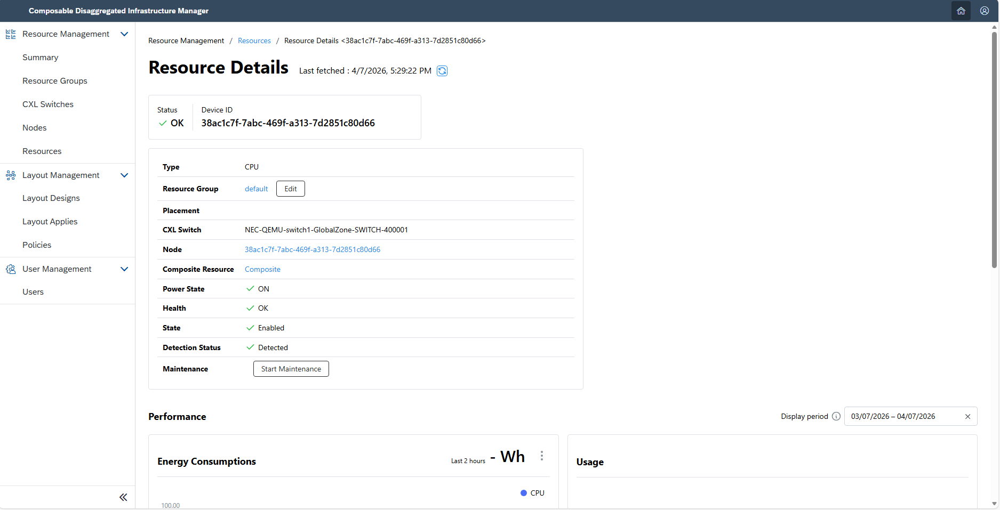
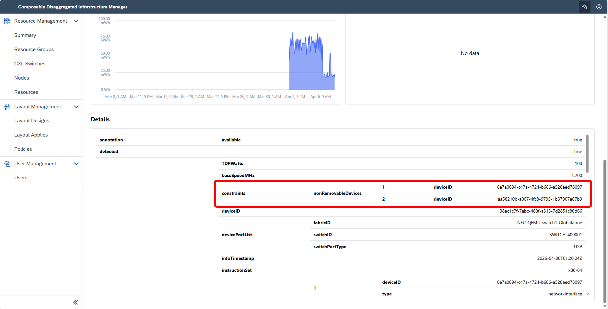
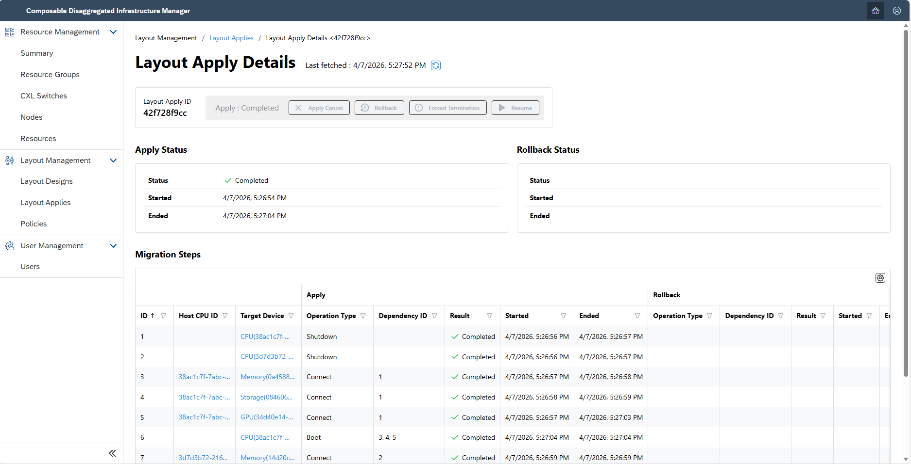
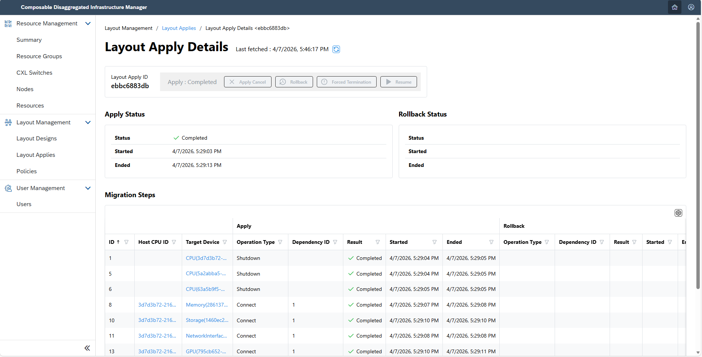
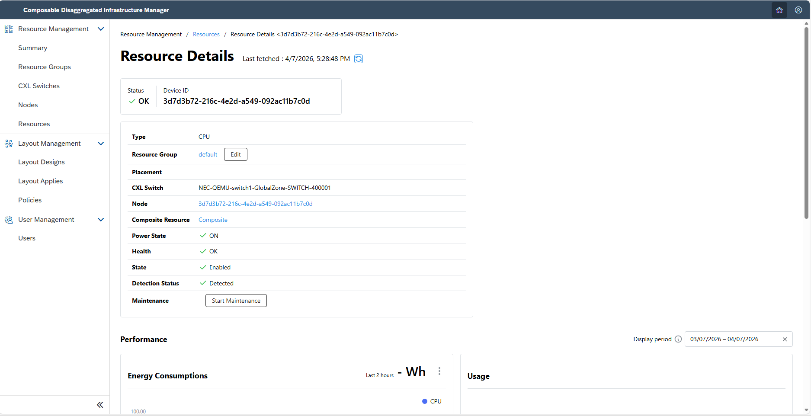
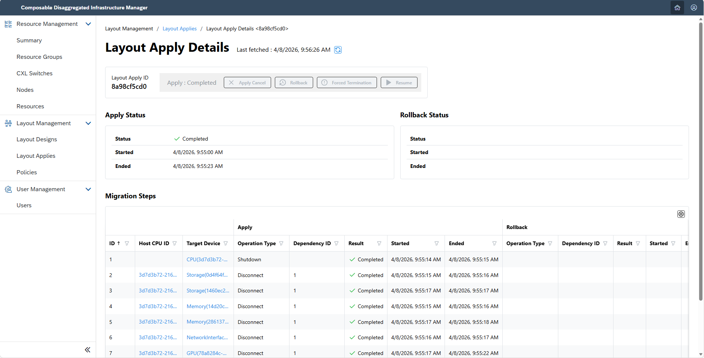
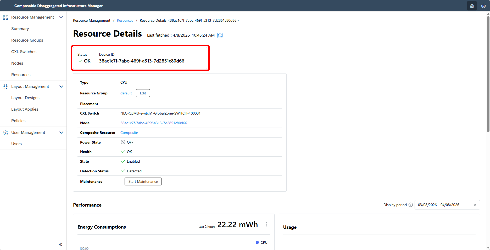
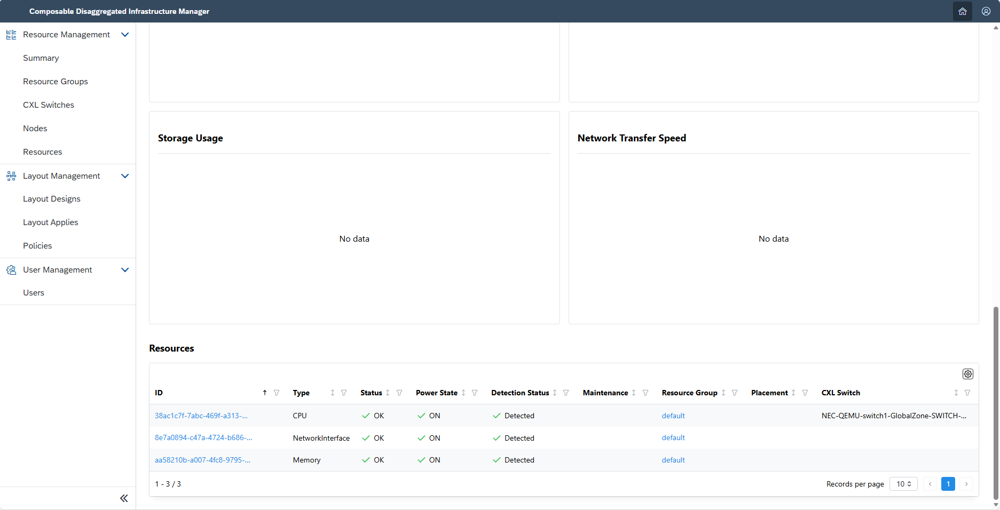
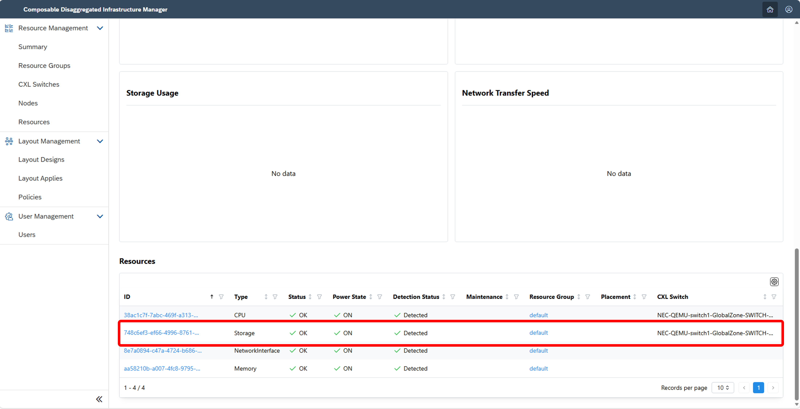

## 2.1 Configuration Changes by Manual Configuration Definition <!-- omit in toc -->
This section explains how to execute configuration changes using Composable Disaggregated Infrastructure Manager (CDIM).

With CDIM, you can seamlessly transition from the current node configuration to the desired one by specifying the configuration parameters for the intended setup.
There are two main functionalities in configuration changes:
- **Configuration Change Function**
  - This feature enables batch configuration changes across multiple nodes simultaneously.
- **Configuration Change via API**
  - This feature is used for granular operations such as turning devices on/off. It is also useful for troubleshooting and isolating issues.

- [2.1.1. Create a New Node](#211-create-a-new-node)
  - [2.1.1.1. Check Device Information](#2111-check-device-information)
  - [2.1.1.2. Describe the Desired Configuration](#2112-describe-the-desired-configuration)
  - [2.1.1.3. Execute](#2113-execute)
- [2.1.2. Modify and Add Nodes](#212-modify-and-add-nodes)
  - [2.1.2.1. Check Device Information](#2121-check-device-information)
  - [2.1.2.2. Describe and Register the Desired Configuration](#2122-describe-and-register-the-desired-configuration)
  - [2.1.2.3. Execute](#2123-execute)
- [2.1.3. Delete Nodes](#213-delete-nodes)
  - [2.1.3.1. Check Device Information](#2131-check-device-information)
  - [2.1.3.2. Describe and Register the Desired Configuration](#2132-describe-and-register-the-desired-configuration)
  - [2.1.3.3. Execute](#2133-execute)
- [2.1.4. Configuration Change via API](#214-configuration-change-via-api)
  - [2.1.4.1. Change Device Power State](#2141-change-device-power-state)
  - [2.1.4.2. Change Device Connection State](#2142-change-device-connection-state)
- [2.1.5. Details of Configuration Change Descriptions (Sample File)](#215-details-of-configuration-change-descriptions-sample-file)

<br>

### 2.1.1. Create a New Node

#### 2.1.1.1. Check Device Information

Validate the specifications of each device by accessing the detailed device screen and select your preferred configuration.



Confirm the device IDs to be utilized post configuration change.

> [!WARNING]
> Some devices are connected to a CPU in advance and cannot be removed from the CPU (e.g., devices built into the server chassis where the CPU is installed). In this document, such devices are referred to as non-removable devices.
> The method to check whether a device is a non-removable device is as follows:
> - If "nonRemovableDevices" is listed in the detailed information: It is a non-removable device and is connected to the CPU with the listed device ID.
> - If "nonRemovableDevices" is not listed in the detailed information: It is not a non-removable device.
> Note: CPUs is not non-removable devices. The "nonRemovableDevices" listed for detailed information of the CPU indicate the CPU have those non-removable devices.
> 

#### 2.1.1.2. Describe the Desired Configuration

Outline the configuration for the new node you wish to establish.  
> [!NOTE]
> Update the device IDs to those generated at CDIM initialization.
```sh
$ mkdir test
$ vi test/template_1.json
```
<details>
<summary>test/template_1.json (example)</summary>

```json
{
    "targetNodeIDs": [
        "38ac1c7f-7abc-469f-a313-7d2851c80d66",
        "3d7d3b72-216c-4e2d-a549-092ac11b7c0d"
    ],
    "desiredLayout": {
        "nodes": [
            {
                "device": {
                    "cpu": {
                        "deviceIDs": [
                            "38ac1c7f-7abc-469f-a313-7d2851c80d66"
                        ]
                    },
                    "memory": {
                        "deviceIDs": [
                            "aa58210b-a007-4fc8-9795-1b37907a87b9",
                            "0a4588f1-3dc4-45d9-a246-b4694b099655"
                        ]
                    },
                    "storage": {
                        "deviceIDs": [
                            "084606d6-79e7-4ec0-a626-826e85ef807c"
                        ]
                    },
                    "networkInterface": {
                        "deviceIDs": [
                            "8e7a0894-c47a-4724-b686-a528eed78097"
                        ]
                    },
                    "gpu": [
                        {
                            "deviceID": "34d40e14-8814-4f07-b9ab-5c839e7d7fbb"
                        }
                    ]
                }
            },
            {
                "device": {
                    "cpu": {
                        "deviceIDs": [
                            "3d7d3b72-216c-4e2d-a549-092ac11b7c0d"
                        ]
                    },
                    "memory": {
                        "deviceIDs": [
                            "b1ebc38b-f748-4188-a76e-567b7d99eef0",
                            "14d20c12-7c53-4790-929c-c304595c3297"
                        ]
                    },
                    "storage": {
                        "deviceIDs": [
                            "0d4f64f4-fc8e-4314-8216-d37bb7a99102"
                        ]
                    },
                    "networkInterface": {
                        "deviceIDs": [
                            "e79c6939-d20d-41c2-8685-13c05c910be3"
                        ]
                    },
                    "gpu": [
                        {
                            "deviceID": "78a8284c-a47c-4c1f-a554-bbe8807e41b3"
                        }
                    ]
                }
            }
        ]
    }
}
```

</details>

#### 2.1.1.3. Execute

1. Create and validate the migration procedure for the specified configuration:
   ```sh
   $ curl -XPOST -H 'Content-Type: application/json' http://<ip-address>:8013/cdim/api/v1/migration-procedures -d @test/template_1.json | jq > test/procedure_template_1.json
   $ cat test/procedure_template_1.json 
   ```

2. Modify the output migration procedure if necessary:
   ```sh
   $ vi test/procedure_template_1.json
   {
    "procedures": [
        <output content>
    ]
   }
   ```

3. Apply the prepared migration procedure:
    ```sh
    $ curl -XPOST -H 'Content-Type: application/json' http://<ip-address>:8013/cdim/api/v1/layout-apply -d @test/procedure_template_1.json
    ```

4. Verify the configuration changes in the user interface:
   > Please allow a few minutes for the node and resource lists to reflect the changes post execution.

   

   If the status indicates Failure or Suspension, retry from [step 2](#2112-describe-the-desired-configuration) or refer to [Troubleshooting](../appendix/troubleshooting/README.md).

### 2.1.2. Modify and Add Nodes

#### 2.1.2.1. Check Device Information

Investigate the detailed screens of each device and select the specifications you wish to either modify or include.  
  
After settling on the node configuration, confirm both the device IDs currently in use and those that will be deployed post-configuration.

> [!WARNING]
> Non-removable devices cannot be connected to any CPU other than the one they are originally connected to.  
> For details on how to identify non-removable devices, see [2.1.1.1.](#2111-check-device-information).

#### 2.1.2.2. Describe and Register the Desired Configuration

Detail the configuration for the evolving node setup you aim to establish.
> [!NOTE]
> Update the device IDs to reflect those registered earlier.
```sh
$ mkdir test
$ vi test/template_2.json
```
<details>
<summary>test/template_2.json (example)</summary>

```json
{
    "targetNodeIDs": [
        "5a2abba5-5503-4df5-9950-f86e4c54bbc3",
        "63a5b9f5-b411-4afe-b44e-e06a4315b1fd",
        "3d7d3b72-216c-4e2d-a549-092ac11b7c0d"
    ],
    "desiredLayout": {
        "nodes": [
            {
                "device": {
                    "cpu": {
                        "deviceIDs": [
                            "3d7d3b72-216c-4e2d-a549-092ac11b7c0d"
                        ]
                    },
                    "memory": {
                        "deviceIDs": [
                            "b1ebc38b-f748-4188-a76e-567b7d99eef0",
                            "14d20c12-7c53-4790-929c-c304595c3297",
                            "28613785-05f1-4bc7-98ba-2c590926b59e"
                        ]
                    },
                    "storage": {
                        "deviceIDs": [
                            "0d4f64f4-fc8e-4314-8216-d37bb7a99102",
                            "1460ec26-32ea-450d-8817-c841b1b1fa08"
                        ]
                    },
                    "networkInterface": {
                        "deviceIDs": [
                            "e79c6939-d20d-41c2-8685-13c05c910be3",
                            "1bf35a50-183f-43d7-8509-8318d308474b"
                        ]
                    },
                    "gpu": [
                        {
                            "deviceID": "78a8284c-a47c-4c1f-a554-bbe8807e41b3"
                        },
                        {
                            "deviceID": "795cb652-4b54-4da9-b4ed-f9aef77054c6"
                        },
                        {
                            "deviceID": "88258305-39b4-4db8-9265-b62cfb9483e2"
                        }
                    ]
                }
            },
            {
                "device": {
                    "cpu": {
                        "deviceIDs": [
                            "5a2abba5-5503-4df5-9950-f86e4c54bbc3"
                        ]
                    },
                    "memory": {
                        "deviceIDs": [
                            "1584de41-3f66-49f9-b749-70b5bf1be5db",
                            "34485a33-8e2c-48f1-b8bb-41e2cab3dccd"
                        ]
                    },
                    "storage": {
                        "deviceIDs": [
                            "192e4531-8a22-450a-bb49-fd16963a28bf",
                            "62d6fb1e-a298-470f-b015-a3348431adf6"
                        ]
                    },
                    "networkInterface": {
                        "deviceIDs": [
                            "13ee71d4-e1b0-4631-bb62-c28338b83ae0"
                        ]
                    },
                    "gpu": [
                        {
                            "deviceID": "8d33a2f6-ca58-4275-8b87-93ffd9237ce9"
                        }
                    ]
                }
            },
            {
                "device": {
                    "cpu": {
                        "deviceIDs": [
                            "63a5b9f5-b411-4afe-b44e-e06a4315b1fd"
                        ]
                    },
                    "memory": {
                        "deviceIDs": [
                            "020277ad-a599-47f7-b640-dc7a168e83f0",
                            "4566c945-e83a-41b6-b88d-26ff97005d02"
                        ]
                    },
                    "storage": {
                        "deviceIDs": [
                            "68593170-5f44-41fb-9f14-52d4eb31df6b"
                        ]
                    },
                    "networkInterface": {
                        "deviceIDs": [
                            "4bb1ac6b-ca96-4d63-b0af-8bb7166dfd05"
                        ]
                    }
                }
            }
        ]
    }
}
```

</details>

#### 2.1.2.3. Execute

1. Create and validate the migration procedure for the specified configuration:
   ```sh
   $ curl -XPOST -H 'Content-Type: application/json' http://<ip-address>:8013/cdim/api/v1/migration-procedures -d @test/template_2.json | jq > test/procedure_template_2.json
   $ cat test/procedure_template_2.json 
   ```

2. Modify the output migration procedure if necessary:
   ```sh
   $ vi test/procedure_template_2.json
   {
    "procedures": [
        <output content>
    ]
   }
   ```

3. Apply the prepared migration procedure:
   ```sh
   $ curl -XPOST -H 'Content-Type: application/json' http://<ip-address>:8013/cdim/api/v1/layout-apply -d @test/procedure_template_2.json
   ```

4. Verify the configuration changes in the user interface:
   > Note: Post-execution changes might take a few minutes to reflect in the node and resource lists.

   

   If the status indicates Failure or Suspension, retry from [step 2](#2122-describe-and-register-the-desired-configuration) or refer to [Troubleshooting guide](../appendix/troubleshooting/README.md).

### 2.1.3. Delete Nodes

#### 2.1.3.1. Check Device Information 

Review the detailed screen of each device and choose the node you want to delete.  


After you've identified the node to delete, confirm the device IDs currently used in that node and the device IDs that will be affected post-deletion.

> [!WARNING]
> Non-removable devices cannot be connected to any CPU other than the one they are originally connected to.  
> For details on how to identify non-removable devices, see [2.1.1.1.](#2111-check-device-information).

#### 2.1.3.2. Describe and Register the Desired Configuration

Draft the configuration necessary for deleting the node.
> [!NOTE]
> Remember to update the device IDs to those generated at your earlier registration.
```sh
$ mkdir test
$ vi test/template_3.json
```
<details>
<summary>test/template_3.json (example)</summary>

```json
{
    "targetNodeIDs": [
        "3d7d3b72-216c-4e2d-a549-092ac11b7c0d"
    ],
    "desiredLayout": {
        "nodes": []
    }
}
```

</details>

#### 2.1.3.3. Execute

1. Create and validate the migration procedure for the specified configuration:
   ```sh
   $ curl -XPOST -H 'Content-Type: application/json' http://<ip-address>:8013/cdim/api/v1/migration-procedures -d @test/template_3.json | jq > test/procedure_template_3.json
   $ cat test/procedure_template_3.json 
   ```

2. Modify the migration procedure as needed:
   ```sh
   $ vi test/procedure_template_3.json
   {
    "procedures": [
        <output content>
    ]
   }
   ```

3. Apply the prepared migration procedure:
   ```sh
   $ curl -XPOST -H 'Content-Type: application/json' http://<ip-address>:8013/cdim/api/v1/layout-apply -d @test/procedure_template_3.json
   ```

4. Verify the configuration changes in the user interface:
   > Please allow a few minutes for the node list and resource list to update reflecting the changes post-execution.
   
   
   Should it display as Failed or Suspended, retry from [step 2](#2132-describe-and-register-the-desired-configuration) or consult [Troubleshooting](../appendix/troubleshooting/README.md).

### 2.1.4. Configuration Change via API

This section explains how to perform configuration changes that are too complex for the standard configuration management interface.

#### 2.1.4.1. Change Device Power State

1. **Check the information of the device whose power state you wish to change**:
   
   ```sh
    $ curl http://localhost:3500/v1.0/invoke/hw-control/method/cdim/api/v1/devices/<device ID to change power state> | jq
   {
    "deviceID": "38ac1c7f-7abc-469f-a313-7d2851c80d66",
    "type": "CPU",
            :
    "powerState": "Off"
            :
    }
   ```

2. **Change the power state**:  
   Choose the desired power state from the following list and issue the corresponding command.

   <details>
   <summary> List of possible power states </summary>
   
   - on
   - off
   - reset
   - force-off
  
   </details>

   ```sh
   $ curl -X PUT http://localhost:3500/v1.0/invoke/hw-control/method/cdim/api/v1/devices/<device ID to change power state>/power -d '{"action": "on"}' -H 'accept: application/json' -H 'Content-Type: application/json'
   {"deviceID":"38ac1c7f-7abc-469f-a313-7d2851c80d66"}
   
   # Verify the change:
   $ curl http://localhost:3500/v1.0/invoke/hw-control/method/cdim/api/v1/devices/<device ID to change power state> | jq
   {
    "deviceID": "38ac1c7f-7abc-469f-a313-7d2851c80d66",
    "type": "CPU",
            :
    "powerState": "On"
            :
    }
   ```

#### 2.1.4.2. Change Device Connection State

1. **Check the information of the device whose connection state you wish to change**:  
   
   ```sh
   # Check CPU information
    $ curl http://localhost:3500/v1.0/invoke/hw-control/method/cdim/api/v1/devices/<CPU device ID> | jq
   {
    "deviceID": "38ac1c7f-7abc-469f-a313-7d2851c80d66",
    "type": "CPU",
            :
    "powerState": "On"
            :
    }
   
   # Check the device information
   $ curl http://localhost:3500/v1.0/invoke/hw-control/method/cdim/api/v1/devices/<device ID to change connection state> | jq
   {
    "deviceID": "748c6ef3-ef66-4996-8761-8fc0db27b16e",
    "type": "storage",
            :
    "powerState": "On"
            :
    }
   ```

2. **Change the connection state**:   
   Choose the desired connection state from the list below and execute the command.

    - connect
    - disconnect
    ```sh
    $ curl -X PUT http://localhost:3500/v1.0/invoke/hw-control/method/cdim/api/v1/devices/<CPU device ID>/aggregations -d '{"destinationDeviceID": "<device ID to change connection state>", "action": "connect"}' -H 'accept: application/json' -H 'Content-Type: application/json'
    {"CPUDeviceID":"38ac1c7f-7abc-469f-a313-7d2851c80d66","deviceID":"748c6ef3-ef66-4996-8761-8fc0db27b16e"}
    ```
    Verify the connection state
    
    > Note: It may take a few minutes for the node list and resource list to update post execution.

### 2.1.5. Details of Configuration Change Descriptions (Sample File)

This section provides an example of how to precisely formulate and describe the details of configuration changes in CDIM using a sample file.

<details>
<summary>Details of Configuration Content (template_0.json)</summary>

```json
{
    // This section specifies the node IDs (CPU device IDs) you wish to change
    "targetNodeIDs": [
        // Include multiple IDs here if necessary
        "f72874dd-509b-445f-ad7a-47e21114736d",
        "c71ca465-189a-4315-ab91-ff8cf58bbfd2"
    ],
    // Define the desired node configuration post-changes
    "desiredLayout": {
        "nodes": [
            // Describing the first node
            {
                // Details about the device configuration for the node
                "device": {
                    "cpu": {
                        "deviceIDs": [
                            "f72874dd-509b-445f-ad7a-47e21114736d"
                        ]
                    },
                    "memory": {
                        "deviceIDs": [
                            "01c510d4-9f9c-4d7e-9107-ab976a7a46fb"
                        ]
                    },
                    "storage": {
                        "deviceIDs": [
                            "b001a83a-10ff-4e53-bb71-fdc4e1fc6c05"
                        ]
                    },
                    "networkInterface": {
                        "deviceIDs": [
                            "fefafbaa-98cf-4d65-a1ef-c24df942c420"
                        ]
                    },
                    // Note that only the GPU must be specified in list format
                    "gpu": [
                        {
                            "deviceID": "060da9eb-4fba-4c06-9d0f-bf1c56992037"
                        }
                    ]
                }
            },
            // Describing the second node
            {
                "device": {
                    "cpu": {
                        "deviceIDs": [
                            "c71ca465-189a-4315-ab91-ff8cf58bbfd2"
                        ]
                    },
                    "memory": {
                        "deviceIDs": [
                            // Include multiple IDs if multiple devices are being used
                            "10991104-a11c-4c44-b20d-78b7ebcab0f8",
                            "99adb16d-e75b-43f9-8215-76fbc26bff33"
                        ]
                    },
                    "storage": {
                        "deviceIDs": [
                            "0d94b110-bde5-48ad-8159-23dbcc2918bd",
                            "db9e86c4-aeb6-4bc1-a061-d31542fbe2b9"
                        ]
                    },
                    "networkInterface": {
                        "deviceIDs": [
                            "499cf595-b79f-40b4-bfd2-af9a05c04c2c"
                        ]
                    }
                }
            }
        ]
    }
}
```

</details>

<br>

<details>
<summary>Details of Description Items</summary>

| Name | Explanation |
|:----|:-----------|
| targetNodeIDs | A field listing the nodes targeted for changes. It's critical to specify this; otherwise, changes may apply to all nodes inadvertently. |
| desiredLayout | Describes the planned node configuration after changes are applied. |
| nodes | An object that details node information in a list format. |
| device | Lists all the devices either currently used or intended for future use in specified nodes. |

</details>

<br>

<details>
<summary>List of Available Resources</summary>

- CPU
- memory
- storage
- networkInterface(NIC)
- GPU
> Note: Additional resources will be progressively supported.

</details>

[Next: 2.2. Configuration Changes Using Design Engine](../layout-design/README.md)
