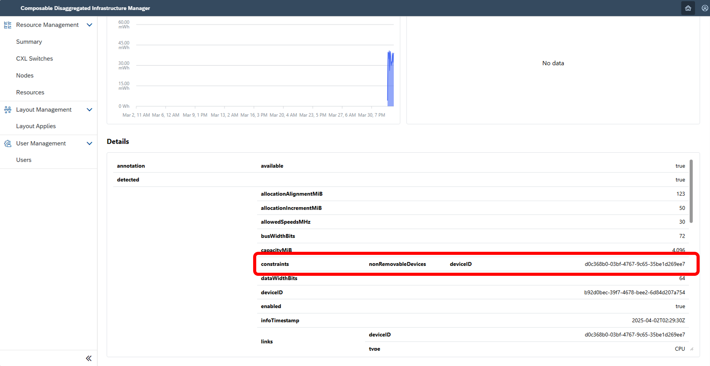
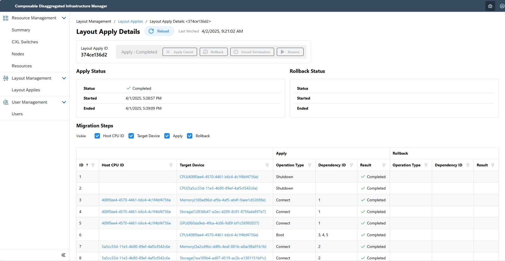
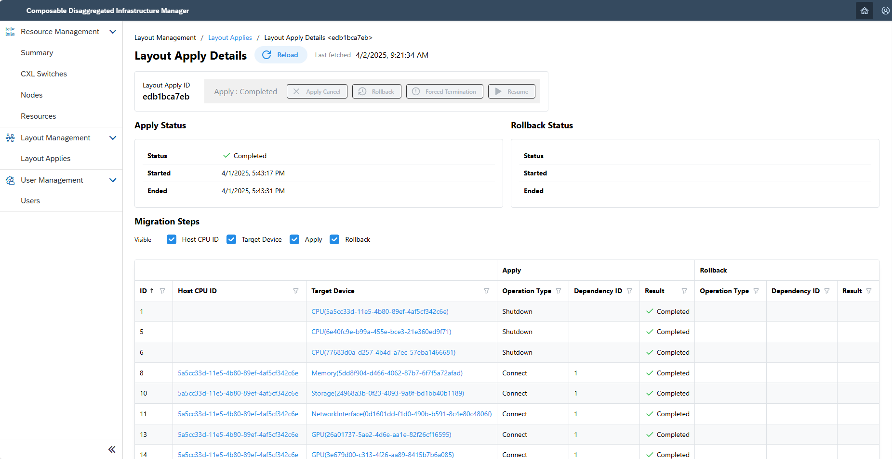
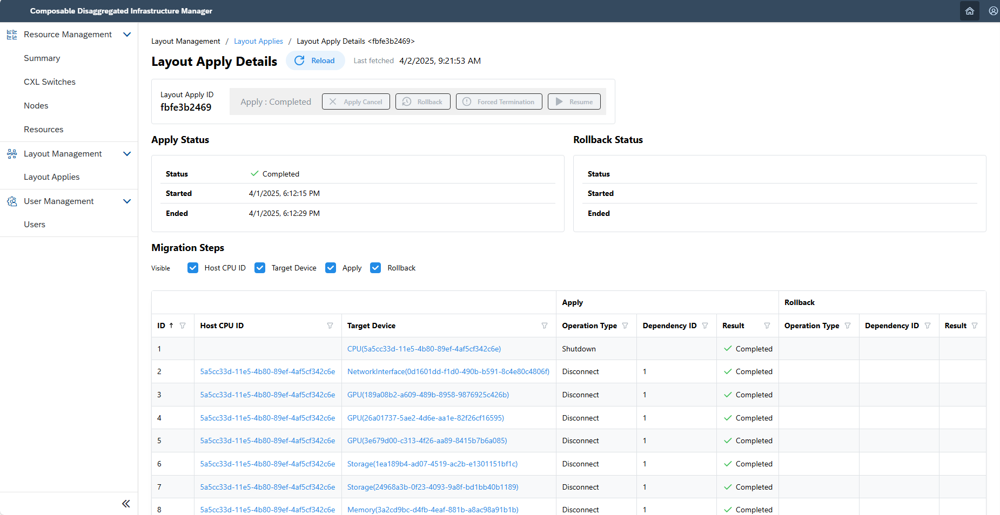

## 2. Configuration Changes <!-- omit in toc -->
This section explains how to execute configuration changes using Composable Disaggregated Infrastructure Manager (CDIM).

With CDIM, you can seamlessly transition from the current node configuration to the desired one by specifying the configuration parameters for the intended setup.
There are two main functionalities in configuration changes:
- **Configuration Change Function**
  - This feature enables batch configuration changes across multiple nodes simultaneously.
- **Configuration Change via API**
  - This feature facilitates granular configuration adjustments such as toggling individual device states, especially useful when an error occurs in the batch configuration function.

<br>

- [2.1. Create a New Node](#21-create-a-new-node)
  - [2.1.1. Check Device Information](#211-check-device-information)
  - [2.1.2. Describe the Desired Configuration](#212-describe-the-desired-configuration)
  - [2.1.3. Execute](#213-execute)
- [2.2. Modify and Add Nodes](#22-modify-and-add-nodes)
  - [2.2.1. Check Device Information](#221-check-device-information)
  - [2.2.2. Describe and Register the Desired Configuration](#222-describe-and-register-the-desired-configuration)
  - [2.2.3. Execute](#223-execute)
- [2.3. Delete Nodes](#23-delete-nodes)
  - [2.3.1. Check Device Information](#231-check-device-information)
  - [2.3.2. Describe and Register the Desired Configuration](#232-describe-and-register-the-desired-configuration)
  - [2.3.3. Execute](#233-execute)
- [2.4. Configuration Change via API](#24-configuration-change-via-api)
  - [2.4.1. Change Device Power State](#241-change-device-power-state)
  - [2.4.2. Change Device Connection State](#242-change-device-connection-state)
- [2.5. Details of Configuration Change Descriptions (Sample File)](#25-details-of-configuration-change-descriptions-sample-file)

<br>

### 2.1. Create a New Node

#### 2.1.1. Check Device Information

Validate the specifications of each device by accessing the detailed device screen and select your preferred configuration.


Confirm the device IDs to be utilized post configuration change.

> [!WARNING]
> Some devices are pre-connected to a CPU as built-in devices, and these built-in devices cannot be connected to any CPU other than the one they are pre-connected to.
> The method to check whether a device is a built-in device is as follows:
> - If "nonRemovableDevices" is listed in the detailed information: It is a built-in device and is connected to the CPU with the listed device ID.
> - If "nonRemovableDevices" is not listed in the detailed information: It is not a built-in device.
> Note: CPUs is not built-in devices. The "nonRemovableDevices" listed for detailed information of the CPU indicate the CPU have those built-in devices.
> 

#### 2.1.2. Describe the Desired Configuration

Outline the configuration for the new node you wish to establish.  
> [!NOTE]
> Update the device IDs to those generated at CDIM initialization.
```sh
$ mkdir test
$ vi test/template_1.json
```
<details>
<summary>test/template_1.json (example)</summary>

```json
{
    "targetNodeIDs": [
            "408f0ee4-4570-4461-b6c4-4c1f4bf4756e",
            "5a5cc33d-11e5-4b80-89ef-4af5cf342c6e"
    ],
    "desiredLayout": {
        "nodes": [
            {
                "device": {
                    "cpu": {
                        "deviceIDs": [
                            "408f0ee4-4570-4461-b6c4-4c1f4bf4756e"
                        ]
                    },
                    "memory": {
                        "deviceIDs": [
                            "1bb7cd4a-e635-49a5-9ca1-e97b7699c32c",
                            "108ad96d-af9a-4af5-ab4f-9aee1d52698e"
                        ]
                    },
                    "storage": {
                        "deviceIDs": [
                            "12836b47-e2ec-4209-8c91-875fade897e7"
                        ]
                    },
                    "networkInterface": {
                        "deviceIDs": [
                            "cd3d1f47-fde5-4cb0-bc6e-bb79921280f8"
                        ]
                    },
                    "gpu": {
                        "deviceIDs": [
                            "060da9eb-4fba-4c06-9d0f-bf1c56992037"
                        ]
                    }
                }
            },
            {
                "device": {
                    "cpu": {
                        "deviceIDs": [
                            "5a5cc33d-11e5-4b80-89ef-4af5cf342c6e"
                        ]
                    },
                    "memory": {
                        "deviceIDs": [
                            "8c1e4a13-2d27-4431-9b82-d2f65f49313e",
                            "3a2cd9bc-d4fb-4eaf-881b-a8ac98a91b1b"
                        ]
                    },
                    "storage": {
                        "deviceIDs": [
                            "1ea189b4-ad07-4519-ac2b-e1301151bf1c"
                        ]
                    },
                    "networkInterface": {
                        "deviceIDs": [
                            "be347398-9179-4173-8bda-15d55083606c"
                        ]
                    },
                    "gpu": {
                        "deviceIDs": [
                            "189a08b2-a609-489b-8958-9876925c426b"
                        ]
                    }
                }
            }
        ]
    }
}
```

</details>

#### 2.1.3. Execute

1. Create and validate the migration procedure for the specified configuration:
   ```sh
   $ curl -XPOST -H 'Content-Type: application/json' http://<ip-address>:8013/cdim/api/v1/migration-procedures -d @test/template_1.json | jq > test/procedure_template_1.json
   $ cat test/procedure_template_1.json 
   ```

2. Modify the output migration procedure if necessary:
   ```sh
   $ vi test/procedure_template_1.json
   {
    "procedures": [
        <output content>
    ]
   }
   ```

3. Apply the prepared migration procedure:
    ```sh
    $ curl -XPOST -H 'Content-Type: application/json' http://<ip-address>:8013/cdim/api/v1/layout-apply -d @test/procedure_template_1.json
    ```

4. Update metrics information:
   Note that updating metrics may take several minutes.
   ```sh
    $ docker exec -it performance-collector /bin/sh
    $ curl -i -s -X PUT http://localhost:8080/cdim/api/v1/configs
    ```

5. Verify the configuration changes in the user interface:
   > Please allow a few minutes for the node and resource lists to reflect the changes post execution.

   

   If the status indicates Failure or Suspension, retry from [step 2](#212-describe-the-desired-configuration) or refer to [Troubleshooting](../appendix/troubleshooting/README.md).

### 2.2. Modify and Add Nodes

#### 2.2.1. Check Device Information

Investigate the detailed screens of each device and select the specifications you wish to either modify or include.  
  
After settling on the node configuration, confirm both the device IDs currently in use and those that will be deployed post-configuration.

> [!WARNING]
> Some devices are pre-connected to a CPU as built-in devices, and these built-in devices cannot be connected to any CPU other than the one they are pre-connected to.
> The method to check whether a device is a built-in device is as follows:
> - If "nonRemovableDevices" is listed in the detailed information: It is a built-in device and is connected to the CPU with the listed device ID.
> - If "nonRemovableDevices" is not listed in the detailed information: It is not a built-in device.
> Note: CPUs is not built-in devices. The "nonRemovableDevices" listed for detailed information of the CPU indicate the CPU have those built-in devices.
> 

#### 2.2.2. Describe and Register the Desired Configuration

Detail the configuration for the evolving node setup you aim to establish.
> [!NOTE]
> Update the device IDs to reflect those registered earlier.
```sh
$ mkdir test
$ vi test/template_2.json
```
<details>
<summary>test/template_2.json (example)</summary>

```json
{
    "targetNodeIDs": [
            "5a5cc33d-11e5-4b80-89ef-4af5cf342c6e",
            "6e40fc9e-b99a-455e-bce3-21e360ed9f71",
            "77683d0a-d257-4b4d-a7ec-57eba1466681"
    ],
    "desiredLayout": {
        "nodes": [
            {
                "device": {
                    "cpu": {
                        "deviceIDs": [
                            "5a5cc33d-11e5-4b80-89ef-4af5cf342c6e"
                        ]
                    },
                    "memory": {
                        "deviceIDs": [
                            "8c1e4a13-2d27-4431-9b82-d2f65f49313e",
                            "3a2cd9bc-d4fb-4eaf-881b-a8ac98a91b1b",
                            "5dd8f904-d466-4062-87b7-6f7f5a72afad"
                        ]
                    },
                    "storage": {
                        "deviceIDs": [
                            "1ea189b4-ad07-4519-ac2b-e1301151bf1c",
                            "24968a3b-0f23-4093-9a8f-bd1bb40b1189"
                        ]
                    },
                    "networkInterface": {
                        "deviceIDs": [
                            "be347398-9179-4173-8bda-15d55083606c",
                            "0d1601dd-f1d0-490b-b591-8c4e80c4806f"
                        ]
                    },
                    "gpu": {
                        "deviceIDs": [
                            "189a08b2-a609-489b-8958-9876925c426b",
                            "26a01737-5ae2-4d6e-aa1e-82f26cf16595",
                            "3e679d00-c313-4f26-aa89-8415b7b6a085"
                        ]
                    }
                }
            },
            {
                "device": {
                    "cpu": {
                        "deviceIDs": [
                            "6e40fc9e-b99a-455e-bce3-21e360ed9f71"
                        ]
                    },
                    "memory": {
                        "deviceIDs": [
                            "01c0be1e-b73b-42f0-9167-35f8f3c4d343",
                            "810cbd3a-0808-4623-8f2d-e60a618d4b23"
                        ]
                    },
                    "storage": {
                        "deviceIDs": [
                            "5b3d6c29-2733-4542-814c-6381277f2ba7",
                            "3e8eecc7-6c68-4d8d-8d21-12bcde4d2c50"
                        ]
                    },
                    "networkInterface": {
                        "deviceIDs": [
                            "cb14c649-de57-482f-9198-23dbb58f51dc"
                        ]
                    },
                    "gpu": {
                        "deviceIDs": [
                            "4ba8f685-8a11-4086-bc6f-50c0d21e17fa"
                        ]
                    }
                }
            },
            {
                "device": {
                    "cpu": {
                        "deviceIDs": [
                            "77683d0a-d257-4b4d-a7ec-57eba1466681"
                        ]
                    },
                    "memory": {
                        "deviceIDs": [
                            "cf8b4abc-12e2-4af4-98c7-3077ebfaf1b7",
                            "a87e2f63-7ff3-4656-b1f0-638c2487589b"
                        ]
                    },
                    "storage": {
                        "deviceIDs": [
                            "7cd6b0c2-194b-4451-a5b4-6ac6e0478525"
                        ]
                    },
                    "networkInterface": {
                        "deviceIDs": [
                            "fd5f1c21-7116-445e-bb8e-4af8d80bd25b"
                        ]
                    }
                }
            }
        ]
    }
}
```

</details>

#### 2.2.3. Execute

1. Create and validate the migration procedure for the specified configuration:
   ```sh
   $ curl -XPOST -H 'Content-Type: application/json' http://<ip-address>:8013/cdim/api/v1/migration-procedures -d @test/template_2.json | jq > test/procedure_template_2.json
   $ cat test/procedure_template_2.json 
   ```
2. Modify the output migration procedure if necessary:
   ```sh
   $ vi test/procedure_template_2.json
   {
    "procedures": [
        <output content>
    ]
   }
   ```
3. Apply the prepared migration procedure:
   ```sh
   $ curl -XPOST -H 'Content-Type: application/json' http://<ip-address>:8013/cdim/api/v1/layout-apply -d @test/procedure_template_2.json
   ```
4. Update the metrics data:
   Updating metrics can take a few minutes.
   ```sh
    $ docker exec -it performance-collector /bin/sh
    $ curl -i -s -X PUT http://localhost:8080/cdim/api/v1/configs
    ```
5. Verify the configuration changes in the user interface:
   > Note: Post-execution changes might take a few minutes to reflect in the node and resource lists.

   

   If the status indicates Failure or Suspension, retry from [step 2](#222-describe-and-register-the-desired-configuration) or refer to [Troubleshooting guide](../appendix/troubleshooting/README.md).

### 2.3. Delete Nodes

#### 2.3.1. Check Device Information 

Review the detailed screen of each device and choose the node you want to delete.  


After you've identified the node to delete, confirm the device IDs currently used in that node and the device IDs that will be affected post-deletion.

> [!WARNING]
> Some devices are pre-connected to a CPU as built-in devices, and these built-in devices cannot be connected to any CPU other than the one they are pre-connected to.
> The method to check whether a device is a built-in device is as follows:
> - If "nonRemovableDevices" is listed in the detailed information: It is a built-in device and is connected to the CPU with the listed device ID.
> - If "nonRemovableDevices" is not listed in the detailed information: It is not a built-in device.
> Note: CPUs is not built-in devices. The "nonRemovableDevices" listed for detailed information of the CPU indicate the CPU have those built-in devices.
> 

#### 2.3.2. Describe and Register the Desired Configuration

Draft the configuration necessary for deleting the node.
> [!NOTE]
> Remember to update the device IDs to those generated at your earlier registration.
```sh
$ mkdir test
$ vi test/template_3.json
```
<details>
<summary>test/template_3.json (example)</summary>

```json
{
    "targetNodeIDs": [
            "5a5cc33d-11e5-4b80-89ef-4af5cf342c6e"
    ],
    "desiredLayout": {
        "nodes": [ ]
    }
}
```

</details>

#### 2.3.3. Execute

1. Create and validate the migration procedure for the specified configuration:
   ```sh
   $ curl -XPOST -H 'Content-Type: application/json' http://<ip-address>:8013/cdim/api/v1/migration-procedures -d @test/template_3.json | jq > test/procedure_template_3.json
   $ cat test/procedure_template_3.json 
   ```
2. Modify the migration procedure as needed:
   ```sh
   $ vi test/procedure_template_3.json
   {
    "procedures": [
        <output content>
    ]
   }
   ```
3. Modify the output migration procedure if necessary:
   ```sh
   $ curl -XPOST -H 'Content-Type: application/json' http://<ip-address>:8013/cdim/api/v1/layout-apply -d @test/procedure_template_3.json
   ```
4. Update metrics information:
   Note that metrics update can take several minutes.
   ```sh
    $ docker exec -it performance-collector /bin/sh
    $ curl -i -s -X PUT http://localhost:8080/cdim/api/v1/configs
    ```
5. Verify the configuration changes in the user interface:
   > Please allow a few minutes for the node list and resource list to update reflecting the changes post-execution.
   
   
   Should it display as Failed or Suspended, retry from [step 2](#232-describe-and-register-the-desired-configuration) or consult [Troubleshooting](../appendix/troubleshooting/README.md).

### 2.4. Configuration Change via API

This section explains how to perform configuration changes that are too complex for the standard configuration management interface.

#### 2.4.1. Change Device Power State

1. **Check the information of the device whose power state you wish to change**:
   
   ```sh
    $ docker container exec -t hw-control curl http://localhost:3500/v1.0/invoke/hw-control/method/cdim/api/v1/devices/<device ID to change power state> | jq
   {
     "deviceID": "1ea189b4-ad07-4519-ac2b-e1301151bf1c",
     "type": "storage",
           :
     "powerState": "Off"
           :
   }
   ```

2. **Change the power state**:  
   Choose the desired power state from the following list and issue the corresponding command.

   <details>
   <summary> List of possible power states </summary>
   
   - on
   - off
   - reset
   - force-off
  
   </details>

   ```sh
   $ docker container exec -t hw-control curl -X PUT http://localhost:3500/v1.0/invoke/hw-control/method/cdim/api/v1/devices/<device ID to change power state>/power -d '{"action": "on"}' -H 'accept: application/json' -H 'Content-Type: application/json'
   {"deviceID":"1ea189b4-ad07-4519-ac2b-e1301151bf1c"}
   
   # Verify the change:
   $ docker container exec -t hw-control curl http://localhost:3500/v1.0/invoke/hw-control/method/cdim/api/v1/devices/<device ID to change power state> | jq
   {
     "deviceID": "1ea189b4-ad07-4519-ac2b-e1301151bf1c",
     "type": "storage",
           :
     "powerState": "On"
           :
   }
   ```

#### 2.4.2. Change Device Connection State

1. **Check the information of the device whose connection state you wish to change**:  
   
   ```sh
   # Check CPU information
    $ docker container exec -t hw-control curl http://localhost:3500/v1.0/invoke/hw-control/method/cdim/api/v1/devices/<CPU device ID> | jq
   {
     "deviceID": "9ea47b1b-bf73-4267-95e2-31c702a274c9",
     "type": "CPU",
           :
     "powerState": "On"
           :
   }
   
   # Check the device information
   $ docker container exec -t hw-control curl http://localhost:3500/v1.0/invoke/hw-control/method/cdim/api/v1/devices/<device ID to change connection state> | jq
   {
     "deviceID": "1ea189b4-ad07-4519-ac2b-e1301151bf1c",
     "type": "storage",
           :
     "powerState": "On"
           :
   }
   ```

2. **Change the connection state**:   
   Choose the desired connection state from the list below and execute the command.

    - connect
    - disconnect
    ```sh
    $ docker container exec -t hw-control curl -X PUT http://localhost:3500/v1.0/invoke/hw-control/method/cdim/api/v1/cpu/<CPU device ID>/aggregations -d '{"deviceID": "<device ID to change connection state>", "action": "connect"}' -H 'accept: application/json' -H 'Content-Type: application/json'
    {"CPUDeviceID":"9ea47b1b-bf73-4267-95e2-31c702a274c9","deviceID":"1ea189b4-ad07-4519-ac2b-e1301151bf1c"}
    ```
    Verify the connection state
    
    > Note: It may take a few minutes for the node list and resource list to update post execution.
    

3. **Update metrics information**:  
   Note that updating metrics information can take a few minutes.
   ```sh
   $ docker exec -it performance-collector /bin/sh
   $ curl -i -s -X PUT http://localhost:8080/cdim/api/v1/configs
   ```

### 2.5. Details of Configuration Change Descriptions (Sample File)

This section provides an example of how to precisely formulate and describe the details of configuration changes in CDIM using a sample file.

<details>
<summary>Details of Configuration Content (template_0.json)</summary>

```json
{
    // This section specifies the node IDs (CPU device IDs) you wish to change
    "targetNodeIDs": [
        // Include multiple IDs here if necessary
        "f72874dd-509b-445f-ad7a-47e21114736d",
        "c71ca465-189a-4315-ab91-ff8cf58bbfd2"
    ],
    // Define the desired node configuration post-changes
    "desiredLayout": {
        "nodes": [
            // Describing the first node
            {
                // Details about the device configuration for the node
                "device": {
                    "cpu": {
                        "deviceIDs": [
                            "f72874dd-509b-445f-ad7a-47e21114736d"
                        ]
                    },
                    "memory": {
                        "deviceIDs": [
                            "01c510d4-9f9c-4d7e-9107-ab976a7a46fb"
                        ]
                    },
                    "storage": {
                        "deviceIDs": [
                            "b001a83a-10ff-4e53-bb71-fdc4e1fc6c05"
                        ]
                    },
                    "networkInterface": {
                        "deviceIDs": [
                            "fefafbaa-98cf-4d65-a1ef-c24df942c420"
                        ]
                    }
                }
            },
            // Describing the second node
            {
                "device": {
                    "cpu": {
                        "deviceIDs": [
                            "c71ca465-189a-4315-ab91-ff8cf58bbfd2"
                        ]
                    },
                    "memory": {
                        "deviceIDs": [
                            // Include multiple IDs if multiple devices are being used
                            "10991104-a11c-4c44-b20d-78b7ebcab0f8",
                            "99adb16d-e75b-43f9-8215-76fbc26bff33"
                        ]
                    },
                    "storage": {
                        "deviceIDs": [
                            "0d94b110-bde5-48ad-8159-23dbcc2918bd",
                            "db9e86c4-aeb6-4bc1-a061-d31542fbe2b9"
                        ]
                    },
                    "networkInterface": {
                        "deviceIDs": [
                            "499cf595-b79f-40b4-bfd2-af9a05c04c2c"
                        ]
                    }
                }
            }
        ]
    }
}
```

</details>

<br>

<details>
<summary>Details of Description Items</summary>

| Name | Explanation |
|:----|:-----------|
| targetNodeIDs | A field listing the nodes targeted for changes. It's critical to specify this; otherwise, changes may apply to all nodes inadvertently. |
| desiredLayout | Describes the planned node configuration after changes are applied. |
| nodes | An object that details node information in a list format. |
| devices | Lists all the devices either currently used or intended for future use in specified nodes. |

</details>

<br>

<details>
<summary>List of Available Resources</summary>

- CPU
- memory
- storage
- networkInterface(NIC)
- GPU
> Note: Additional resources will be progressively supported.

</details>

[Next: 3. Various Settings](../configuration/README.md)
