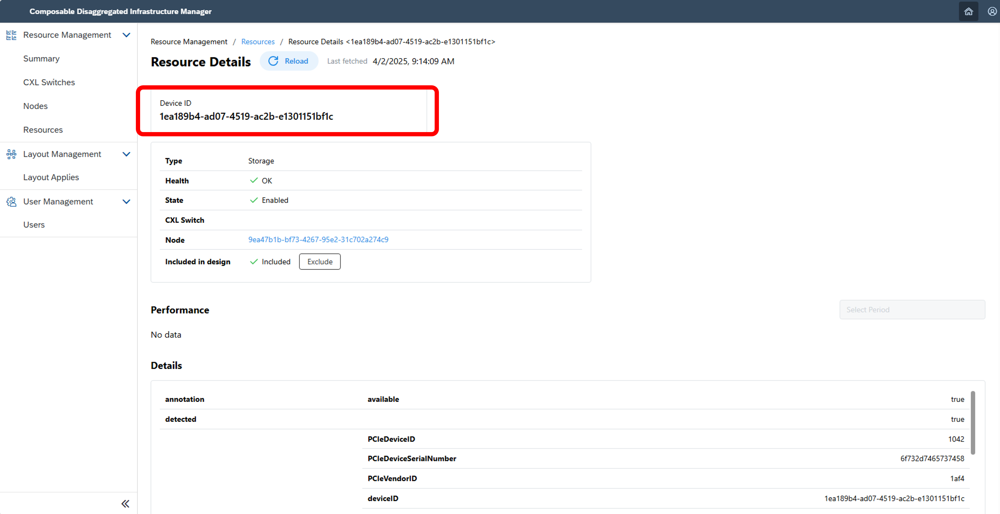

## 2. Configuration Changes <!-- omit in toc -->
This section explains configuration changes using the Composable Disaggregated Infrastructure Manager (CDIM).

With CDIM, you can easily change the current node configuration to the desired node configuration by inputting the information of the node configuration you want to build.  
There are two functions available for configuration changes:  
- Configuration Change Function
  - A function that allows batch configuration changes for dozens of nodes.
- Configuration Change via API
  - A function for making detailed configuration changes, such as turning devices on or off individually. This is used when an error occurs in the configuration change function.

<br>

- [2.1. Create a New Node](#21-create-a-new-node)
  - [2.1.1. Check Device Information](#211-check-device-information)
  - [2.1.2. Describe the Desired Configuration](#212-describe-the-desired-configuration)
  - [2.1.3. Execute](#213-execute)
- [2.2. Modify and Add Nodes](#22-modify-and-add-nodes)
  - [2.2.1. Check Device Information](#221-check-device-information)
  - [2.2.2. Describe and Register the Desired Configuration](#222-describe-and-register-the-desired-configuration)
  - [2.2.3. Execute](#223-execute)
- [2.3. Delete Nodes](#23-delete-nodes)
  - [2.3.1. Check Device Information](#231-check-device-information)
  - [2.3.2. Describe and Register the Desired Configuration](#232-describe-and-register-the-desired-configuration)
  - [2.3.3. Execute](#233-execute)
- [2.4. Configuration Change via API](#24-configuration-change-via-api)
  - [2.4.1. Change Device Power State](#241-change-device-power-state)
  - [2.4.2. Change Device Connection State](#242-change-device-connection-state)
- [2.5. Details of Configuration Change Descriptions (Sample File)](#25-details-of-configuration-change-descriptions-sample-file)
  
### 2.1. Create a New Node

#### 2.1.1. Check Device Information

Check the detailed screen of each device and select the specifications you want to use.


Once the node configuration is determined, check the device IDs to be used after the configuration change.

#### 2.1.2. Describe the Desired Configuration

Describe the new node configuration you want to create.  
> For device IDs, change them to the values generated when CDIM was launched.
```sh
$ mkdir test
$ vi test/templete_1.json
```
<details>
<summary>test/templete_1.json (example)</summary>

```json
{
    "targetNodeIDs": [
            "171c0595-16ca-4250-8dfb-1c6ad598e27d",
            "5edb4f4f-1745-4376-a0e1-c7568e6088b1"
    ],
    "desiredLayout": {
        "nodes": [
            {
                "device": {
                    "cpu": {
                        "deviceIDs": [
                            "171c0595-16ca-4250-8dfb-1c6ad598e27d"
                        ]
                    },
                    "memory": {
                        "deviceIDs": [
                            "3401f8c6-debf-4a5b-9b43-88ec512a9b7e",
                            "0e41ef00-1828-4b93-84e5-bde05be551cf"
                        ]
                    },
                    "storage": {
                        "deviceIDs": [
                            "29eae3ac-f8e7-4130-8a67-c97c6c33d29a"
                        ]
                    },
                    "networkInterface": {
                        "deviceIDs": [
                            "f8e0379e-b213-438e-8a7b-b22bac509590"
                        ]
                    },
                    "gpu": {
                        "deviceIDs": [
                            "14021ef1-fb9c-4acf-8a65-a7a580682fed"
                        ]
                    }
                }
            },
            {
                "device": {
                    "cpu": {
                        "deviceIDs": [
                            "5edb4f4f-1745-4376-a0e1-c7568e6088b1"
                        ]
                    },
                    "memory": {
                        "deviceIDs": [
                            "d4617cce-ca87-4577-9f28-24de39703caf",
                            "1c0a0dc8-bff6-4459-bcb7-60d7528f59d8"
                        ]
                    },
                    "storage": {
                        "deviceIDs": [
                            "3f28d608-747d-40ee-88b6-5c25808c4c27"
                        ]
                    },
                    "networkInterface": {
                        "deviceIDs": [
                            "d2dcdde8-b74c-45f3-8c41-5b4e2a1acd35"
                        ]
                    },
                    "gpu": {
                        "deviceIDs": [
                            "18a3990d-fc86-443d-bee2-1d2cbd6be803"
                        ]
                    }
                }
            }
        ]
    }
}
```

</details>

#### 2.1.3. Execute

1. Create and verify the migration procedure for the registered configuration
   ```sh
   $ curl -XPOST -H 'Content-Type: application/json' http://<ip-address>:8013/cdim/api/v1/migration-procedures -d @test/templete_1.json | jq > test/procedure_templete_1.json
   $ cat test/procedure_templete_1.json 
   ```

2. Edit the output migration procedure  
   If the output migration procedure is not in the following format, correct it to the following format.
   ```sh
   $ vi test/procedure_templete_1.json
   {
    "procedures": [
        <output content>
    ]
   }
   ```

3. Apply the created migration procedure
    ```sh
    $ curl -XPOST -H 'Content-Type: application/json' http://<ip-address>:8013/cdim/api/v1/layout-apply -d @test/procedure_templete_1.json
    ```

4. Update metrics information  
   Updating the metrics information takes a few minutes.
   ```sh
    $ docker exec -it performance-collector /bin/sh
    $ curl -i -s -X PUT http://localhost:8080/cdim/api/v1/configs
    ```

5. Verify the configuration change in the UI
   > It takes a few minutes for the node list and resource list to reflect the changes after execution.

    
    If it shows Failed or Suspend, execute again from [2.](#212-describe-the-desired-configuration) or refer to [Troubleshooting](../appendix/troubleshooting/README.md).

### 2.2. Modify and Add Nodes

#### 2.2.1. Check Device Information

Check the detailed screen of each device and select the specifications you want to modify or add.
  
Once the node configuration is determined, check the device IDs used in the node before the configuration change and the device IDs to be used after the configuration change.

#### 2.2.2. Describe and Register the Desired Configuration

Describe the new node configuration you want to create.  
> For device IDs, change them to the values generated when you registered earlier.
```sh
$ mkdir test
$ vi test/templete_2.json
```
<details>
<summary>test/templete_2.json (example)</summary>

```json
{
    "targetNodeIDs": [
            "5edb4f4f-1745-4376-a0e1-c7568e6088b1",
            "67172327-fbb1-4651-bc6d-63a696a1c6a1",
            "7d5454e5-6860-4750-9722-b1011d07449d"
    ],
    "desiredLayout": {
        "nodes": [
            {
                "device": {
                    "cpu": {
                        "deviceIDs": [
                            "5edb4f4f-1745-4376-a0e1-c7568e6088b1"
                        ]
                    },
                    "memory": {
                        "deviceIDs": [
                            "d4617cce-ca87-4577-9f28-24de39703caf",
                            "1c0a0dc8-bff6-4459-bcb7-60d7528f59d8",
                            "1faaa6ed-3074-46ec-8d5a-e2266bb3d0e8"
                        ]
                    },
                    "storage": {
                        "deviceIDs": [
                            "3f28d608-747d-40ee-88b6-5c25808c4c27",
                            "587bd765-69b5-4633-8695-fe91b513a490"
                        ]
                    },
                    "networkInterface": {
                        "deviceIDs": [
                            "d2dcdde8-b74c-45f3-8c41-5b4e2a1acd35"
                        ]
                    },
                    "gpu": {
                        "deviceIDs": [
                            "18a3990d-fc86-443d-bee2-1d2cbd6be803",
                            "2397eb69-8966-4600-80ba-5aca074a6f74",
                            "7269d815-fc01-4170-9087-555325587344"
                        ]
                    }
                }
            },
            {
                "device": {
                    "cpu": {
                        "deviceIDs": [
                            "67172327-fbb1-4651-bc6d-63a696a1c6a1"
                        ]
                    },
                    "memory": {
                        "deviceIDs": [
                            "94c0ec8b-e869-4c82-bd00-582821eca246",
                            "6c5abb5e-4daf-4bca-a494-f208efe80b87"
                        ]
                    },
                    "storage": {
                        "deviceIDs": [
                            "599b6a7f-113c-440f-b3ad-e7a361c75a9f",
                            "69cea176-520b-4225-84a2-6eccd6817dbb"
                        ]
                    },
                    "networkInterface": {
                        "deviceIDs": [
                            "9ce25d3e-f16c-4427-a53f-f4f69dcf8f7d"
                        ]
                    },
                    "gpu": {
                        "deviceIDs": [
                            "8a3739af-47ba-4272-a552-e3eb7ffe7052"
                        ]
                    }
                }
            },
            {
                "device": {
                    "cpu": {
                        "deviceIDs": [
                            "7d5454e5-6860-4750-9722-b1011d07449d"
                        ]
                    },
                    "memory": {
                        "deviceIDs": [
                            "c528e62a-8a2c-49bb-9e7a-632894b23627",
                            "91b4ece7-6a0d-459b-bb1c-961129fbae18"
                        ]
                    },
                    "storage": {
                        "deviceIDs": [
                            "722a8a2a-afee-4d99-98f6-1358f0cc4dc3"
                        ]
                    },
                    "networkInterface": {
                        "deviceIDs": [
                            "92a0c318-f0cb-4b84-9038-068af00b6029"
                        ]
                    }
                }
            }
        ]
    }
}
```

</details>

#### 2.2.3. Execute

1. Create and verify the migration procedure for the registered configuration
   ```sh
   $ curl -XPOST -H 'Content-Type: application/json' http://<ip-address>:8013/cdim/api/v1/migration-procedures -d @test/templete_2.json | jq > test/procedure_templete_2.json
   $ cat test/procedure_templete_2.json 
   ```
2. Edit the output migration procedure  
   If the output migration procedure is not in the following format, correct it to the following format.
   ```sh
   $ vi test/procedure_templete_2.json
   {
    "procedures": [
        <output content>
    ]
   }
   ```
3. Apply the created migration procedure
   ```sh
   $ curl -XPOST -H 'Content-Type: application/json' http://<ip-address>:8013/cdim/api/v1/layout-apply -d @test/procedure_templete_2.json
   ```
4. Update metrics information  
   Updating the metrics information takes a few minutes.
   ```sh
    $ docker exec -it performance-collector /bin/sh
    $ curl -i -s -X PUT http://localhost:8080/cdim/api/v1/configs
    ```
5. Verify the configuration change in the UI
   > It takes a few minutes for the node list and resource list to reflect the changes after execution.

   
    If it shows Failed or Suspend, execute again from [2.](#222-describe-and-register-the-desired-configuration) or refer to [Troubleshooting](../appendix/troubleshooting/README.md).

### 2.3. Delete Nodes

#### 2.3.1. Check Device Information 

Check the detailed screen of each device and select the node you want to delete.

Once the node configuration is determined, check the device IDs used in the node before the configuration change and the device IDs to be used after the configuration change.

#### 2.3.2. Describe and Register the Desired Configuration

Describe the new node configuration you want to create.
> For device IDs, change them to the values generated when you registered earlier.
```sh
$ mkdir test
$ vi test/templete_3.json
```
<details>
<summary>test/templete_3.json (example)</summary>

```json
{
    "targetNodeIDs": [
            "5edb4f4f-1745-4376-a0e1-c7568e6088b1"
    ],
    "desiredLayout": {
        "nodes": [
        ]
    }
}
```

</details>

#### 2.3.3. Execute

1. Create and verify the migration procedure for the registered configuration
   ```sh
   $ curl -XPOST -H 'Content-Type: application/json' http://<ip-address>:8013/cdim/api/v1/migration-procedures -d @test/templete_3.json | jq > test/procedure_templete_3.json
   $ cat test/procedure_templete_3.json 
   ```
2. Edit the output migration procedure  
   If the output migration procedure is not in the following format, correct it to the following format.
   ```sh
   $ vi test/procedure_templete_3.json
   {
    "procedures": [
        <output content>
    ]
   }
   ```
3. Apply the created migration procedure
   ```sh
   $ curl -XPOST -H 'Content-Type: application/json' http://<ip-address>:8013/cdim/api/v1/layout-apply -d @test/procedure_templete_3.json
   ```
4. Update metrics information  
   Updating the metrics information takes a few minutes.
   ```sh
    $ docker exec -it performance-collector /bin/sh
    $ curl -i -s -X PUT http://localhost:8080/cdim/api/v1/configs
    ```
5. Verify the configuration change in the UI
   > It takes a few minutes for the node list and resource list to reflect the changes after execution.
   
    If it shows Failed or Suspend, execute again from [2.](#232-describe-and-register-the-desired-configuration) or refer to [Troubleshooting](../appendix/troubleshooting/README.md).

### 2.4. Configuration Change via API

This section explains detailed configuration change methods that are difficult to change with the configuration information function.

#### 2.4.1. Change Device Power State

1. Check the information of the device whose power state you want to change
　
  ```sh
  $ docker container exec -it hw-control /bin/sh
  $ curl http://<ip-address>:3500/v1.0/invoke/hw-control/method/cdim/api/v1/devices/<device ID to change power state> | jq
  {
    "deviceID": "18a3990d-fc86-443d-bee2-1d2cbd6be803",
    "type": "gpu",
          :
    "powerState": "Off"
          :
  }
  ```
1. Change the power state  
  Select the desired power state from the list below and enter the following command.

  <details>
   <summary> List of possible power states </summary>
   
   - on
   - off
   - reset
   - force-off
  
   </details>

  ```sh
  $ curl -X PUT http://<ip-address>:3500/v1.0/invoke/hw-control/method/cdim/api/v1/devices/<device ID to change power state>/power -d '{"action": "on"}' -H 'accept: application/json' -H 'Content-Type: application/json'
  {"deviceID":"18a3990d-fc86-443d-bee2-1d2cbd6be803"}
  Check the information of the changed device
  $ curl http://<ip-address>:3500/v1.0/invoke/hw-control/method/cdim/api/v1/devices/<device ID to change power state> | jq
  {
    "deviceID": "18a3990d-fc86-443d-bee2-1d2cbd6be803",
    "type": "gpu",
          :
    "powerState": "On"
          :
  }
  ```

#### 2.4.2. Change Device Connection State

1. Check the information of the device whose connection state you want to change
   
  ```sh
  Check CPU information
  $ docker container exec -it hw-control /bin/sh
  $ curl http://<ip-address>:3500/v1.0/invoke/hw-control/method/cdim/api/v1/devices/<CPU device ID> | jq
  {
    "deviceID": "855d94b5-6855-4aa7-817c-ca2acd743a59",
    "type": "CPU",
          :
    "powerState": "On"
          :
  }
  Check the information of the device whose connection state you want to change
  $ curl http://<ip-address>:3500/v1.0/invoke/hw-control/method/cdim/api/v1/devices/<device ID to change connection state> | jq
  {
    "deviceID": "18a3990d-fc86-443d-bee2-1d2cbd6be803",
    "type": "gpu",
          :
    "powerState": "On"
          :
  }
  ```

1. Change the connection state     
   Select the desired connection state from the list below and execute the following command.

    List of possible connection states
    - connect
    - disconnect
    ```sh
    $ curl -X PUT http://<ip-address>:3500/v1.0/invoke/hw-control/method/cdim/api/v1/cpu/<CPU device ID>/aggregations -d '{"deviceID": "<device ID to change connection state>", "action": "connect"}' -H 'accept: application/json' -H 'Content-Type: application/json'
    {"CPUDeviceID":"855d94b5-6855-4aa7-817c-ca2acd743a59","deviceID":"18a3990d-fc86-443d-bee2-1d2cbd6be803"}
    ```
    Check the connection state of the device.
    
    > It takes a few minutes for the node list and resource list to reflect the changes after execution.

1. Update metrics information  
   
   Exit from the hw-control container and perform the metrics update.
   Updating the metrics information takes a few minutes.
   ```sh
    $ exit
    $ docker exec -it performance-collector /bin/sh
    $ curl -i -s -X PUT http://localhost:8080/cdim/api/v1/configs
    ```

### 2.5. Details of Configuration Change Descriptions (Sample File)

This section shows how to describe and the items of configuration content in CDIM using a sample file.

<details>
<summary>Details of Configuration Content (templete_0.json)</summary>

```json
{
    <!-- Specify the node IDs (CPU device IDs) you want to change -->
    "targetNodeIDs": [
        <!-- Specify multiple if there are multiple -->
        "f72874dd-509b-445f-ad7a-47e21114736d",
        "c71ca465-189a-4315-ab91-ff8cf58bbfd2"
    ],
    <!-- Specify the node configuration after the change -->
    "desiredLayout": {
        "nodes": [
            <!-- First node -->
            {
                <!-- Specify the device information of the node -->
                "device": {
                    "cpu": {
                        "deviceIDs": [
                            "f72874dd-509b-445f-ad7a-47e21114736d"
                        ]
                    },
                    "memory": {
                        "deviceIDs": [
                            "01c510d4-9f9c-4d7e-9107-ab976a7a46fb"
                        ]
                    },
                    "storage": {
                        "deviceIDs": [
                            "b001a83a-10ff-4e53-bb71-fdc4e1fc6c05"
                        ]
                    },
                    "networkInterface": {
                        "deviceIDs": [
                            "fefafbaa-98cf-4d65-a1ef-c24df942c420"
                        ]
                    }
                }
            },
            <!-- Second node -->
            {
                "device": {
                    "cpu": {
                        "deviceIDs": [
                            "c71ca465-189a-4315-ab91-ff8cf58bbfd2"
                        ]
                    },
                    "memory": {
                        "deviceIDs": [
                            <!-- Specify multiple if using multiple devices -->
                            "10991104-a11c-4c44-b20d-78b7ebcab0f8",
                            "99adb16d-e75b-43f9-8215-76fbc26bff33"
                        ]
                    },
                    "storage": {
                        "deviceIDs": [
                            "0d94b110-bde5-48ad-8159-23dbcc2918bd",
                            "db9e86c4-aeb6-4bc1-a061-d31542fbe2b9"
                        ]
                    },
                    "networkInterface": {
                        "deviceIDs": [
                            "499cf595-b79f-40b4-bfd2-af9a05c04c2c"
                        ]
                    }
                }
            }
        ]
    }
}
```

</details>

<br>

<details>
<summary>Details of Description Items</summary>

| Name | Explanation |
|:--|:--|
| targetNodeIDs | An object to list the nodes you want to change. Be careful not to omit this item, as it will apply to all nodes if not specified. |
| desireLayout | An object to describe the information after the configuration change. |
| nodes | An object to describe node information in list format. |
| devices | An object to describe the list of devices used or planned to be used in the node. |

</details>

<br>

<details>
<summary>List of Available Resources</summary>

- CPU
- memory
- storage
- networkInterface (NIC)
- GPU
> More resources will be added sequentially

</details>

[Next 3. Various Settings](../configuration/README.md)
