#### 1. Check Hardware Configuration and Information <!-- omit in toc -->
This section explains how to check hardware configuration and information from the Composable Disaggregated Infrastructure Manager (CDIM) interface.

> [!NOTE] 
> The illustrations below include red frames and numbers for explanatory purposes, these will not appear in the actual interface.

> [!NOTE] 
> In the context of this tutorial, the term "device" refers to individual physical hardware components like CPUs, memory, and storage that constitute the Composable Disaggregated Infrastructure (CDI). The term "resource" denotes physical hardware within a device serving as a "node component."

> [!WARNING]
> Note important considerations regarding the usage rates of each resource.
> Refer to the [Notes](#111-notes) for details.

> [!WARNING]
> Note important considerations when the control target is an emulator.
> Refer to the [Notes](#111-notes) for further details.

- [1.1. Overview of Hardware Configuration and Information](#11-overview-of-hardware-configuration-and-information)
- [1.2. Check Power Consumption and Resource Status by Resource Type](#12-check-power-consumption-and-resource-status-by-resource-type)
- [1.3. Check the List of Constructed Nodes](#13-check-the-list-of-constructed-nodes)
- [1.4. Check the Details of Constructed Nodes](#14-check-the-details-of-constructed-nodes)
- [1.5. Check the List of Registered Resources](#15-check-the-list-of-registered-resources)
- [1.6. Check the Details of Registered Resources](#16-check-the-details-of-registered-resources)
- [1.7. Check the List of Layout Designs](#17-check-the-list-of-layout-designs)
- [1.8. Check the Details of Layout Designs](#18-check-the-details-of-layout-designs)
- [1.9. Check the List of Layout Applies](#19-check-the-list-of-layout-applies)
- [1.10. Operate and Check the Details of Layout Applies](#110-operate-and-check-the-details-of-layout-applies)
- [1.11. Notes](#111-notes)

##### 1.1. Overview of Hardware Configuration and Information
From the dashboard on the home screen, you can observe the number of constructed nodes and resources, the count of nodes and resources with issues, and the quantity of resources utilized by nodes.

Here is a screen example:  
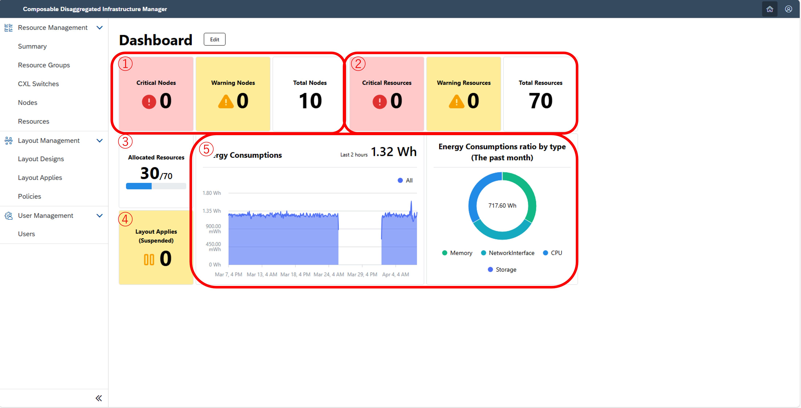

Details of the screen are as follows:
| Number | Name             | Description |
|:------:|------------------|-------------|
|   1    | Node Information | View total nodes and check for critical or warning statuses; if none, all nodes are normal. |
|   2    | Resource Information | View total resources and check for critical or warning statuses; if none, all resources are normal. |
|   3    | Resource Usage | View the count of resources in use. |
|   4    | Layout Apply Status | View pending applications; if zero, there are no issues. |
|   5    | Power Consumption Status | Observe power consumption over a month. Display of graph may take about an hour upon first performance information update due to data accumulation. |

Actions you can perform are as follows:
- **Return to Home**  
  Navigate to the home screen by selecting the home button or the CDIM title.
  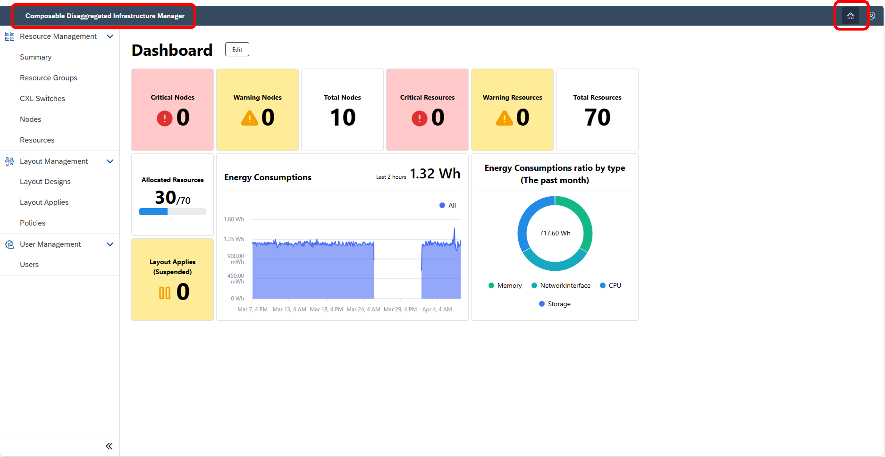

- **Log Out**  
  After selecting the user button, you can log out by pressing the logout button.
  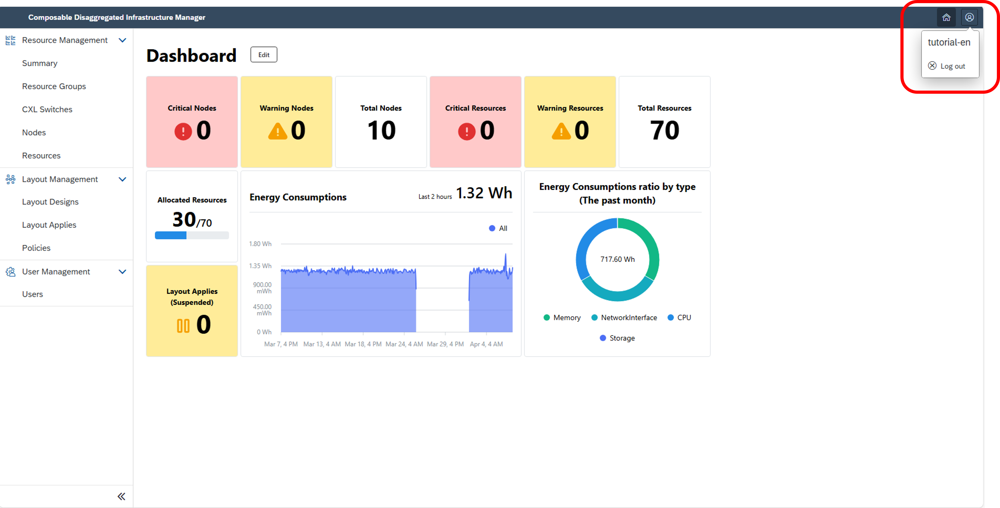
  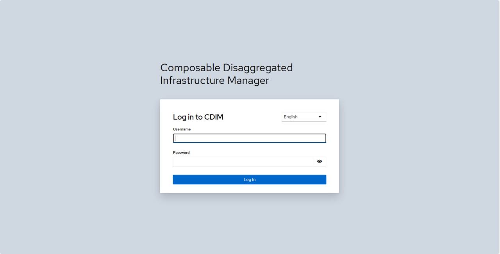

##### 1.2. Check Power Consumption and Resource Status by Resource Type
Select "Summary" from the left-side menu to view the summary screen. The dashboard displayed there shows overall and per-resource-type power consumption and resource status.

Example screens:  
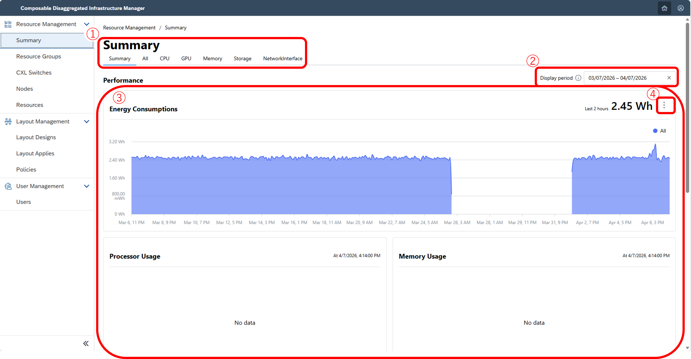
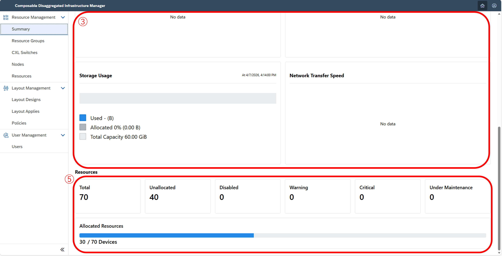

Details of the screen:
| Number | Name             | Description |
|:------:|------------------|-------------|
|   1    | Tab Function     | Access performance and resource status for individual resources. |
|   2    | Display Period | You can set the display period for performance status across all resources. |
|   3    | Performance Status | Observe current power consumption and usage rate. |
|   4    | Performance Status Options | You can open the options menu. Currently, you can export performance status as a CSV file. |
|   5    | Resource Status   | Monitor the count and condition of currently utilized resources; if resources display no critical or warning alerts, all are considered normal. |

##### 1.3. Check the List of Constructed Nodes
Navigate to "Nodes" via the left-side menu. This screen allows you to check node IDs and the resources allocated to each node.

Example screen:  
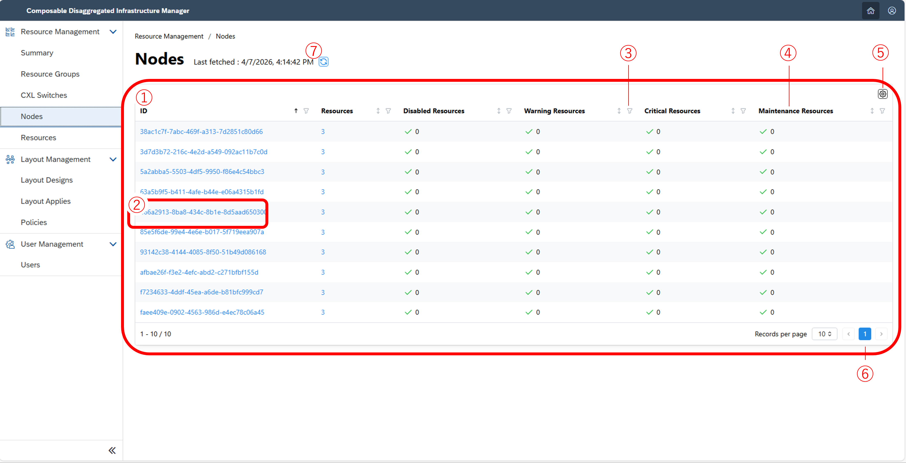

Details of the screen:
| Number | Name          | Description |
|:------:|---------------|-------------|
|   1    | Nodes         | View the current node status. By default, the list shows Node ID, allocated resources, unavailable resources, warnings, critical, and maintenance-unavailable resources. |
|   2    | Node ID       | Clicking the node ID directs to the node details screen. |
|   3    | Filter        | Apply filters per column. |
|   4    | Ascending/Descending Order | Sort columns in ascending or descending order. |
|   5    | Column Settings | Change which columns are shown on the Node List screen. When you click this button, the following dialog is displayed. |
|   6    | Page Number   | Adjust the displayed nodes per page. |
|   7    | Reload        | Refresh information on demand. |

Dialog displayed when you click **Column Settings**:
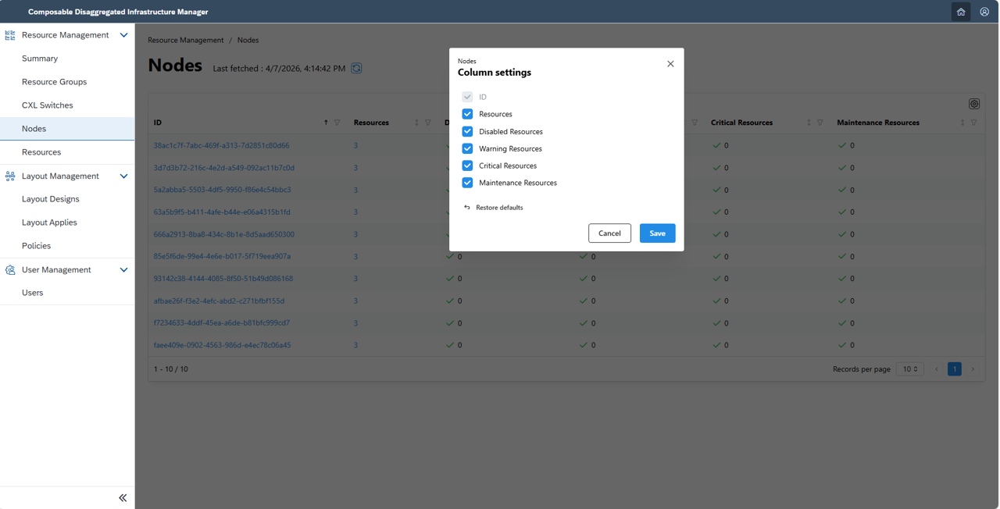

##### 1.4. Check the Details of Constructed Nodes
By clicking a node ID on the node list screen, you transition to the node details screen where you can review the node's specifications, power consumption, and resources allocated to it.

Example screens:  
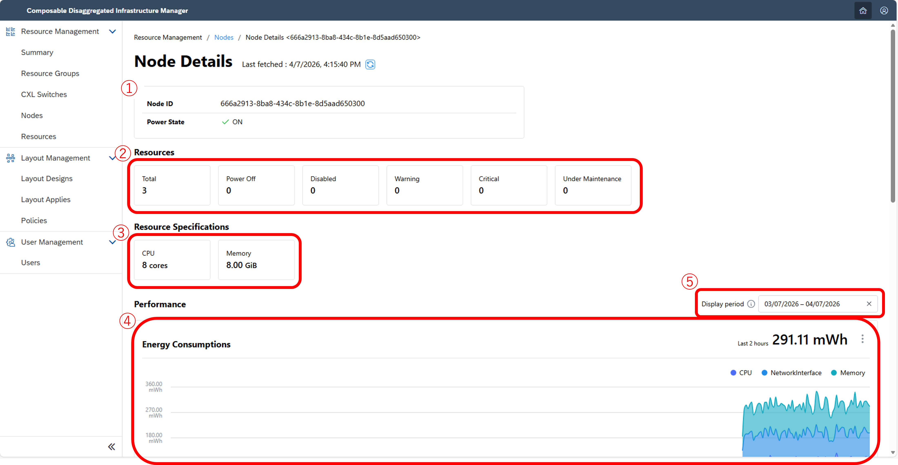
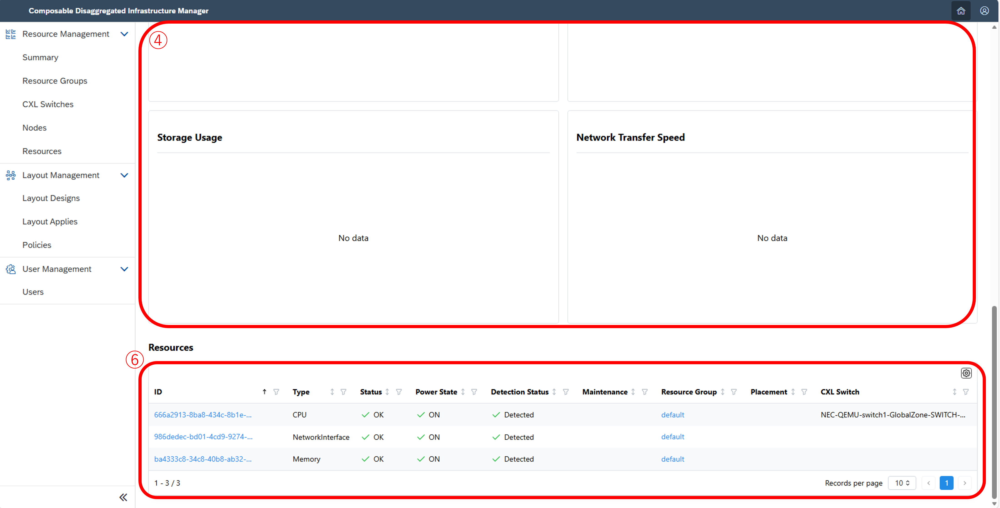

Details of the screen:
| Number | Name                 | Description |
|:------:|----------------------|-------------|
|   1    | Node ID              | Node's assigned ID, usually the device ID of the CPU. |
|   2    | Resource Status      | Monitor the count and condition of resources in use; if resources display no critical or warning alerts, all are considered normal. |
|   3    | Resource Characteristics | Review specifications allocated to this node. |
|   4    | Performance Status   | Observe current power consumption and usage rate. |
|   5    | Display Period | You can set the display period for the performance status of this node. |
|   6    | Resource Allocation Status | View a list of resources allocated to this node. |

##### 1.5. Check the List of Registered Resources
Navigate to "Resources" via the left-side menu. You can identify the types of registered resources and their statuses on this screen.

Example screen:  
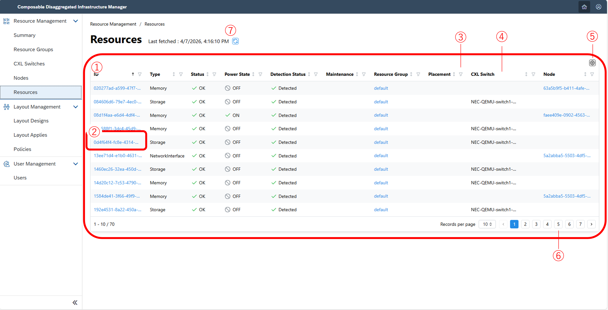

| Number | Name               | Description |
|:------:|--------------------|-------------|
|   1    | Resources          | View the current resource status. By default, columns include Device ID, resource type, integration status, device power status, maintenance status, resource group, rack location, CXL switch information, and the node ID using this resource. If a value is not available, the field is left blank. |
|   2    | Device ID          | Detailed resource screen accessible by clicking the device ID. |
|   3    | Filter             | Apply filters per column. |
|   4    | Ascending/Descending Order | Sort columns in ascending or descending order. |
|   5    | Column Settings | Change which columns are shown on the Resource List screen. |
|   6    | Page Number        | Adjust the number of displayed resources per page. |
|   7    | Reload             | Refresh information on demand. |

##### 1.6. Check the Details of Registered Resources
Click on the device ID either from the resource list screen or the node details screen to navigate to the resource details screen. On this screen, you can inspect detailed information about the resource and mark a resource as unavailable for maintenance.
The screen example is as follows:

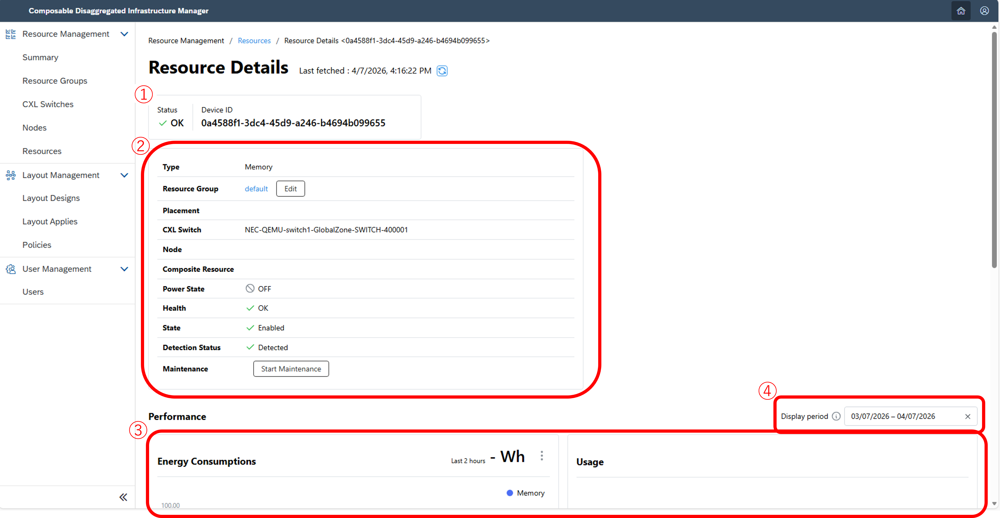
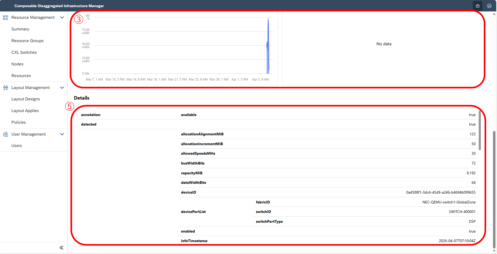

The screen details are as follows:
| Number | Name | Description |
|:------|:------|:------|
| 1 | Device ID | The ID assigned to each resource, automatically determined at initial startup or when adding new resources. |
| 2 | Resource Status | Review the type and status of the resource. A status of 'OK' in Health and 'enable' indicates the resource is operating normally. |
| 3 | Performance Status | Monitor the current power consumption and usage rate. |
| 4 | Display Period | You can set the display period for the performance status of this resource. |
| 5 | Detailed Information | Access in-depth information available for each resource. |

The actions you can undertake include:
- **Mark a resource as unavailable (exclude it from layout design and layout apply)**  
  On the resource details screen, click "Start Maintenance" to exclude the resource from layout design and layout apply.
  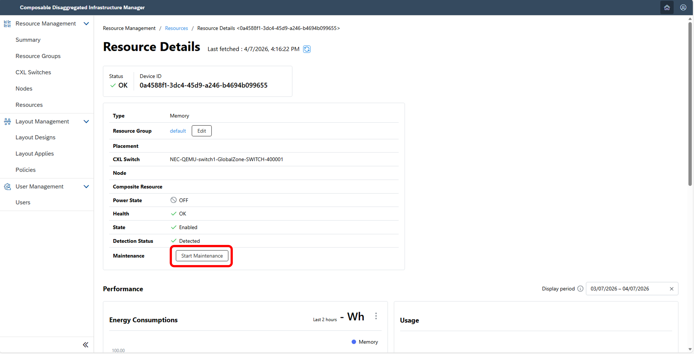
  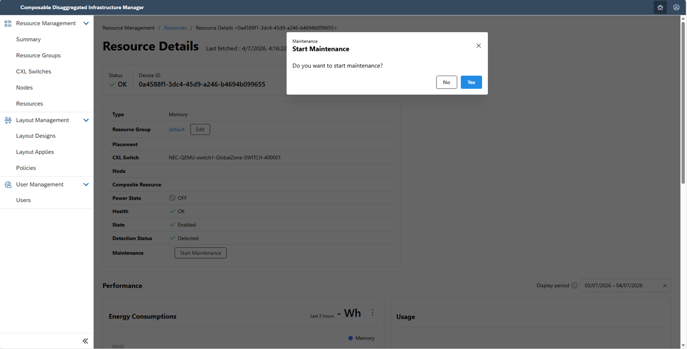
  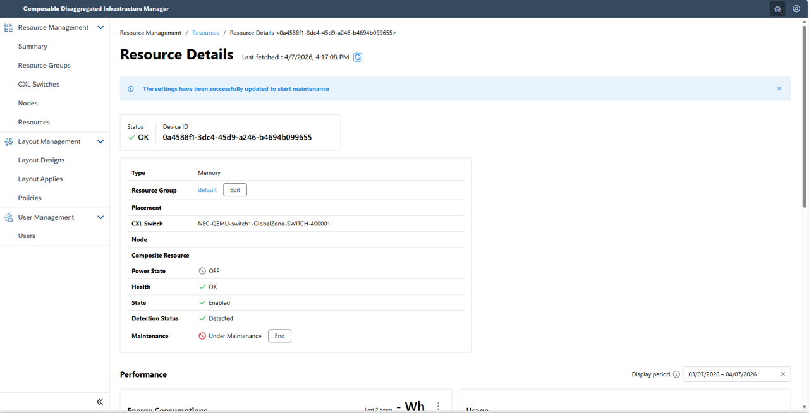

- **Re-enable an excluded (unavailable) resource**  
  On the resource details screen of an excluded resource, click "End" to end maintenance and make the resource available again (included in layout design and layout apply).
  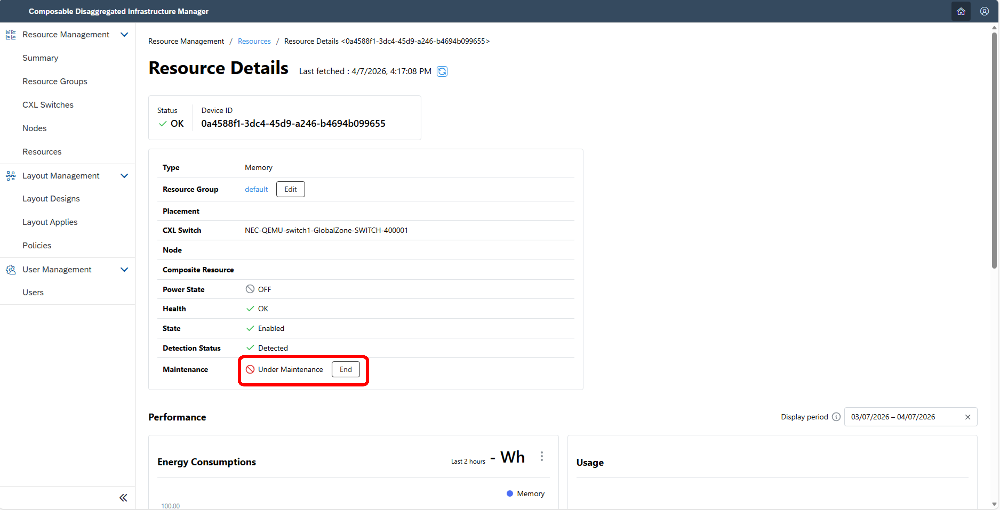
  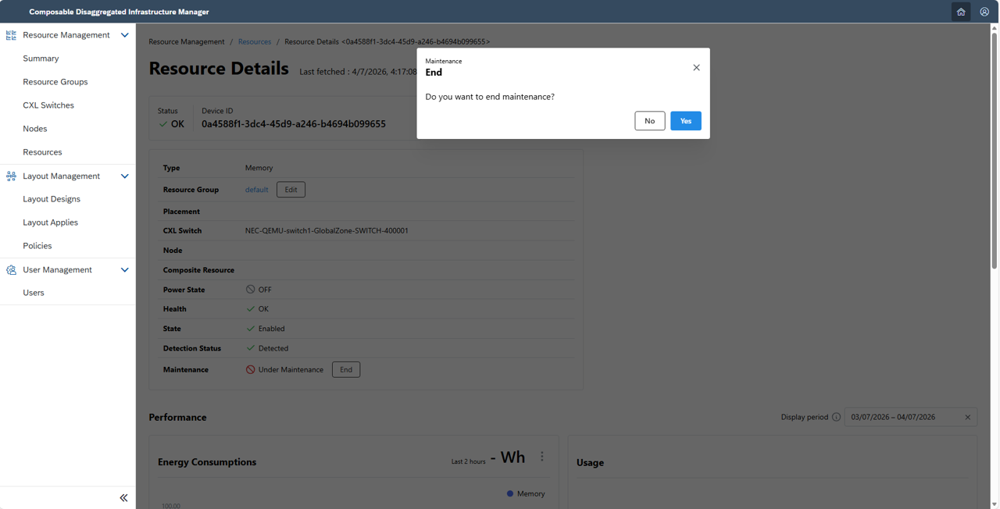
  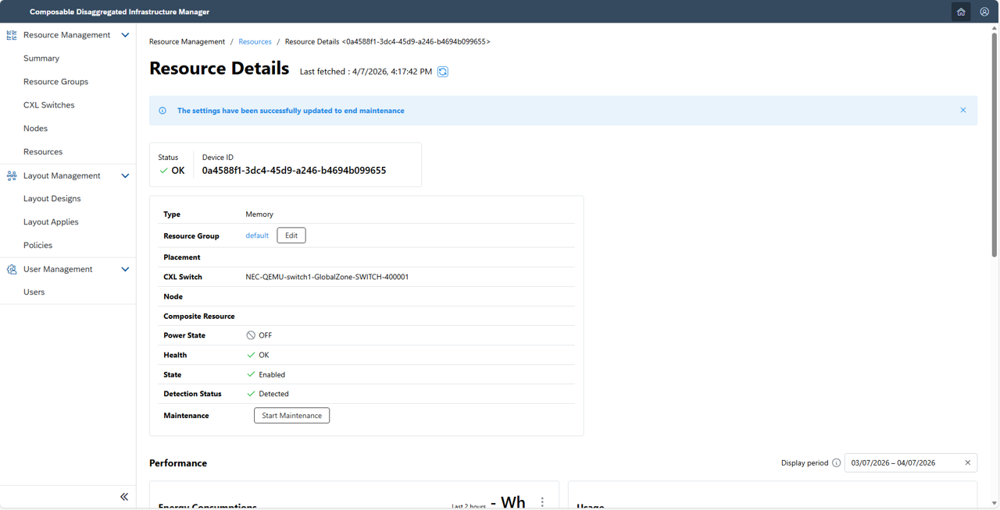

##### 1.7. Check the List of Layout Designs
Select **Layout Designs** from the left-side menu to open the Layout Design List screen.  
On this screen, you can check the list of executed layout designs. Details of layout design are described in the next section.

Example screen:
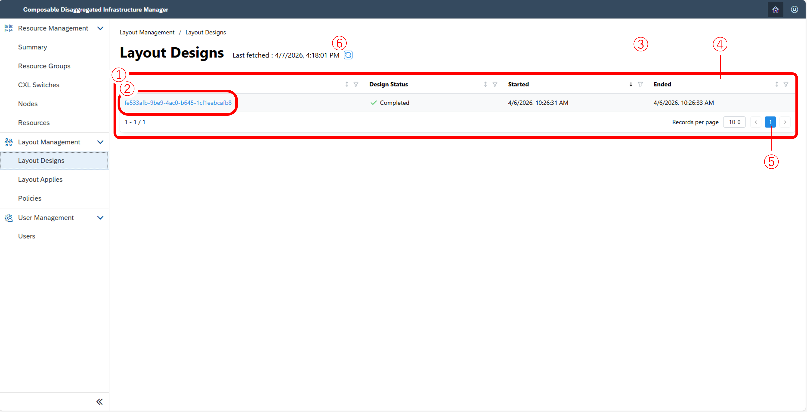

Items you can check on this screen are as follows:

| Number | Name | Description |
|:--:|--|--|
| 1 | Layout Designs | Check the layout design history. Columns include (from left): Design ID, design status, start time, and end time. If no information exists, the field is blank. |
| 2 | Layout Design Details | Click a Design ID to navigate to the Layout Design Details screen. |
| 3 | Filter | You can set filters for each column. |
| 4 | Ascending/Descending Order | Click a column header to sort in ascending/descending order. |
| 5 | Page Number | Change the number of entries displayed per page. |
| 6 | Reload | Use this to refresh information immediately. |

##### 1.8. Check the Details of Layout Designs
Click a Design ID on the Layout Design List screen to open the Layout Design Details screen.  
On this screen, you can check the design status and the designed layout (node composition) produced by the layout design.

Example screens:
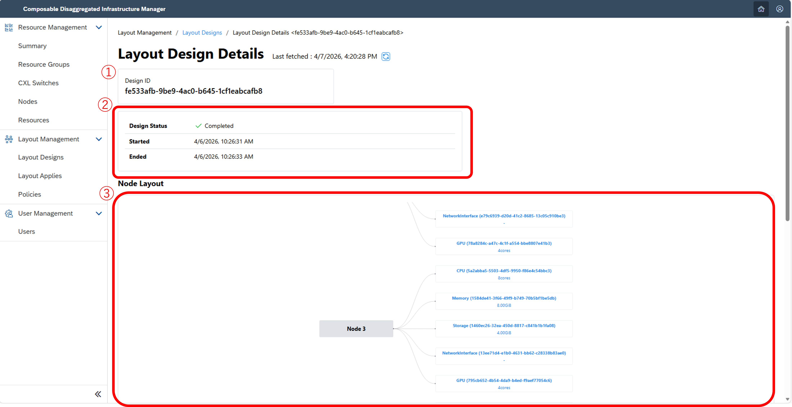
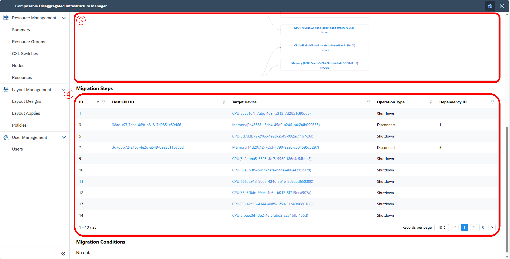

Items you can check on this screen are as follows:

| Number | Name | Description |
|:--:|--|--|
| 1 | Layout Design ID | Check the Design ID. See the list below for the meaning of each design status. |
| 2 | Layout Design Status | Check the status, start time, end time, and other details of layout design. |
| 3 | Node Composition | Check the node composition designed by layout design. You can drag within the frame to view the whole composition, and zoom in/out by scrolling. |
| 4 | Migration Steps | Check the detailed procedure for layout apply created by the layout design. |

**Layout Design State List**
- **Completed**: Displayed when the design completes successfully.
- **In_progress**: Displayed while the design is running.
- **Failed**: Displayed when the design finishes with errors.
- **Canceling, Canceled**: Displayed when the design is being or has been canceled.

##### 1.9. Check the List of Layout Applies
Select "Layout Applies" from the left-side menu to access the Layout Applies screen. Here, you can view the list of previously executed layout applies. Detailed explanations of these applications will appear in the upcoming sections.
The screen example is displayed below:

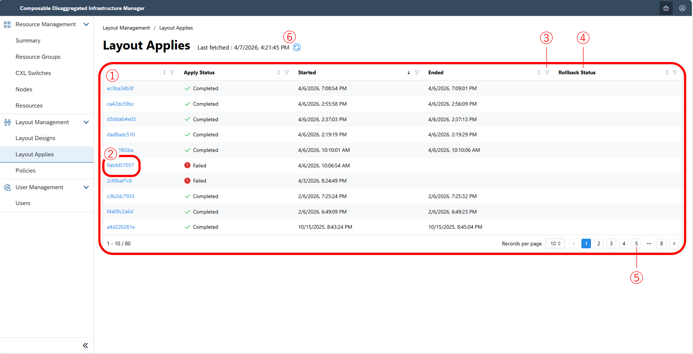

The screen details are as follows:
| Number | Name | Description |
|:------|:------|:------|
| 1 | Layout Applies | Review past Layout Applies, displaying Apply ID, apply status, start and end times, and rollback status. If no data is available, none will be shown. |
| 2 | Layout Apply Details | Access more details by clicking an Apply ID. |
| 3 | Filter | Set filters for sorting data in each column. |
| 4 | Ascending/Descending Order | Sort items either in ascending or descending order by clicking on the desired column. |
| 5 | Page Number | Modify the number of entries displayed per page. |
| 6 | Reload | Update the information instantly. |

##### 1.10. Operate and Check the Details of Layout Applies
Click the Apply ID on the layout applies screen to proceed to the detailed layout apply screen. From here, you can review the status of the apply and explore the executed steps. Options for cancelling or rolling back ongoing applies are also available.
The screen example is shown here:

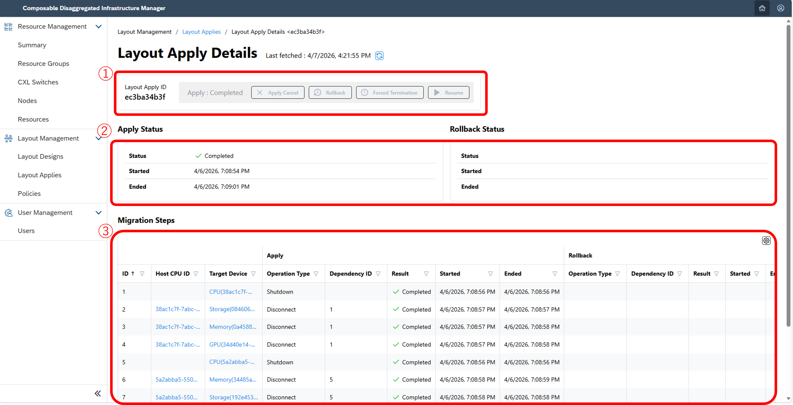

The screen details are as follows:
| Number | Name | Description |
|:------|:------|:------|
| 1 | Layout Apply Operation | Review the Apply ID and the status of this application, with detailed state descriptions provided below. |
| 2 | Layout Apply Status | Track the status, including start and end times of the application. |
| 3 | Migration Steps | Investigate the detailed steps undertaken during the application. Error messages can be reviewed if the application was unsuccessful. |

**Layout Apply State List**
- **Completed**: Indicated when the application has successfully concluded.
- **In_progress**: Shown while the application is ongoing.
- **Failed**: Shows when the application concludes with errors.
- **Suspended**: Indicates a temporary halt due to issues during the application.
- **Canceling, Canceled**: Shows when the application is being or has been canceled.

The following actions are possible:
- **Execute Cancel and Rollback**  
  Allows cancellation or rollback of an active application.
  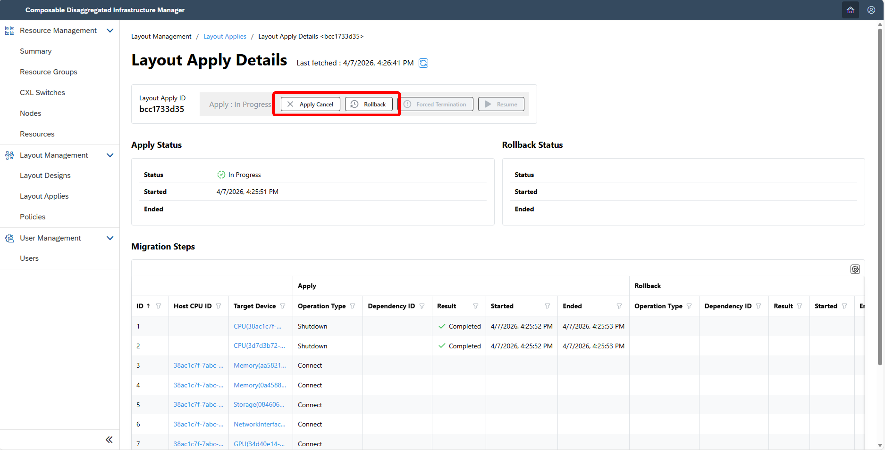
  
- **Execute Force Stop and Resume**  
  Allows resumption or stopping of applications that are suspended. Errors leading to suspension can be identified through displayed messages.
  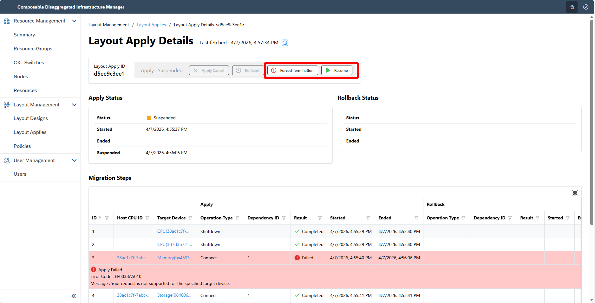

##### 1.11. Notes
- **Notes for the Current Version (v0.2.0)**  
  The following features remain unsupported in the current version (v0.2.0):
  - **Displaying Resource Usage Rates**: 
    - The interface continuously shows "No data" regarding resource usage rates.

- **Notes When Using an Emulator**  
  Using emulators involves dummy data for:
  - Resource power consumption (dummy data for GPU power consumption is not output)
  - Resource health status
  - Resource state status

  To adjust display settings in an emulator, refer to [Emulator Operation Details](../appendix/emulator/README.md).

- **Notes when using the sample design engine**  
  See the [Sample Design Engine Plugin](https://github.com/project-cdim/sample-design-engine-plugin).

[Next: 2.1 Configuration Changes by Manual Configuration Definition](../layout-manual/README.md)
