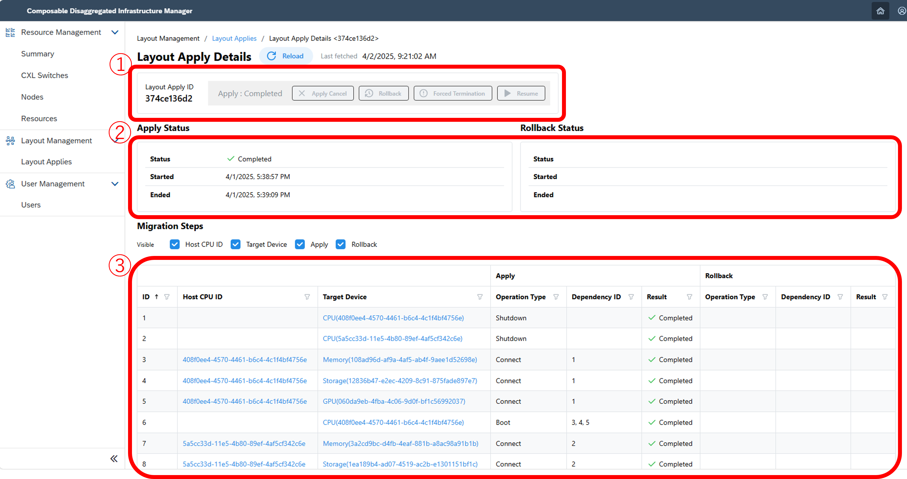

#### 1. Check Hardware Configuration and Information <!-- omit in toc -->
This section explains how to check hardware configuration and information from the Composable Disaggregated Infrastructure Manager (CDIM) screen.

> [!NOTE] 
> The screen examples shown below include red frames and numbers for explanation purposes, but these will not be displayed in the actual interface.

> [!NOTE] 
> In terms of hardware, there are two expressions: "device" and "resource." A device refers to individual physical hardware components such as CPUs, memory, and storage that make up the Composable Disaggregated Infrastructure (CDI). A resource, on the other hand, refers to the physical hardware within a device that serves as a "node component."

> [!WARNING]
> There are important notes regarding the usage rates of each resource.
> Please refer to the [Notes](#9-notes) for details.

> [!WARNING]
> There are important notes when the control target is an emulator.
> Please refer to the [Notes](#9-notes) for details.

##### 1. Overview of Hardware Configuration and Information
From the dashboard displayed on the home screen, you can check the number of configured nodes and resources, the number of nodes and resources with issues, and the number of resources used by nodes.

The screen example is as follows:

The screen details are as follows:
| Number | Name | Description |
|:--|:--|:--|
| 1 | Node Information | Check the number of configured nodes from Total Nodes. If Critical Nodes and Warning Nodes are 0, all nodes are normal. |
| 2 | Resource Information | Check the number of resources in the environment from Total Resources. If Critical Resources and Warning Resources are 0, all resources are normal. |
| 3 | Resource Usage | Check the number of resources in use. |
| 4 | Configuration Application Status | Check the number of pending configuration applications. If it is 0, there is no problem. |
| 5 | Power Consumption Status | Check the power consumption over a year. It takes about an hour for the graph to be displayed when updating performance information for the first time due to data accumulation. |

The actions you can perform are as follows:
- Return to Home  
  You can move to the home screen by selecting the home button or the CDIM title.
  

 

- Log Out  
  You can log out by selecting the user button.
  
  

 

##### 2. Check Power Consumption and Resource Status by Resource Type
Select "Summary" from the menu on the left side of the screen to move to the summary screen. From the dashboard displayed on the summary screen, you can check the overall power consumption and resource status, as well as the power consumption and resource status for each resource type.
The screen example is as follows:

The screen details are as follows:
| Number | Name | Description |
|:--|:--|:--|
| 1 | Tab Function | You can check the performance status and resource status for each resource. |
| 2 | Performance Status | Check the current power consumption and usage rate. |
| 3 | Resource Status | Check the number of resources currently in use and whether there are any abnormalities in the resources being used. If Critical Resource and Warning Resource are 0, all resources are normal. |

 

##### 3. Check the List of Constructed Nodes
Select "Node List" from the menu on the left side of the screen to move to the node list screen. From the node list screen, you can check the node ID and the number of resources allocated to the node.
The screen example is as follows:

The screen details are as follows:
| Number | Name | Description |
|:--|:--|:--|
| 1 | Node List | Check the current node status. From the left, it displays the node ID, the number of resources allocated to the node, the number of unusable resources, the number of resources with warnings, the number of resources with alerts, and the IDs of excluded resources marked as unusable. |
| 2 | Node ID | You can move to the node details screen by clicking the node ID. |
| 3 | Filter | You can set filters for each item. |
| 4 | Ascending/Descending Order | You can display items in ascending or descending order by clicking the item you want to sort. |
| 5 | Page Number | You can change the number of nodes displayed per page. |
| 6 | Reload | Use this to update information immediately. |

 

##### 4. Check the Details of Constructed Nodes
Click the node ID on the node list screen to move to the node details screen. From the node details screen, you can check the node's specifications, power consumption, and resources allocated to the node.
The screen example is as follows:

The screen details are as follows:
| Number | Name | Description |
|:--|:--|:--|
| 1 | Node ID | The ID assigned to the node. Typically, the device ID of the CPU is used. |
| 2 | Resource Status | Check the number of resources currently in use and whether there are any abnormalities in the resources being used. If Critical Resource and Warning Resource are 0, all resources are normal. |
| 3 | Resource Characteristics | Check the specifications allocated to this node. |
| 4 | Performance Status | Check the current power consumption and usage rate. |
| 5 | Resource Allocation Status | Check the list of resources allocated to this node. |

 

##### 5. Check the List of Registered Resources
Select "Resource List" from the menu on the left side of the screen to move to the resource list screen. From the resource list screen, you can check the types of registered resources and their status.
The screen example is as follows:

| Number | Name | Description |
|:--|:--|:--|
| 1 | Resource List | Check the current node status. From the left, it displays the device ID, resource type, resource health status, resource availability, CXL switch information, node ID where this resource is used, and the status of excluded resources marked as unusable. If there is no information, nothing is displayed. |
| 2 | Device ID | You can move to the resource details screen by clicking the device ID. |
| 3 | Filter | You can set filters for each item. |
| 4 | Ascending/Descending Order | You can display items in ascending or descending order by clicking the item you want to sort. |
| 5 | Page Number | You can change the number of resources displayed per page. |
| 6 | Reload | Use this to update information immediately. |

 

##### 6. Check the Details of Registered Resources
Click the device ID on the resource list screen or node details screen to move to the resource details screen. From the resource details screen, you can exclude resources from design or check detailed information about the resources.
The screen example is as follows:

The screen details are as follows:
| Number | Name | Description |
|:--|:--|:--|
| 1 | Device ID | The ID assigned to each resource. It is automatically assigned at initial startup or when resources are added. |
| 2 | Resource Status | Check the type and status of the resource. If Health is OK and state is enable, the resource is normal. |
| 3 | Performance Status | Check the current power consumption and usage rate. |
| 4 | Detailed Information | Check detailed information that can be obtained for each resource. |

The actions you can perform are as follows:
- Exclude Unused Resources  
  Move to the resource details screen of unused resources and select the resource exclusion button to exclude resources.
  
  
  

 

- Re-enable Excluded Resources  
  Move to the resource details screen of excluded resources and select the resource enable button to re-enable resources.
  
  
  

 

##### 7. Check the List of Configuration Application Status
Select "Configuration Application List" from the menu on the left side of the screen to move to the configuration application list screen. From the configuration application list screen, you can check the list of configuration applications that have been executed so far. The details of the configuration application are explained in the next chapter.
The screen example is as follows:

The screen details are as follows:
| Number | Name | Description |
|:--|:--|:--|
| 1 | Configuration Application List | Check the configuration application status so far. From the left, it displays the Apply ID, configuration application status, start date and time of the configuration application, end date and time of the configuration application, and rollback status. If there is no information, nothing is displayed. |
| 2 | Configuration Application Details | You can move to the configuration application details screen by clicking the Apply ID. |
| 3 | Filter | You can set filters for each item. |
| 4 | Ascending/Descending Order | You can display items in ascending or descending order by clicking the item you want to sort. |
| 5 | Page Number | You can change the number of resources displayed per page. |
| 6 | Reload | Use this to update information immediately. |

 

##### 8. Operate and Check the Details of Configuration Application Status
Click the Apply ID on the configuration application list screen to move to the configuration application details screen. From the configuration application details screen, you can check the configuration application status and the steps executed in the configuration application. You can also perform operations such as canceling or rolling back an ongoing configuration application.
The screen example is as follows:

The screen details are as follows:
| Number | Name | Description |
|:--|:--|:--|
| 1 | Configuration Application Operation | Check the Apply ID and the status of this configuration application. Refer to the list below for configuration application states. |
| 2 | Configuration Application Status | Check the status and start and end date and time of the configuration application. |
| 3 | Migration Steps | Check the detailed steps of this configuration application. The steps are displayed when the configuration application is completed, and error messages are checked when the configuration application does not go well. |

Configuration Application State List
- Complete: Displayed when the configuration application is completed successfully
- In_progress: Displayed while the configuration application is being executed
- Failed: Displayed when the configuration application is completed with errors
- Suspended: Displayed when there is a problem during configuration application and it is temporarily suspended
- Canceling, Canceled: Displayed when the configuration application is canceled

The actions you can perform are as follows:
- Execute Cancel and Rollback  
  You can execute cancel or rollback if the configuration application is in progress.
  
  
 

- Execute Force Stop and Resume  
  You can execute resume or force stop if the configuration result is Suspended. You can also understand the cause of failure from the error message.
  

##### 9. Notes
- Notes for the Current Version (v0.1.0)  
  The following features are not supported in the current version (v0.1.0).
  - Displaying resource usage rates
    - In the current version (v0.1.0), the display does not change and shows "No data".

- Notes When Using an Emulator  
  When using an emulator, dummy data is used for the following items. If you want to change the display content of the emulator, refer to [Emulator Operation Details](../appendix/emulator/README.md).
  - Resource power consumption
  - Resource health status
  - Resource state status

[Next 2. Configuration Changes](../layout/README.md)
