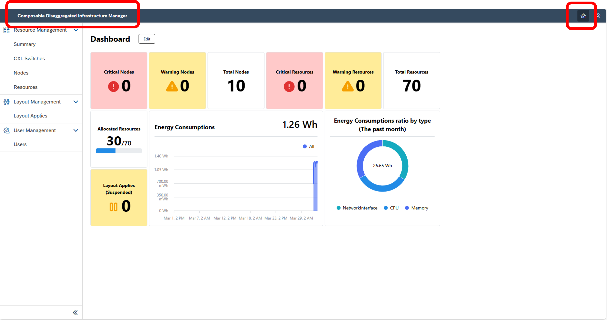
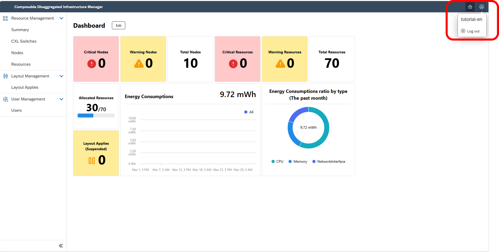
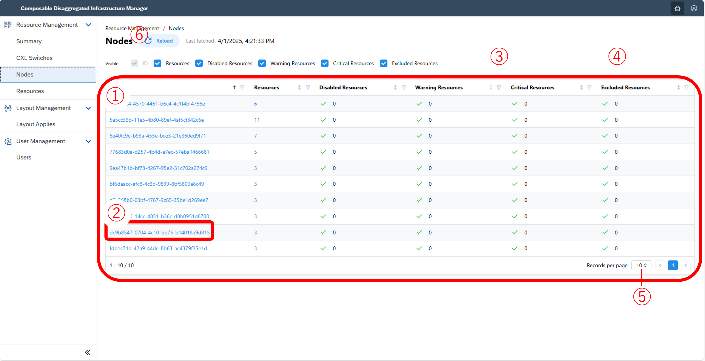
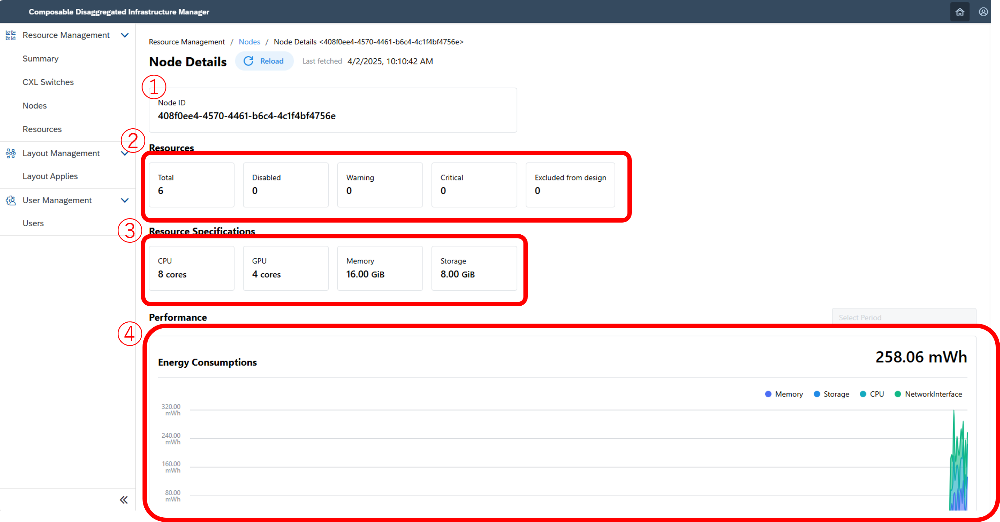
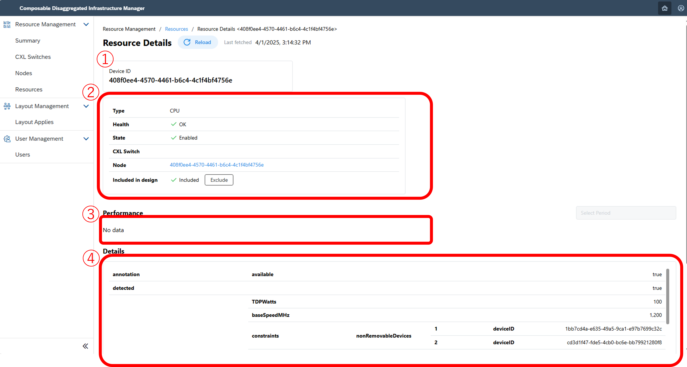

#### 1. Check Hardware Configuration and Information <!-- omit in toc -->
This section explains how to check hardware configuration and information from the Composable Disaggregated Infrastructure Manager (CDIM) interface.

> [!NOTE] 
> The illustrations below include red frames and numbers for explanatory purposes, these will not appear in the actual interface.

> [!NOTE] 
> In the context of this tutorial, the term "device" refers to individual physical hardware components like CPUs, memory, and storage that constitute the Composable Disaggregated Infrastructure (CDI). The term "resource" denotes physical hardware within a device serving as a "node component."

> [!WARNING]
> Note important considerations regarding the usage rates of each resource.
> Refer to the [Notes](#19-notes) for details.

> [!WARNING]
> Note important considerations when the control target is an emulator.
> Refer to the [Notes](#19-notes) for further details.

- [1.1. Overview of Hardware Configuration and Information](#11-overview-of-hardware-configuration-and-information)
- [1.2. Check power consumption and resource status by resource type](#12-check-power-consumption-and-resource-status-by-resource-type)
- [1.3. Check the list of constructed nodes](#13-check-the-list-of-constructed-nodes)
- [1.4. Check the details of constructed nodes](#14-check-the-details-of-constructed-nodes)
- [1.5. Check the list of registered resources](#15-check-the-list-of-registered-resources)
- [1.6. Check the details of registered resources](#16-check-the-details-of-registered-resources)
- [1.7. Check the list of configuration application status](#17-check-the-list-of-configuration-application-status)
- [1.8. Operate and check the details of configuration application status](#18-operate-and-check-the-details-of-configuration-application-status)
- [1.9. Notes](#19-notes)

##### 1.1. Overview of Hardware Configuration and Information
From the dashboard on the home screen, you can observe the number of configured nodes and resources, the count of nodes and resources with issues, and the quantity of resources utilized by nodes.

Here is a screen example:  

Details of the screen are as follows:
| Number | Name             | Description |
|:------:|------------------|-------------|
|   1    | Node Information | View total nodes and check for critical or warning statuses; if none, all nodes are normal. |
|   2    | Resource Information | View total resources and check for critical or warning statuses; if none, all resources are normal. |
|   3    | Resource Usage | View the count of resources in use. |
|   4    | Configuration Application Status | View pending applications; if zero, there are no issues. |
|   5    | Power Consumption Status | Observe power consumption over a month. Display of graph may take about an hour upon first performance information update due to data accumulation. |

Actions you can perform are as follows:
- **Return to Home**  
  Navigate to the home screen by selecting the home button or the CDIM title.
  

- **Log Out**  
  After selecting the user button, you can log out by pressing the logout button.
  
  

##### 1.2. Check Power Consumption and Resource Status by Resource Type
Select "Summary" from the left-side menu to view the summary screen. The dashboard displayed there shows overall and per-resource-type power consumption and resource status.

Example screens:  

Details of the screen:
| Number | Name             | Description |
|:------:|------------------|-------------|
|   1    | Tab Function     | Access performance and resource status for individual resources. |
|   2    | Performance Status | Observe current power consumption and usage rate. |
|   3    | Resource Status   | Monitor the count and condition of currently utilized resources; if resources display no critical or warning alerts, all are considered normal. |

##### 1.3. Check the List of Constructed Nodes
Navigate to "Node List" via the left-side menu. This screen allows you to check node IDs and the resources allocated to each node.

Example screen:  

Details of the screen:
| Number | Name          | Description |
|:------:|---------------|-------------|
|   1    | Node List     | View current status of nodes, including node ID, resources allocated, unusable resources, resources with warnings or alerts, and number of resources excluded as unusable. You can move to the node details screen by clicking the node ID. |
|   2    | Node ID       | Clicking the node ID directs to the node details screen. |
|   3    | Filter        | Apply filters per column. |
|   4    | Ascending/Descending Order | Sort columns in ascending or descending order. |
|   5    | Page Number   | Adjust the displayed nodes per page. |
|   6    | Reload        | Refresh information on demand. |

##### 1.4. Check the Details of Constructed Nodes
By clicking a node ID on the node list screen, you transition to the node details screen where you can review the node's specifications, power consumption, and resources allocated to it.

Example screens:  

Details of the screen:
| Number | Name                 | Description |
|:------:|----------------------|-------------|
|   1    | Node ID              | Node's assigned ID, usually the device ID of the CPU. |
|   2    | Resource Status      | Monitor the count and condition of resources in use; if resources display no critical or warning alerts, all are considered normal. |
|   3    | Resource Characteristics | Review specifications allocated to this node. |
|   4    | Performance Status   | Observe current power consumption and usage rate. |
|   5    | Resource Allocation Status | View a list of resources allocated to this node. |

##### 1.5. Check the List of Registered Resources
Navigate to "Resource List" via the left-side menu. You can identify the types of registered resources and their statuses on this screen.

Example screen:  

| Number | Name               | Description |
|:------:|--------------------|-------------|
|   1    | Resource List      | View current resource status, including the device ID, resource type, resource health status, availability, CXL switch information, and node ID using this resource, along with any excluded resource statuses. Absence of data will display nothing. |
|   2    | Device ID          | Detailed resource screen accessible by clicking the device ID. |
|   3    | Filter             | Apply filters per column. |
|   4    | Ascending/Descending Order | Sort columns in ascending or descending order. |
|   5    | Page Number        | Adjust the number of displayed resources per page. |
|   6    | Reload             | Refresh information on demand. |

##### 1.6. Check the Details of Registered Resources
Click on the device ID either from the resource list screen or the node details screen to navigate to the resource details screen. This page allows you to exclude resources from configurations or inspect detailed information about the resources.
The screen example is as follows:

The screen details are as follows:
| Number | Name | Description |
|:------|:------|:------|
| 1 | Device ID | The ID assigned to each resource, automatically determined at initial startup or when adding new resources. |
| 2 | Resource Status | Review the type and status of the resource. A status of 'OK' in Health and 'enable' indicates the resource is operating normally. |
| 3 | Performance Status | Monitor the current power consumption and usage rate. |
| 4 | Detailed Information | Access in-depth information available for each resource. |

The actions you can undertake include:
- **Exclude Unused Resources**  
  Navigate to the details screen of unused resources and select the exclusion button to remove resources.
  
  
  

- **Re-enable Excluded Resources**  
  Go to the details screen of excluded resources and select the enable button to reactivate resources.
  
  
  

##### 1.7. Check the List of Configuration Application Status
Select "Configuration Application List" from the left-side menu to access the configuration application list screen. Here, you can view the list of previous configuration applications. Detailed explanations of these applications will appear in the upcoming sections.
The screen example is displayed below:

The screen details are as follows:
| Number | Name | Description |
|:------|:------|:------|
| 1 | Configuration Application List | Review past configuration applications, displaying Apply ID, application status, start and end times, and rollback status. If no data is available, none will be shown. |
| 2 | Configuration Application Details | Access more details by clicking an Apply ID. |
| 3 | Filter | Set filters for sorting data in each column. |
| 4 | Ascending/Descending Order | Sort items either in ascending or descending order by clicking on the desired column. |
| 5 | Page Number | Modify the number of entries displayed per page. |
| 6 | Reload | Update the information instantly. |

##### 1.8. Operate and Check the Details of Configuration Application Status
Click the Apply ID on the configuration application list screen to proceed to the detailed configuration application status screen. From here, you can review the status of the application and explore the executed steps. Options for cancelling or rolling back ongoing applications are also available.
The screen example is shown here:

The screen details are as follows:
| Number | Name | Description |
|:------|:------|:------|
| 1 | Configuration Application Operation | Review the Apply ID and the status of this application, with detailed state descriptions provided below. |
| 2 | Configuration Application Status | Track the status, including start and end times of the application. |
| 3 | Migration Steps | Investigate the detailed steps undertaken during the application. Error messages can be reviewed if the application was unsuccessful. |

**Configuration Application State List**
- **Complete**: Indicated when the application has successfully concluded.
- **In_progress**: Shown while the application is ongoing.
- **Failed**: Shows when the application concludes with errors.
- **Suspended**: Indicates a temporary halt due to issues during the application.
- **Canceling, Canceled**: Shows when the application is being or has been canceled.

The following actions are possible:
- **Execute Cancel and Rollback**  
  Allows cancellation or rollback of an active application.
  
  
- **Execute Force Stop and Resume**  
  Allows resumption or stopping of applications that are suspended. Errors leading to suspension can be identified through displayed messages.
  

##### 1.9. Notes
- **Notes for the Current Version (v0.1.0)**  
  The following features remain unsupported in the current version (v0.1.0):
  - **Displaying Resource Usage Rates**: 
    - The interface continuously shows "No data" regarding resource usage rates.

- **Notes When Using an Emulator**  
  Using emulators involves dummy data for:
  - Resource power consumption
  - Resource health status
  - Resource state status

  To adjust display settings in an emulator, refer to [Emulator Operation Details](../appendix/emulator/README.md).

[Next: 2. Configuration Changes](../layout/README.md)
