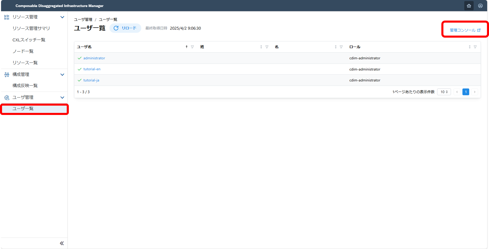

### 3. 各種設定 <!-- omit in toc -->
ここでは、Composable Disaggregated Infrastructure Manager(略称:CDIM)の各種設定方法について説明します。

- [3.1. ログを確認する・出力方法を変更する](#31-ログを確認する出力方法を変更する)
  - [3.1.1. ログの確認](#311-ログの確認)
  - [3.1.2. ログの出力方法を変更する](#312-ログの出力方法を変更する)
- [3.2. 情報収集の設定を変更する](#32-情報収集の設定を変更する)
- [3.3. 利用者の認証方法,権限を変更する](#33-利用者の認証方法権限を変更する)
  - [3.3.1. ユーザーを追加する](#331-ユーザーを追加する)
  - [3.3.2. CDIMにおけるユーザーの権限を変更する](#332-cdimにおけるユーザーの権限を変更する)
  - [3.3.3. ユーザーの認証方法を登録・変更する](#333-ユーザーの認証方法を登録変更する)
    - [3.3.3.1. パスワード認証の設定方法](#3331-パスワード認証の設定方法)

#### 3.1. ログを確認する・出力方法を変更する 
##### 3.1.1. ログの確認
ログの出力先は、デフォルトでは下の場所になります。
コンテナ内に出力されますので、保存には注意してください。
```sh
$ docker exec -it <コンテナ名> /bin/sh
$ ls /var/log/cdim
```
またコンポーネントごとに、ログ出力ファイルが以下のように分かれています。

|ログの種類|ログファイル名|
|:--|:--|
|証跡ログ|trail.log|
|アプリケーションログ (ハードウェア制御) |app_hw_control.log|
|アプリケーションログ (構成案反映) |app_layout_apply.log|
|アプリケーションログ (移行手順生成) |app_migration_procedures.log|
|アプリケーションログ (構成情報管理) |app_config_info.log|

##### 3.1.2. ログの出力方法を変更する
それぞれのコンポーネントの設定ファイルを変更してログ出力方法を変更します。
それぞれの設定ファイルは以下のとおりです。

|コンポーネント名|設定ファイル名|ファイルパス|
|:--|:--|:--|
|証跡ログ(性能情報収集)|main.go|performance-collector-compose/performance-collector/performance-collector|
|証跡ログ(性能情報収集エクスポーター)|main.go|performance-exporter-compose/performance-exporter/performance-exporter|
|証跡ログ(構成情報収集エクスポーター)|main.go|configuration-exporter-compose/configuration-exporter/configuration-exporter|
|証跡ログ(構成情報収集管理)|main.go|configuration-manager-compose/configuration-manager/configuration-manager|
|ハードウェア制御|setting.py|hw-control-compose/hw-control/src/app/common|
|構成案反映|layoutapply_config.yaml|layout-apply-compose/layout-apply/src/layoutapply/config|
|移行手順生成|migrationprocedures_config.yaml|migration-procedure-generator-compose/migration-procedure-generator/src/migrationproceduregenerator/config|
|性能情報収集|logger.go|performance-collector-compose/performance-collector/performance-collector/internal/service|
|性能情報収集エクスポーター|logger.go|performance-exporter-compose/performance-exporter/performance-exporter/internal/service|
|構成情報収集エクスポーター|controller_common.go|configuration-exporter-compose/configuration-exporter/configuration-exporter/controller|
|構成情報収集管理|gi_cm_applog.go|configuration-manager-compose/configuration-manager/configuration-manager/common|

ログ出力ファイルの設定項目は以下になります。
設定ファイルがgo形式のものはコード内に以下の項目を書き込んでください。
|設定項目|説明|
|:--|:--|
|tag|コンポーネントを表すタグ|
|log_dir|ログ出力ディレクトリ|
|log_file|ログファイル名|
|logging_level|ロギングレベル。設定レベル以上のログが出力されます|
|rotation_size|ログをローテーションする際のファイルサイズ(bytes)|
|backup_files|ローテーションにより保持するバックアップファイル数|
|stdout|true を指定すると標準出力にもログを出力します|

出力方法を変更した後は、そのコンポーネントを再起動する必要があります。
[この手順](../appendix/troubleshooting/README.md#4-特定のコンポーネントを再起動したい場合)に従って再起動してください。

> [!NOTE]
> logの出力ディレクトリを変更後、そのコンポーネントが動かない場合はディレクトリを作成する必要があります。その場合はそれぞれのDockerfileの中にて、ログの出力ディレクトリを作成していますので、それもあわせて変更してください。

#### 3.2. 情報収集の設定を変更する 
各コンポーネントの設定ファイルを変更することで、収集のインターバルなどの変更が可能です。

ジョブ管理 構成情報収集設定 : job-manager-compose/job-manager-setup/HW_configuration_information_data_linkage_job.yaml

```yaml
  schedule:    # 構成情報の取得インターバル
    dayofmonth:
      day: '*'
    month: '*'
    time:
      hour: '*'
      minute: '0/10'
      seconds: '0'
    year: '*'
  timeout: '600'  # 構成情報のタイムアウト値(s)
```

収集間隔を変更した後は、以下のコマンドで設定を反映する必要があります。  

```sh
$ curl -X POST 'http://localhost:8288/api/14/project/CDIM/jobs/import?fileformat=yaml&dupeOption=update' -H "X-Rundeck-Auth-Token:$(cut -d' ' -f2 ../share/token/tokens.properties | cut -d',' -f1)" -H "Content-Type: application/yaml" --data-binary '@HW_configuration_information_data_linkage_job.yaml'
```

性能情報収集 : performance-collector-compose/share/prometheus.yml

```yaml
global:
    evaluation_interval: 180s  # 性能情報の取得インターバル(s)
    scrape_interval: 180s      # 性能情報のタイムアウト値(s)
```

性能情報収集については、情報収集を再実行する必要があります。
```sh
$ docker exec -it performance-collector /bin/sh
$ curl -i -s -X PUT http://localhost:8080/cdim/api/v1/configs
```

#### 3.3. 利用者の認証方法,権限を変更する
> [!NOTE]
> 認証にはKeycloakを用いています。  
> 詳細は[公式ドキュメント(日本語版)](https://keycloak-documentation.openstandia.jp/)を参照ください。

##### 3.3.1. ユーザーを追加する

1. CDIMユーザー管理用のKeycloakのマスターURLにアクセスし、ログインする
   - user管理画面から操作する場合  
  
    cdim-manage-userの権限を持ったアカウント(Administratorなど)でログインし、ユーザー管理/ユーザー一覧を押します。

    右上の「管理コンソール」を押し、ログインします。
    

   - Keycloak管理URLから操作する場合
  
    [getting started](../../../getting-started/ja/setup/setup.md#2-フロントエンド)のとおりに操作し、直接Keycloakの管理画面にログインします。  
    ログインした後に、左上のドロップダウンリストをKeycloakからCDIMに変更することで、CDIMの管理画面に切り替わります。

> [!NOTE]
> user管理画面からログインした場合、We are sorryの画面が出てくることがありますが、問題ありません。  
> 「Back to Application」を押すことでCDIMの管理URLに接続可能になります。

> [!NOTE] 
> また、cdim-administratorのロールを持たないユーザーはユーザー管理画面に遷移できますが、ユーザー追加などの変更はできません。  

1. Usersからユーザー追加する  
    画面左のメニューにあるUsersを押下し、「ユーザーの追加」ボタンを押します。
    
    localeを「English/Japanese」のいずれかから選択し、ユーザー名を入力します。
    
    その他必要な項目を入力した後、「作成」ボタンを押し、ユーザーを作成します。
    <br>

2. ユーザーを削除する  
   削除したいユーザーを選択し、「ユーザーの削除」を押します。
   
   

##### 3.3.2. CDIMにおけるユーザーの権限を変更する
- ユーザーの権限を追加する
  1. 作製したユーザーの詳細画面を開く  
     ユーザー管理用のURLにアクセスし、CDIM管理画面に切り替えます。  
     画面左のUsersを押し、権限を変更したいユーザーの詳細画面を開きます。  
     
     <br>
  2. 「Role mapping」から権限を変更する  
     * 権限を追加する場合  
     画面上部のタブから「Role mapping」を選択し、「Assign role」ボタンを押します。
       
     画面左上のフィルターを「Filter by realm roles」に変更します。
       
     追加したい権限をチェックし、Assignを押します。
     
     ロールを追加後、ログインし直すことで設定が適用されます。

   <details>
   <summary> CDIMの権限の詳細情報 </summary>
   左上のフィルターが「filter by realm roles」の場合に選択可能です。

   - ユーザー用ロール
  
   |役割|名前|説明|
   |:--|:--|:--|
   |Guest|cdim-viewer|CDIMの全メニューの閲覧が可能。cdim-view-layout、cdim-view-resource、cdim-view-userをまとめた複合ロール|
   |DC Operator|cdim-operator|CDIMの全メニューの操作が可能。cdim-viewerの権限に加えて、cdim-manage-layout、cdim-manage-resourceをまとめた複合ロール|
   |DC Administrator|cdim-administrator|CDIMの全権限が操作可能。cdim-operatorの権限に加えて、cdim-manage-userの権限が付与された複合ロール|
   
   </details>

- 権限を解除する  
   「Role mapping」の画面で、削除したい権限にチェックを入れ、Unassignボタンを押します。
   

##### 3.3.3. ユーザーの認証方法を登録・変更する
###### 3.3.3.1. パスワード認証の設定方法

1. ユーザーへのパスワードの割り当て  
   cdim-administratorの権限を持ったアカウントで、ユーザー管理/ユーザー一覧を押し、右上の「管理コンソール」を押します。  
   画面左メニューのユーザーを選択し、パスワード認証を登録したいユーザーの詳細画面を開きます。  
   「クレデンシャル」タブを選択し、「パスワードを設定」を押します。パスワードを入力し終わったら「Save」ボタンを押します。
   
     

   > [!TIP]
   > ユーザーにアカウントを払い出す場合は「一時的」をONにします。  
   > この場合、ユーザーが初回ログインした際に新しいパスワードの設定をして貰う形となります。

   CDIMのURLにアクセスし、パスワード認証でログインします。

2. パスワードポリシーの設定方法  
   REALM管理用のアカウントでユーザー管理URLにログインします。
   「認証」を押し、「ポリシー」のタブをを選択します。
   
   
   パスワードポリシー欄にある「Add policy」を選択し、追加したいパスワードポリシーを選択します。
   

<!--
###### 3.3.3.2. OTP(One Time Password)認証方法

KeycloakのマスターURLにログインし、左上のドロップダウンリストをKeycloakからCDIMに変更します。
「Authentication」メニューを選択し、認証方法を変更したいFlowを選択します。
「Add step」からOTP認証のFlowである「OTP Form」を選択し、Flowの好きなタイミングに入れる。
Flowを決めた後に、「Authentication」メニューに戻り、上のタブでPolicies/OTP Policyの順に選択します。
OTP認証の詳細動作を設定したのち、「Save」を押し設定を終える。

CDIMにアクセスし、OTP認証でログインします。

###### 3.3.3.3. シングルサインオン認証方法
-->

[Next 4. Appendix](../appendix/README.md)
