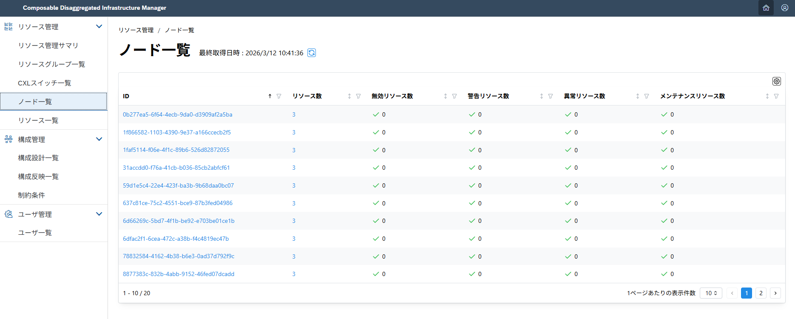
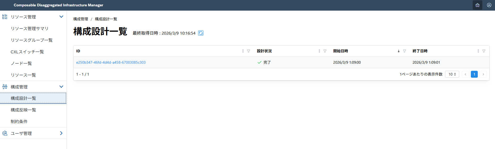
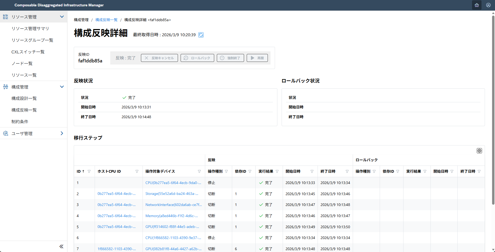
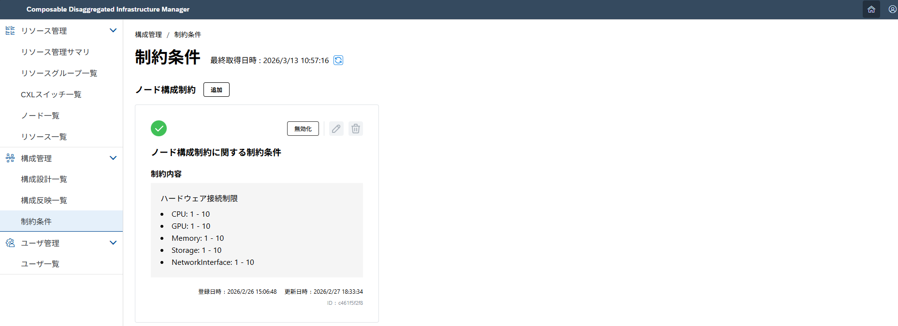
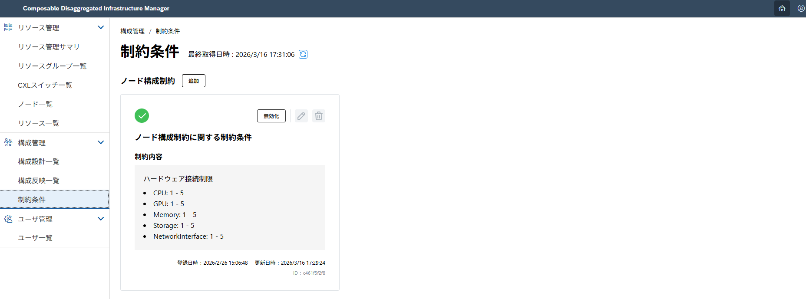
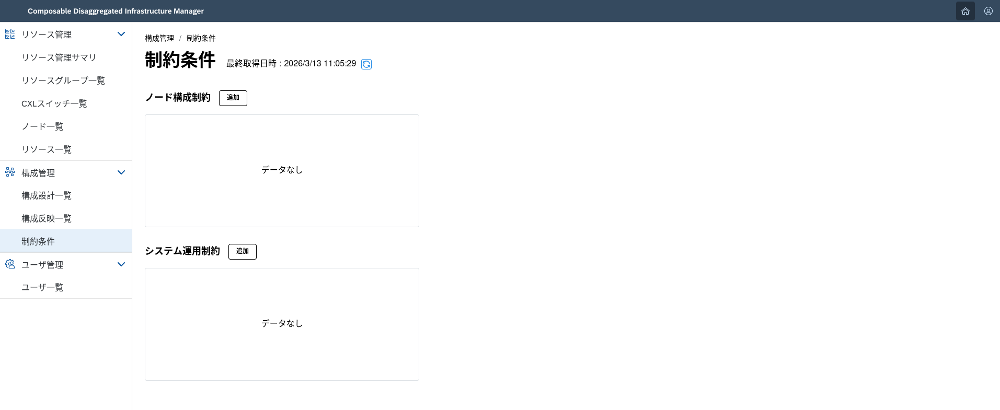

## 2.2. 設計機構による構成変更 <!-- omit in toc -->

ここでは、Composable Disaggregated Infrastructure Manager(略称:CDIM) を用いた構成変更のうち、設計機構による構成変更について説明します。

設計機構および構成案設計の機能を使用することで、サービスが稼働するために必要なノードの構成案とノード移行に必要な手順を自動で作成できます。  
サービスとは、Composable Disaggregated Infrastructure (CDI)上で稼働するアプリケーションやソフトウェアを指します。  
設計機構および構成案設計を使用して作成された移行手順を構成案反映のAPIに入力することで、ノードの作成/変更ができます。

<br>

- [2.2.1. 構成案設計と設計機構について](#221-構成案設計と設計機構について)
- [2.2.2. ノードの新規作成・変更追加・削除](#222-ノードの新規作成変更追加削除)
  - [2.2.2.1. 入力データを用意する](#2221-入力データを用意する)
  - [2.2.2.2. 実行する](#2222-実行する)
- [2.2.3. 制約条件管理について](#223-制約条件管理について)
- [2.2.4. 制約条件の新規追加・更新・有効化・無効化・削除](#224-制約条件の新規追加更新有効化無効化削除)
  - [2.2.4.1. 制約条件の新規追加](#2241-制約条件の新規追加)
  - [2.2.4.2. 制約条件の有効化・無効化](#2242-制約条件の有効化無効化)
  - [2.2.4.3. 制約条件の更新](#2243-制約条件の更新)
  - [2.2.4.4. 制約条件の削除](#2244-制約条件の削除)
- [2.2.5. 構成変更機能の記述内容(サンプルファイル)](#225-構成変更機能の記述内容サンプルファイル)

[構成案設計API]: https://project-cdim.github.io/docs/api-reference/ja/layout-design-api/index.html
[構成案反映API]: https://project-cdim.github.io/docs/api-reference/ja/layout-apply-api/index.html
[制約条件管理API]: https://project-cdim.github.io/docs/api-reference/ja/policy-manager-api/index.html

### 2.2.1. 構成案設計と設計機構について

設計機構は、サービスが稼働するために必要なスペック情報から以下の情報を算出・管理する機能の総称です。
- サービスの定義情報やサービスが要求するリソースの性能情報から算出されたノードの構成案
- 実行時点の現ノード構成から作成されたノード構成案へ移行する際に許容されるノード負荷に関する条件
- 現ノード構成から作成されたノード構成案へ移行するための手順

構成案設計は、リソースの選定基準などが異なる複数の設計機構に対して統一的なインターフェースを提供する機能です。

設計機構プラグインは、構成案設計と設計機構の間に位置するコンポーネントです。
設計機構ごとに対応するプラグインを実装することで、構成案設計から柔軟に複数の設計機構との連携を行うことができます。

現時点ではすべての機能を持った設計機構は存在しないため、簡易的な設計機構および設計機構プラグインのサンプルプログラムを提供しています。
- [サンプルプラグイン/サンプル設計機構]()

また、設計機構プラグインの開発を行う際には以下のドキュメントを参考にしてください。
- [設計機構プラグイン開発ガイド]()

### 2.2.2. ノードの新規作成・変更追加・削除

希望のスペックにより構成案を設計し、設計した構成案から新規にノードを作成、変更追加、削除を行います。

本章の手順では、希望のスペックを入力データとして準備し、[構成案設計API][] と [構成案反映API][] を使用してノードを作成、変更追加、削除します。

ノードの新規作成、変更追加、削除は、入力データは異なりますが、操作手順に違いはありません。

#### 2.2.2.1. 入力データを用意する

希望のスペックを記載した入力データを用意します。

入力データは [構成案設計API][] の「構成案設計要求」に渡す入力データとなります。

```sh
$ mkdir test
$ vi test/template_layoutdesign.json
```

以下にノードの新規作成/変更追加/削除を行う場合の入力データの例を示します。  
入力データの例で動作させる際は、`services.instances.nodeID`の値を実際のノードIDの値に修正してください。  


入力データの詳細は、 [2.2.5. 構成変更機能の記述内容(サンプルファイル)](#225-構成変更機能の記述内容サンプルファイル)を参照してください。

<details>
<summary> 新規作成の場合：template_layoutdesign.json </summary>

以下の例はサービスIDが`a58ee3a7-62a0-46f3-ba80-f7080eaa0d1c`のサービスインスタンスを1件新規追加する場合の入力データ例です。

```json
{
    "requestID": "463e79c1-d138-4748-9018-5c1435a50d87",
    "noCondition": false,
    "partialDesign": false,
    "resourceGroupIDs": [
        "625d8951-50fb-41b3-a824-6c98438c4c52"
    ],
    "serviceSetRequestResources": [
        {
            "id": "6ea26bd4-ece0-4a9a-b042-3fa04361526e",
            "serviceSetID": "bbb02921-ee54-4b26-97d2-0fec1d987b12",
            "serviceSetName": "Web app chat services",
            "serviceRequestResources": [
                {
                    "id": "cbc896de-1df2-4aed-b71d-4aff38206ca3",
                    "serviceID": "a58ee3a7-62a0-46f3-ba80-f7080eaa0d1c",
                    "serviceName": "LLM agent",
                    "shareService": false,
                    "resource": {
                        "operatingSystem": "Redhat Enterprise 9.0",
                        "instances": [
                            {
                                "requestInstanceID": "1d40d2a9-979f-4956-aee7-30587de64fe9",
                                "serviceInstanceID": "5b4ea1a2-4130-4de8-9045-bc92709df778",
                                "redundant": false,
                                "changed": true,
                                "cpu": {
                                    "architecture": "x86",
                                    "coreNumber": 4,
                                    "operatingSpeedMHz": 3000
                                },
                                "memory": {
                                    "size": 8000,
                                    "operatingSpeedMHz": 3200
                                },
                                "storage": {
                                    "size": 250,
                                    "capableSpeedGbs": 12
                                },
                                "gpu": [
                                    {
                                        "architecture": "x86",
                                        "coreNumber": 2,
                                        "operatingSpeedMHz": 2400,
                                        "memorySize": 16000,
                                        "deviceCount": 1
                                    }
                                ],
                                "networkInterface": {
                                    "bitRate": 9600
                                }
                            }
                        ]
                    }
                }
            ]
        }
    ],
    "services": [
        {
            "id": "a58ee3a7-62a0-46f3-ba80-f7080eaa0d1c",
            "name": "LLM agent",
            "description": "LLM inference service for natural language tasks.",
            "owner": "NEC Corp.",
            "instances": []
        }
    ]
}
```
</details>

<details>
<summary> 変更追加の場合：template_layoutdesign.json </summary>

以下の例はサービスIDが`a58ee3a7-62a0-46f3-ba80-f7080eaa0d1c`のサービスインスタンスが稼働するノード`b477ea1c-db3d-48b3-9725-b0ce6e25ef01`を解体して再構築する場合の入力データ例です。

```json
{
    "requestID": "463e79c1-d138-4748-9018-5c1435a50d87",
    "noCondition": false,
    "partialDesign": false,
    "resourceGroupIDs": [
        "625d8951-50fb-41b3-a824-6c98438c4c52"
    ],
    "serviceSetRequestResources": [
        {
            "id": "6ea26bd4-ece0-4a9a-b042-3fa04361526e",
            "serviceSetID": "bbb02921-ee54-4b26-97d2-0fec1d987b12",
            "serviceSetName": "Web app chat services",
            "serviceRequestResources": [
                {
                    "id": "cbc896de-1df2-4aed-b71d-4aff38206ca3",
                    "serviceID": "a58ee3a7-62a0-46f3-ba80-f7080eaa0d1c",
                    "serviceName": "LLM agent",
                    "shareService": false,
                    "resource": {
                        "operatingSystem": "Redhat Enterprise 9.0",
                        "instances": [
                            {
                                "requestInstanceID": "1d40d2a9-979f-4956-aee7-30587de64fe9",
                                "serviceInstanceID": "5b4ea1a2-4130-4de8-9045-bc92709df778",
                                "redundant": false,
                                "changed": true,
                                "cpu": {
                                    "architecture": "x86",
                                    "coreNumber": 4,
                                    "operatingSpeedMHz": 3000
                                },
                                "memory": {
                                    "size": 8000,
                                    "operatingSpeedMHz": 3200
                                },
                                "storage": {
                                    "size": 250,
                                    "capableSpeedGbs": 12
                                },
                                "gpu": [
                                    {
                                        "architecture": "x86",
                                        "coreNumber": 2,
                                        "operatingSpeedMHz": 2400,
                                        "memorySize": 16000,
                                        "deviceCount": 1
                                    }
                                ],
                                "networkInterface": {
                                    "bitRate": 9600
                                }
                            }
                        ]
                    }
                }
            ]
        }
    ],
    "services": [
        {
            "id": "a58ee3a7-62a0-46f3-ba80-f7080eaa0d1c",
            "name": "LLM agent",
            "description": "LLM inference service for natural language tasks.",
            "owner": "NEC Corp.",
            "instances": [
                {
                    "serviceInstanceID": "5b4ea1a2-4130-4de8-9045-bc92709df778",
                    "requestInstanceID": "1d40d2a9-979f-4956-aee7-30587de64fe9",
                    "status": "RUNNING",
                    "nodeID": "b477ea1c-db3d-48b3-9725-b0ce6e25ef01"
                }
            ]
        }
    ]
}
```
</details>

<details>
<summary> 削除の場合：template_layoutdesign.json </summary>

以下の例はサービスIDが`a58ee3a7-62a0-46f3-ba80-f7080eaa0d1c`のサービスインスタンスが稼働するノード`b477ea1c-db3d-48b3-9725-b0ce6e25ef01`を解体/削除する場合の入力データ例です。

```json
{
    "requestID": "463e79c1-d138-4748-9018-5c1435a50d87",
    "noCondition": false,
    "partialDesign": false,
    "resourceGroupIDs": [
        "625d8951-50fb-41b3-a824-6c98438c4c52"
    ],
    "serviceSetRequestResources": [],
    "services": [
        {
            "id": "a58ee3a7-62a0-46f3-ba80-f7080eaa0d1c",
            "name": "LLM agent",
            "description": "LLM inference service for natural language tasks.",
            "owner": "NEC Corp.",
            "instances": [
                {
                    "serviceInstanceID": "5b4ea1a2-4130-4de8-9045-bc92709df778",
                    "requestInstanceID": "1d40d2a9-979f-4956-aee7-30587de64fe9",
                    "status": "RUNNING",
                    "nodeID": "b477ea1c-db3d-48b3-9725-b0ce6e25ef01"
                }
            ]
        }
    ]
}
```
</details>

#### 2.2.2.2. 実行する

1. 用意した入力データから構成案を設計する  
    [構成案設計API][] の「構成案設計要求」を実行し、構成案を設計します。APIが正常終了すると`designID`(設計ID) が返却されます。  
    ```sh
    $ curl -XPOST -H 'Content-Type: application/json' http://<ipアドレス>:8011/cdim/api/v1/layout-designs?designEngine=sample_design_engine -d @test/template_layoutdesign_1.json | jq
    {
        "designID": "e250b347-46fd-4d4d-a458-67003085c303"
    }
    ```  

    [構成案設計API][] の「構成案設計結果取得」を使用して、構成案の設計状態(`status`)と設計結果を取得します。  
    `status`が`IN_PROGRESS`の場合は、少し待ってから、再度「構成案設計結果取得」を実行してください。  
    ```sh
    $ curl -XGET http://<ipアドレス>:8011/cdim/api/v1/layout-designs/<designID>?designEngine=sample_design_engine | jq > test/template_layoutdesign_res1.json
    ```  
    ```sh
    $ grep status test/template_layoutdesign_res1.json
    ```  

    `status`が`COMPLETED`の場合は、正常に設計が完了しています。  
    `status`が`COMPLETED`の場合は、取得した設計結果から移行手順(`procedures`)を抽出します。  
    ```sh
    $ jq '{procedures: .procedures}' test/template_layoutdesign_res1.json > test/template_layoutdesign_res1_procedures.json
    ```  

    構成案設計要求の実行状況はWebUIからも確認できます。
    

2. 構成案を反映する  
    抽出した移行手順(`procedures`) を入力として [構成案反映API][] の「構成案反映要求」を実行し、設計した構成案を反映します。APIが正常終了すると`applyID`(構成案反映ID) が返却されます。
    ```sh
    $ curl -XPOST -H 'Content-Type: application/json' http://<ipアドレス>:8013/cdim/api/v1/layout-apply -d @test/template_layoutdesign_res1_procedures.json | jq
    {
        "applyID": "faf1ddb85a"
    }
    ```  

3. WebUIから結果を確認する    
    ノードが作成、変更追加、削除できたことをWebUIで確認します。  
    > 実行後、ノード一覧やリソース一覧に反映されるまで数分かかります。

    

### 2.2.3. 制約条件管理について

制約条件管理は、設計機構および構成案設計を使用してノードの構成案を作成する際のリソース選定に関する制約条件を管理する機能です。

制約条件として以下の2種類があります。
- ノード構成制約: ノードにおけるリソースの接続可能数に関する制約
- システム運用制約: ノードにサービスをデプロイした際のリソース使用率に関する制約

制約条件は、構成案設計要求の実行時に構成案設計から取得され、設計機構へ渡されます。  
この時、制約条件管理に登録されている、かつ有効化されている制約条件のみが取得されます。

### 2.2.4. 制約条件の新規追加・更新・有効化・無効化・削除

[制約条件管理API][]に対して`curl`コマンドを実行して、制約条件の新規追加・更新・有効化・無効化・削除を行う手順を以下に示します。

#### 2.2.4.1. 制約条件の新規追加

##### 新規追加する制約条件を記述する <!-- omit in toc -->

制約条件管理に新規追加する制約条件を記述します。

```sh
$ mkdir test
$ vi test/template_node_configuration_policy.json
$ vi test/template_system_operation_policy.json
```

<details>
<summary>ノード構成制約: test/template_node_configuration_policy.json</summary>

以下の制約条件は、ノード構成制約で1つのノードに接続する各デバイス種別のリソース数が1以上10以下であることを意味します。

```json
{
    "category": "nodeConfigurationPolicy",
    "title": "ノード構成制約に関する制約条件",
    "policy": {
        "hardwareConnectionsLimit": {
            "cpu": {
                "minNum": 1,
                "maxNum": 10
            },
            "memory": {
                "minNum": 1,
                "maxNum": 10
            },
            "storage": {
                "minNum": 1,
                "maxNum": 10
            },
            "gpu": {
                "minNum": 1,
                "maxNum": 10
            },
            "networkInterface": {
                "minNum": 1,
                "maxNum": 10
            }
        }
    },
    "enabled": true
}
```
</details>

<details>
<summary>システム運用制約: test/template_system_operation_policy.json</summary>

以下の制約条件は、システム運用制約でノードにデプロイされたサービスの各デバイス種別の使用率が99％以下であることを意味します。

```json
{
    "category": "systemOperationPolicy",
    "title": "システム運用制約に関する制約条件",
    "policy": {
        "useThreshold": {
            "cpu": {
                "value": 99,
                "unit": "percent",
                "comparison": "lt"
            },
            "memory": {
                "value": 99,
                "unit": "percent",
                "comparison": "lt"
            },
            "storage": {
                "value": 99,
                "unit": "percent",
                "comparison": "lt"
            },
            "gpu": {
                "value": 99,
                "unit": "percent",
                "comparison": "lt"
            },
            "networkInterface": {
                "value": 99,
                "unit": "percent",
                "comparison": "lt"
            }
        }
    },
    "enabled": true
}
```
</details>

##### 実行する <!-- omit in toc -->

以下、ノード構成制約を新規追加する場合の実行手順を示します。

1. 記述した制約条件を登録する
```sh
$ curl -XPOST -H 'Content-Type: application/json' http://<ipアドレス>:8010/cdim/api/v1/policies -d @test/test_node_configuration_policy.json | jq
{
    "policyID": "c461f5f2f8"
}
```

2. 制約条件が登録されたことをWebUIで確認する



#### 2.2.4.2. 制約条件の有効化・無効化

##### 有効化・無効化する制約条件を記述する <!-- omit in toc -->

有効化または無効化する制約条件を記述します。

```sh
$ mkdir test
$ vi test/policy_change_enabled.json
```

<details>
<summary>有効化または無効化する制約条件一覧: test/policy_change_enabled.json</summary>

以下のデータは、制約条件ID`c461f5f2f8`を有効化、制約条件ID`04fd2aeab7`を無効化する場合の例です。

```json
{
    "enableIDList": [
        "c461f5f2f8"
    ],
    "disableIDList": [
        "04fd2aeab7"
    ]
}
```
</details>

##### 実行する <!-- omit in toc -->

1. 記述した制約条件の有効状態を反映する

```sh
$ curl -XPUT -H 'Content-Type: application/json' http://<ipアドレス>:8010/cdim/api/v1/policies/change-enabled -d @test/policy_change_enabled.json -w "%{http_code}\n"
201
```
有効状態の反映に成功した場合、レスポンスボディはなくHTTPステータス201が返却されます。

2. 有効状態をWebUIで確認する


以下のアイコンから制約条件が有効化されているか、無効化されているか判断できます。

| 状態 | アイコン |
| --- | --- |
| 有効化 |  |
| 無効化 |  |

#### 2.2.4.3. 制約条件の更新

##### 更新する制約条件を記述する <!-- omit in toc -->

更新する制約条件を記述します。

```sh
$ mkdir test
$ vi test/template_update_node_configuration_policy.json
$ vi test/template_update_system_operation_policy.json
```

<details>
<summary>ノード構成制約: test/template_update_node_configuration_policy.json</summary>

以下の制約条件は、ノード構成制約で1つのノードに接続する各デバイス種別のリソース数が1以上5以下であることを意味します。

```json
{
    "category": "nodeConfigurationPolicy",
    "title": "ノード構成制約に関する制約条件",
    "policy": {
        "hardwareConnectionsLimit": {
            "cpu": {
                "minNum": 1,
                "maxNum": 5
            },
            "memory": {
                "minNum": 1,
                "maxNum": 5
            },
            "storage": {
                "minNum": 1,
                "maxNum": 5
            },
            "gpu": {
                "minNum": 1,
                "maxNum": 5
            },
            "networkInterface": {
                "minNum": 1,
                "maxNum": 5
            }
        }
    }
}
```
</details>

<details>
<summary>システム運用制約: test/template_update_system_operation_policy.json</summary>

以下の制約条件は、システム運用制約でノードにデプロイされたサービスの各デバイス種別の使用率が80％以下であることを意味します。

```json
{
    "category": "systemOperationPolicy",
    "title": "システム運用制約に関する制約条件",
    "policy": {
        "useThreshold": {
            "cpu": {
                "value": 80,
                "unit": "percent",
                "comparison": "lt"
            },
            "memory": {
                "value": 80,
                "unit": "percent",
                "comparison": "lt"
            },
            "storage": {
                "value": 80,
                "unit": "percent",
                "comparison": "lt"
            },
            "gpu": {
                "value": 80,
                "unit": "percent",
                "comparison": "lt"
            },
            "networkInterface": {
                "value": 80,
                "unit": "percent",
                "comparison": "lt"
            }
        }
    }
}
```
</details>

##### 実行する <!-- omit in toc -->

1. 記述した制約条件の更新内容を反映する

```sh
$ curl -XPUT -H 'Content-Type: application/json' http://<ipアドレス>:8010/cdim/api/v1/policies/{policyID} -d @test/template_update_node_configuration_policy.json -w "%{http_code}\n"
204
```
`{policyID}`には更新する制約条件IDを指定してください。  
制約条件の更新に成功した場合、レスポンスボディはなくHTTPステータス204が返却されます。

有効化されている制約条件の更新を行う場合は、一度無効化してから更新をするか、以下のようにクエリパラメータ`force`に`true`を指定してください。

```sh
$ curl -XPUT -H 'Content-Type: application/json' http://<ipアドレス>:8010/cdim/api/v1/policies/{policyID}?force=true -d @test/template_update_node_configuration_policy.json -w "%{http_code}\n"
204
```

2. 制約条件が更新されたことをWebUIで確認する



#### 2.2.4.4. 制約条件の削除

##### 実行する <!-- omit in toc -->

1. 特定の制約条件を削除する

```sh
$ curl -XDELETE http://<ipアドレス>:8010/cdim/api/v1/policies/{policyID} -w "%{http_code}\n"
```
`{policyID}`には削除する制約条件IDを指定してください。  
制約条件の削除に成功した場合、レスポンスボディはなくHTTPステータス204が返却されます。

有効化されている制約条件の削除を行う場合は、一度無効化してから削除をするか、以下のようにクエリパラメータ`force`に`true`を指定してください。

```sh
$ curl -XDELETE http://<ipアドレス>:8010/cdim/api/v1/policies/{policyID}?force=true -w "%{http_code}\n"
```

2. 制約条件が削除されたことをWebUIで確認する



### 2.2.5. 構成変更機能の記述内容(サンプルファイル)

<details>
<summary>構成案設計への入力データ詳細</summary>

```json
{
    <!-- 利用者が管理する構成案設計/設計機構への要求ID -->
    "requestID": "463e79c1-d138-4748-9018-5c1435a50d87",
    <!-- 設計機構で移行条件の算出を行うかを制御するフラグ (true: 移行条件を算出しない, false: 移行条件を算出する) -->
    "noCondition": false,
    <!-- 要求する構成案の設計が全体設計か部分設計かを制御するフラグ (true: 部分設計, false: 全体設計) -->
    "partialDesign": false,
    <!-- 構成案の設計に利用可能なリソースグループIDを示すリスト -->
    "resourceGroupIDs": [
        "625d8951-50fb-41b3-a824-6c98438c4c52"
    ],
    <!-- サービスが要求するデバイス種別と性能情報 -->
    "serviceSetRequestResources": [
        {
            <!-- サービスセット要求リソースを識別するID -->
            "id": "6ea26bd4-ece0-4a9a-b042-3fa04361526e",
            <!-- サービスセットを識別するID -->
            "serviceSetID": "bbb02921-ee54-4b26-97d2-0fec1d987b12",
            <!-- サービスセット名 -->
            "serviceSetName": "Web app chat services",
            <!-- サービスが要求するデバイスの性能情報 -->
            "serviceRequestResources": [
                {
                    <!-- サービス要求リソースを識別するID -->
                    "id": "cbc896de-1df2-4aed-b71d-4aff38206ca3",
                    <!-- サービスを識別するID -->
                    "serviceID": "a58ee3a7-62a0-46f3-ba80-f7080eaa0d1c",
                    <!-- サービス名 -->
                    "serviceName": "LLM agent",
                    <!-- 当該サービスが他サービスとノードを共有することができるかを示すフラグ (true: 共有、false: 専有) -->
                    "shareService": false,
                    <!-- サービスの実行に必要なデバイスとその性能情報 -->
                    "resource": {
                        <!-- サービスが使用するOS -->
                        "operatingSystem": "Redhat Enterprise 9.0",
                        <!-- サービスインスタンスごとに必要なデバイスとその性能情報 -->
                        "instances": [
                            {
                                <!-- 構成変更後のインスタンスを識別するためのID -->
                                "requestInstanceID": "1d40d2a9-979f-4956-aee7-30587de64fe9",
                                <!-- 稼働中のインスタンスを識別するためのID -->
                                "serviceInstanceID": "5b4ea1a2-4130-4de8-9045-bc92709df778",
                                <!-- 当該サービスインスタンスが予備インスタンスか否かを示すフラグ (true: 予備インスタンス、false: 通常インスタンス) -->
                                "redundant": false,
                                <!-- 部分設計時に当該インスタンスを再設計するか否かを示すフラグ (true: 再設計する、false: 再設計しない) -->
                                "changed": true,
                                <!-- 要求するCPUのデバイス性能 -->
                                "cpu": {
                                    <!-- CPUアーキテクチャ -->
                                    "architecture": "x86",
                                    <!-- CPUコア数 -->
                                    "coreNumber": 4,
                                    <!-- CPU動作周波数 (MHz) -->
                                    "operatingSpeedMHz": 3000
                                },
                                <!-- 要求するメモリのデバイス性能 -->
                                "memory": {
                                    <!-- メモリサイズ (MB) -->
                                    "size": 8000,
                                    <!-- メモリ動作周波数 (MHz) -->
                                    "operatingSpeedMHz": 3200
                                },
                                <!-- 要求するストレージのデバイス性能 -->
                                "storage": {
                                    <!-- ストレージサイズ (GB) -->
                                    "size": 250,
                                    <!-- ストレージコントローラとの通信速度 (Gbit/s) -->
                                    "capableSpeedGbs": 12
                                },
                                <!-- 要求するGPUのデバイス性能 -->
                                "gpu": [
                                    {
                                        <!-- GPUアーキテクチャ -->
                                        "architecture": "x86",
                                        <!-- GPUコア数 -->
                                        "coreNumber": 2,
                                        <!-- GPU動作周波数 -->
                                        "operatingSpeedMHz": 2400,
                                        <!-- GPUメモリサイズ (MB) -->
                                        "memorySize": 16000,
                                        <!-- GPUの要求デバイス数 -->
                                        "deviceCount": 1
                                    }
                                ],
                                <!-- 要求するネットワークインターフェースのデバイス性能 -->
                                "networkInterface": {
                                    <!-- ネットワークインターフェースの通信速度 (Mbit/s) -->
                                    "bitRate": 9600
                                }
                            }
                        ]
                    }
                }
            ]
        }
    ],
    <!-- 設計対象であるサービス情報の一覧 -->
    "services": [
        {
            <!-- サービスを識別するためのID -->
            "id": "a58ee3a7-62a0-46f3-ba80-f7080eaa0d1c",
            <!-- サービス名 -->
            "name": "LLM agent",
            <!-- サービスの説明 -->
            "description": "LLM inference service for natural language tasks.",
            <!-- サービス所有者 -->
            "owner": "NEC Corp.",
            <!-- サービスを実行するインスタンスの一覧 -->
            "instances": [
                {
                    <!-- 稼働中のインスタンスを識別するためのID -->
                    "serviceInstanceID": "5b4ea1a2-4130-4de8-9045-bc92709df778",
                    <!-- 構成変更後のインスタンスを識別するためのID -->
                    "requestInstanceID": "1d40d2a9-979f-4956-aee7-30587de64fe9",
                    <!-- インスタンスが稼働するノードの状態 -->
                    "status": "RUNNING",
                    <!-- インスタンスが稼働するノードのID -->
                    "nodeID": "b477ea1c-db3d-48b3-9725-b0ce6e25ef01"
                }
            ]
        }
    ]
}
```
</details>

<details>
<summary>構成案設計要求の各ケースで用意するデータについて</summary>

構成案設計へ入力されるデータのうち、`serviceSetRequestResources`および`services`は以下の意味を持ちます。
- `serviceSetRequestResources`: 構成変更後に構築されたノード上で稼働するサービスが要求するリソース種別および性能情報
- `services`: 構成変更の対象となる稼働中のサービスとサービスインスタンスの一覧

言い換えると、`serviceSetRequestResources`には構成変更後に構築されるべきノードの性能情報を、`services`には解体される稼働中のノードの情報 (サービスインスタンス) を定義します。

1. ノードの新規作成を行う場合

    - ノードで稼働中のサービスインスタンスは存在しないため、`services`のうちサービスインスタンスの情報としては空リストを指定します。
    - 構築後のノードで稼働するサービスインスタンスが要求するリソース種別と性能情報を`serviceSetRequestResources`に指定します。

2. ノードの変更追加を行う場合

    - 構成変更を行うにあたって、解体するノードの情報を`services`に指定します。
    - 構築後のノードで稼働するサービスインスタンスが要求するリソース種別と性能情報を`serviceSetRequestResources`に指定します。

3. ノードの削除を行う場合

    - 構成変更を行うにあたって、解体する不要なノードの情報を`services`に指定します。
    - 構成変更後に稼働させたいノードが存在しない場合、`serviceSetRequestResources`には空リストを指定します。

上記の入力データの例は入力されたノード (サービスインスタンス) のすべてが構成変更の対象となる全体設計の例です。  
全体設計に対して一部のノードのみが構成変更の対象となる部分設計があります。
部分設計では入力されたノードの一部の構成を維持したまま、その他のノードの新規作成/変更追加/削除を行うことができます。

4. 既存ノードをそのまま稼働させて新たにノードを追加する場合

    - `services`には稼働中の全サービスインスタンスの情報を指定します。
    - `serviceSetRequestResources`では稼働中のサービスインスタンスと新たに追加するサービスインスタンスの情報を指定し、以下のとおり`changed`パラメータを指定します。
        - 稼働中のまま維持するサービスインスタンス: `changed: false`
        - 新たに追加するサービスインスタンス: `changed: true`
  
    <details>
    <summary> 既存ノードをそのまま稼働させて新たにノードを追加する場合：template_layoutdesign.json </summary>

    以下の例はサービスIDが`a58ee3a7-62a0-46f3-ba80-f7080eaa0d1c`のサービスインスタンスが1件稼働中のところに、1件サービスインスタンスを追加する場合の入力データ例です。

    ```json
    {
        "requestID": "463e79c1-d138-4748-9018-5c1435a50d87",
        "noCondition": false,
        "partialDesign": true,    # 部分設計を示す true を指定する
        "resourceGroupIDs": [
            "625d8951-50fb-41b3-a824-6c98438c4c52"
        ],
        "serviceSetRequestResources": [
            {
                "id": "6ea26bd4-ece0-4a9a-b042-3fa04361526e",
                "serviceSetID": "bbb02921-ee54-4b26-97d2-0fec1d987b12",
                "serviceSetName": "Web app chat services",
                "serviceRequestResources": [
                    {
                        "id": "cbc896de-1df2-4aed-b71d-4aff38206ca3",
                        "serviceID": "a58ee3a7-62a0-46f3-ba80-f7080eaa0d1c",
                        "serviceName": "LLM agent",
                        "shareService": false,
                        "resource": {
                            "operatingSystem": "Redhat Enterprise 9.0",
                            "instances": [
                                {
                                    "requestInstanceID": "1d40d2a9-979f-4956-aee7-30587de64fe9",
                                    "serviceInstanceID": "5b4ea1a2-4130-4de8-9045-bc92709df778",
                                    "redundant": false,
                                    "changed": false,    # ノード構成を維持する稼働中のサービスインスタンスでは false を指定する
                                    "cpu": {
                                        "architecture": "x86",
                                        "coreNumber": 4,
                                        "operatingSpeedMHz": 3000
                                    },
                                    "memory": {
                                        "size": 8000,
                                        "operatingSpeedMHz": 3200
                                    },
                                    "storage": {
                                        "size": 250,
                                        "capableSpeedGbs": 12
                                    },
                                    "gpu": [
                                        {
                                            "architecture": "x86",
                                            "coreNumber": 2,
                                            "operatingSpeedMHz": 2400,
                                            "memorySize": 16000,
                                            "deviceCount": 1
                                        }
                                    ],
                                    "networkInterface": {
                                        "bitRate": 9600
                                    }
                                },
                                {
                                    "requestInstanceID": "107a546f-1b27-4504-9627-6d5ee22f4c33",
                                    "serviceInstanceID": "20433a4b-a5de-46b4-afe1-de46b7ad65b9",
                                    "redundant": false,
                                    "changed": true,    # 新たに追加稼働させるサービスインスタンスでは true を指定する
                                    "cpu": {
                                        "architecture": "x86",
                                        "coreNumber": 4,
                                        "operatingSpeedMHz": 3000
                                    },
                                    "memory": {
                                        "size": 8000,
                                        "operatingSpeedMHz": 3200
                                    },
                                    "storage": {
                                        "size": 250,
                                        "capableSpeedGbs": 12
                                    },
                                    "gpu": [
                                        {
                                            "architecture": "x86",
                                            "coreNumber": 2,
                                            "operatingSpeedMHz": 2400,
                                            "memorySize": 16000,
                                            "deviceCount": 1
                                        }
                                    ],
                                    "networkInterface": {
                                        "bitRate": 9600
                                    }
                                }
                            ]
                        }
                    }
                ]
            }
        ],
        "services": [
            {
                "id": "a58ee3a7-62a0-46f3-ba80-f7080eaa0d1c",
                "name": "LLM agent",
                "description": "LLM inference service for natural language tasks.",
                "owner": "NEC Corp.",
                "instances": [    # 稼働中の全サービスインスタンスの情報を指定する
                    {
                        "serviceInstanceID": "5b4ea1a2-4130-4de8-9045-bc92709df778",
                        "requestInstanceID": "1d40d2a9-979f-4956-aee7-30587de64fe9",
                        "status": "RUNNING",
                        "nodeID": "b477ea1c-db3d-48b3-9725-b0ce6e25ef01"
                    }
                ]
            }
        ]
    }
    ```
    </details>

5. 既存ノードのうち一部のみ構成を変更する場合

    - `services`には稼働中の全サービスインスタンスの情報を指定します。
    - `serviceSetRequestResources`では稼働中のサービスインスタンスと構成変更するサービスインスタンスの情報を指定し、以下のとおり`changed`パラメータを指定します。
        - 稼働中のまま維持するサービスインスタンス: `changed: false`
        - 構成変更するサービスインスタンス: `changed: true`
  
    <details>
    <summary> 既存ノードのうち一部のみ構成を変更する場合：template_layoutdesign.json </summary>

    以下の例はサービスIDが`a58ee3a7-62a0-46f3-ba80-f7080eaa0d1c`のサービスインスタンスが2件稼働中のところに、1件のサービスインスタンスのみ構成変更する場合の入力データ例です。

    ```json
    {
        "requestID": "463e79c1-d138-4748-9018-5c1435a50d87",
        "noCondition": false,
        "partialDesign": true,    # 部分設計を示す true を指定する
        "resourceGroupIDs": [
            "625d8951-50fb-41b3-a824-6c98438c4c52"
        ],
        "serviceSetRequestResources": [
            {
                "id": "6ea26bd4-ece0-4a9a-b042-3fa04361526e",
                "serviceSetID": "bbb02921-ee54-4b26-97d2-0fec1d987b12",
                "serviceSetName": "Web app chat services",
                "serviceRequestResources": [
                    {
                        "id": "cbc896de-1df2-4aed-b71d-4aff38206ca3",
                        "serviceID": "a58ee3a7-62a0-46f3-ba80-f7080eaa0d1c",
                        "serviceName": "LLM agent",
                        "shareService": false,
                        "resource": {
                            "operatingSystem": "Redhat Enterprise 9.0",
                            "instances": [
                                {
                                    "requestInstanceID": "1d40d2a9-979f-4956-aee7-30587de64fe9",
                                    "serviceInstanceID": "5b4ea1a2-4130-4de8-9045-bc92709df778",
                                    "redundant": false,
                                    "changed": false,    # ノード構成を維持する稼働中のサービスインスタンスでは false を指定する
                                    "cpu": {
                                        "architecture": "x86",
                                        "coreNumber": 4,
                                        "operatingSpeedMHz": 3000
                                    },
                                    "memory": {
                                        "size": 8000,
                                        "operatingSpeedMHz": 3200
                                    },
                                    "storage": {
                                        "size": 250,
                                        "capableSpeedGbs": 12
                                    },
                                    "gpu": [
                                        {
                                            "architecture": "x86",
                                            "coreNumber": 2,
                                            "operatingSpeedMHz": 2400,
                                            "memorySize": 16000,
                                            "deviceCount": 1
                                        }
                                    ],
                                    "networkInterface": {
                                        "bitRate": 9600
                                    }
                                },
                                {
                                    "requestInstanceID": "107a546f-1b27-4504-9627-6d5ee22f4c33",
                                    "serviceInstanceID": "20433a4b-a5de-46b4-afe1-de46b7ad65b9",
                                    "redundant": false,
                                    "changed": true,    # 構成変更させるサービスインスタンスでは true を指定する
                                    "cpu": {
                                        "architecture": "x86",
                                        "coreNumber": 4,
                                        "operatingSpeedMHz": 3000
                                    },
                                    "memory": {
                                        "size": 8000,
                                        "operatingSpeedMHz": 3200
                                    },
                                    "storage": {
                                        "size": 250,
                                        "capableSpeedGbs": 12
                                    },
                                    "gpu": [
                                        {
                                            "architecture": "x86",
                                            "coreNumber": 2,
                                            "operatingSpeedMHz": 2400,
                                            "memorySize": 16000,
                                            "deviceCount": 1
                                        }
                                    ],
                                    "networkInterface": {
                                        "bitRate": 9600
                                    }
                                }
                            ]
                        }
                    }
                ]
            }
        ],
        "services": [
            {
                "id": "a58ee3a7-62a0-46f3-ba80-f7080eaa0d1c",
                "name": "LLM agent",
                "description": "LLM inference service for natural language tasks.",
                "owner": "NEC Corp.",
                "instances": [    # 稼働中の全サービスインスタンスの情報を指定する
                    {
                        "serviceInstanceID": "5b4ea1a2-4130-4de8-9045-bc92709df778",
                        "requestInstanceID": "1d40d2a9-979f-4956-aee7-30587de64fe9",
                        "status": "RUNNING",
                        "nodeID": "b477ea1c-db3d-48b3-9725-b0ce6e25ef01"
                    },
                    {
                        "serviceInstanceID": "20433a4b-a5de-46b4-afe1-de46b7ad65b9",
                        "requestInstanceID": "107a546f-1b27-4504-9627-6d5ee22f4c33",
                        "status": "RUNNING",
                        "nodeID": "c0ee1cfd-83a8-49bf-b90b-442dc8359e22"
                    }
                ]
            }
        ]
    }
    ```
    </details>
  
6. 複数ある稼働中のノードの内一部だけを削除したい場合

    - `services`には稼働中の全サービスインスタンスの情報を指定します。
    - `serviceSetRequestResources`では稼働を維持させるサービスインスタンスの情報のみを指定し、`changed`パラメータには`false`を指定します。
  
    <details>
    <summary> 複数ある稼働中のノードの内一部だけを削除したい場合：template_layoutdesign.json </summary>

    以下の例はサービスIDが`a58ee3a7-62a0-46f3-ba80-f7080eaa0d1c`のサービスインスタンスが2件稼働中のところ、1件のみサービスインスタンスを削除する場合の入力データ例です。

    ```json
    {
        "requestID": "463e79c1-d138-4748-9018-5c1435a50d87",
        "noCondition": false,
        "partialDesign": true,    # 部分設計を示す true を指定する
        "resourceGroupIDs": [
            "625d8951-50fb-41b3-a824-6c98438c4c52"
        ],
        "serviceSetRequestResources": [
            {
                "id": "6ea26bd4-ece0-4a9a-b042-3fa04361526e",
                "serviceSetID": "bbb02921-ee54-4b26-97d2-0fec1d987b12",
                "serviceSetName": "Web app chat services",
                "serviceRequestResources": [
                    {
                        "id": "cbc896de-1df2-4aed-b71d-4aff38206ca3",
                        "serviceID": "a58ee3a7-62a0-46f3-ba80-f7080eaa0d1c",
                        "serviceName": "LLM agent",
                        "shareService": false,
                        "resource": {
                            "operatingSystem": "Redhat Enterprise 9.0",
                            "instances": [
                                {
                                    "requestInstanceID": "1d40d2a9-979f-4956-aee7-30587de64fe9",
                                    "serviceInstanceID": "5b4ea1a2-4130-4de8-9045-bc92709df778",
                                    "redundant": false,
                                    "changed": false,    # ノード構成を維持する稼働中のサービスインスタンスでは false を指定する
                                    "cpu": {
                                        "architecture": "x86",
                                        "coreNumber": 4,
                                        "operatingSpeedMHz": 3000
                                    },
                                    "memory": {
                                        "size": 8000,
                                        "operatingSpeedMHz": 3200
                                    },
                                    "storage": {
                                        "size": 250,
                                        "capableSpeedGbs": 12
                                    },
                                    "gpu": [
                                        {
                                            "architecture": "x86",
                                            "coreNumber": 2,
                                            "operatingSpeedMHz": 2400,
                                            "memorySize": 16000,
                                            "deviceCount": 1
                                        }
                                    ],
                                    "networkInterface": {
                                        "bitRate": 9600
                                    }
                                }
                            ]
                        }
                    }
                ]
            }
        ],
        "services": [
            {
                "id": "a58ee3a7-62a0-46f3-ba80-f7080eaa0d1c",
                "name": "LLM agent",
                "description": "LLM inference service for natural language tasks.",
                "owner": "NEC Corp.",
                "instances": [    # 稼働中の全サービスインスタンスの情報を指定する
                    {
                        "serviceInstanceID": "5b4ea1a2-4130-4de8-9045-bc92709df778",
                        "requestInstanceID": "1d40d2a9-979f-4956-aee7-30587de64fe9",
                        "status": "RUNNING",
                        "nodeID": "b477ea1c-db3d-48b3-9725-b0ce6e25ef01"
                    },
                    {
                        "serviceInstanceID": "20433a4b-a5de-46b4-afe1-de46b7ad65b9",
                        "requestInstanceID": "107a546f-1b27-4504-9627-6d5ee22f4c33",
                        "status": "RUNNING",
                        "nodeID": "c0ee1cfd-83a8-49bf-b90b-442dc8359e22"
                    }
                ]
            }
        ]
    }
    ```
    </details>
    
</details>

<details>
<summary>制約条件管理への入力データ詳細</summary>

<details>
<summary>ノード構成制約</summary>

```json
{
    <!-- 制約種別 -->
    "category": "nodeConfigurationPolicy",
    <!-- 制約条件のタイトル -->
    "title": "ノード構成制約に関する制約条件",
    <!-- ノード構成制約の定義 -->
    "policy": {
        <!-- ハードウェア接続制約 -->
        "hardwareConnectionsLimit": {
            <!-- デバイス種別 -->
            "cpu": {
                <!-- 接続最小数 -->
                "minNum": 1,
                <!-- 接続最大数 -->
                "maxNum": 10
            }
        }
    },
    <!-- 有効状態 (true: 有効, false: 無効) -->
    "enabled": true
}
```
</details>

<details>
<summary>システム運用制約</summary>

```json
{
    <!-- 制約種別 -->
    "category": "systemOperationPolicy",
    <!-- 制約条件のタイトル -->
    "title": "システム運用制約に関する制約条件",
    <!-- システム運用制約の定義 -->
    "policy": {
        <!-- リソース使用率のしきい値 -->
        "useThreshold": {
            <!-- デバイス種別 -->
            "cpu": {
                <!-- しきい値 -->
                "value": 99,
                <!-- しきい値の単位 -->
                "unit": "percent",
                <!-- しきい値に対する比較演算子 (lt, le, gt, ge) -->
                "comparison": "lt"
            }
        }
    },
    <!-- 有効状態 (true: 有効, false: 無効) -->
    "enabled": true
}
```
</details>

<details>
<summary>有効化または無効化する制約条件一覧</summary>

```json
{
    <!-- 有効化する制約条件ID一覧 -->
    "enableIDList": [
        "c461f5f2f8"
    ],
    <!-- 無効化する制約条件ID一覧 -->
    "disableIDList": [
        "04fd2aeab7"
    ]
}
```
</details>

</details>

<details>
<summary>使用可能リソース一覧</summary>

- CPU
- memory
- storage
- networkInterface(NIC)
- GPU
> 使用可能リソースは順次追加予定

</details>

<br />

本節で説明した構成変更の手順だけでなく、設計機構を使用しない構成変更の手順もあります。まだ、確認していない場合は[2.1 手動の構成定義による構成変更](../layout-manual/README.md)も参照してください。

[Next 3.各種設定](../configuration/README.md)
