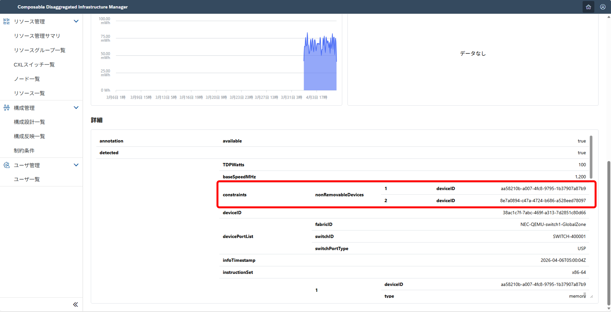
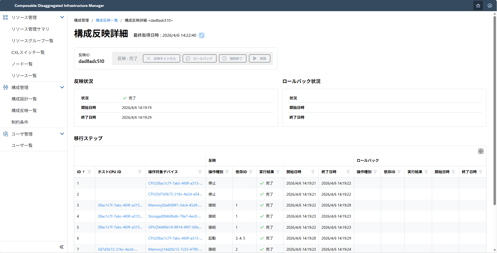
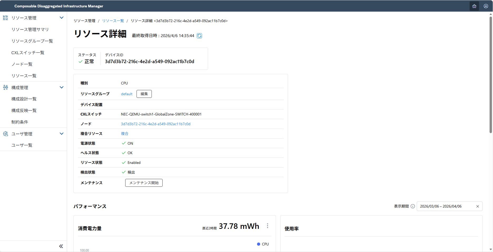
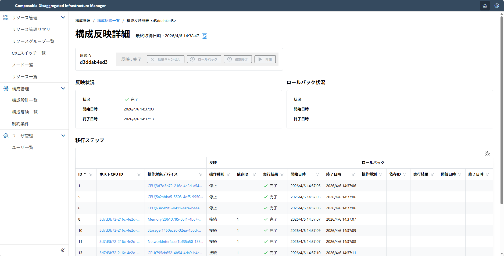
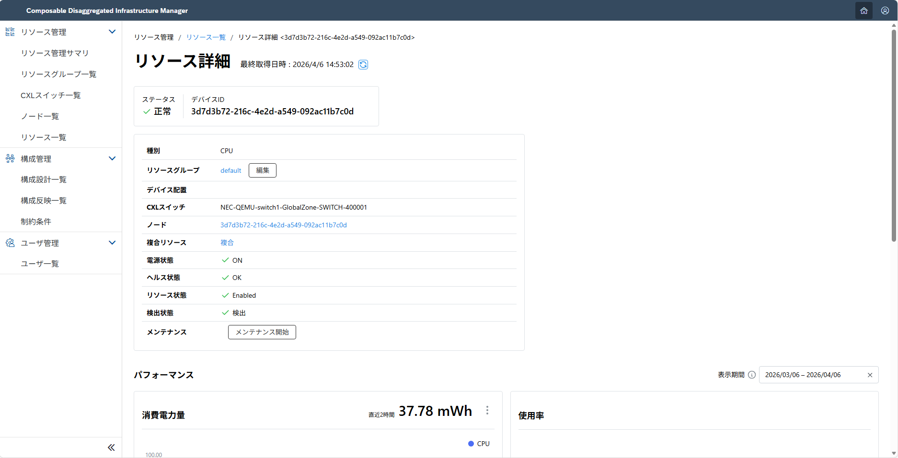
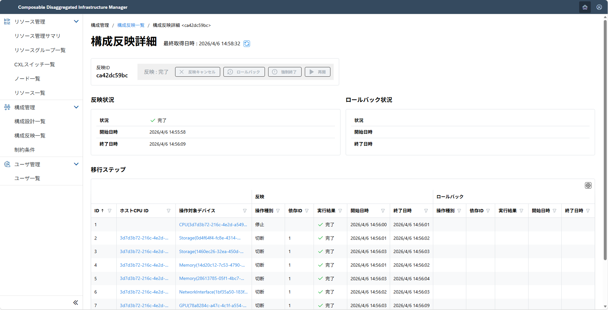
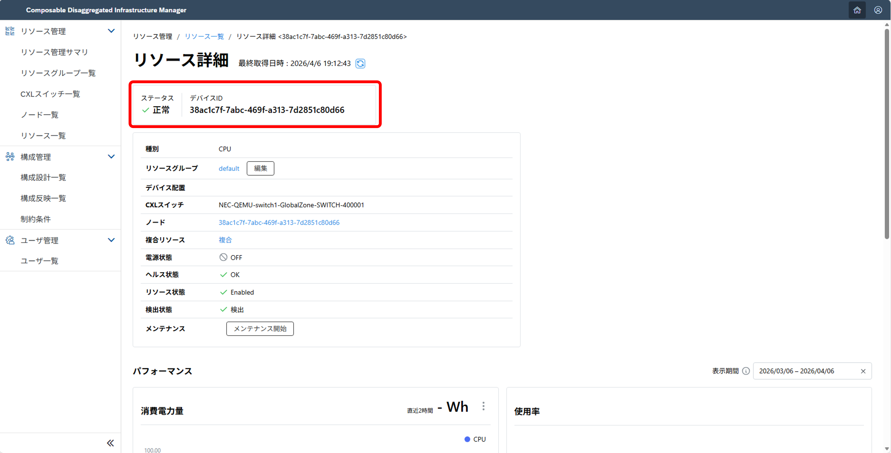
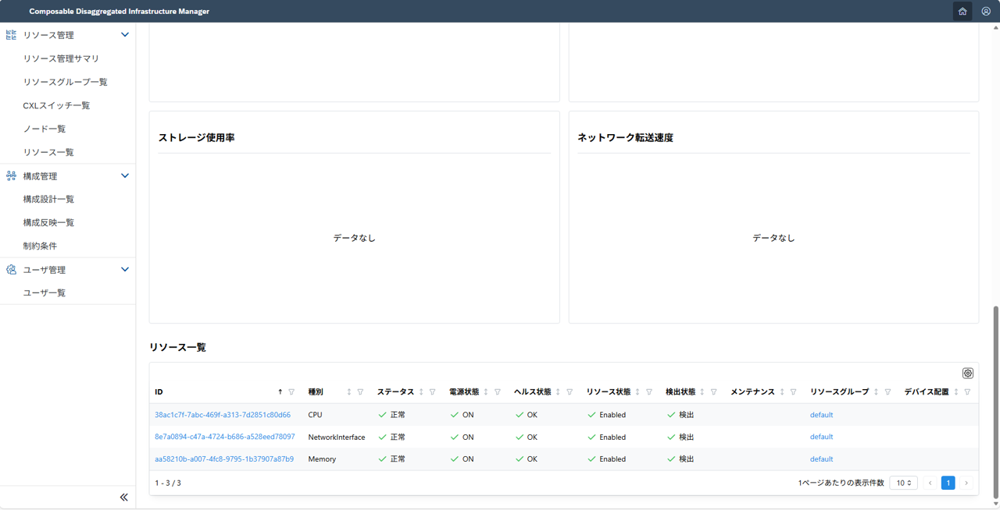
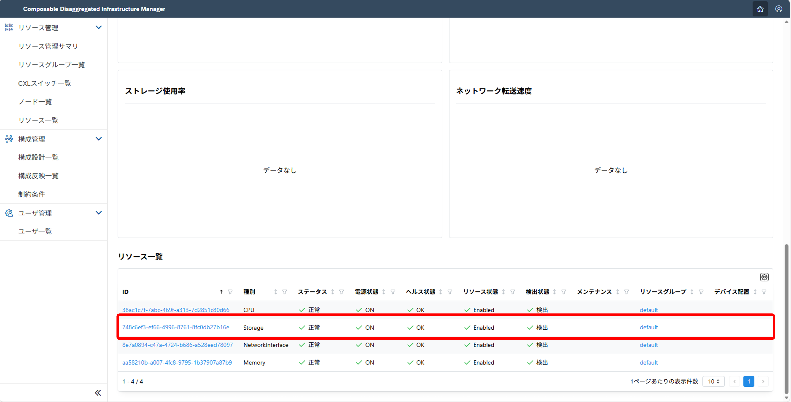

## 2.1 手動の構成定義による構成変更 <!-- omit in toc -->
ここでは、Composable Disaggregated Infrastructure Manager(略称:CDIM)を用いた構成変更について説明します。  

CDIMでは実際に構築したいノード構成を入力することで、手軽に現在のノード構成を理想のノード構成に変更できます。  
構成変更を行う機能としては、以下の2つが存在します。  
- 構成変更機能
  - 一括で十数ノードの構成変更が可能な機能です。
- APIを用いた構成変更
  - デバイスのON・OFFなど、細かい構成変更を行うための機能です。細かな操作やトラブル時の切り分けに使用します。

- [2.1.1. ノードを新規作成する](#211-ノードを新規作成する)
  - [2.1.1.1. デバイス情報を確認する](#2111-デバイス情報を確認する)
  - [2.1.1.2. 構成したい内容を記述する](#2112-構成したい内容を記述する)
  - [2.1.1.3. 実行する](#2113-実行する)
- [2.1.2. ノードを変更追加する](#212-ノードを変更追加する)
  - [2.1.2.1. デバイス情報を確認する](#2121-デバイス情報を確認する)
  - [2.1.2.2. 構成したい内容を記述(登録)する](#2122-構成したい内容を記述登録する)
  - [2.1.2.3. 実行する](#2123-実行する)
- [2.1.3. ノードを削除する](#213-ノードを削除する)
  - [2.1.3.1. デバイス情報を確認する](#2131-デバイス情報を確認する)
  - [2.1.3.2. 構成したい内容を記述(登録)する](#2132-構成したい内容を記述登録する)
  - [2.1.3.3. 実行する](#2133-実行する)
- [2.1.4. APIを用いた構成変更](#214-apiを用いた構成変更)
  - [2.1.4.1. デバイスの電源状態を変える](#2141-デバイスの電源状態を変える)
  - [2.1.4.2. デバイスの接続状態を変える](#2142-デバイスの接続状態を変える)
- [2.1.5. 構成変更機能の記述内容(サンプルファイル)](#215-構成変更機能の記述内容サンプルファイル)
  
### 2.1.1. ノードを新規作成する

#### 2.1.1.1. デバイス情報を確認する

各デバイスの詳細画面を確認し、使用したいスペックを選定します。


ノード構成が定まったら、構成変更後に使用予定のデバイスIDを確認します。

> [!WARNING]
> デバイスの中には、あらかじめCPU と接続されており、CPU から取り外しできないデバイスが存在します。  （ex : 該当CPU が搭載されているサーバシャーシに内蔵されているデバイスなど） このデバイスを以降は「切断不可デバイス」と呼称します。
> 切断不可デバイスかどうかを確認する方法は以下になります。
> - 詳細情報にnonRemovableDevicesの記載がある : 切断不可デバイスであり、記載があるデバイスIDのCPUと接続されている
> - 詳細情報にnonRemovableDevicesの記載がない : 切断不可デバイス以外  
> ※cpuは切断不可デバイスではありません。CPUに記載されているnonRemovableDevicesは切断不可デバイスを示しています。
> 

#### 2.1.1.2. 構成したい内容を記述する

新しく構成したいノード構成を記述します。  
> [!NOTE]
> デバイスIDについては、CDIMを立ち上げた時に生成された値に変更してください。 
```sh
$ mkdir test
$ vi test/template_1.json
```
<details>
<summary>test/template_1.json (example)</summary>

```json

{
    "targetNodeIDs": [
        "38ac1c7f-7abc-469f-a313-7d2851c80d66",
        "3d7d3b72-216c-4e2d-a549-092ac11b7c0d"
    ],
    "desiredLayout": {
        "nodes": [
            {
                "device": {
                    "cpu": {
                        "deviceIDs": [
                            "38ac1c7f-7abc-469f-a313-7d2851c80d66"
                        ]
                    },
                    "memory": {
                        "deviceIDs": [
                            "aa58210b-a007-4fc8-9795-1b37907a87b9",
                            "0a4588f1-3dc4-45d9-a246-b4694b099655"
                        ]
                    },
                    "storage": {
                        "deviceIDs": [
                            "084606d6-79e7-4ec0-a626-826e85ef807c"
                        ]
                    },
                    "networkInterface": {
                        "deviceIDs": [
                            "8e7a0894-c47a-4724-b686-a528eed78097"
                        ]
                    },
                    "gpu": [
                        {
                            "deviceID": "34d40e14-8814-4f07-b9ab-5c839e7d7fbb"
                        }
                    ]
                }
            },
            {
                "device": {
                    "cpu": {
                        "deviceIDs": [
                            "3d7d3b72-216c-4e2d-a549-092ac11b7c0d"
                        ]
                    },
                    "memory": {
                        "deviceIDs": [
                            "b1ebc38b-f748-4188-a76e-567b7d99eef0",
                            "14d20c12-7c53-4790-929c-c304595c3297"
                        ]
                    },
                    "storage": {
                        "deviceIDs": [
                            "0d4f64f4-fc8e-4314-8216-d37bb7a99102"
                        ]
                    },
                    "networkInterface": {
                        "deviceIDs": [
                            "e79c6939-d20d-41c2-8685-13c05c910be3"
                        ]
                    },
                    "gpu": [
                        {
                            "deviceID": "78a8284c-a47c-4c1f-a554-bbe8807e41b3"
                        }
                    ]
                }
            }
        ]
    }
}

```

</details>

#### 2.1.1.3. 実行する

1. 上で登録した構成の移行手順を作成し、確認する
   ```sh
   $ curl -XPOST -H 'Content-Type: application/json' http://<ipアドレス>:8013/cdim/api/v1/migration-procedures -d @test/template_1.json | jq > test/procedure_template_1.json
   $ cat test/procedure_template_1.json 
   ```

2. 出力された移行手順を編集する  
   出力された移行手順が以下の形式になっていない場合は、以下の形式に修正します。
   ```sh
   $ vi test/procedure_template_1.json
   {
    "procedures": [
        <出力内容>
    ]
   }
   ```

3. 作成した移行手順を反映する
    ```sh
    $ curl -XPOST -H 'Content-Type: application/json' http://<ipアドレス>:8013/cdim/api/v1/layout-apply -d @test/procedure_template_1.json
    ```

4. 構成変更されたことをUIで確認する
   > 実行後、ノード一覧やリソース一覧に反映されるまで数分かかります。

   
   FailedやSuspendedの場合はもう一度[2.](#2112-構成したい内容を記述する)から実行するか、 [トラブルシューティング](../appendix/troubleshooting/README.md)を参照してください。

### 2.1.2. ノードを変更追加する

#### 2.1.2.1. デバイス情報を確認する

各デバイスの詳細画面を確認し、変更・追加したいスペックを選定します。
  
ノード構成が定まったら、構成変更する前のノードに使用されているデバイスIDと構成変更後のデバイスIDを確認します。

> [!WARNING]
> 切断不可デバイスは、あらかじめCPU と接続されているCPU以外のCPUに接続できません。
> 切断不可デバイスかどうかを確認する方法については、[2.1.1.1.](#2111-デバイス情報を確認する)を参照してください。

#### 2.1.2.2. 構成したい内容を記述(登録)する

新しく構成したいノード構成を記述します。  
> [!NOTE]
> デバイスIDについては、CDIMを立ち上げた時に生成された値に変更してください。 
```sh
$ mkdir test
$ vi test/template_2.json
```
<details>
<summary>test/template_2.json (example)</summary>

```json
{
    "targetNodeIDs": [
        "5a2abba5-5503-4df5-9950-f86e4c54bbc3",
        "63a5b9f5-b411-4afe-b44e-e06a4315b1fd",
        "3d7d3b72-216c-4e2d-a549-092ac11b7c0d"
    ],
    "desiredLayout": {
        "nodes": [
            {
                "device": {
                    "cpu": {
                        "deviceIDs": [
                            "3d7d3b72-216c-4e2d-a549-092ac11b7c0d"
                        ]
                    },
                    "memory": {
                        "deviceIDs": [
                            "b1ebc38b-f748-4188-a76e-567b7d99eef0",
                            "14d20c12-7c53-4790-929c-c304595c3297",
                            "28613785-05f1-4bc7-98ba-2c590926b59e"
                        ]
                    },
                    "storage": {
                        "deviceIDs": [
                            "0d4f64f4-fc8e-4314-8216-d37bb7a99102",
                            "1460ec26-32ea-450d-8817-c841b1b1fa08"
                        ]
                    },
                    "networkInterface": {
                        "deviceIDs": [
                            "e79c6939-d20d-41c2-8685-13c05c910be3",
                            "1bf35a50-183f-43d7-8509-8318d308474b"
                        ]
                    },
                    "gpu": [
                        {
                            "deviceID": "78a8284c-a47c-4c1f-a554-bbe8807e41b3"
                        },
                        {
                            "deviceID": "795cb652-4b54-4da9-b4ed-f9aef77054c6"
                        },
                        {
                            "deviceID": "88258305-39b4-4db8-9265-b62cfb9483e2"
                        }
                    ]
                }
            },
            {
                "device": {
                    "cpu": {
                        "deviceIDs": [
                            "5a2abba5-5503-4df5-9950-f86e4c54bbc3"
                        ]
                    },
                    "memory": {
                        "deviceIDs": [
                            "1584de41-3f66-49f9-b749-70b5bf1be5db",
                            "34485a33-8e2c-48f1-b8bb-41e2cab3dccd"
                        ]
                    },
                    "storage": {
                        "deviceIDs": [
                            "192e4531-8a22-450a-bb49-fd16963a28bf",
                            "62d6fb1e-a298-470f-b015-a3348431adf6"
                        ]
                    },
                    "networkInterface": {
                        "deviceIDs": [
                            "13ee71d4-e1b0-4631-bb62-c28338b83ae0"
                        ]
                    },
                    "gpu": [
                        {
                            "deviceID": "8d33a2f6-ca58-4275-8b87-93ffd9237ce9"
                        }
                    ]
                }
            },
            {
                "device": {
                    "cpu": {
                        "deviceIDs": [
                            "63a5b9f5-b411-4afe-b44e-e06a4315b1fd"
                        ]
                    },
                    "memory": {
                        "deviceIDs": [
                            "020277ad-a599-47f7-b640-dc7a168e83f0",
                            "4566c945-e83a-41b6-b88d-26ff97005d02"
                        ]
                    },
                    "storage": {
                        "deviceIDs": [
                            "68593170-5f44-41fb-9f14-52d4eb31df6b"
                        ]
                    },
                    "networkInterface": {
                        "deviceIDs": [
                            "4bb1ac6b-ca96-4d63-b0af-8bb7166dfd05"
                        ]
                    }
                }
            }
        ]
    }
}
```

</details>

#### 2.1.2.3. 実行する

1. 上で登録した構成の移行手順を作成し、確認する
   ```sh
   $ curl -XPOST -H 'Content-Type: application/json' http://<ipアドレス>:8013/cdim/api/v1/migration-procedures -d @test/template_2.json | jq > test/procedure_template_2.json
   $ cat test/procedure_template_2.json 
   ```

2. 出力された移行手順を編集する  
   出力された移行手順が以下の形式になっていない場合は、以下の形式に修正します。
   ```sh
   $ vi test/procedure_template_2.json
   {
    "procedures": [
        <出力内容>
    ]
   }
   ```

3. 作成した移行手順を反映する
   ```sh
   $ curl -XPOST -H 'Content-Type: application/json' http://<ipアドレス>:8013/cdim/api/v1/layout-apply -d @test/procedure_template_2.json
   ```

4. 構成変更されたことをUIで確認する
   > 実行後、ノード一覧やリソース一覧に反映されるまで数分かかります。

   
   FailedやSuspendedの場合はもう一度[2.](#2122-構成したい内容を記述登録する)から実行するか、 [トラブルシューティング](../appendix/troubleshooting/README.md)を参照してください。

### 2.1.3. ノードを削除する

#### 2.1.3.1. デバイス情報を確認する 

各デバイスの詳細画面を確認し、削除したいノードを選定します。

ノード構成が定まったら、構成変更する前のノードに使用されているデバイスIDと構成変更後のデバイスIDを確認します。

> [!WARNING]
> 切断不可デバイスは、あらかじめCPU と接続されているCPU以外のCPUに接続できません。
> 切断不可デバイスかどうかを確認する方法については、[2.1.1.1.](#2111-デバイス情報を確認する)を参照してください。

#### 2.1.3.2. 構成したい内容を記述(登録)する

新しく構成したいノード構成を記述します。
> [!NOTE]
> デバイスIDについては、CDIMを立ち上げた時に生成された値に変更してください。 
```sh
$ mkdir test
$ vi test/template_3.json
```
<details>
<summary>test/template_3.json (example)</summary>

```json
{
    "targetNodeIDs": [
        "3d7d3b72-216c-4e2d-a549-092ac11b7c0d"
    ],
    "desiredLayout": {
        "nodes": []
    }
}
```

</details>

#### 2.1.3.3. 実行する

1. 上で登録した構成の移行手順を作成し、確認する
   ```sh
   $ curl -XPOST -H 'Content-Type: application/json' http://<ipアドレス>:8013/cdim/api/v1/migration-procedures -d @test/template_3.json | jq > test/procedure_template_3.json
   $ cat test/procedure_template_3.json 
   ```

2. 出力された移行手順を編集する  
   出力された移行手順が以下の形式になっていない場合は、以下の形式に修正します。
   ```sh
   $ vi test/procedure_template_3.json
   {
    "procedures": [
        <出力内容>
    ]
   }
   ```

3. 作成した移行手順を反映する
   ```sh
   $ curl -XPOST -H 'Content-Type: application/json' http://<ipアドレス>:8013/cdim/api/v1/layout-apply -d @test/procedure_template_3.json
   ```

4. 構成変更されたことをUIで確認する
   > 実行後、ノード一覧やリソース一覧に反映されるまで数分かかります。

   
   FailedやSuspendedの場合はもう一度[2.](#2132-構成したい内容を記述登録する)から実行するか、 [トラブルシューティング](../appendix/troubleshooting/README.md)を参照してください。

### 2.1.4. APIを用いた構成変更

ここでは構成変更機能での変更がむずかしい、細かな構成変更方法を説明します。

#### 2.1.4.1. デバイスの電源状態を変える

1. 電源状態を変更したいデバイスの情報を確認する
    
    ```sh
    $ curl http://localhost:3500/v1.0/invoke/hw-control/method/cdim/api/v1/devices/<電源状態を変更したいデバイスID> | jq
    {
    "deviceID": "38ac1c7f-7abc-469f-a313-7d2851c80d66",
    "type": "CPU",
            :
    "powerState": "Off"
            :
    }
    ```
2. 電源状態を変更する
    下の電源状態一覧から変更したい電源状態を選択し、以下のコマンドを入力します。

    <details>
    <summary> 変更可能な電源状態一覧 </summary>

    - on
    - off
    - reset
    - force-off

    </details>

    ```sh
    $ curl -X PUT http://localhost:3500/v1.0/invoke/hw-control/method/cdim/api/v1/devices/<電源状態を変更したいデバイスID>/power -d '{"action": "on"}' -H 'accept: application/json' -H 'Content-Type: application/json'
    {"deviceID":"38ac1c7f-7abc-469f-a313-7d2851c80d66"}
    変更したデバイス情報を確認します
    $ curl http://localhost:3500/v1.0/invoke/hw-control/method/cdim/api/v1/devices/<電源状態を変更したいデバイスID> | jq
    {
    "deviceID": "38ac1c7f-7abc-469f-a313-7d2851c80d66",
    "type": "CPU",
            :
    "powerState": "On"
            :
    }
    ```

#### 2.1.4.2. デバイスの接続状態を変える

1. 接続状態を変更したいデバイス情報を確認する
    
    ```sh
    CPU情報を確認します
    $ curl http://localhost:3500/v1.0/invoke/hw-control/method/cdim/api/v1/devices/<cpuのデバイスID> | jq
    {
    "deviceID": "38ac1c7f-7abc-469f-a313-7d2851c80d66",
    "type": "CPU",
            :
    "powerState": "On"
            :
    }
    接続状態を変更するデバイス情報を確認します
    $ curl http://localhost:3500/v1.0/invoke/hw-control/method/cdim/api/v1/devices/<接続情報を変更するデバイスID> | jq
    {
    "deviceID": "748c6ef3-ef66-4996-8761-8fc0db27b16e",
    "type": "storage",
            :
    "powerState": "On"
            :
    }
    ```

2. 接続状態を変更する

    下の接続状態一覧から接続状態を選択し、以下のコマンドを実行します。

    変更可能な接続状態一覧
    - connect
    - disconnect
    ```sh
    $ curl -X PUT http://localhost:3500/v1.0/invoke/hw-control/method/cdim/api/v1/devices/<cpuのデバイスID>/aggregations -d '{"destinationDeviceID": "<接続状態を変更するデバイスID>", "action": "connect"}' -H 'accept: application/json' -H 'Content-Type: application/json'
    {"CPUDeviceID":"38ac1c7f-7abc-469f-a313-7d2851c80d66","deviceID":"748c6ef3-ef66-4996-8761-8fc0db27b16e"}
    ```
    デバイスの接続状態を確認します。
    
    > 実行後、ノード一覧やリソース一覧に反映されるまで数分かかります。

### 2.1.5. 構成変更機能の記述内容(サンプルファイル)

ここではサンプルファイルを用いて、CDIMでの構成内容の記述方法・項目を示します。

<details>
<summary>構成内容の記述詳細(template_0.json)</summary>

```json
{
    <!-- 変更したいノードID(CPUのデバイスID)を記載する -->
    "targetNodeIDs": [
        <!-- 複数ある場合は複数記載する -->
        "f72874dd-509b-445f-ad7a-47e21114736d",
        "c71ca465-189a-4315-ab91-ff8cf58bbfd2"
    ],
    <!-- 変更後のノード構成を記載する -->
    "desiredLayout": {
        "nodes": [
            <!-- ノード1つ目 -->
            {
                <!-- ノードのデバイス情報を記載する -->
                "device": {
                    "cpu": {
                        "deviceIDs": [
                            "f72874dd-509b-445f-ad7a-47e21114736d"
                        ]
                    },
                    "memory": {
                        "deviceIDs": [
                            "01c510d4-9f9c-4d7e-9107-ab976a7a46fb",
                        ]
                    },
                    "storage": {
                        "deviceIDs": [
                            "b001a83a-10ff-4e53-bb71-fdc4e1fc6c05"
                        ]
                    },
                    "networkInterface": {
                        "deviceIDs": [
                            "fefafbaa-98cf-4d65-a1ef-c24df942c420"
                        ]
                    },
                    <!-- GPUだけはList形式であることに注意する -->
                    "gpu": [
                        {
                            "deviceID": "060da9eb-4fba-4c06-9d0f-bf1c56992037"
                        }
                    ]
                }
            },
            <!-- ノード2つ目 -->
            {
                "device": {
                    "cpu": {
                        "deviceIDs": [
                            "c71ca465-189a-4315-ab91-ff8cf58bbfd2"
                        ]
                    },
                    "memory": {
                        "deviceIDs": [
                            <!-- デバイスを複数使用する場合は複数記載する -->
                            "10991104-a11c-4c44-b20d-78b7ebcab0f8",
                            "99adb16d-e75b-43f9-8215-76fbc26bff33"
                        ]
                    },
                    "storage": {
                        "deviceIDs": [
                            "0d94b110-bde5-48ad-8159-23dbcc2918bd",
                            "db9e86c4-aeb6-4bc1-a061-d31542fbe2b9"
                        ]
                    },
                    "networkInterface": {
                        "deviceIDs": [
                            "499cf595-b79f-40b4-bfd2-af9a05c04c2c"
                        ]
                    }
                }
            }
        ]
    }
}
```

</details>

<br>

<details>
<summary>記述項目詳細</summary>

|name|explanation|
|:--|:--|
|targetNodeIDs|変更したいノード一覧を記載するオブジェクトです。この項目が空の場合、すべてのノードに対して実行されるため注意が必要です。|
|desiredLayout|構成変更した後の情報を記載するオブジェクトです。|
|nodes|ノード情報をリスト形式で記述するオブジェクトです。|
|device|ノードに使用されているまたは使用予定のデバイス一覧を記述するオブジェクトです。|

</details>

<br>

<details>
<summary>使用可能リソース一覧</summary>

- CPU
- memory
- storage
- networkInterface(NIC)
- GPU
> 使用可能リソースは順次追加予定

</details>

[Next 2.2. 設計機構による構成変更](../layout-design/README.md)
