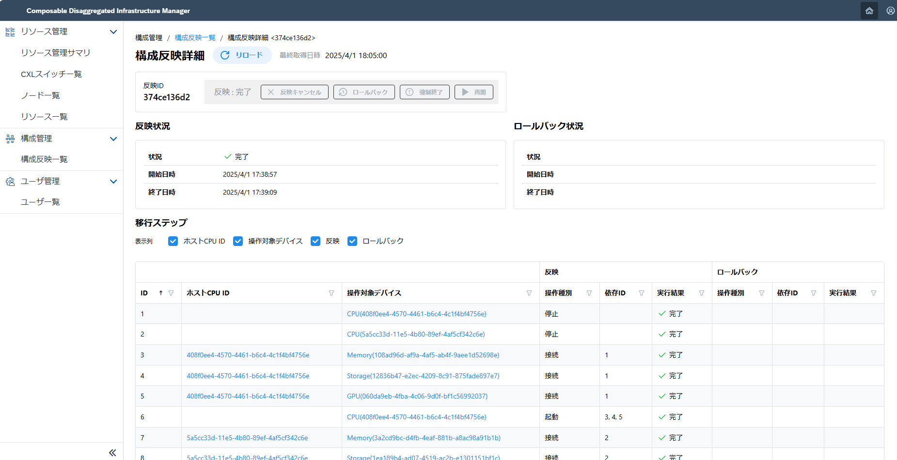

## 2. 構成の変更 <!-- omit in toc -->
ここでは、Composable Disaggregated Infrastructure Manager(略称:CDIM)を用いた構成変更について説明します。  

CDIMでは実際に構築したいノード構成を入力することで、手軽に現在のノード構成を理想のノード構成に変更できます。  
構成変更を行う機能としては、以下の2つが存在します。  
- 構成変更機能
  - 一括で十数ノードの構成変更が可能な機能です。
- APIを用いた構成変更
  - 一つ一つのデバイスのON・OFFなど、細かい構成変更を行うための機能です。構成変更機能でエラーが発生した場合などに使用します。

<br>

- [2.1. ノードを新規作成する](#21-ノードを新規作成する)
  - [2.1.1. デバイス情報を確認する](#211-デバイス情報を確認する)
  - [2.1.2. 構成したい内容を記述する](#212-構成したい内容を記述する)
  - [2.1.3. 実行する](#213-実行)
- [2.2. ノードを変更追加する](#22-ノードを変更追加する)
  - [2.2.1. デバイス情報を確認する](#221-デバイス情報を確認する)
  - [2.2.2. 構成したい内容を記述登録する](#222-構成したい内容を記述登録する)
  - [2.2.3. 実行する](#223-実行)
- [2.3. ノードを削除する](#23-ノードを削除する)
  - [2.3.1. デバイス情報を確認する](#231-デバイス情報を確認する)
  - [2.3.2. 構成したい内容を記述登録する](#232-構成したい内容を記述登録する)
  - [2.3.3. 実行する](#233-実行する)
- [2.4. APIを用いた構成変更](#24-apiを用いた構成変更)
  - [2.4.1. デバイスの電源状態を変える](#241-デバイスの電源状態を変える)
  - [2.4.2. デバイスの接続状態を変える](#242-デバイスの接続状態を変える)
- [2.5. 構成変更機能の記述内容(サンプルファイル)](#25-構成変更時の記述内容についての詳細サンプルファイル)
  
### 2.1. ノードを新規作成する

#### 2.1.1. デバイス情報を確認する

各デバイスの詳細画面を確認し、使用したいスペックを選定します。


ノード構成が定まったら、構成変更後に使用予定のデバイスIDを確認します。

#### 2.1.2. 構成したい内容を記述する

新しく構成したいノード構成を記述します。  
> デバイスIDについては、CDIMを立ち上げた時に生成された値に変更して下さい。 
```sh
$ mkdir test
$ vi test/templete_1.json
```
<details>
<summary>test/templete_1.json (example)</summary>

```json

{
    "targetNodeIDs": [
            "171c0595-16ca-4250-8dfb-1c6ad598e27d",
            "5edb4f4f-1745-4376-a0e1-c7568e6088b1"
    ],
    "desiredLayout": {
        "nodes": [
            {
                "device": {
                    "cpu": {
                        "deviceIDs": [
                            "171c0595-16ca-4250-8dfb-1c6ad598e27d"
                        ]
                    },
                    "memory": {
                        "deviceIDs": [
                            "3401f8c6-debf-4a5b-9b43-88ec512a9b7e",
                            "0e41ef00-1828-4b93-84e5-bde05be551cf"
                        ]
                    },
                    "storage": {
                        "deviceIDs": [
                            "29eae3ac-f8e7-4130-8a67-c97c6c33d29a"
                        ]
                    },
                    "networkInterface": {
                        "deviceIDs": [
                            "f8e0379e-b213-438e-8a7b-b22bac509590"
                        ]
                    },
                    "gpu": {
                        "deviceIDs": [
                            "14021ef1-fb9c-4acf-8a65-a7a580682fed"
                        ]
                    }
                }
            },
            {
                "device": {
                    "cpu": {
                        "deviceIDs": [
                            "5edb4f4f-1745-4376-a0e1-c7568e6088b1"
                        ]
                    },
                    "memory": {
                        "deviceIDs": [
                            "d4617cce-ca87-4577-9f28-24de39703caf",
                            "1c0a0dc8-bff6-4459-bcb7-60d7528f59d8"
                        ]
                    },
                    "storage": {
                        "deviceIDs": [
                            "3f28d608-747d-40ee-88b6-5c25808c4c27"
                        ]
                    },
                    "networkInterface": {
                        "deviceIDs": [
                            "d2dcdde8-b74c-45f3-8c41-5b4e2a1acd35"
                        ]
                    },
                    "gpu": {
                        "deviceIDs": [
                            "18a3990d-fc86-443d-bee2-1d2cbd6be803"
                        ]
                    }
                }
            }
        ]
    }
}

```

</details>

#### 2.1.3. 実行する

1. 上で登録した構成の移行手順を作成し、確認する
   ```sh
   $ curl -XPOST -H 'Content-Type: application/json' http://<ipアドレス>:8013/cdim/api/v1/migration-procedures -d @test/templete_1.json | jq > test/procedure_templete_1.json
   $ cat test/procedure_templete_1.json 
   ```

2. 出力された移行手順を編集する
   出力された移行手順が以下の形式になっていない場合は、以下の形式に修正します。
   ```sh
   $ vi test/procedure_templete_1.json
   {
    "procedures": [
        <出力内容>
    ]
   }
   ```

3. 作成した移行手順を反映する
    ```sh
    $ curl -XPOST -H 'Content-Type: application/json' http://<ipアドレス>:8013/cdim/api/v1/layout-apply -d @test/procedure_templete_1.json
    ```

4. メトリクス情報の更新する
   メトリクス情報の更新には、数分の時間がかかります。
   ```sh
    $ docker exec -it performance-collector /bin/sh
    $ curl -i -s -X PUT http://localhost:8080/cdim/api/v1/configs
    ```

5. 構成変更されたことをUIで確認する
   > 実行後、ノード一覧やリソース一覧に反映されるまで数分かかります。
    
    FailedやSuspendの場合はもう一度[2.](#212-構成したい内容を記述する)から実行するか、 [トラブルシューティング](../appendix/troubleshooting/README.md)を参照してください。

### 2.2. ノードを変更追加する

#### 2.2.1. デバイス情報を確認する

各デバイスの詳細画面を確認し、変更・追加したいスペックを選定します。
  
ノード構成が定まったら、構成変更する前のノードに使用されているデバイスIDと構成変更後のデバイスIDを確認します。

#### 2.2.2. 構成したい内容を記述(登録)する

新しく構成したいノード構成を記述します。  
> デバイスIDについては、先程登録した時に生成された値に変更して下さい。 
```sh
$ mkdir test
$ vi test/templete_2.json
```
<details>
<summary>test/templete_2.json (example)</summary>

```json
{
    "targetNodeIDs": [
            "5edb4f4f-1745-4376-a0e1-c7568e6088b1",
            "67172327-fbb1-4651-bc6d-63a696a1c6a1",
            "7d5454e5-6860-4750-9722-b1011d07449d"
    ],
    "desiredLayout": {
        "nodes": [
            {
                "device": {
                    "cpu": {
                        "deviceIDs": [
                            "5edb4f4f-1745-4376-a0e1-c7568e6088b1"
                        ]
                    },
                    "memory": {
                        "deviceIDs": [
                            "d4617cce-ca87-4577-9f28-24de39703caf",
                            "1c0a0dc8-bff6-4459-bcb7-60d7528f59d8",
                            "1faaa6ed-3074-46ec-8d5a-e2266bb3d0e8"
                        ]
                    },
                    "storage": {
                        "deviceIDs": [
                            "3f28d608-747d-40ee-88b6-5c25808c4c27",
                            "587bd765-69b5-4633-8695-fe91b513a490"
                        ]
                    },
                    "networkInterface": {
                        "deviceIDs": [
                            "d2dcdde8-b74c-45f3-8c41-5b4e2a1acd35"
                        ]
                    },
                    "gpu": {
                        "deviceIDs": [
                            "18a3990d-fc86-443d-bee2-1d2cbd6be803",
                            "2397eb69-8966-4600-80ba-5aca074a6f74",
                            "7269d815-fc01-4170-9087-555325587344"
                        ]
                    }
                }
            },
            {
                "device": {
                    "cpu": {
                        "deviceIDs": [
                            "67172327-fbb1-4651-bc6d-63a696a1c6a1"
                        ]
                    },
                    "memory": {
                        "deviceIDs": [
                            "94c0ec8b-e869-4c82-bd00-582821eca246",
                            "6c5abb5e-4daf-4bca-a494-f208efe80b87"
                        ]
                    },
                    "storage": {
                        "deviceIDs": [
                            "599b6a7f-113c-440f-b3ad-e7a361c75a9f",
                            "69cea176-520b-4225-84a2-6eccd6817dbb"
                        ]
                    },
                    "networkInterface": {
                        "deviceIDs": [
                            "9ce25d3e-f16c-4427-a53f-f4f69dcf8f7d"
                        ]
                    },
                    "gpu": {
                        "deviceIDs": [
                            "8a3739af-47ba-4272-a552-e3eb7ffe7052"
                        ]
                    }
                }
            },
            {
                "device": {
                    "cpu": {
                        "deviceIDs": [
                            "7d5454e5-6860-4750-9722-b1011d07449d"
                        ]
                    },
                    "memory": {
                        "deviceIDs": [
                            "c528e62a-8a2c-49bb-9e7a-632894b23627",
                            "91b4ece7-6a0d-459b-bb1c-961129fbae18"
                        ]
                    },
                    "storage": {
                        "deviceIDs": [
                            "722a8a2a-afee-4d99-98f6-1358f0cc4dc3"
                        ]
                    },
                    "networkInterface": {
                        "deviceIDs": [
                            "92a0c318-f0cb-4b84-9038-068af00b6029"
                        ]
                    }
                }
            }
        ]
    }
}
```

</details>

#### 2.2.3. 実行する

1. 上で登録した構成の移行手順を作成し、確認する
   ```sh
   $ curl -XPOST -H 'Content-Type: application/json' http://<ipアドレス>:8013/cdim/api/v1/migration-procedures -d @test/templete_2.json | jq > test/procedure_templete_2.json
   $ cat test/procedure_templete_2.json 
   ```
2. 出力された移行手順を編集する
   出力された移行手順が以下の形式になっていない場合は、以下の形式に修正します。
   ```sh
   $ vi test/procedure_templete_2.json
   {
    "procedures": [
        <出力内容>
    ]
   }
   ```
3. 作成した移行手順を反映する
   ```sh
   $ curl -XPOST -H 'Content-Type: application/json' http://<ipアドレス>:8013/cdim/api/v1/layout-apply -d @test/procedure_templete_2.json
   ```
4. メトリクス情報の更新する
   メトリクス情報の更新には、数分の時間がかかります。
   ```sh
    $ docker exec -it performance-collector /bin/sh
    $ curl -i -s -X PUT http://localhost:8080/cdim/api/v1/configs
    ```
5. 構成変更されたことをUIで確認する
   > 実行後、ノード一覧やリソース一覧に反映されるまで数分かかります。
   
    FailedやSuspendの場合はもう一度[2.](#212-構成したい内容を記述登録する)から実行するか、 [トラブルシューティング](../appendix/troubleshooting/README.md)を参照してください。

### 2.3. ノードを削除する

#### 2.3.1. デバイス情報を確認する 

各デバイスの詳細画面を確認し、削除したいノードを選定します。

ノード構成が定まったら、構成変更する前のノードに使用されているデバイスIDと構成変更後のデバイスIDを確認します。

#### 2.3.2. 構成したい内容を記述(登録)する

新しく構成したいノード構成を記述します。
> デバイスIDについては、先程登録した時に生成された値に変更して下さい。 
```sh
$ mkdir test
$ vi test/templete_3.json
```
<details>
<summary>test/templete_3.json (example)</summary>

```json
{
    "targetNodeIDs": [
            "5edb4f4f-1745-4376-a0e1-c7568e6088b1"
    ],
    "desiredLayout": {
        "nodes": [
        ]
    }
}
```

</details>

#### 2.3.3. 実行する

1. 上で登録した構成の移行手順を作成し、確認する
   ```sh
   $ curl -XPOST -H 'Content-Type: application/json' http://<ipアドレス>:8013/cdim/api/v1/migration-procedures -d @test/templete_3.json | jq > test/procedure_templete_3.json
   $ cat test/procedure_templete_3.json 
   ```
2. 出力された移行手順を編集する
   出力された移行手順が以下の形式になっていない場合は、以下の形式に修正します。
   ```sh
   $ vi test/procedure_templete_3.json
   {
    "procedures": [
        <出力内容>
    ]
   }
   ```
3. 作成した移行手順を反映する
   ```sh
   $ curl -XPOST -H 'Content-Type: application/json' http://<ipアドレス>:8013/cdim/api/v1/layout-apply -d @test/procedure_templete_3.json
   ```
4. メトリクス情報の更新する
   メトリクス情報の更新には、数分の時間がかかります。
   ```sh
    $ docker exec -it performance-collector /bin/sh
    $ curl -i -s -X PUT http://localhost:8080/cdim/api/v1/configs
    ```
5. 構成変更されたことをUIで確認する
   > 実行後、ノード一覧やリソース一覧に反映されるまで数分かかります。
   
    FailedやSuspendの場合はもう一度[2.](#212-構成したい内容を記述登録する)から実行するか、 [トラブルシューティング](../appendix/troubleshooting/README.md)を参照してください。

### 2.4. APIを用いた構成変更

ここでは構成情報機能での変更が難しい、細かな構成変更方法を説明します。

#### 2.4.1. デバイスの電源状態を変える

1. 電源状態を変更したいデバイスの情報を確認する
　
  ```sh
  $ docker container exec -it hw-control /bin/sh
  $ curl http://<ipアドレス>:3500/v1.0/invoke/hw-control/method/cdim/api/v1/devices/<電源状態を変更したいデバイスID> | jq
  {
    "deviceID": "18a3990d-fc86-443d-bee2-1d2cbd6be803",
    "type": "gpu",
          :
    "powerState": "Off"
          :
  }
  ```
1. 電源状態を変更する
  下の電源状態一覧から変更したい電源状態を選択し、以下のコマンドを入力します。

  <details>
   <summary> 変更可能な電源状態一覧 </summary>
   
   - on
   - off
   - reset
   - force-off
  
   </details>

  ```sh
  $ curl -X PUT http://<ipアドレス>:3500/v1.0/invoke/hw-control/method/cdim/api/v1/devices/<電源状態を変更したいデバイスID>/power -d '{"action": "on"}' -H 'accept: application/json' -H 'Content-Type: application/json'
  {"deviceID":"18a3990d-fc86-443d-bee2-1d2cbd6be803"}
  変更したデバイス情報を確認します
  $ curl http://<ipアドレス>:3500/v1.0/invoke/hw-control/method/cdim/api/v1/devices/<電源状態を変更したいデバイスID> | jq
  {
    "deviceID": "18a3990d-fc86-443d-bee2-1d2cbd6be803",
    "type": "gpu",
          :
    "powerState": "On"
          :
  }
  ```

#### 2.4.2. デバイスの接続状態を変える

1. 接続状態を変更したいデバイス情報を確認する
   
  ```sh
  CPU情報を確認します
  $ docker container exec -it hw-control /bin/sh
  $ curl http://<ipアドレス>:3500/v1.0/invoke/hw-control/method/cdim/api/v1/devices/<cpuのデバイスID> | jq
  {
    "deviceID": "855d94b5-6855-4aa7-817c-ca2acd743a59",
    "type": "CPU",
          :
    "powerState": "On"
          :
  }
  接続状態を変更するデバイス情報を確認します
  $ curl http://<ipアドレス>:3500/v1.0/invoke/hw-control/method/cdim/api/v1/devices/<接続情報を変更するデバイスID> | jq
  {
    "deviceID": "18a3990d-fc86-443d-bee2-1d2cbd6be803",
    "type": "gpu",
          :
    "powerState": "On"
          :
  }
  ```
1. 接続状態を変更する
   
　下の接続状態一覧から接続状態を選択し、以下のコマンドを実行します。

  変更可能な接続状態一覧
  - connect
  - disconnect
  ```sh
  $ curl -X PUT http://<ipアドレス>:3500/v1.0/invoke/hw-control/method/cdim/api/v1/cpu/<cpuのデバイスID>/aggregations -d '{"deviceID": "<接続状態を変更するデバイスID>", "action": "connect"}' -H 'accept: application/json' -H 'Content-Type: application/json'
  {"CPUDeviceID":"855d94b5-6855-4aa7-817c-ca2acd743a59","deviceID":"18a3990d-fc86-443d-bee2-1d2cbd6be803"}
  ```
  デバイスの接続状態を確認します。
  
  > 実行後、ノード一覧やリソース一覧に反映されるまで数分かかります。

1. メトリクス情報の更新する
   hw-controlのコンテナから抜け、メトリクス更新を行います。
   メトリクス情報の更新には、数分の時間がかかります。
   ```sh
    $ exit
    $ docker exec -it performance-collector /bin/sh
    $ curl -i -s -X PUT http://localhost:8080/cdim/api/v1/configs
    ```

### 2.5. 構成変更機能の記述内容(サンプルファイル)

ここではサンプルファイルを用いて、CDIMでの構成内容の記述方法・項目を示します。

<details>
<summary>構成内容の記述詳細(templete_0.json)</summary>

```json
{
    <!-- 変更したいノードID(CPUのデバイスID)を記載する -->
    "targetNodeIDs": [
        <!-- 複数ある場合は複数記載する -->
        "f72874dd-509b-445f-ad7a-47e21114736d",
        "c71ca465-189a-4315-ab91-ff8cf58bbfd2"
    ],
    <!-- 変更後のノード構成を記載する -->
    "desiredLayout": {
        "nodes": [
            <!-- ノード一つ目 -->
            {
                <!-- ノードのデバイス情報を記載する -->
                "device": {
                    "cpu": {
                        "deviceIDs": [
                            "f72874dd-509b-445f-ad7a-47e21114736d"
                        ]
                    },
                    "memory": {
                        "deviceIDs": [
                            "01c510d4-9f9c-4d7e-9107-ab976a7a46fb",
                        ]
                    },
                    "storage": {
                        "deviceIDs": [
                            "b001a83a-10ff-4e53-bb71-fdc4e1fc6c05"
                        ]
                    },
                    "networkInterface": {
                        "deviceIDs": [
                            "fefafbaa-98cf-4d65-a1ef-c24df942c420"
                        ]
                    }
                }
            },
            <!-- ノード二つ目 -->
            {
                "device": {
                    "cpu": {
                        "deviceIDs": [
                            "c71ca465-189a-4315-ab91-ff8cf58bbfd2"
                        ]
                    },
                    "memory": {
                        "deviceIDs": [
                            <!-- デバイスを複数使用する場合は複数記載する -->
                            "10991104-a11c-4c44-b20d-78b7ebcab0f8",
                            "99adb16d-e75b-43f9-8215-76fbc26bff33"
                        ]
                    },
                    "storage": {
                        "deviceIDs": [
                            "0d94b110-bde5-48ad-8159-23dbcc2918bd",
                            "db9e86c4-aeb6-4bc1-a061-d31542fbe2b9"
                        ]
                    },
                    "networkInterface": {
                        "deviceIDs": [
                            "499cf595-b79f-40b4-bfd2-af9a05c04c2c"
                        ]
                    }
                }
            }
        ]
    }
}
```

</details>

<br>

<details>
<summary>記述項目詳細</summary>

|name|explantation|
|:--|:--|
|targetNodeIDs|変更したいノード一覧を記載するオブジェクトです。この項目が空の場合、全てのノードに対して実行されるため注意が必要です。|
|desireLayout|構成変更した後の情報を記載するオブジェクトです。|
|nodes|ノード情報をリスト形式で記述するオブジェクトです。|
|devices|ノードに使用されているまたは使用予定のデバイス一覧を記述するオブジェクトです。|

</details>

<br>

<details>
<summary>使用可能リソース一覧</summary>

- CPU
- memory
- storage
- networkInterface(NIC)
- GPU
> 使用可能リソースは順次追加予定

</details>

[Next 3.各種設定](../configuration/README.md)
