#### 1. ハードウェア構成、情報を確認 <!-- omit in toc -->
ここでは、Composable Disaggregated Infrastructure Manager (略称:CDIM) の画面からハードウェア構成、情報を確認します。

> [!NOTE] 
> 以降では画面例を掲載しています。画面例には説明のために赤枠と番号を付記していますが、実際には赤枠と番号は表示されません。

> [!NOTE] 
> ハードウェアを指す用語としてデバイスとリソースの2種類の表現が出てきます。デバイスはCPUやメモリ、ストレージなどのComposable Disaggregated Infrastructure (CDI) を構成する個々の物理ハードウェアのことを指し、リソースはデバイスの中で「ノードの構成要素」となる物理ハードウェアのことを指します。

> [!WARNING]
> 各リソースの使用率について注意事項が存在します。
> 詳細は[注意事項](#111-注意事項)を参照してください。

> [!WARNING]
> 制御対象がエミュレータの場合は注意事項が存在します。
> 詳細は[注意事項](#111-注意事項)を参照してください。

- [1.1. ハードウェア構成、情報の概略を確認](#11-ハードウェア構成情報の概略を確認)
- [1.2. 各リソース種類ごとの消費電力とリソース状況を確認](#12-各リソース種類ごとの消費電力とリソース状況を確認)
- [1.3. 構築されているノードの一覧を確認](#13-構築されているノードの一覧を確認)
- [1.4. 構築されているノードの詳細を確認](#14-構築されているノードの詳細を確認)
- [1.5. 登録されているリソースの一覧を確認](#15-登録されているリソースの一覧を確認)
- [1.6. 登録されているリソースの詳細を確認](#16-登録されているリソースの詳細を確認)
- [1.7. 構成案設計状況の一覧を確認](#17-構成案設計状況の一覧を確認)
- [1.8. 構成案設計状況の詳細を確認](#18-構成案設計状況の詳細を確認)
- [1.9. 構成案反映状況の一覧を確認](#19-構成案反映状況の一覧を確認)
- [1.10. 構成案反映状況の詳細を操作・確認](#110-構成案反映状況の詳細を操作確認)
- [1.11. 注意事項](#111-注意事項)

##### 1.1. ハードウェア構成、情報の概略を確認
ホーム画面に表示されるダッシュボードから、構成済みのノード数やリソース数、障害などが発生しているノード数やリソース数、ノードで使用済みのリソース数などを確認します。

画面の表示例は以下のとおりです。
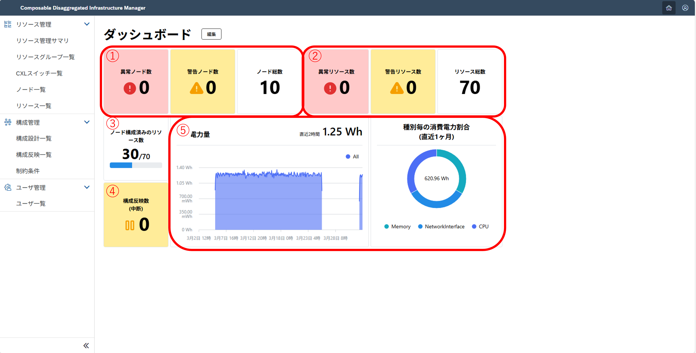

画面の確認内容は以下のとおりです。
|番号|名前|説明|
|:--|:--|:--|
| 1 |ノード情報|[ノード総数]から構成済みのノード数を確認します。[重大ノード数]や[警告ノード数]が0の場合はノードはすべて正常です。|
| 2 |リソース情報|[リソース総数]から環境のリソース数を確認します。[重大リソース数]や[警告リソース数]が0の場合はリソースはすべて正常です。|
| 3 |リソース使用状況|使用されているリソース数を確認します。|
| 4 |構成案反映状況|保留中の構成案反映数を確認します。0の場合は問題はありません。|
| 5 |消費電力状況|直近1か月間の消費電力量を確認します。初回の性能情報の更新時には、性能情報の蓄積のためにグラフが表示されるまで1時間ほど時間がかかります。|

実行できる内容は以下のとおりです。
- ホームに戻る  
  ホームボタンかCDIMのタイトルを選択することでホーム画面に移動できます。
  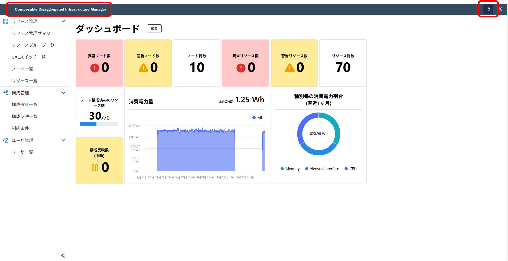

 

- ログアウトする  
  ユーザーボタンを選択後、ログアウトボタンを押すことでログアウトできます。
  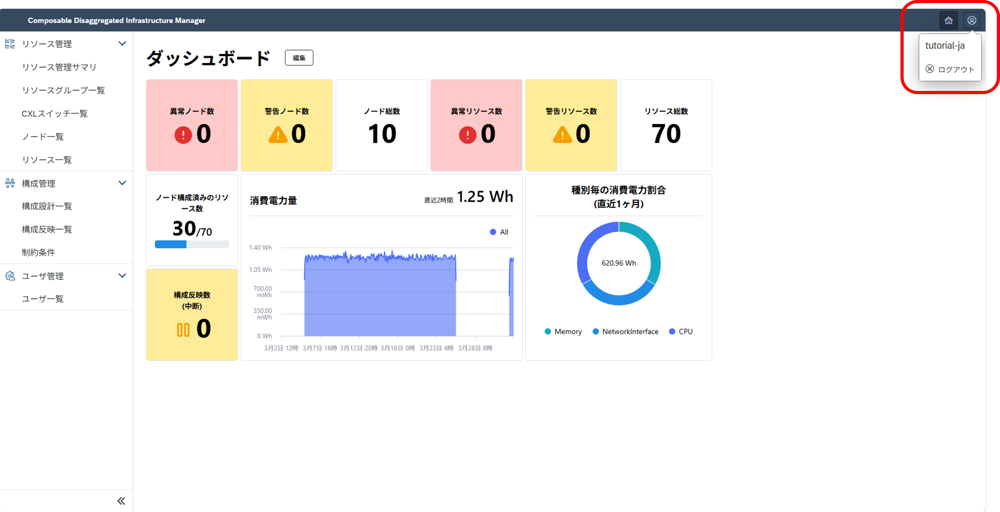
  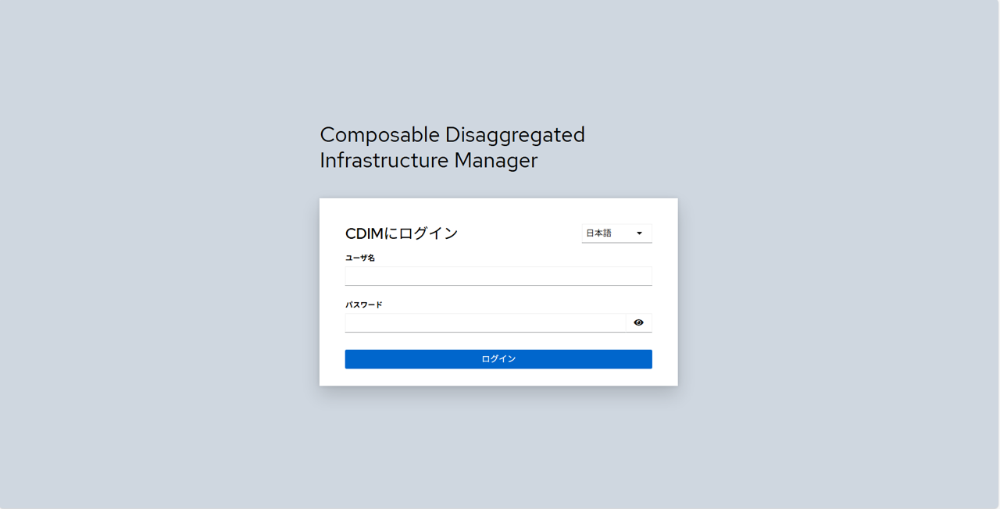

 

##### 1.2. 各リソース種類ごとの消費電力とリソース状況を確認
画面左のメニューから「サマリー」を選択することでサマリー画面に移動します。
サマリー画面に表示されるダッシュボードから全体の消費電力やリソース状況、および各リソース種類ごとの消費電力やリソース状況などを確認します。
画面の表示例は以下のとおりです。

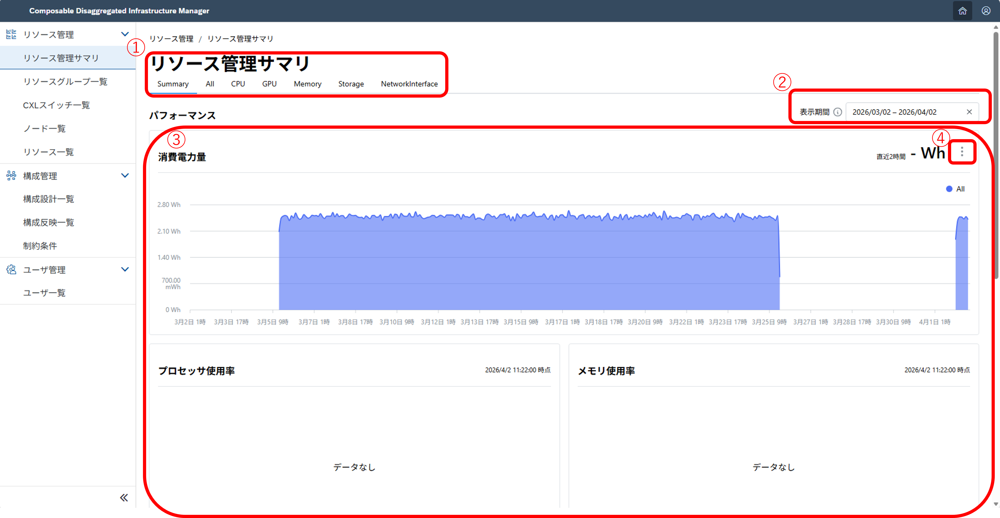
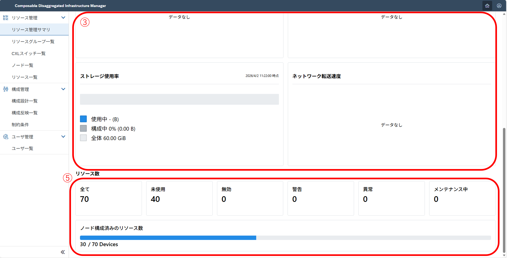

画面の確認内容は以下のとおりです。
|番号|名前|説明|
|:--|:--|:--|
| 1 |タブ機能|それぞれのリソースごとのパフォーマンス状況とリソース状況を確認できます。|
| 2 |表示期間|全リソースのパフォーマンス状況について、表示期間を設定することができます。|
| 3 |パフォーマンス状況|現在の消費電力と使用率を確認します。|
| 4 |パフォーマンス状況の詳細|三点リーダーから詳細を確認できます。現時点ではcsvファイルの形式でパフォーマンス状況のエクスポートをすることが可能です。|
| 5 |リソース状況|現在使用しているリソースの数や使用しているリソースに異常がないかを確認します。Critical ResourceやWarning Resourceが0の場合はリソースはすべて正常です。|

 

##### 1.3. 構築されているノードの一覧を確認
画面左のメニューから「ノード一覧」を選択することでノード一覧画面に移動します。
ノード一覧画面ではノードIDやノードに割り当てられているリソース数などを確認します。
画面の表示例は以下のとおりです。

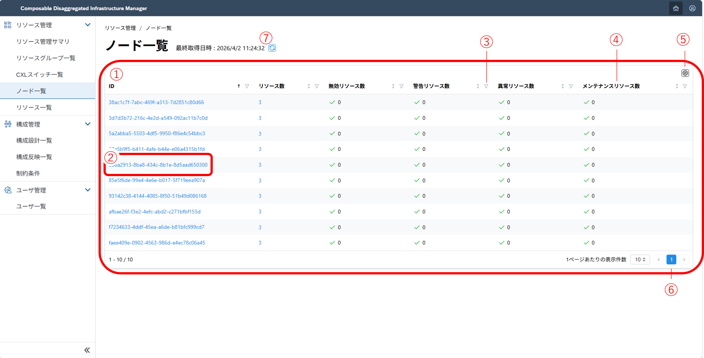

画面の確認内容は以下のとおりです。
|番号|名前|説明|
|:--|:--|:--|
| 1 |ノード一覧|現在のノード状況を確認します。デフォルトでは左からノードID、ノードに割り当てられているリソース数、使用できないリソース数、警告が出ているリソース数、異常が出ているリソース数、メンテナンスのため使用不可としたリソース数が表示されています。|
| 2 |ノードID|ノードIDをクリックすることでノード詳細画面に移動することが可能です。|
| 3 |フィルター|各項目でフィルターを設定することが可能です。|
| 4 |昇順・降順|昇順表示、降順表示したい項目をクリックすることで昇順・降順表示できます。|
| 5 |表示列設定|ノード一覧画面で表示したい項目を変更できます。ボタンをクリックした場合は下記の通りの画面が表示されます。|
| 6 |ページ数|1ページに表示したいノード数を変更できます。|
| 7 |リロード|即座に情報更新したい場合に使用します。|

表示列設定をクリックした場合の画面
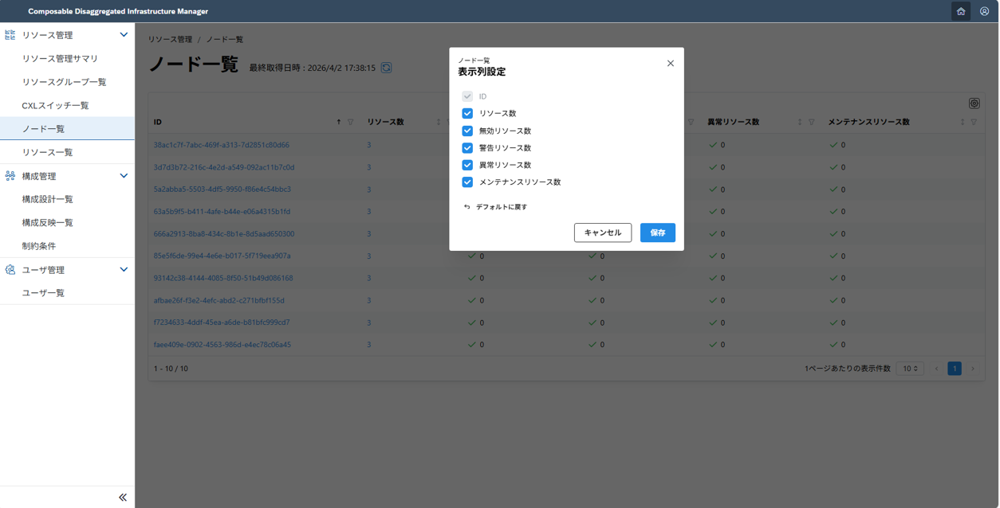

 

##### 1.4. 構築されているノードの詳細を確認
ノード一覧画面でノードIDをクリックすることでノード詳細画面に移動します。
ノード詳細画面ではノードのスペックや消費電力、ノードに割り当てられているリソースを確認します。
画面の表示例は以下のとおりです。

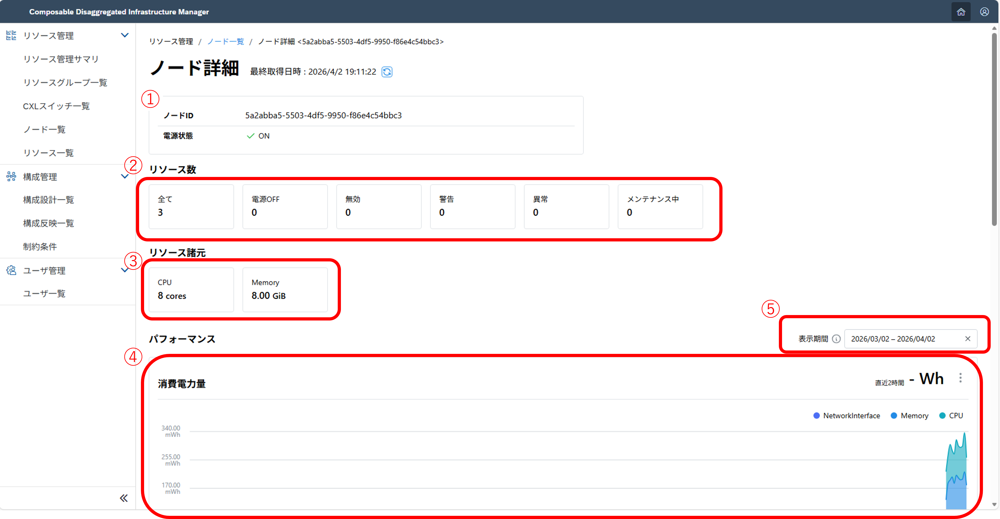
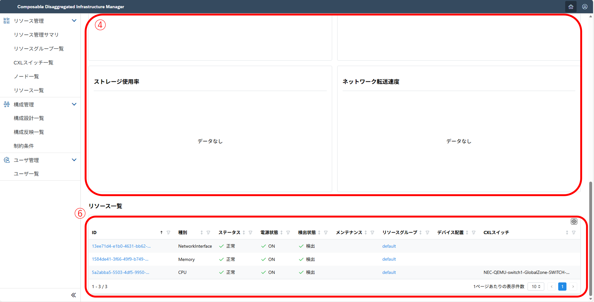

画面の確認項目は以下のとおりです。
|番号|名前|説明|
|:--|:--|:--|
| 1 |ノードID|ノードに割り振られるIDです。基本はCPUのデバイスIDが用いられています。|
| 2 |リソース状況|現在使用しているリソースの数や使用しているリソースに異常がないかを確認します。Critical ResourceやWarning Resourceが0の場合はリソースはすべて正常です。|
| 3 |リソース特性|ノードに割り当てられているスペックを確認します。|
| 4 |パフォーマンス状況|現在の消費電力と使用率を確認します。|
| 5 |表示期間|該当ノードのパフォーマンス状況について、表示期間を設定することができます。|
| 6 |リソース割り当て状況|このノードに割り当てられているリソース一覧を確認します。|

 

##### 1.5. 登録されているリソースの一覧を確認
画面左のメニューから「リソース一覧」を選択することでリソース一覧画面に移動します。
リソース一覧画面では登録されているリソースの種類やリソースの状態を確認します。
画面の表示例は以下のとおりです。

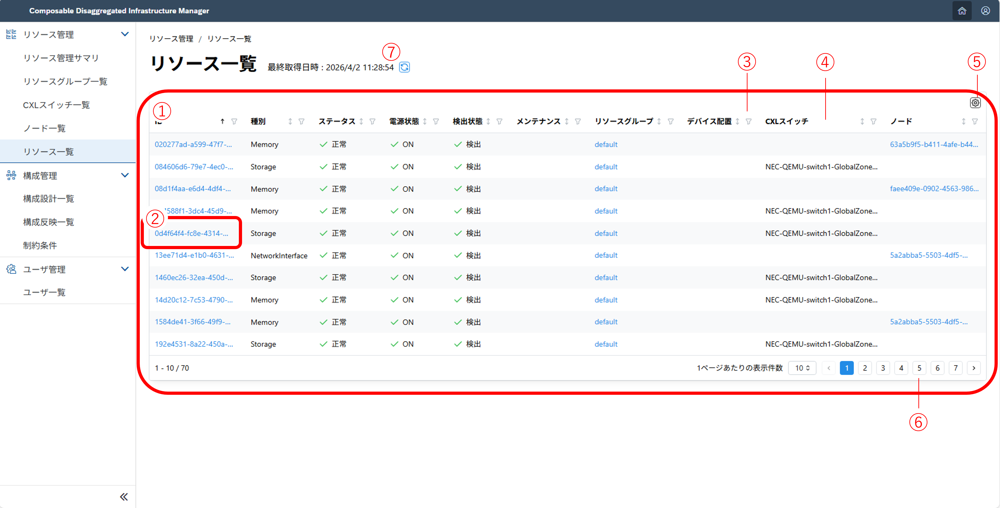

|番号|名前|説明|
|:--|:--|:--|
| 1 |リソース一覧|現在のリソース状況を確認できます。デフォルトでは左からデバイスID、リソースの種類、リソースの統合ステータス状況、デバイスの電源状況、メンテナンスのため使用不可としたリソース状況、リソースグループ情報、ラック内でのデバイス配置、CXLスイッチ情報、このリソースが使用されているノードIDが表示されています。情報がない場合は何も記載されません。|
| 2 |デバイスID|デバイスIDをクリックすることでリソース詳細画面に移動することが可能です。|
| 3 |フィルター|各項目でフィルターを設定することが可能です。|
| 4 |昇順・降順|昇順表示、降順表示したい項目をクリックすることで昇順・降順表示できます。|
| 5 |表示列設定|リソース一覧画面で表示したい項目を変更できます。|
| 6 |ページ数|1ページに表示したいリソース数を変更できます。|
| 7 |リロード|即座に情報更新したい場合に使用します。|

 

##### 1.6. 登録されているリソースの詳細を確認
リソース一覧画面やノード詳細画面などにおいて、デバイスIDをクリックすることでリソース詳細画面に移動します。
リソース詳細画面ではリソースの詳細情報を確認できるほか、メンテナンスを予定しているリソースを使用不可にする操作ができます。
画面の表示例は以下のとおりです。

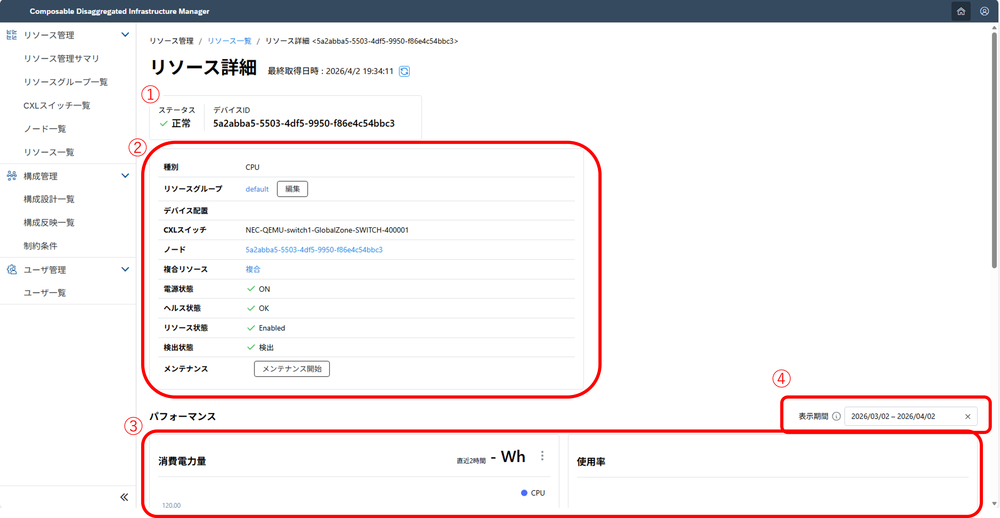
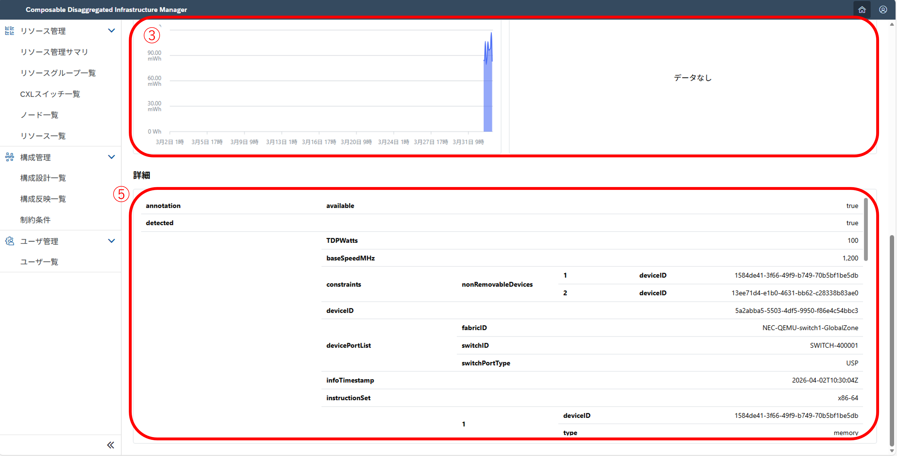

画面の確認項目は以下のとおりです。
|番号|名前|説明|
|:--|:--|:--|
| 1 |デバイスID|リソースを識別するIDです。初回起動時やリソースを追加した時に自動で割り振られます。|
| 2 |リソース状況|リソースの種類やリソースの状況を確認します。HealthがOK、stateがenableの場合はリソースは正常です。|
| 3 |パフォーマンス状況|現在の消費電力と使用率を確認します。|
| 4 |表示期間|該当リソースのパフォーマンス状況について、表示期間を設定することができます。|
| 5 |詳細情報|リソースごとの詳細情報を確認します。|

実行できる内容は以下のとおりです。
- メンテナンス等によりリソースを使用不可(設計から除外)とする  
  使用しないリソースのリソース詳細画面に移動し、メンテナンス開始ボタンを選択することで、リソースを構成案設計・構成案反映の対象から除外できます。
  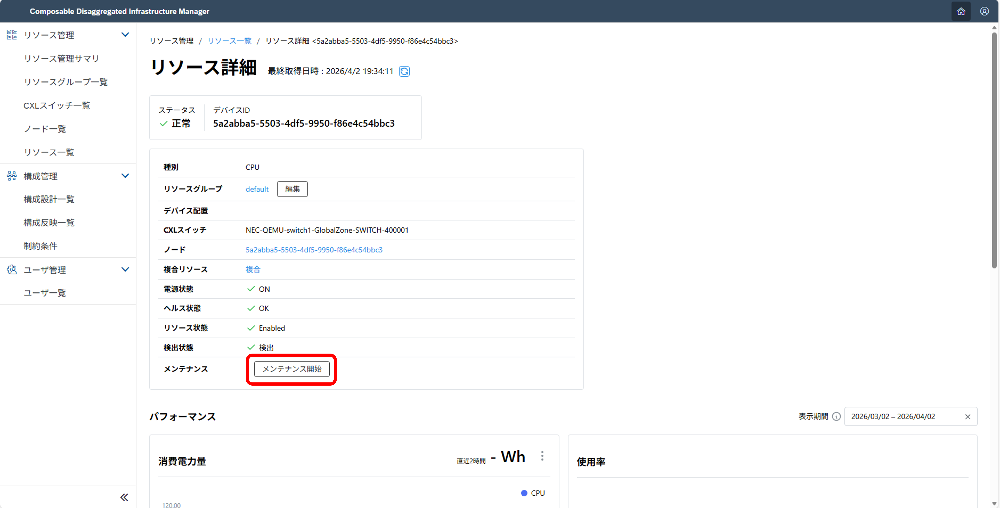
  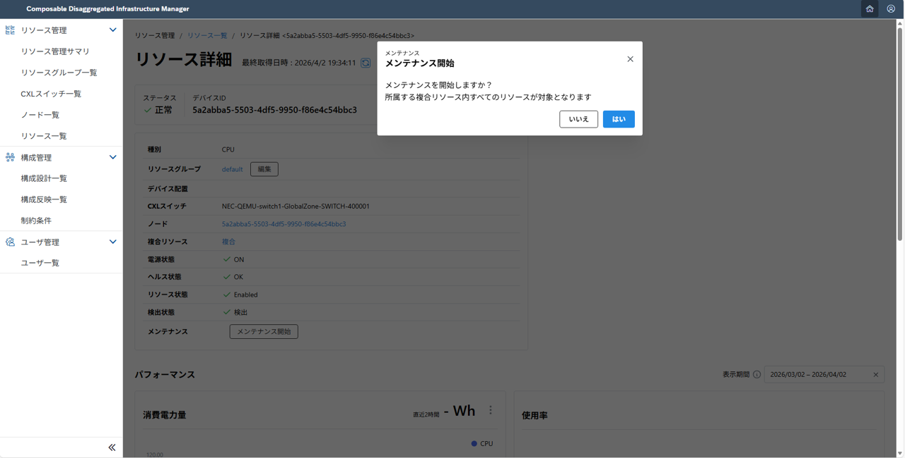
  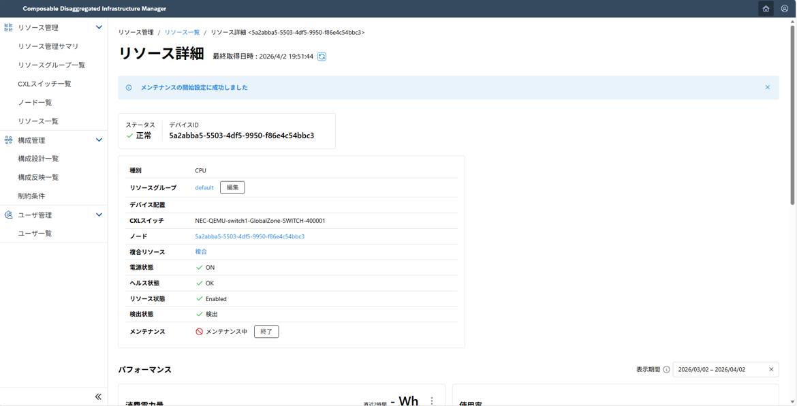

 

- 除外されている(使用不可状態)リソースを使用可能に戻す  
  除外されているリソースのリソース詳細画面に移動し、メンテナンスの終了ボタンを選択することで、リソースを使用可能状態（設計・反映の対象）に戻せます。
  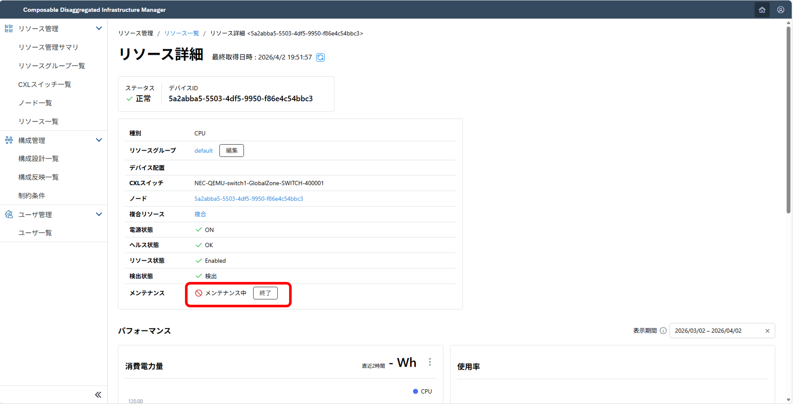
  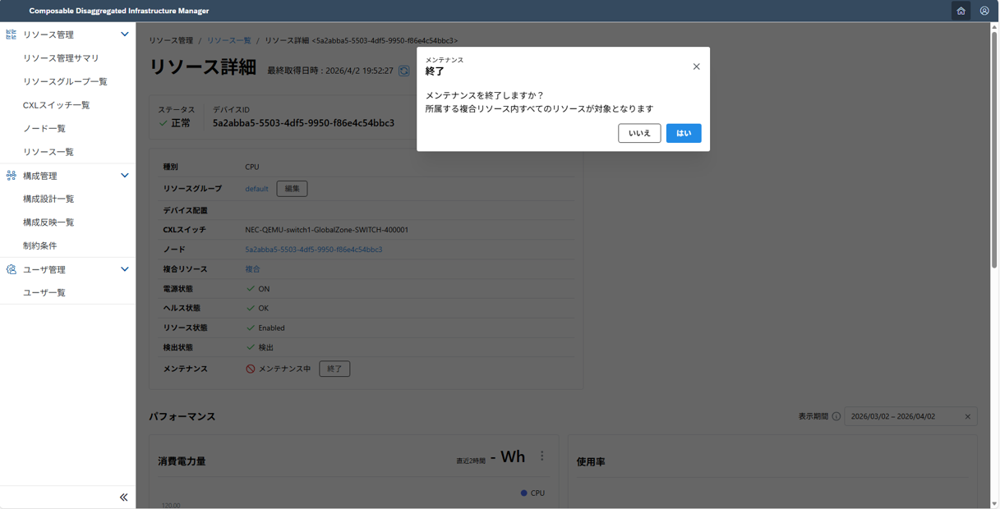
  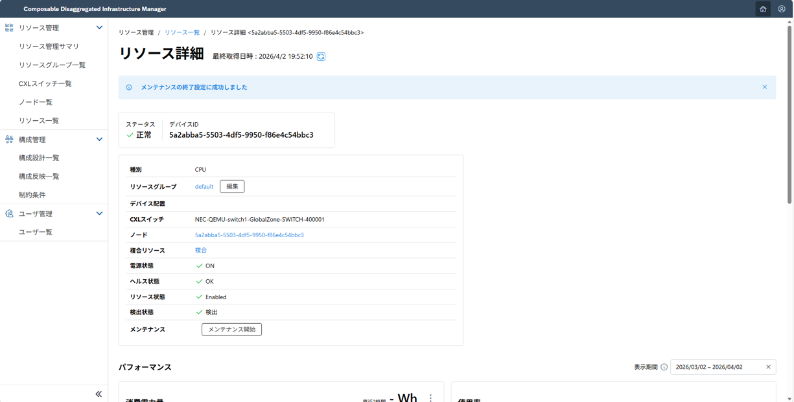

 

##### 1.7. 構成案設計状況の一覧を確認
画面左のメニューから「構成案設計一覧」を選択することで構成案設計一覧画面に移動します。
構成案設計一覧画面ではこれまでに実行された構成案設計一覧を確認します。構成案設計の詳細は次章で説明します。
画面の表示例は以下のとおりです。

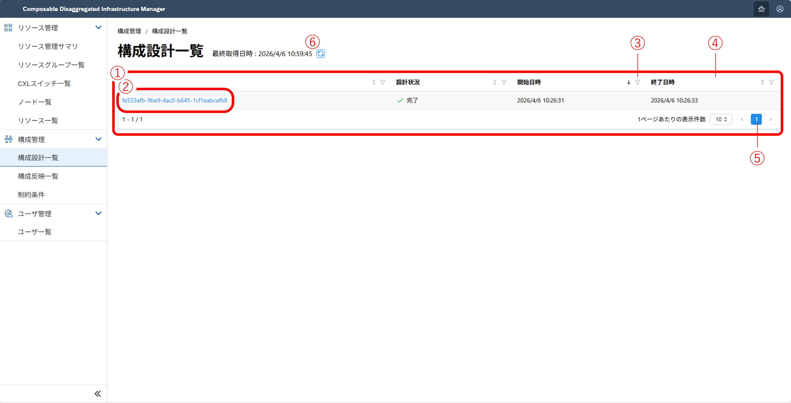

画面の確認項目は以下のとおりです。
|番号|名前|説明|
|:--|:--|:--|
| 1 |構成案設計一覧|これまでの構成案設計状況を確認します。左からDesign ID、構成案設計状況、構成案設計の開始日時、構成案設計の終了日時が表示されています。情報がない場合は何も記載されません。|
| 2 |構成案設計詳細|Design IDをクリックすることで構成案設計詳細画面に移動することが可能です。|
| 3 |フィルター|各項目でフィルターを設定することが可能です。|
| 4 |昇順・降順|昇順表示、降順表示したい項目をクリックすることで昇順・降順表示できます。|
| 5 |ページ数|1ページに表示したいリソース数を変更できます。|
| 6 |リロード|即座に情報更新したい場合に使用します。|

##### 1.8. 構成案設計状況の詳細を確認
構成案設計一覧画面でDesign IDをクリックすることで構成案設計詳細画面に移動します。
構成案設計詳細画面では構成案設計状況や構成案設計で出力された構成案を確認します。
画面の表示例は以下のとおりです。

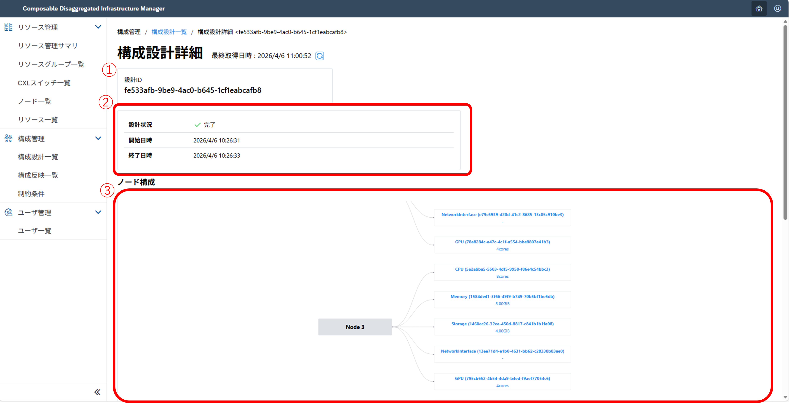
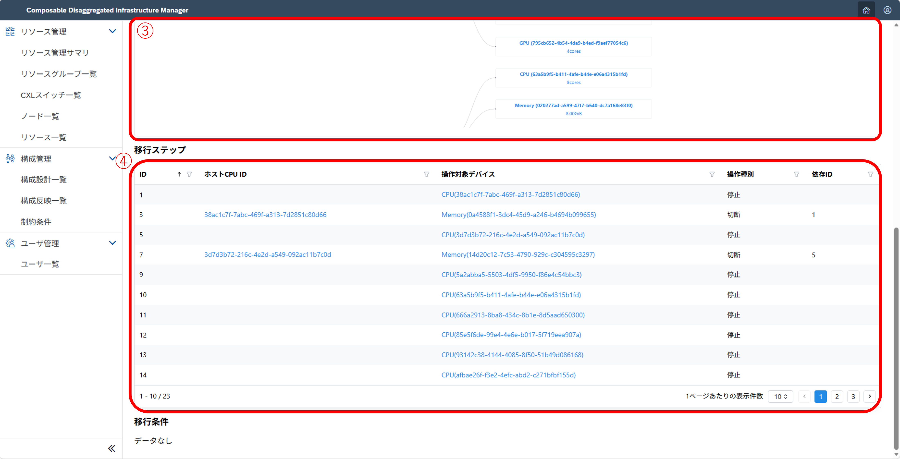

画面の確認項目は以下のとおりです。
|番号|名前|説明|
|:--|:--|:--|
| 1 |構成案設計ID|Design IDを確認します。構成案設計状態については下記の一覧を参照してください。|
| 2 |構成案設計状況|構成案設計の状況と開始、終了日時などを確認します。|
| 3 |ノード構成|構成案設計で設計されたノード構成を確認します。枠内でドラッグすることでノード構成の全体像を確認でき、スクロール操作をすることで拡大・縮小をすることができます。|
| 4 |移行ステップ|構成案設計で作成された構成案反映の詳細な手順を確認します。|

構成案設計状態一覧  
- Completed : 構成案設計を正常終了すると表示されます
- In_progress : 構成案設計を実行中に表示されます
- Failed : 構成案設計を異常終了すると表示されます
- Canceling,Canceled : 構成案設計をキャンセルすると表示されます

##### 1.9. 構成案反映状況の一覧を確認
画面左のメニューから「構成案反映一覧」を選択することで構成案反映一覧画面に移動します。
構成案反映一覧画面ではこれまでに実行された構成案反映一覧を確認します。構成案反映の詳細は次章で説明します。
画面の表示例は以下のとおりです。

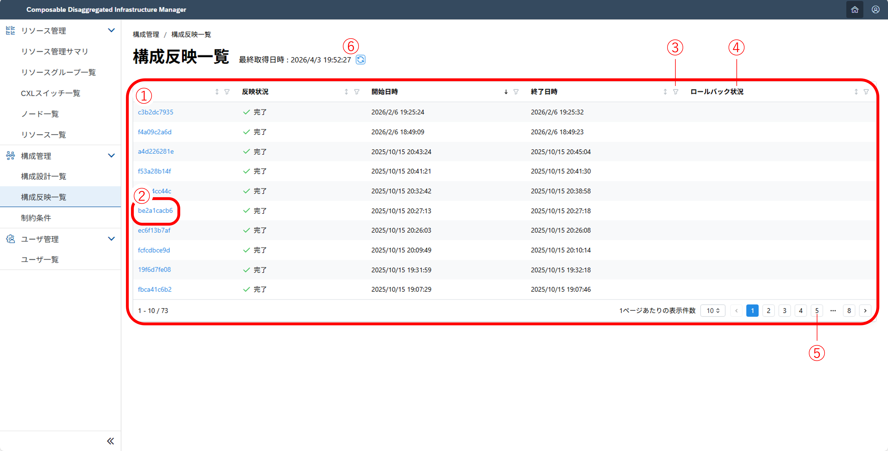

画面の確認項目は以下のとおりです。
|番号|名前|説明|
|:--|:--|:--|
| 1 |構成案反映一覧|これまでの構成案反映状況を確認します。左からApply ID、構成案反映状況、構成案反映の開始日時、構成案反映の終了日時、ロールバック状況が表示されています。情報がない場合は何も記載されません。|
| 2 |構成案反映詳細|Apply IDをクリックすることで構成案反映詳細画面に移動することが可能です。|
| 3 |フィルター|各項目でフィルターを設定することが可能です。|
| 4 |昇順・降順|昇順表示、降順表示したい項目をクリックすることで昇順・降順表示できます。|
| 5 |ページ数|1ページに表示したいリソース数を変更できます。|
| 6 |リロード|即座に情報更新したい場合に使用します。|

 

##### 1.10. 構成案反映状況の詳細を操作・確認
構成案反映一覧画面でApply IDをクリックすることで構成案反映詳細画面に移動します。
構成案反映詳細画面では構成案反映状況や構成案反映で実行された手順を確認します。また、実行中の構成案反映のキャンセルやロールバックなどの操作ができます。
画面の表示例は以下のとおりです。

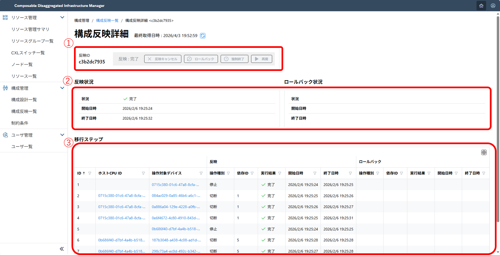

画面の確認項目は以下のとおりです。
|番号|名前|説明|
|:--|:--|:--|
| 1 |構成案反映操作|Apply IDと構成案反映の状況を確認します。構成案反映状態については下記の一覧を参照してください。|
| 2 |構成案反映状況|構成案反映の状況と開始、終了日時などを確認します。|
| 3 |移行ステップ|構成案反映の詳細な手順を確認します。手順は構成案反映が終了したときに表示され、構成案反映が上手くいかなかったときはエラーメッセージを確認します。|

構成案反映状態一覧  
- Completed : 構成案反映を正常終了すると表示されます
- In_progress : 構成案反映を実行中に表示されます
- Failed : 構成案反映を異常終了すると表示されます
- Suspended : 構成案反映中に問題があり、一時中断した場合に表示されます
- Canceling,Canceled : 構成案反映をキャンセルすると表示されます

実行できる内容は以下のとおりです。
- キャンセルとロールバックの実行  
  構成案反映を実行している場合はキャンセルかロールバックを実行できます。
  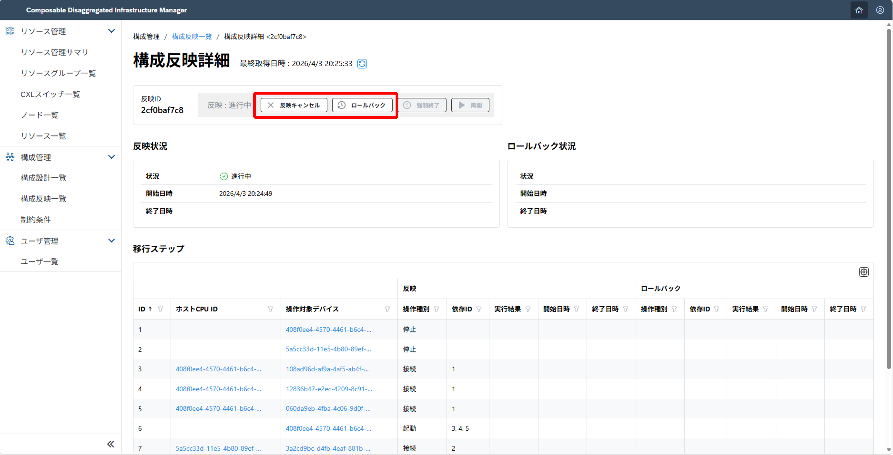
  
 

- 強制終了と再開の実行  
  構成結果がSuspendedの場合は再開か強制終了を実行できます。
  また、エラーメッセージより失敗した原因を把握できます。
  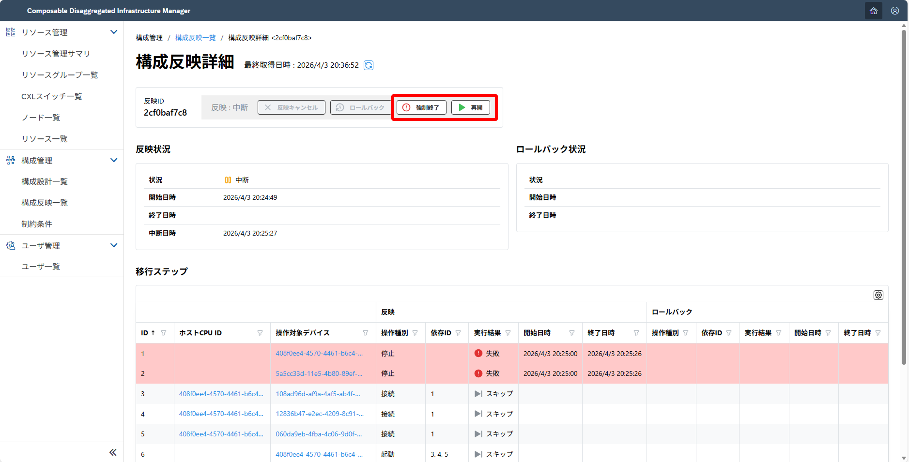

##### 1.11. 注意事項
- 現バージョン(v0.2.0)の注意事項
  現バージョン(v0.2.0)では以下の機能がサポートされていません。
  - リソースの使用率を表示する機能
    - 現バージョン(v.0.2.0)では表示が変化せず、No dataと表示されます。

- エミュレータ使用時の注意事項  
  エミュレータを使用している場合、以下の項目にはダミーデータが使用されています。  
  エミュレータの表示内容を変更したい場合は、[エミュレータの操作内容](../appendix/emulator/README.md)を参照してください。
  - リソースの消費電力 (GPU消費電力のダミーデータは出力されません。)
  - リソースのHealthの状態
  - リソースのstateの状態

- サンプル設計機構使用時の注意事項
  [サンプル設計機構プラグイン](https://github.com/project-cdim/sample-design-engine-plugin)を参照ください。

[Next 2.1 手動の構成定義による構成変更](../layout-manual/README.md)
