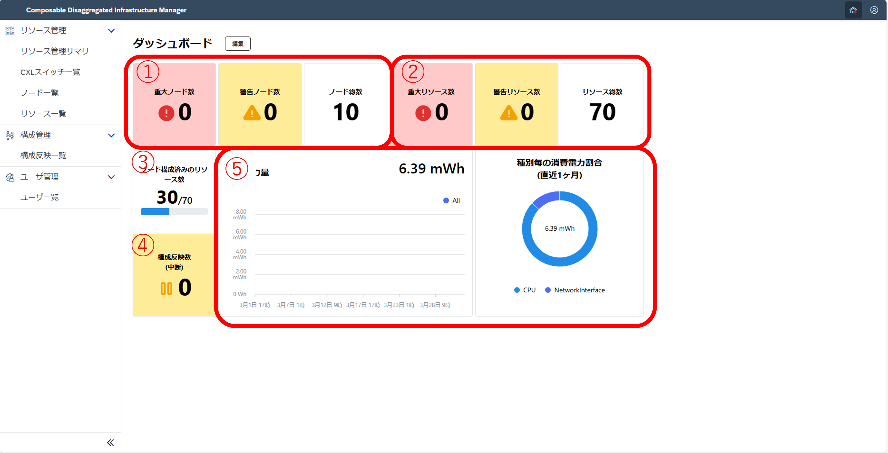
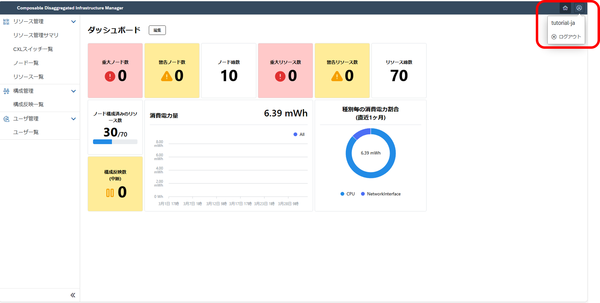
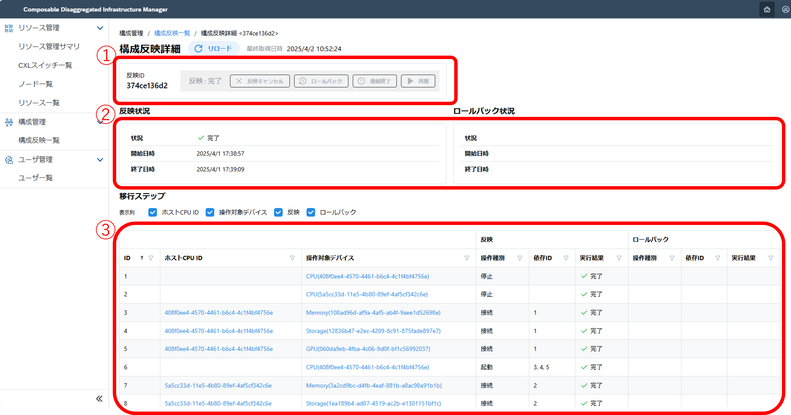

#### 1. ハードウェア構成、情報を確認 <!-- omit in toc -->
ここでは、Composable Disaggregated Infrastructure Manager (略称:CDIM) の画面からハードウェア構成、情報を確認します。

> [!NOTE] 
> 以降では画面例を掲載しています。画面例には説明のために赤枠と番号を付記していますが、実際には赤枠と番号は表示されません。

> [!NOTE] 
> ハードウェアを指す用語としてデバイスとリソースの2種類の表現が出てきます。デバイスはCPUやメモリ、ストレージなどのComposable Disaggregated Infrastructure (CDI) を構成する個々の物理ハードウェアのことを指し、リソースはデバイスの中で「ノードの構成要素」となる物理ハードウェアのことを指します。

> [!WARNING]
> 各リソースの使用率について注意事項が存在します。
> 詳細は[注意事項](#19-注意事項)を参照してください。

> [!WARNING]
> 制御対象がエミュレータの場合は注意事項が存在ます。
> 詳細は[注意事項](#19-注意事項)を参照してください。

- [1.1. ハードウェア構成、情報の概略を確認](#11-ハードウェア構成情報の概略を確認)
- [1.2. 各リソース種類ごとの消費電力とリソース状況を確認](#12-各リソース種類ごとの消費電力とリソース状況を確認)
- [1.3. 構築されているノードの一覧を確認](#13-構築されているノードの一覧を確認)
- [1.4. 構築されているノードの詳細を確認](#14-構築されているノードの詳細を確認)
- [1.5. 登録されているリソースの一覧を確認](#15-登録されているリソースの一覧を確認)
- [1.6. 登録されているリソースの詳細を確認](#16-登録されているリソースの詳細を確認)
- [1.7. 構成案反映状況の一覧を確認](#17-構成案反映状況の一覧を確認)
- [1.8. 構成案反映状況の詳細を操作確認](#18-構成案反映状況の詳細を操作確認)
- [1.9. 注意事項](#19-注意事項)

##### 1.1. ハードウェア構成、情報の概略を確認
ホーム画面に表示されるダッシュボードから、構成済みのノード数やリソース数、障害などが発生しているノード数やリソース数、ノードで使用済みのリソース数などを確認します。

画面の表示例は以下のとおりです。

画面の確認内容は以下のとおりです。
|番号|名前|説明|
|:--|:--|:--|
| 1 |ノード情報|Total Nodesから構成済みのノード数を確認します。Critical NodesやWarning Nodesが0の場合はノードはすべて正常です。|
| 2 |リソース情報|Total Resourcesから環境のリソース数を確認します。Critical ResourcesやWarning Resourcesが0の場合はリソースはすべて正常です。|
| 3 |リソース使用状況|使用されているリソース数を確認します。|
| 4 |構成案反映状況|保留中の構成案反映数を確認します。0の場合は問題はありません。|
| 5 |消費電力状況|直近1か月間の消費電力量を確認します。初回の性能情報の更新時には、性能情報の蓄積のためにグラフが表示されるまで1時間ほど時間がかかります。|

実行できる内容は以下のとおりです。
- ホームに戻る  
  ホームボタンかCDIMのタイトルを選択することでホーム画面に移動できます。
  

 

- ログアウトする  
  ユーザーボタンを選択後、ログアウトボタンを押すことでログアウトできます。
  
  

 

##### 1.2. 各リソース種類ごとの消費電力とリソース状況を確認
画面左のメニューから「サマリー」を選択することでサマリー画面に移動します。
サマリー画面に表示されるダッシュボードから全体の消費電力やリソース状況、および各リソース種類ごとの消費電力やリソース状況などを確認します。
画面の表示例は以下のとおりです。

画面の確認内容は以下のとおりです。
|番号|名前|説明|
|:--|:--|:--|
| 1 |タブ機能|それぞれのリソースごとのパフォーマンス状況とリソース状況を確認できます。|
| 2 |パフォーマンス状況|現在の消費電力と使用率を確認します。|
| 3 |リソース状況|現在使用しているリソースの数や使用しているリソースに異常がないかを確認します。Critical ResourceやWarning Resourceが0の場合はリソースはすべて正常です。|

 

##### 1.3. 構築されているノードの一覧を確認
画面左のメニューから「ノード一覧」を選択することでノード一覧画面に移動します。
ノード一覧画面ではノードIDやノードに割り当てられているリソース数などを確認します。
画面の表示例は以下のとおりです。

画面の確認内容は以下のとおりです。
|番号|名前|説明|
|:--|:--|:--|
| 1 |ノード一覧|現在のノード状況を確認します。左からノードID、ノードに割り当てられているリソース数、使用できないリソース数、注意が出ているリソース数、警告が出ているリソース数、使用不可として除外したリソース数が表示されています。|ノードIDをクリックすることでノード詳細画面に移動することが可能です。|
| 3 |フィルター|各項目でフィルターを設定することが可能です。|
| 4 |昇順・降順|昇順表示、降順表示したい項目をクリックすることで昇順・降順表示できます。|
| 5 |ページ数|1ページに表示したいノード数を変更できます。|
| 6 |リロード|即座に情報更新したい場合に使用します。|

 

##### 1.4. 構築されているノードの詳細を確認
ノード一覧画面でノードIDをクリックすることでノード詳細画面に移動します。
ノード詳細画面ではノードのスペックや消費電力、ノードに割り当てられているリソースを確認します。
画面の表示例は以下のとおりです。

画面の確認項目は以下のとおりです。
|番号|名前|説明|
|:--|:--|:--|
| 1 |ノードID|ノードに割り振られるIDです。基本はCPUのデバイスIDが用いられています。|
| 2 |リソース状況|現在使用しているリソースの数や使用しているリソースに異常がないかを確認します。Critical ResourceやWarning Resourceが0の場合はリソースはすべて正常です。|
| 3 |リソース特性|ノードに割り当てられているスペックを確認します。|
| 4 |パフォーマンス状況|現在の消費電力と使用率を確認します。|
| 5 |リソース割り当て状況|このノードに割り当てられているリソース一覧を確認します。|

 

##### 1.5. 登録されているリソースの一覧を確認
画面左のメニューから「リソース一覧」を選択することでリソース一覧画面に移動します。
リソース一覧画面では登録されているリソースの種類やリソースの状態を確認します。
画面の表示例は以下のとおりです。

|番号|名前|説明|
|:--|:--|:--|
| 1 |リソース一覧|現在のノード状況を確認できます。左からデバイスID、リソースの種類、リソースのHealth状況、リソースの使用可不可、CXLスイッチ情報、このリソースが使用されているノードID、使用不可とした除外したリソース状況が表示されています。情報がない場合は何も記載されません。|
| 2 |デバイスID|デバイスIDをクリックすることでリソース詳細画面に移動することが可能です。|
| 3 |フィルター|各項目でフィルターを設定することが可能です。|
| 4 |昇順・降順|昇順表示、降順表示したい項目をクリックすることで昇順・降順表示できます。|
| 5 |ページ数|1ページに表示したいリソース数を変更できます。|
| 6 |リロード|即座に情報更新したい場合に使用します。|

 

##### 1.6. 登録されているリソースの詳細を確認
リソース一覧画面やノード詳細画面などにおいて、デバイスIDをクリックすることでリソース詳細画面に移動します。
リソース詳細画面ではリソースを設計から除外することやリソースの詳細情報を確認できます。
画面の表示例は以下のとおりです。

画面の確認項目は以下のとおりです。
|番号|名前|説明|
|:--|:--|:--|
| 1 |デバイスID|リソースを識別するIDです。初回起動時やリソースを追加した時に自動で割り振られます。|
| 2 |リソース状況|リソースの種類やリソースの状況を確認します。HealthがOK、stateがenableの場合はリソースは正常です。|
| 3 |パフォーマンス状況|現在の消費電力と使用率を確認します。|
| 4 |詳細情報|リソースごとの詳細情報を確認します。|

実行できる内容は以下のとおりです。
- 使用しないリソースを除外する  
  使用しないリソースのリソース詳細画面に移動し、リソース除外ボタンを選択することでリソースを除外できます。
  
  
  

 

- 除外されているリソースを使用可能に戻す  
  除外されているリソースのリソース詳細画面に移動し、リソース使用可能ボタンを選択することでリソースを使用可能状態に戻せます。
  
  
  

 

##### 1.7. 構成案反映状況の一覧を確認
画面左のメニューから「構成案反映一覧」を選択することで構成案反映一覧画面に移動します。
構成案反映一覧画面ではこれまでに実行された構成案反映一覧を確認します。構成案反映の詳細は次章で説明します。
画面の表示例は以下のとおりです。

画面の確認項目は以下のとおりです。
|番号|名前|説明|
|:--|:--|:--|
| 1 |構成案反映一覧|これまでの構成案反映状況を確認します。左からApply ID、構成案反映状況、構成案反映の開始日時、構成案反映の終了日時、ロールバック状況が表示されています。情報がない場合は何も記載されません。|
| 2 |構成案反映詳細|Apply IDをクリックすることで構成案反映詳細画面に移動することが可能です。|
| 3 |フィルター|各項目でフィルターを設定することが可能です。|
| 4 |昇順・降順|昇順表示、降順表示したい項目をクリックすることで昇順・降順表示できます。|
| 5 |ページ数|1ページに表示したいリソース数を変更できます。|
| 6 |リロード|即座に情報更新したい場合に使用します。|

 

##### 1.8. 構成案反映状況の詳細を操作・確認
構成案反映一覧画面でApply IDをクリックすることで構成案反映詳細画面に移動します。
構成案反映詳細画面では構成案反映状況や構成案反映で実行された手順を確認します。また、実行中の構成案反映のキャンセルやロールバックなどの操作ができます。
画面の表示例は以下のとおりです。

画面の確認項目は以下のとおりです。
|番号|名前|説明|
|:--|:--|:--|
| 1 |構成案反映操作|Apply IDと構成案反映の状況を確認します。構成案反映状態については下記の一覧を参照してください。|
| 2 |構成案反映状況|構成案反映の状況と開始、終了日時などを確認します。|
| 3 |移行手順|構成案反映の詳細な手順を確認します。手順は構成案反映が終了したときに表示され、構成案反映が上手くいかなかったときはエラーメッセージを確認します。|

構成案反映状態一覧  
- Complete : 構成案反映を正常終了すると表示されます
- In_progress : 構成案反映を実行中に表示されます
- Failed : 構成案反映を異常終了すると表示されます
- Suspended : 構成案反映中に問題があり、一時中断した場合に表示されます
- Canceling,Canceled : 構成案反映をキャンセルすると表示されます

実行できる内容は以下のとおりです。
- キャンセルとロールバックの実行  
  構成案反映を実行している場合はキャンセルかロールバックを実行できます。
  
  
 

- 強制終了と再開の実行  
  構成結果がSuspendedの場合は再開か強制終了を実行できます。
  また、エラーメッセージより失敗した原因を把握できます。
  

##### 1.9. 注意事項
- 現バージョン(v0.1.0)の注意事項
  現バージョン(v0.1.0)では以下の機能がサポートされていません。
  - リソースの使用率を表示する機能
    - 現バージョン(v.0.1.0)では表示が変化せず、No dataと表示されます。

- エミュレータ使用時の注意事項  
  エミュレータを使用している場合、以下の項目にはダミーデータが使用されています。  
  エミュレータの表示内容を変更したい場合は、[エミュレータの操作内容](../appendix/emulator/README.md)を参照してください。
  - リソースの消費電力
  - リソースのHealthの状態
  - リソースのstateの状態

[Next 2. 構成の変更](../layout/README.md)
